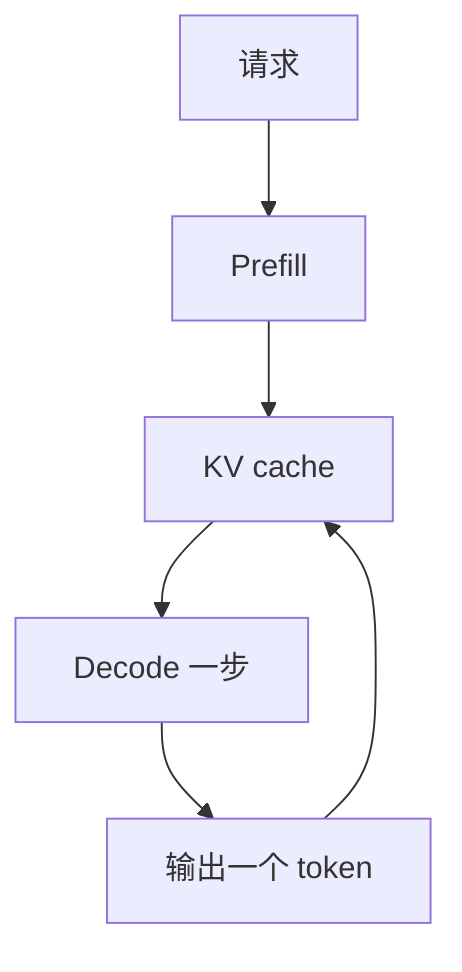

import SeriesNav from '../../components/SeriesNav.astro'

一次生成同时记三本账：花了多少时间，占了多少字节，这些字节在存储层级之间搬了几次。权重、激活和 KV cache 是这三本账里反复出现的三项。

Prefill 读入整段提示，同一层里各个 token 的矩阵乘可以一起做。Decode 每次只吃一个新 token，却要读回已经写好的 KV，再把这个新 token 的 K 和 V 追加进去。[KV cache](../../lessons/kv-cache) 证明了这种追加和整段重算可以保持数值等价。这一章只给追加的结果定价。

## 先用一个能手算的模型把加法做完

下面的模型 S 是教案，不是任何已发布的权重。它小到每一项都能口算，形状仍是 decoder-only：注意力加 SwiGLU 前馈。

| 符号 | 值 | 含义 |
| --- | --- | --- |
| $L$ | 2 | 层数 |
| $d$ | 256 | 隐藏维 |
| $n_q, n_{kv}, d_h$ | 8、2、32 | query 头、KV 头、每头维度 |
| $d_{ff}$ | 512 | 前馈中间维 |
| $V$ | 128 | 词表 |
| $b$ | 2 | fp16，每元素字节数 |

一层里的大矩阵是：

$$
\begin{aligned}
W_q &\colon d \times n_q d_h = 256 \times 256 = 65536,\\
W_k, W_v &\colon d \times n_{kv} d_h = 256 \times 64 = 16384,\\
W_o &\colon n_q d_h \times d = 65536,\\
W_{gate}, W_{up}, W_{down} &\colon 131072 \times 3.
\end{aligned}
$$

一层参数量是 $65536 \times 2 + 16384 \times 2 + 131072 \times 3 = 557056$。两层是 $1114112$。词嵌入和输出头各是 $V \times d = 32768$，这里按不共享来计。合计

$$
N = 1114112 + 32768 + 32768 = 1179648,
$$

fp16 权重占 $1179648 \times 2 = 2359296$ 字节，也就是 2.25 MiB。RMSNorm 的缩放向量只有几百个数，第一张账单里先不收。

每个 token 的 KV 是 K 和 V 各一份：

$$
2 \times L \times n_{kv} \times d_h \times b = 2 \times 2 \times 2 \times 32 \times 2 = 512 \text{ 字节}.
$$

128 个 token 的 KV 是 $512 \times 128 = 65536$ 字节。这个数后面要自己再算一次。

## 把同一组公式放大到公开的 8B 形状

Llama 3 8B 的层宽是公开的：32 层，隐藏维 4096，32 个 query 头，8 个 KV 头，词表 128256。前馈宽度按 [模型代码](https://github.com/meta-llama/llama3/blob/main/llama/model.py) 里的规则得到 14336：从 $4d$ 出发，乘 $2/3$，再乘发布配置里的 1.3，向上取到 1024 的倍数。

$$
\begin{aligned}
4 \times 4096 &= 16384,\\
\lfloor 2 \times 16384 / 3 \rfloor &= 10922,\\
\lfloor 1.3 \times 10922 \rfloor &= 14198,\\
1024 \times \lceil 14198 / 1024 \rceil &= 14336.
\end{aligned}
$$

技术报告把这组形状写进了 8B 模型，见 [The Llama 3 Herd of Models](https://arxiv.org/abs/2407.21783)。下面的参数量是把这些矩阵乘出来，不是对某个 checkpoint 文件的测量。输出头与词嵌入在这份代码里是两块矩阵。

一层注意力是 $4096 \times 4096$ 的 $W_q$、$W_o$，加上 $4096 \times 1024$ 的 $W_k$、$W_v$，共 $41943040$ 个参数。一层 SwiGLU 是三块 $4096 \times 14336$，共 $176160768$。一层合计 $218103808$，32 层是 $6979321856$。两块词表矩阵各 $128256 \times 4096 = 525336576$。总和

$$
N = 8029995008.
$$

bf16 权重是 $N \times 2 = 16059990016$ 字节，约 16.06 GB（按 $10^9$），或 14.96 GiB（按 $2^{30}$）。每层两个 RMSNorm 再加最后的一个，大约还有 $65 \times 4096$ 个参数，相对 80 亿可以留到后面再记。

每个 token 的 KV：

$$
2 \times 32 \times 8 \times 128 \times 2 = 131072 \text{ 字节} = 128 \text{ KiB}.
$$

8192 个 token 是 $131072 \times 8192 = 2^{30}$ 字节，正好 1 GiB。十六条这样的请求就是 16 GiB，和权重放在同一张图上才看得出谁先把卡撑满。

<figure class="math-figure">

<figcaption>刻度是 GiB。一条 8192 token 请求的 KV 只有 1 GiB；并发到 16 条时，KV 超过 bf16 权重。产品页上的 80GB 容量按厂商的十进制习惯书写，和这里的 GiB 不是同一个单位。</figcaption>
</figure>

## 时间账先分开两个时刻

用户感受到的时间至少有两段。首 token 之前的等待包含排队、prefill 和第一次采样，通常记作 TTFT。之后每个 token 的间隔记作 TPOT。只测量 decode，会把长提示的 prefill 整段漏掉；只报平均值，会把排队的长尾抹平。第 07 章把它们收成服务指标，这里先记住：prefill 的账单随提示长度一次付清，decode 的账单按生成长度逐 token 重复。

数据搬移账问的是另一件事：这 14.96 GiB 权重在每个 decode token 上要不要从显存再读一遍，KV 是按整个上下文读还是只读新增的一块。第 03 章把「读了多少字节、做了多少乘加」收成一个比值，第 04 章才把这个比值放到具体 GPU 的带宽和算力上。

## 核对

模型 S、fp16、上下文 128。KV 一共多少字节？按上面的单 token 公式，应当是 65536。再把上下文改成 1024，KV 变成 $512 \times 1024 = 524288$ 字节，仍然小于 2.25 MiB 的权重。模型 S 之所以看不出 KV 压过权重，是因为层数和 KV 头都太少。8B 那张图就是同一个公式在公开宽度上的结果。

## 引用与边界

| 用到的内容 | 出处 | 本页的处理 |
| --- | --- | --- |
| 从一次执行的资源账进入 AI Infra | [AI Infra Book，初识 AI Infra](https://bojieli.github.io/ai-infra-book/manuscripts/01-%E5%88%9D%E8%AF%86%20AI%20Infra.html) | 沿用「先记账」这个分层，例题和表述是重写的 |
| 最小阅读顺序里的推理算术 | [Wafer 清单，Start here](https://github.com/wafer-ai/gpu-perf-engineering-resources#start-here-the-minimum-mental-model) | 只作为下一步读原始材料的索引 |
| 8B 的层数、宽度、GQA 和 FFN 取整 | [Llama 3 论文](https://arxiv.org/abs/2407.21783)，[模型实现](https://github.com/meta-llama/llama3/blob/main/llama/model.py) | 参数量由这些宽度乘出来，未读取权重文件 |
| 注意力与缓存的数值等价 | 本仓库 [KV cache](../../lessons/kv-cache) | 这里只给缓存计价 |

省略了激活峰值、allocator 碎片、对齐填充和 RoPE 表。这些项在具体实现里会把账单改掉几个百分点到几倍，第 02 章会先补上最容易被漏掉的一块：注意力分数矩阵。

<SeriesNav current="ai-infra-01" />
