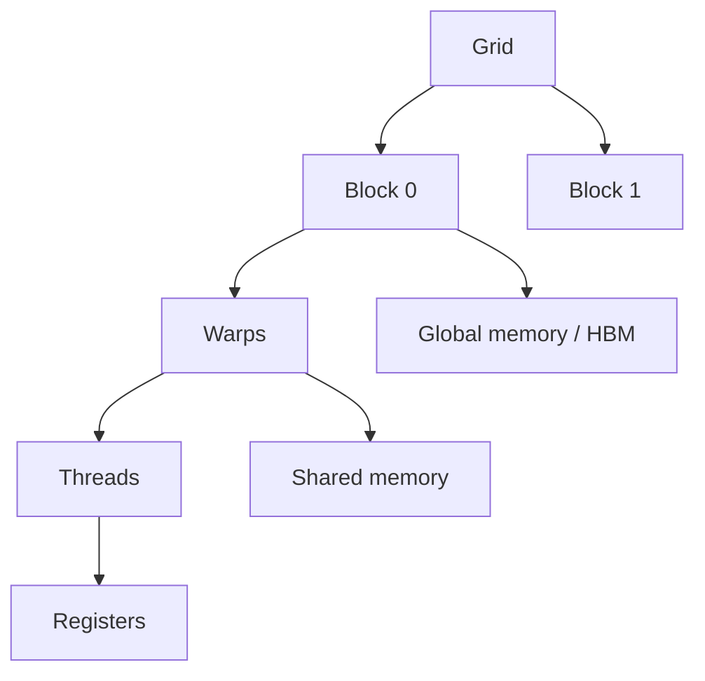

这一章只做一件事：把“GPU 很快”拆成可测量的 kernel 行为。先掌握 CUDA 的执行模型，再谈 Triton、CUTLASS 或特定 GPU 架构。

## 01 · 一个 kernel 的最小心智模型



线程执行同一程序，block 是协作和共享内存的边界，warp 是硬件调度的基本组。访问相邻地址、减少分支发散、让数据在寄存器/共享内存复用，通常比盲目增加线程更重要。

权威定义以 [CUDA Programming Guide](https://docs.nvidia.com/cuda/cuda-c-programming-guide/) 和 [CUDA Best Practices Guide](https://docs.nvidia.com/cuda/cuda-c-best-practices-guide/) 为准；本页只抽取足够开始实验的部分。

## 02 · 从朴素矩阵乘开始

矩阵乘 $C=AB$ 的朴素实现让每个线程计算一个 $C_{ij}$，反复从全局内存读取 $A$ 的行和 $B$ 的列。分块后，一个 tile 由 block 搬进 shared memory，多线程复用，减少 HBM 访问。

```text
for each C tile:
    load A tile and B tile cooperatively
    synchronize block
    accumulate tile products in registers
    repeat over K
    store C tile
```

正确性先用小矩阵与 `torch.testing.assert_close` 对照；性能再用固定形状、预热、同步后的计时。不要把一次冷启动时间称为 kernel 性能。

## 03 · 何时用 Triton，何时看 PTX

Triton 让你以块为单位表达 kernel，适合快速验证布局、融合和内存访问；CUDA C++/CUTLASS 提供更细的控制，适合成熟算子和硬件特性。编译链中 CUDA C++ 会经过 PTX 再到目标机器码，可用 `nvcc`、`cuobjdump` 与 `nvdisasm` 检查产物。

- [Triton Programming Guide](https://triton-lang.org/main/getting-started/tutorials/)
- [CUTLASS documentation](https://docs.nvidia.com/cutlass/latest/)
- [PTX ISA](https://docs.nvidia.com/cuda/parallel-thread-execution/)

选择标准很简单：先用能表达问题的最高层抽象；只有 profile 证明瓶颈在它覆盖不到的地方，才下沉一层。

## 04 · Profile 的最小闭环

1. 先记录输入形状、dtype、硬件、软件版本和正确性结果。
2. 用 Nsight Systems 看 CPU、GPU、通信和空洞的时间线。
3. 用 Nsight Compute 看单 kernel 的带宽、占用率、内存访问和 roofline。
4. 一次只改一个变量，再复测端到端指标。

对应工具：[Nsight Systems User Guide](https://docs.nvidia.com/nsight-systems/UserGuide/)、[Nsight Compute Profiling Guide](https://docs.nvidia.com/nsight-compute/ProfilingGuide/) 与 [Compute Sanitizer](https://docs.nvidia.com/compute-sanitizer/ComputeSanitizer/index.html)。指标名称会随 GPU 和工具版本变化，报告时保留原始导出文件。

### 小练习

用 Python/NumPy 写一个 64×64 的朴素 matmul，手算一个元素并与库结果比较；随后阅读一个 Triton matmul tutorial，标出“加载、同步、复用、写回”四个阶段。没有 GPU 也能完成前半部分。

### 引用与边界

本页的线程层级与编译链来自 NVIDIA 官方文档；性能工程资源的章节顺序参考 [Wafer 的 GPU fundamentals、kernel optimization、profiling](https://github.com/wafer-ai/gpu-perf-engineering-resources)。示例伪代码刻意省略边界处理、向量化和异步拷贝，进入生产 kernel 前必须补齐这些条件。
