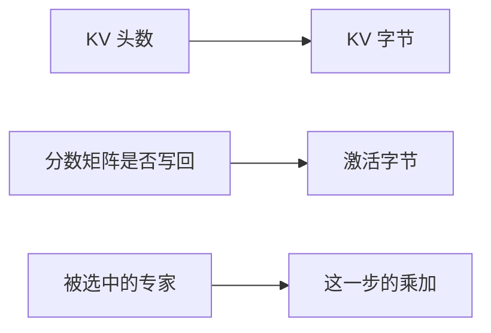

import SeriesNav from '../../components/SeriesNav.astro'

第 01 章的公式里，KV 字节正比于 KV 头数，注意力的计算量正比于 token 数的平方。换一种架构，就是改这两个因子，或者让一部分参数在某一步根本不参与计算。

## 因果掩码决定谁能并行

Decoder 在位置 $t$ 只能看见 $1 \ldots t$。Prefill 仍然可以把整段提示放进同一次矩阵乘，因为每个位置需要的历史都已经在输入里，掩码只是把未来的分数盖住。Decode 则没有这种自由：位置 $t+1$ 的查询依赖位置 $t$ 刚采样出来的 token。所以 KV 可以复用，生成本身仍是串行的。位置如何进入 Q 和 K，见 [位置编码](../../lessons/position-encoding)；复用后数值是否不变，见 [KV cache](../../lessons/kv-cache)。

## KV 头数直接乘在缓存上

多头注意力为每个 query 头保存一对 K、V。分组查询让若干 query 头共用一对。多查询注意力让所有 query 头共用一对。图里把 query 头画成 8 个，是为了看清分组；Llama 3 8B 是 32 个 query 头共用 8 对 KV。

<figure class="math-figure">

<figcaption>绿色是 query，蓝色是要写入缓存的 K/V。缓存的宽度跟着蓝色走。</figcaption>
</figure>

第 01 章的 8B 形状在 8192 token 上是 1 GiB KV。若 KV 头从 8 改成 32，其他宽度不动，缓存变为 4 GiB。GQA 的定义和从多头检查点压缩出分组头的做法，见 [Ainslie 等人](https://arxiv.org/abs/2305.13245)。只留一对 KV 的做法见 [Shazeer 的多查询注意力](https://arxiv.org/abs/1911.02150)。

头数变少之后，每个 query 头在解码时仍要扫过它所共享的那一对 K、V。计算量按 query 头计，容量按 KV 头计。两本账因此可以分开移动。

## 分数矩阵不一定要落在显存里

一层、一条序列、fp16，若把注意力分数完整存下来：

$$
n_q \times S \times S \times 2.
$$

$S = 8192$、$n_q = 32$ 时，这是 $32 \times 8192^2 \times 2 = 4$ GiB，而且只是一层、一条请求。实现如果按层循环，不会把 32 层的分数同时留下，但单层 4 GiB 已经比这一层的 KV 大。

FlashAttention 的做法是按 tile 计算分数、在线归一化、只把输出写回，从而不必物化整块 $S \times S$。算法和 IO 复杂度见 [Dao 等人](https://arxiv.org/abs/2205.14135)。这里要记住的系统后果是：激活账单取决于实现是否把中间矩阵写回显存，不能只按数学定义里出现过的张量去加。

## 专家：参数可以常驻，计算可以缺席

稠密层每个 token 都经过同一套前馈权重。混合专家层先为 token 选择少数专家，再只计算那几个前馈。参数总量按全部专家计，一次前向的乘加按被选中的专家计。容量规划因此有两个数：卡上要放得下所有专家，算力只覆盖活跃的那一部分。

专家若分放在不同设备上，token 要被送到它选中的设备，通信形态是 all-to-all。设备上的专家放置见 [GShard](https://arxiv.org/abs/2006.16668)，稀疏门控的大规模训练见 [Switch Transformer](https://arxiv.org/abs/2101.03961)。一个具体的稀疏模型形状可以对照 [Mixtral](https://arxiv.org/abs/2401.04088)。第 08 章再把这种通信放进集群账单；这一章只把「总参数」和「活跃参数」拆成两个量。

## 引用与边界

| 用到的内容 | 出处 | 本页的处理 |
| --- | --- | --- |
| 架构怎样改变系统需求 | [AI Infra Book，模型架构](https://bojieli.github.io/ai-infra-book/manuscripts/02-%E6%A8%A1%E5%9E%8B%E6%9E%B6%E6%9E%84.html) | 借用问题，例子换成第 01 章的 8B 手算 |
| 注意力 kernel 的阅读入口 | [Wafer 清单，Attention](https://github.com/wafer-ai/gpu-perf-engineering-resources#attention) | 索引，不展开 kernel 实现 |
| GQA、MQA、FlashAttention、MoE | 上表各论文 | 只保留会改写字节或乘加的那一条机制 |

本页没有比较这些架构的模型质量，也没有给出某种头数配置的推荐值。质量要在对应的训练配方里测；系统侧能先确定的是容量和 IO。

<SeriesNav current="ai-infra-02" />
