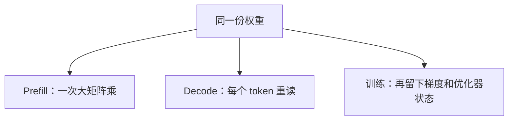

import SeriesNav from '../../components/SeriesNav.astro'

第 01 章把权重和 KV 的字节算了出来。同样这些字节，在 prefill、decode 和训练里被读的次数、旁边还要留下的张量，都不一样。

<figure class="math-figure">

<figcaption>上半张是推理的两种时间形状。下半张是混合精度 Adam 里，一个参数常见的 16 字节构成。</figcaption>
</figure>

## 线性层的算术强度等于批大小

算术强度是做完这次计算要付出的乘加次数，除以为此从显存读入或写回的字节数。只看参数矩阵、batch 为 $B$、权重为 bf16 时：每个参数对每个 token 做一次乘加，即 2 FLOP，权重本身是 2 字节。KV 还小到可以先不计入时，

$$
\text{强度} = \frac{2NB}{2N} = B \text{ FLOP/byte}.
$$

$B = 1$ 时强度是 1。第 01 章的 8B 模型因此在单请求 decode 上，大约读 16.06 GB、做 $1.6 \times 10^{10}$ 次乘加。这个比值要到第 04 章才和某张 GPU 的带宽天花板比较；这里先把它当成负载的签名。

批大小的作用是让同一份权重服务多个 token。$B$ 从 1 增到 8，线性层的强度从 1 增到 8，权重字节不变。KV 不能这样共享：每条请求有自己的上下文，字节随 $B$ 和长度一起涨。第 01 章的图已经显示，16 条 8192 token 请求的 KV 是 16 GiB。强度公式在 KV 不能忽略时变成

$$
\frac{2NB}{2N + \text{KV 字节}}.
$$

长上下文、大并发会把分母里的第二项抬起来，瓶颈从「重复读权重」转到「读每条请求的缓存」。

## Decode 注意力是另一个更小的强度

一条请求、缓存长度 $S$、只计 QK 和 AV 这两次对 KV 的乘法。8B 形状下每层是 $4 \times 4096 \times S$ 次乘加，32 层是 $524288 \times S$。$S = 8192$ 时总共 $2^{32}$ 次乘加。KV 正好 $2^{30}$ 字节。强度是

$$
2^{32} / 2^{30} = 4 \text{ FLOP/byte}.
$$

Softmax 的元素级运算比这个主项小，这里不收进分子。这个 4 和第 01 章的 1 GiB 是同一笔账的两侧：字节已经算过，现在知道这些字节只支撑很少的乘加。

Prefill 的线性层则是 $2NS$。$S = 8192$ 时约 $1.32 \times 10^{14}$ 次乘加，另有约 $3.5 \times 10^{13}$ 次注意力乘加。提示足够长时，一次 prefill 的计算量比单步 decode 高几个数量级，而且权重在这次大矩阵乘内部被大量复用。所以「计算密集」和「带宽密集」不是模型的属性，是这一步负载的属性。

## 训练要留下梯度和优化器状态

推理部署可以只保留低精度权重，也就是下图最左边的 2 字节。混合精度 Adam 的一种常见布局是：低精度参数 2 字节、低精度梯度 2 字节、fp32 主权重 4 字节、动量 4 字节、方差 4 字节，合计 16 字节。这个构成写在 [ZeRO 论文](https://arxiv.org/abs/1910.02054) 的显存分析里；fp32 主权重的来源是 [混合精度训练](https://arxiv.org/abs/1710.03740)，动量和方差来自 [Adam](https://arxiv.org/abs/1412.6980)。

8B 的 $N \times 16 \approx 1.28 \times 10^{11}$ 字节，约 128 GB，已经超过一张 80GB 的卡，而且还没有激活。激活随 batch 和序列长度增长。梯度检查点丢掉前向激活，反向时再算一遍，用计算换这块显存，见 [Chen 等人](https://arxiv.org/abs/1604.06174)。第 08 章再讨论把 16 字节里的哪一段切到别的卡上。

## 到达过程让平均长度失效

上面的强度都假设长度和批大小已经给定。线上请求的长度分布是尖的，到达是一阵一阵的。用平均长度估出来的 KV，会在一串长请求同时到达时不够用；用最大长度预留，又会在短请求上空转。调度要在每个 decode 步重新决定这一步算哪些请求。那是第 07 章的事，它使用的输入就是这一章的两套强度，加上第 01 章的字节。

## 引用与边界

| 用到的内容 | 出处 | 本页的处理 |
| --- | --- | --- |
| 推理与训练是不同负载 | [AI Infra Book，推理与训练负载](https://bojieli.github.io/ai-infra-book/manuscripts/03-%E6%8E%A8%E7%90%86%E4%B8%8E%E8%AE%AD%E7%BB%83%E8%B4%9F%E8%BD%BD.html) | 用第 01 章的数字把差异算成强度和字节 |
| 推理算术的阅读入口 | [Wafer 清单，Start here](https://github.com/wafer-ai/gpu-perf-engineering-resources#start-here-the-minimum-mental-model) | 索引 |
| 16 字节的优化器布局 | [ZeRO](https://arxiv.org/abs/1910.02054) | 只复述字节构成，不涉及分片算法 |

强度公式忽略了 kernel 启动、采样和临时缓冲。它用来比较两种负载，不用来预测某次运行的毫秒数。

<SeriesNav current="ai-infra-03" />
