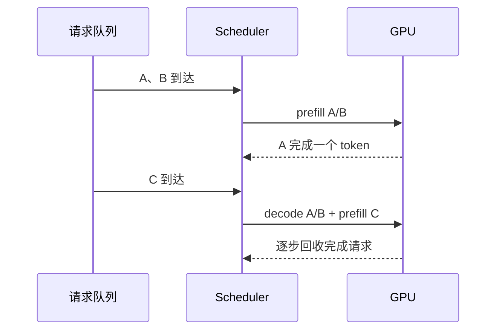

推理引擎的核心工作是调度“不同长度、不同阶段、不同 SLO”的请求，同时保持 GPU 有事可做。模型本身不变，数据布局和调度策略却会显著改变成本。

## 01 · 连续批处理解决什么问题？

静态 batch 要等 batch 中最慢的请求结束；迭代级调度在每个 decode step 重新选择活跃请求，可以把新请求插入空出的槽位。它提高利用率，但也让公平性、排队和显存回收成为系统问题。

连续批处理的经典起点是 [Orca](https://www.usenix.org/conference/osdi22/presentation/yu)；KV 分页与 vLLM 的实现见 [PagedAttention](https://arxiv.org/abs/2309.06180) 与 [vLLM](https://github.com/vllm-project/vllm)。

## 02 · KV cache 是内存分配问题

把 KV 视为一块只能线性增长的大数组，会遇到不同请求长度造成的碎片和搬移。分页把 cache 切成固定大小 block，用逻辑 token 位置映射到物理 block；共享前缀时可以复用只读 block，但引用计数和写时复制必须明确。

本仓库的 [KV cache 章节](./kv-cache) 用 `torch.cat` 保持教学清晰，生产系统则会使用预分配、分页或专门的内存池。这是从数学等价到系统工程的分界。

## 03 · 量化和 speculative decoding 的判断题

- 量化减少权重或 KV 的 bytes，但引入缩放、误差和 kernel 支持成本；先定义精度验收集，再测吞吐与延迟。
- speculative decoding 用 draft model 提供多个候选，再由 target model 验证；接受率取决于模型对、采样规则与工作负载，不应默认“必然加速”。参考 [Fast Inference from Transformers via Speculative Decoding](https://proceedings.mlr.press/v202/leviathan23a.html)。

量化资料可从 [SmoothQuant](https://proceedings.mlr.press/v202/xiao23c.html)、[AWQ](https://proceedings.mlsys.org/paper_files/paper/2024/hash/42a452cb1c1f0c1866c2a1a4a2b4f8a7-Abstract-Conference.html) 开始，再对照具体 engine 的实现。

## 04 · 用三个指标描述用户体验

| 指标 | 含义 | 常见误读 |
| --- | --- | --- |
| TTFT | 首 token 前等待 | 只测 decode 会漏掉长提示成本 |
| TPOT | 后续 token 的平均间隔 | 平均值掩盖长尾 |
| Goodput | 满足 SLO 的有效请求吞吐 | 只报最大吞吐无法代表服务质量 |

基准必须写清模型、输入输出长度、并发、dtype、硬件、正确性与 SLO。可参考 [Etalon](https://arxiv.org/abs/2407.07000) 和 [MLPerf Inference](https://mlcommons.org/benchmarks/inference-datacenter/)。

### 引用与边界

本页综合 [Wafer 资源中的 inference engines](https://github.com/wafer-ai/gpu-perf-engineering-resources#4-inference-engines) 与 AI Infra Book 的“推理优化”章节入口。这里没有实现完整 scheduler；下一步应在 nano-vLLM 章节中沿源码验证队列、block table 和 CUDA Graph 的关系。
