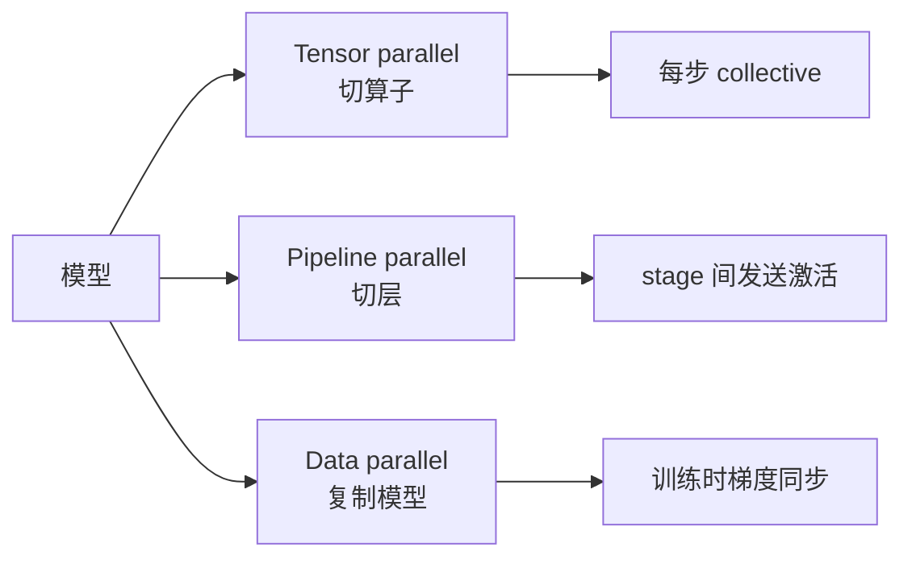
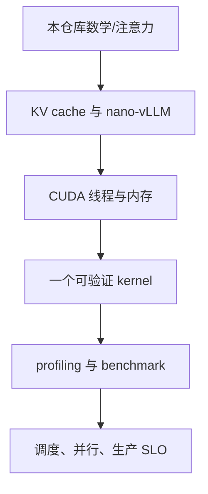

单卡优化解决不了模型规模、并发或故障域问题。多卡系统的第一原则是：每一种并行都在用通信换显存或计算，通信路径和同步点必须进入性能模型。

## 01 · 三种并行先分清

Tensor parallel 把一个算子分到多卡，频繁依赖 collective；pipeline parallel 切层，产生 stage 间激活传输与气泡；data parallel 复制模型，训练时需要梯度同步。推理常组合 TP/PP，训练还会加入 DP 和 ZeRO 等内存策略。

参考 [Megatron-LM](https://arxiv.org/abs/1909.08053) 的并行化描述和 [NCCL 文档](https://docs.nvidia.com/deeplearning/nccl/user-guide/docs/index.html) 的 collective 语义；拓扑优化要以实际 NVLink/PCIe/InfiniBand 连接为准。

## 02 · Prefill/decode 解耦何时值得？

把 prefill worker 与 decode worker 分开，可以分别按计算密集和内存密集的特征扩缩容，但需要跨节点传递 KV 或中间状态。网络带宽、序列长度分布和调度粒度决定收益，不能只看单卡 benchmark。

可以从 [DistServe](https://www.usenix.org/conference/osdi24/presentation/yi) 的设计问题入手，再阅读 [Mooncake](https://www.usenix.org/conference/fast25/presentation/qin) 与 NVIDIA 的 [Dynamo](https://docs.nvidia.com/dynamo/latest/) 实现资料。

## 03 · 生产系统要回答的五个问题

1. 请求排队多久，TTFT/TPOT 的 p50、p95、p99 是多少？
2. 显存、KV block、GPU 利用率和网络带宽谁先耗尽？
3. kernel 或通信错误怎样被检测、隔离和重试？
4. 新模型、新量化和新驱动如何做回归与回滚？
5. 成本按 token、按请求还是按 SLO 计算？

这五个问题比“GPU 利用率 99%”更接近服务质量。利用率高但排队长，仍然是坏系统。

## 04 · 一条可执行的学习路线

每阶段只增加一个变量：先能解释单请求，再解释单卡，再解释多卡，最后才做容量和成本规划。资源索引可回看 [Wafer 的 distributed inference 与 current hardware](https://github.com/wafer-ai/gpu-perf-engineering-resources#5-distributed-inference)，架构总览可回看 [AI Infra Book 目录](https://bojieli.github.io/ai-infra-book/index.html)。

### 引用与边界

本章只建立系统边界，不给出某一代 NVIDIA/AMD/TPU 的“最佳配置”。硬件与驱动更新快，应以厂商最新 tuning guide、ISA 和实际测量为准；性能数字若没有 workload、precision、baseline 和 correctness 方法，就不应引用。
