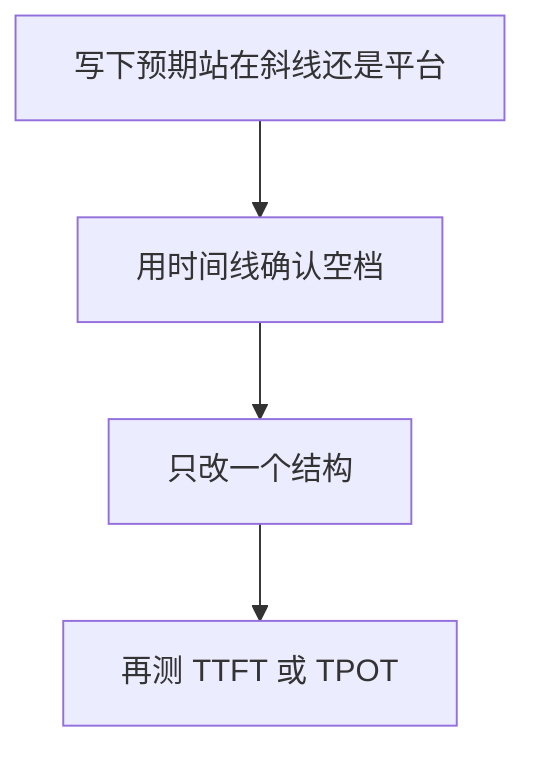

import SeriesNav from '../../components/SeriesNav.astro'

第 04 章给出的是上限，第 05 章给出的是一种靠近上限的结构。测量要回答的是：这次运行离那条线有多远，时间到底花在 kernel 里面，还是花在两次 kernel 之间。

<figure class="math-figure">

<figcaption>四行分别是 CPU 发射、GPU kernel、HBM 拷贝和网络。格子是教学用的时间形状。白道是下一步该看的地方：先解释空档，再打开单个 kernel。</figcaption>
</figure>

## 一次可以比较的运行要写下这些

两次耗时能相减，前提是下面几项相同，或者差异被写进记录：

| 记录项 | 原因 |
| --- | --- |
| 模型形状、序列长度、批大小、dtype | 它们就是第 01 到 03 章的账单 |
| GPU 形态、驱动、CUDA、框架版本 | 峰值和 kernel 选择会随版本变 |
| 预热次数、计时区间、是否同步 | 冷启动和异步返回会把启动算进 kernel |
| 正确性对照 | 更快但结果变了，比较的是另一个计算 |

正确性先于速度。越界和竞争可以用 [Compute Sanitizer](https://docs.nvidia.com/compute-sanitizer/ComputeSanitizer/index.html) 看。数值对照可以是一小段 CPU 结果，或同一个算子的另一个实现，容差要和 dtype 一起写下来。

## 两种镜头

[Nsight Systems](https://docs.nvidia.com/nsight-systems/UserGuide/index.html) 看整条时间线：CPU 什么时候发射，GPU 哪里是空的，拷贝有没有和计算重叠，通信卡在哪一段。空档若来自发射太细或主机与设备同步，去改融合和批处理，比去调共享内存更对症。

[Nsight Compute](https://docs.nvidia.com/nsight-compute/ProfilingGuide/index.html) 看一个 kernel：实际带宽、计算吞吐、占用率、内存访问模式，以及它在屋顶线的哪一侧。指标名称随架构和工具版本变化，报告里留原始导出。两个工具的分工，和 [Wafer 清单的 profiling 一节](https://github.com/wafer-ai/gpu-perf-engineering-resources#profiling-benchmarking-and-correctness) 一致。

## 源码、PTX 和机器码

CUDA C++ 先变成 PTX，再变成目标 GPU 的机器码。PTX 的语义在 [PTX ISA](https://docs.nvidia.com/cuda/parallel-thread-execution/index.html)。`cuobjdump` 和 `nvdisasm` 用来查看二进制里实际生成了什么，说明见 [CUDA Binary Utilities](https://docs.nvidia.com/cuda/cuda-binary-utilities/index.html)。这一步用来核对「我以为会发出 Tensor Core 指令」这件事，不用来代替时间线。编译选项、架构代号和输入形状都会改变产物，所以它们属于上一节的记录项。

## 一次只改一个量

一次实验里同时改 tile、dtype 和启动方式，快了也无法知道是哪一项生效。可执行的循环是：用第 04 章的下界写下预期站在斜线还是平台，用时间线确认时间是否真在那个 kernel 里，只改一个结构，再测端到端的 TTFT 或 TPOT。Kernel 内部变快，而端到端不变，通常说明空档在别处。

## 引用与边界

| 用到的内容 | 出处 | 本页的处理 |
| --- | --- | --- |
| 运行时开销要被看见 | [AI Infra Book，算子与运行时](https://bojieli.github.io/ai-infra-book/manuscripts/05-%E7%AE%97%E5%AD%90%E4%B8%8E%E8%BF%90%E8%A1%8C%E6%97%B6.html) | 收成两种镜头和一份记录表 |
| Nsight、Sanitizer、基准方法 | [Wafer，Profiling](https://github.com/wafer-ai/gpu-perf-engineering-resources#profiling-benchmarking-and-correctness) | 索引到厂商文档 |
| PTX 与二进制工具 | NVIDIA 的 PTX 与 Binary Utilities 文档 | 只说明它们回答的问题 |

本页不附带某次 nsys 或 ncu 的导出文件。没有那份导出，图里的格子就只是时间形状，不是性能数据。

<SeriesNav current="ai-infra-06" />
