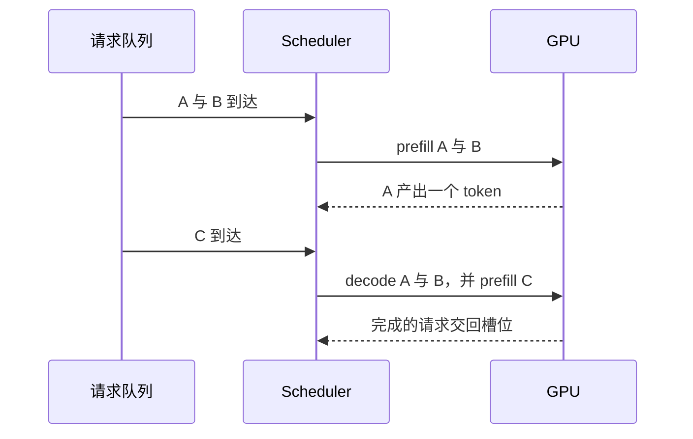

单卡的屋顶线和 kernel 决定一步计算能有多快。推理引擎决定这一步算哪些请求、KV 放在哪、权重用多少字节，以及一步验证能产出几个 token。模型权重可以不变，这四件事仍会改掉第 01 章的三本账。

## 静态 batch 在等最长的那条

把若干请求拼成一个张量，然后一起跑到全部结束，短请求会在长请求后面空转。迭代级调度在每个 decode 步重新选择还活着的请求，结束的请求腾出的位置可以马上给新来的预填充。利用率因此更接近「这一步有多少 token 可算」，排队、公平和显存回收也变成调度器自己的状态。这个调度单位的变化来自 [Orca](https://www.usenix.org/conference/osdi22/presentation/yu)。

公平性是这个机制带出来的新问题：如果调度总是优先能填满 GPU 的短请求，长请求的排队会变差。进一步的阅读放在 [Wafer 的调度一节](https://github.com/wafer-ai/gpu-perf-engineering-resources#scheduling-and-continuous-batching)，不在这里展开某一种公平策略。

## KV 是一张页表

若每条请求占一块连续显存，并且按最大长度预留，短请求会留下用不上的尾巴，结束一条长请求还会迫使别的请求搬家。分页把 KV 切成固定大小的块，逻辑 token 通过块表找到物理块。请求之间的物理块可以交错，结束的块回到空闲列表。

<figure class="math-figure">

<figcaption>教学用的块大小是 4。A 的 10 个 token 在逻辑上连续，物理上占用 1、2、5 三块。B 的块夹在中间。空闲块可以给下一条请求。</figcaption>
</figure>

[PagedAttention](https://arxiv.org/abs/2309.06180) 把操作系统的分页用到 KV 上，[vLLM](https://github.com/vllm-project/vllm) 是对应的实现。块大小在生产系统里通常大于 4，映射方式相同。共享前缀时，只读块可以被多条请求指到同一物理块；一旦某条请求要写，就先复制再写。本仓库的 [KV cache](../../lessons/kv-cache) 用拼接保持等式清楚，[nano-vLLM 讲义](../../inference/nano-vllm-from-zero-to-mastery.html) 则沿着调度、块表和 CUDA Graph 的源码往下看。

## 量化先改字节

把权重或 KV 从 2 字节收成 1 字节，第 03 章里由权重主导的算术强度大约翻倍，容量也大约减半。误差是否可接受，要在固定的评测集上和改字节之前的模型比，再看吞吐和尾延迟。两条常见的不同做法：SmoothQuant 把激活里难量化的幅度搬一部分到权重上，使两侧都能用 8 位整数，见 [Xiao 等人](https://arxiv.org/abs/2211.10438)；AWQ 按激活的幅度保护少量显著权重，见 [Lin 等人](https://arxiv.org/abs/2306.00978)。具体缩放和 kernel 以论文和所用引擎的实现为准。

## 投机解码用接受率决定一步能产出几个 token

草稿模型先提出若干候选，目标模型再一次验证能接受多长的前缀。设草稿长度为 $\gamma$，每个草稿 token 被独立接受的概率是常数 $\alpha$，并在第一次拒绝时仍由目标分布产出一个 token。一步验证期望得到的 token 数是

$$
\sum_{i=0}^{\gamma} \alpha^{i} = \frac{1-\alpha^{\gamma+1}}{1-\alpha}.
$$

$\alpha = 0$ 时这个和是 1，相当于没有草稿。$\alpha$ 接近 1 时，一步可以接近 $\gamma+1$ 个 token。净加速还要扣掉草稿模型自己的时间，所以接受率高而草稿很贵时，端到端仍可能变慢。过程的定义见 [Leviathan 等人](https://arxiv.org/abs/2211.17192)。这里的常数 $\alpha$ 是为了把期望写成等比级数，真实接受率随上下文和采样方式变化。

## 三个数描述这次服务

| 指标 | 它记的区间 |
| --- | --- |
| TTFT | 请求到达到第一个 token |
| TPOT | 之后相邻 token 的间隔 |
| 有效吞吐 | 满足延迟目标的完成量，而不是不计延迟的最大 token 速率 |

基准记录要包含模型、输入输出长度、并发、dtype、硬件、正确性做法和延迟目标。[Etalon](https://arxiv.org/abs/2407.07000) 讨论怎样让服务基准反映这些目标，[MLPerf Inference](https://mlcommons.org/benchmarks/inference-datacenter/) 是一组公开的基准定义。

## 引用与边界

| 用到的内容 | 出处 | 本页的处理 |
| --- | --- | --- |
| 批处理、KV、量化与投机解码何时有效 | [AI Infra Book，推理优化](https://bojieli.github.io/ai-infra-book/manuscripts/08-%E6%8E%A8%E7%90%86%E4%BC%98%E5%8C%96.html) | 每项只保留它改写的那一本账 |
| 引擎主题的原始论文 | [Wafer，Inference engines](https://github.com/wafer-ai/gpu-perf-engineering-resources#4-inference-engines) | 索引 |
| 迭代调度、分页、两种量化、投机解码 | Orca、PagedAttention、SmoothQuant、AWQ、Leviathan 等，链在正文 | 机制用自己的例子重写，等比级数是常数接受率下的期望 |

本页没有实现调度器。块表和 CUDA Graph 的代码路径在 nano-vLLM 那一篇里。

