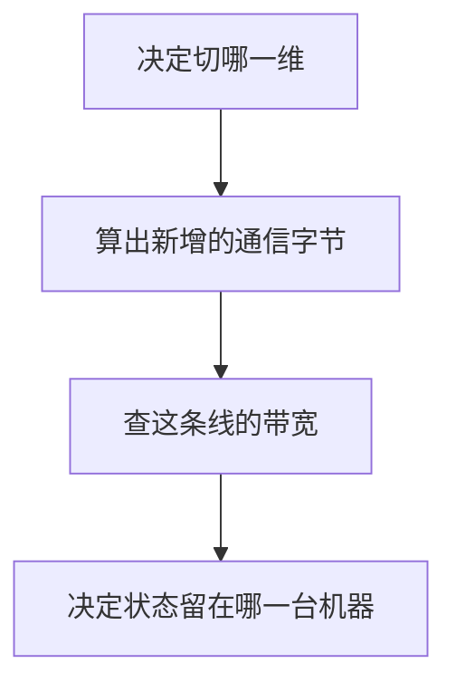

一张卡的字节和脊点已经确定之后，多出来的卡只能做一件事：用通信换容量或换吞吐。先决定切哪一维，再问这些字节要穿过哪条线。

<figure class="math-figure">

<figcaption>张量并行每步都要集合通信。流水并行在阶段之间送激活。数据并行复制整模，训练时同步梯度。图下的带宽提醒：HBM 和 NVLink 不是同一个量级。</figcaption>
</figure>

## 切列、切层、复制，以及只送选中的专家

张量并行把一个矩阵乘的列或行分到多张卡。列并行的局部结果要在进入下一个需要完整向量的算子之前归约。[Megatron-LM](https://arxiv.org/abs/1909.08053) 把这种切法和对应的集合通信写进了层结构。通信次数随层数走，所以它换来的是单层放得下，付出的是每层一次同步。

流水并行按层把网络切成阶段。前一阶段的激活送给后一阶段。阶段数是 $P$、同时在飞的微批是 $M$ 时，流水里填不满的那一段比例大约是 $(P-1)/M$。这个气泡来自 [GPipe](https://arxiv.org/abs/1811.06965) 的排程；后来的交错阶段能把它压小，见 [Narayanan 等人](https://arxiv.org/abs/2104.04473)，但阶段之间的激活传输还在。

数据并行每张卡留一份完整模型，各自吃不同的样本。推理时可以不通信，直接把请求分出去。训练时梯度要合到一起，再更新那份共享的权重。

专家并行是第 02 章的自然延伸：token 只去它选中的专家所在的卡，集合操作是 all-to-all，而不是把所有专家的结果加起来。放置方式见 [GShard](https://arxiv.org/abs/2006.16668)。

## 同一次集合通信，秒数取决于线

NCCL 规定了 all-reduce、all-gather、reduce-scatter 和 all-to-all 的结果应当是什么，文档在 [NCCL User Guide](https://docs.nvidia.com/deeplearning/nccl/user-guide/docs/index.html)。字节数由切分方式决定。秒数由拓扑决定：同一机柜里的 NVLink，和穿过网卡的链路，带宽可以差一个数量级以上。

[H100 产品页](https://www.nvidia.com/en-us/data-center/h100/) 在 2026-09-22 给 SXM 列出的 NVLink 是 900 GB/s，HBM 带宽是 3.35 TB/s。不管 900 这个数在脚注里是单向还是双向合计，它都小于本卡 HBM。所以「把张量切到另一张卡」不是免费的容量。机内、机间各是什么链路，要以那台机器的拓扑为准，而不是以产品页上的峰值代替。[Wafer 的并行与拓扑一节](https://github.com/wafer-ai/gpu-perf-engineering-resources#parallelism-collectives-and-topology) 把这部分原始材料集中在一起。超节点和数据中心网络分别是 [AI Infra Book 第 6 章](https://bojieli.github.io/ai-infra-book/manuscripts/06-%E8%B6%85%E8%8A%82%E7%82%B9.html) 与 [第 7 章](https://bojieli.github.io/ai-infra-book/manuscripts/07-%E6%95%B0%E6%8D%AE%E4%B8%AD%E5%BF%83%E7%BD%91%E7%BB%9C.html) 的主题；这里只保留「字节数和秒数分开记」。

## 把 prefill 和 decode 拆开

第 03 章已经说明，长提示的 prefill 靠近算力平台，单请求 decode 靠近带宽斜线。把两种请求放在同一张卡上，小而频繁的 decode 会把大矩阵乘切开。拆成两类 worker 之后，各自按自己的强度扩容，代价是 KV 或隐藏状态要跨机传送。传送时间小于混部造成的损失时，拆开才划算。问题的提法见 [DistServe](https://arxiv.org/abs/2401.09670)。[Mooncake](https://www.usenix.org/conference/fast25/presentation/qin) 把 KV 的存放和传输做成独立的一层。阅读索引在 [Wafer 的解耦一节](https://github.com/wafer-ai/gpu-perf-engineering-resources#prefill-and-decode-disaggregation)。

## 训练：重算，或者把 16 字节切开

第 03 章的 16 字节已经让一个 8B 模型超过单卡。两条正交的办法可以叠用。梯度检查点少留激活，反向时重算。ZeRO 按数据并行的成员数 $D$ 切开常驻状态：先切 8 字节的优化器状态，再切梯度，最后连参数也切，用到时再集齐。切得越细，单卡常驻越小，集合通信越多。分片的定义见 [ZeRO](https://arxiv.org/abs/1910.02054)。训练系统要同时安排这三样：激活留多少、优化器状态放在谁那里、微批怎样填满流水。这是 [AI Infra Book 第 10 章](https://bojieli.github.io/ai-infra-book/manuscripts/10-%E8%AE%AD%E7%BB%83%E7%B3%BB%E7%BB%9F.html) 的问题；分布式推理一侧的放置、扩容和恢复见 [第 9 章](https://bojieli.github.io/ai-infra-book/manuscripts/09-%E5%88%86%E5%B8%83%E5%BC%8F%E6%8E%A8%E7%90%86.html)。

## 状态放在哪一台机器上

调度回答的是：这份权重和这段 KV 此刻在哪，下一个请求要不要等它们，还是另找一份副本。[AI Infra Book 第 11 章](https://bojieli.github.io/ai-infra-book/manuscripts/11-%E8%B5%84%E6%BA%90%E8%B0%83%E5%BA%A6%E4%B8%8E%E8%BF%90%E8%A1%8C%E7%8E%AF%E5%A2%83.html) 把这个问题放到共享集群里。端和云是同一个问题的两个半径：状态若必须留在设备上，模型就得缩到那台设备的容量和能耗里；状态若可以送到云上，延迟预算就要盖住网络的往返。[第 12 章](https://bojieli.github.io/ai-infra-book/manuscripts/12-%E7%AB%AF%E8%BE%B9%E4%BA%91%E5%8D%8F%E5%90%8C.html) 讨论的就是这个放置。

生产里值得持续记录的是这些量：TTFT 和 TPOT 的分位数、KV 块和带宽谁先用尽、失败后怎样隔离、新 kernel 或新驱动怎样回滚、成本按 token 还是按达标请求计算。GPU 忙，只说明第 04 章的某一侧被碰到了；排队仍在变长时，服务并没有变好。基准的记法可以回到 [Wafer 的 serving benchmarks](https://github.com/wafer-ai/gpu-perf-engineering-resources#serving-benchmarks)。

## 引用与边界

| 用到的内容 | 出处 | 本页的处理 |
| --- | --- | --- |
| 超节点、网络、分布式推理、训练、调度、端边云 | AI Infra Book 第 6、7、9、10、11、12 章，链在各节 | 收成「切哪一维、走哪条线、状态放哪」 |
| 并行、MoE 通信、解耦、生产与硬件 | [Wafer，Distributed inference](https://github.com/wafer-ai/gpu-perf-engineering-resources#5-distributed-inference) 与 [Current hardware](https://github.com/wafer-ai/gpu-perf-engineering-resources#6-current-hardware) | 索引 |
| Megatron、GPipe、ZeRO、DistServe、NCCL、H100 | 正文中的论文和文档 | 只保留会改变字节或同步次数的规则 |

本页不给出某一代 GPU 的推荐拓扑或并行组合。那种组合依赖模型形状、长度分布和这台集群的线，要用第 06 章的记录方法在目标机器上测。

