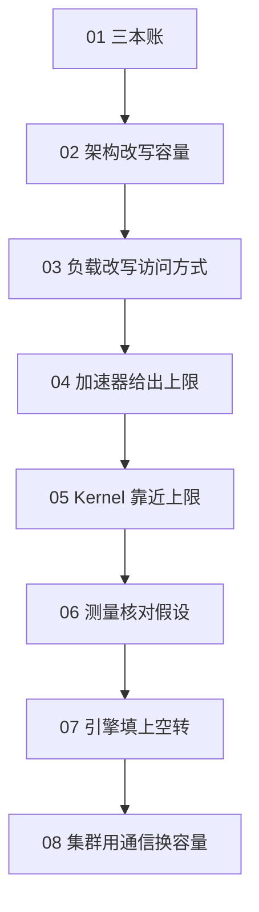

这条路线回答一个问题：一次文本生成，时间和显存到底花在哪里，以及多加一张卡时这笔账怎么变。前面的数学、位置编码和 KV cache 已经说明注意力在算什么；这里接着问这些张量放在哪、搬多少次、由谁调度。

<figure class="math-figure">

<figcaption>后一章只用前一章已经算过的量。上限、kernel 和调度都是为了靠近这些量，而不是另起一套词汇。</figcaption>
</figure>

## 每一章只增加一个变量

| 章 | 这一章新出现的量 | 读完要能手算的事 |
| --- | --- | --- |
| [01 三本账](../../lessons/ai-infra-01) | 权重字节、KV 字节、prefill 与 decode | 换一个上下文长度，重算 KV |
| [02 架构](../../lessons/ai-infra-02) | KV 头数、分数矩阵、专家是否常驻 | 把 MHA 换成 GQA，看缓存缩小几倍 |
| [03 负载](../../lessons/ai-infra-03) | 算术强度、批大小、优化器状态 | 说明 batch 为什么让权重被复用 |
| [04 加速器](../../lessons/ai-infra-04) | 带宽、算力峰值、脊点 | 判断一个 kernel 该贴着斜线还是平台 |
| [05 Kernel](../../lessons/ai-infra-05) | tile、融合、Tensor Core 的形状约束 | 指出朴素矩阵乘重复读了哪一块 |
| [06 测量](../../lessons/ai-infra-06) | 时间线、单 kernel、编译产物 | 写下一次实验要固定的全部条件 |
| [07 推理引擎](../../lessons/ai-infra-07) | 迭代调度、页表、量化、接受率 | 说明分页解决的是哪一种碎片 |
| [08 集群](../../lessons/ai-infra-08) | 切分维度、collective、状态放在哪 | 说出一种并行每次多出来的通信 |

读法是顺着走。已经熟悉某一层的人也可以从对应的一章进入，但第 04 章的脊点用的是第 01 章的字节和第 03 章的算术强度。

## 材料各自负责什么

正文里的手算、图和例子是为这条讲义写的。外部材料只在两处出现：定义和数字指向一手来源，阅读顺序指向两条已经整理好的路线。

- [AI Infra Book](https://bojieli.github.io/ai-infra-book/index.html) 把系统从一次执行的资源账写到端边云。本系列借用它的问题分层，每章注明对应的章节，不复述书里的表述和例题。
- [GPU Performance Engineering Resources](https://github.com/wafer-ai/gpu-perf-engineering-resources) 是一份按「一次请求 → 一张 GPU → kernel → 引擎 → 分布式」排好的原始资料索引。本系列用它决定进一步阅读的顺序，不把链接列表当成正文。

一手材料包括论文、NVIDIA 的 CUDA 与 Nsight 文档、产品规格表，以及 Meta 公开的 Llama 3 模型代码。产品页上的峰值会改版；第 04 章写明了读取日期。把某个数字写进自己的报告之前，要回到那一页再核对一次。

## 和本仓库前几篇的接缝

[KV cache](../../lessons/kv-cache) 用 CPU 上的小张量证明：有缓存的逐步解码和整段注意力可以算出同一个结果。[位置编码](../../lessons/position-encoding) 说明位置是怎么进 Q 和 K 的。那些章节故意把存储写成 `torch.cat`，好让等式看得清。从第 01 章起，同一块缓存要按字节计价，并在后面的章节里变成页表、带宽和跨机传输。

