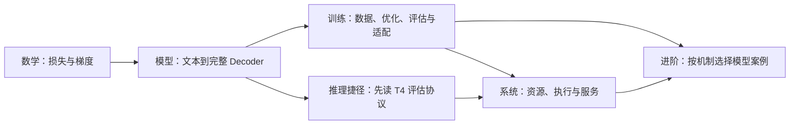

# 内容连贯性审计与课程大纲

研究日期：2026-09-27。审计基线：`9437d99`，16 个正文章节、3 个导读，以及验证脚本、首页和导航实现。

本文保留原始审计编号。2026-10-01 补充后，数学路线为 M1–M11：新增事件、贝叶斯与信息量三章，原 M1/M2 改为 M3/M5，原 M3–M8 改为 M6–M11。现行章节与概念衔接见[数学导读](../site/src/content/lessons/math/index.mdx)，验收见[课程进度](CURRICULUM_PROGRESS.md)。

状态：课程设计方案。本文中的新编号、章节和实验尚未进入网站；实施前按下述批次安排。逐章内容设计见 [章节设计卡](CHAPTER_BLUEPRINTS.md)。

## 1. 结论与课程目标

最需要补齐的是从数学到语言模型的完整计算链。现在 M7 完成 XOR 分类网络，P1 立即研究注意力的置换对称性，P2/P3 深入旋转与相对位置，P4 证明缓存；随后 S1 按现代 Transformer 的结构记账。读者还没有搭过 tokenizer、嵌入、完整 Decoder、下一 token 训练和生成循环，就开始证明其中的专项性质并优化执行。

建议课程最终形成四条主线：数学基础 M1-M7、模型原理 P1-P10、训练与适配 T1-T6、推理系统 S1-S10，共 33 章，另有 9 篇进阶专题。现有 16 章的内容尽量复用，新增、拆分和改写分批进行；这些数量是目标结构，不是要求一次写完。

读者仍以具备 Python 基础、未系统学习深度学习的人为主。完成主线后应能：

- 从文本构造模型输入和预测标签，解释每个张量轴与损失归约。
- 在 CPU 上训练、保存、恢复一个教学级 Decoder，并运行生成与缓存对照。
- 阅读指定 Llama/Qwen 配置，解释结构差异和推理所需状态。
- 从朴素实现走到分块、调度、分页、并行，给出正确性证据和测量边界。

CPU 实验负责教学正确性；GPU 实验负责真实性能。训练很小的模型不等于复现公开大模型，也不能凭几个生成样例证明具备通用语言能力。

推荐阅读路径：

- 完整主线：M → P → T → S，最后按问题选择 A 专题。
- 已有训练背景、主要读推理：补齐 P1-P10，阅读 T4 的评估协议，再进入 S；T2 仅在阅读优化器状态与 ZeRO 分支时需要。
- 已有数学背景、主要做模型：从 P1 开始，按先修链接回读 M，再完成 T1-T6。

路线之间存在分支依赖；网站的“下一章”只给默认顺序，章首必须写清真正的先修，不能把所有上一章内容自动变成必修。

## 2. Web 检索如何影响大纲

以下是对一手资料的归纳；章节顺序与取舍是结合本仓库读者定位作出的设计判断。

| 一手资料 | 确认的覆盖范围或机制 | 对本课程的设计影响 |
| --- | --- | --- |
| [Stanford CS336，2026](https://cs336.stanford.edu/) | tokenizer、模型、优化器、小模型训练、系统、数据、评估和后训练；课程要求已有深度学习与系统基础 | 用来检查覆盖完整性；本课程补足先修，不照搬其较快的讲解顺序 |
| [Hugging Face LLM Course](https://huggingface.co/learn/llm-course/chapter1/1)、[tokenizer 章节](https://huggingface.co/learn/llm-course/chapter6/1) | 文本处理、模型使用、tokenizer 与训练等主题 | tokenizer、特殊 token、输入整理需要独立介绍 |
| [Transformer 原论文](https://arxiv.org/abs/1706.03762) | 注意力之外还有多头、前馈、残差、归一化及输入输出结构 | 先构成完整模型，再研究位置编码专项 |
| [RMSNorm](https://arxiv.org/abs/1910.07467)、[GLU 变体](https://arxiv.org/abs/2002.05202)、[GQA](https://arxiv.org/abs/2305.13245) | 现代稠密模型的关键模块 | 在系统记账前推导 RMSNorm、SwiGLU、GQA |
| [Llama 3 报告](https://arxiv.org/abs/2407.21783)、[Qwen3 报告](https://arxiv.org/html/2505.09388v1) | 可公开核对的模型架构、训练和评估资料；Qwen3 包含稠密与 MoE 模型 | 用 Llama 3 做参数账，用 Qwen3 接入现有 nano-vLLM 案例 |
| [HF 生成文档](https://huggingface.co/docs/transformers/main/en/llm_tutorial)、[chat template](https://huggingface.co/docs/transformers/main/en/chat_templating) | 自回归生成、停止、输入整理和对话序列化 | 采样与对话输入移到模型路线；系统路线解释执行成本 |
| [HF 困惑度文档](https://huggingface.co/docs/transformers/main/en/perplexity) | tokenizer 与上下文计算方式会影响困惑度 | 把评估协议放在模型优化和性能比较之前 |
| [FlashAttention](https://arxiv.org/abs/2205.14135)、[FlashAttention-2](https://arxiv.org/abs/2307.08691) | 通过 IO 与计算组织改进注意力执行 | 从朴素注意力推在线 softmax，区别于改模型结构 |
| [Orca](https://www.usenix.org/conference/osdi22/presentation/yu)、[PagedAttention](https://arxiv.org/abs/2309.06180) | 迭代级调度与 KV 分页是不同机制 | 调度和存储分别讲，再追踪它们在引擎中的契约 |
| [LoRA](https://arxiv.org/abs/2106.09685)、[InstructGPT](https://arxiv.org/abs/2203.02155)、[DPO](https://arxiv.org/abs/2305.18290) | 参数高效适配、监督微调、人类偏好训练的不同目标 | 先讲预训练与 SFT，再讲 LoRA；DPO 作为有明确先修的进阶专题 |
| [DeepSeek-V3](https://arxiv.org/html/2412.19437v2)、[DeepSeek-R1](https://arxiv.org/abs/2501.12948) | MLA/MoE 架构与推理能力训练是不同层面的变化 | 架构专题与 RL 专题分开，不把 reasoning 当作新注意力层 |
| [Mamba-2](https://arxiv.org/abs/2405.21060)、[Qwen3.5 官方模型卡](https://huggingface.co/Qwen/Qwen3.5-35B-A3B-Base/blob/main/README.md)、[DeepSeek-V3.2](https://arxiv.org/abs/2512.02556) | 状态空间、Gated DeltaNet 混合结构与稀疏注意力提供不同执行方式 | 用进阶章节讨论哪些缓存、复杂度和分页结论需要重新分析 |

本次选择的是能解释机制、资料可核对的代表案例，不是截至研究日期的最新模型排行榜。具体写模型章节时，应再次固定模型配置、源码 revision 与论文版本。

## 3. 当前内容的主要断点

优先级定义：高 = 阻断初学者沿主线学习，或存在会误导后续计算的概念问题；中 = 内容已有但组织或验证不足。

| 优先级 | 位置 | 断点与证据 | 处理 |
| --- | --- | --- | --- |
| 高 | [M7](../site/src/content/lessons/math/training.mdx) 到 [P1](../site/src/content/lessons/principles/attention-order.mdx) | 前者的输入是二维实数、标签是两类；后者假定已经有 token 内容向量和 Q/K/V | 新增 tokenizer、嵌入、下一 token 目标与 bigram 基线 |
| 高 | P1 到 P4 | 有单头注意力和缓存证明，但没有完整 Decoder 的前向路径与实现 | 新增多头、因果掩码、残差、LayerNorm、FFN、LM head 和整体模型 |
| 高 | [S1:23](../site/src/content/lessons/systems/ledger.mdx#L23)、[S4:52](../site/src/content/lessons/systems/engine-execution.mdx#L52) | SwiGLU、RMSNorm、GQA 已成为记账与源码阅读的默认前提，正文未给完整结构推导 | 新增现代稠密 Decoder 章，明确与基础 Transformer 的差分 |
| 高 | [P4:127](../site/src/content/lessons/principles/kv-cache.mdx#L127)、README | 当前脚本检验预先给定的单层 Q/K/V，不是完整 LM；README 已准确说明边界，但课程尚无完整文本生成闭环 | 增加完整模型训练、生成、逐层缓存验证，保留现有单层对照 |
| 高 | [S5:21](../site/src/content/lessons/systems/cluster.mdx#L21)、[S4:68](../site/src/content/lessons/systems/engine-execution.mdx#L68) | S5 将列并行局部结果描述为需要归约，与 S4 的列分输出、行求和不一致 | 用两卡手算区分拼接和求和；只有需要完整输出时才 gather，列接行可保留分片 |
| 高 | [S5:23](../site/src/content/lessons/systems/cluster.mdx#L23) 与练习 1 | `(n_PP-1)/n_micro` 是气泡时间相对有效时间的比值，被称为占总时间比例 | 区分两个分母；平衡、忽略通信的示意模型下，4 阶段/12 微批占总时间 20%，相对有效时间开销 25% |
| 中 | [M2](../site/src/content/lessons/math/distributions.mdx) | 极值和熵的求导出现在 M4 前；已有“暂不熟悉导数可先比较函数值”说明，但几段详细证明仍打断主线 | 保留概率与数值说明，将提前使用微积分的证明明确标为回读内容 |
| 中 | [M4:216](../site/src/content/lessons/math/calculus.mdx#L216) | 正定、特征值、特征向量先于对应概念介绍；M3 的秩与正交不能替代这些先修 | 主线用对角二次函数说明曲率；谱分析放选读并就地补定义 |
| 中 | P 导读、[P2:172](../site/src/content/lessons/principles/sinusoidal.mdx#L172) | 引用 M4 的“幂级数”，但 M4 只有有限阶 Taylor 说明；矩阵指数推导还引入微分方程的解 | 修正先修描述，补必要定义；移动到 sin/cos 与 RoPE 主线之后的选读 |
| 中 | [P3:14](../site/src/content/lessons/principles/rope.mdx#L14) | 学 RoPE 前连续经过 Shaw、T5、ALiBi、复数与指数展开，早期认知负担偏大 | 先用已学二维旋转推 RoPE，再讲复数等价表示和相对位置方案比较 |
| 中 | [P4:137](../site/src/content/lessons/principles/kv-cache.mdx#L137) 之后 | padding、窗口、插值、YaRN、动态频率失配聚集在缓存正确性一章 | padding 保留为缓存必需边界；长上下文扩展另设专题 |
| 中 | [S1](../site/src/content/lessons/systems/ledger.mdx) 到 [S4](../site/src/content/lessons/systems/engine-execution.mdx) | 无缓存的普通生成与采样尚未独立讲，系统执行却已依赖 prefill 采首 token、decode 输入上一采样 token | P9 先讲普通生成，P10 再讲缓存，系统只新增资源和调度变量 |
| 中 | S1 的 `2N`、`2NT` 与 S4 的 LM head 优化 | S1 的 N 包含嵌入表；嵌入是行查表，S4 的推理 prefill 只计算末位置词表输出；总参数不能直接当作每位置 GEMM 参数 | 分开总参数、参与线性乘法参数、嵌入查表和输出头；标明粗略估计条件 |
| 中 | [S2](../site/src/content/lessons/systems/accelerator.mdx) | tile、Tensor Core、融合、测量、PTX 都集中在硬件上限一章，FlashAttention 只提 IO 结果 | GPU 执行入门与注意力分块算法分成两章 |
| 中 | S4 | 张量打包、模型结构、并行、CUDA Graph、显存、采样、量化、投机解码、指标聚于一章 | 保留执行器主线；量化、投机、并行和服务评估独立设计 |
| 中 | S5 | 81 行覆盖 TP/PP/DP/EP、通信、PD 解耦、ZeRO、调度和端边云，多个主题只有一段 | 展开多卡推理，增加 collectives 算例与通信时间模型；训练状态分片作为分支说明 |
| 中 | 全站 | 验证以代数性质为主，缺数据、模型质量、恢复与服务协议的共同评价方式 | 建立贯穿案例和递进验收，区分数学等价、模型质量、系统性能 |

气泡比例的来源为 [GPipe §2.3](https://arxiv.org/html/1811.06965v5#S2.SS3)。正文修订需画出假设下的排程，不能把该理想公式泛化到不平衡阶段、通信等待或自回归推理。列并行拼接的定义可核对 [Megatron Core](https://docs.nvidia.com/megatron-core/developer-guide/0.16.0/apidocs/core/core.tensor_parallel.layers.html)。这些是本轮识别出的待修订项，尚未修改正文。

## 4. 现有 19 个页面逐页去向

下表左侧编号是当前网站编号，右侧是规划编号。

| 当前页面 | 保留的价值 | 在新结构中的处理 |
| --- | --- | --- |
| M 导读 | 术语、轴与梯度约定 | 保留；增加全课程地图和主线/选读标识 |
| M1 概率与统计 | 条件、均值、方差、统计轴 | 保留；只作轻量例子衔接，不提前扩写 RL 理论 |
| M2 分布与信息量 | NLL、CE、KL、稳定 softmax | 保留；微积分证明回读，序列目标链接 P2 |
| M3 向量与矩阵 | 形状、投影、批量运算、秩 | 保留；低秩段链接 T6，不提前完整推 LoRA |
| M4 微积分与梯度 | 梯度与步长手算 | 保留；谱分析与更深的 Taylor 内容选读 |
| M5 矩阵求导 | 同形状梯度、三方核对 | 保留；迹记法可选，核心逐元素推导先行 |
| M6 链式法则与反向传播 | 图、广播、微批、求导边界 | 保留；微批、retain_graph 等 API 深入部分可回读 |
| M7 神经网络训练 | XOR 训练和 CE 梯度 | 保留；结尾明确固定类别分类到词表条件预测的变化 |
| P 导读 | 位置专项路线清晰 | 改为文本到完整 Decoder；原四章位置推导作为中后段 |
| P1 注意力为什么不认顺序 | 单头例子、置换证明 | 基础注意力迁至 P3；位置与对称性主体成为 P5 |
| P2 从旋转到 sin/cos | 多频率与严格边界 | 成为 P6；矩阵指数选读后置 |
| P3 相对位置与 RoPE | 相对旋转、范数、梯度 | 成为 P7；先矩阵主线，再方案比较与复数选读 |
| P4 KV cache 的正确性 | 缓存证明与错误对照 | 成为 P10；长上下文材料迁 A4，并增完整 Decoder 验证 |
| S 导读 | 资源到引擎的分层 | 更新为十章，引入实验依赖和硬件边界 |
| S1 一次生成的账单 | 手算模型与 Llama 3 参数 | 保留为 S1；用 P8 作架构先修，细化计算账 |
| S2 单卡的上限 | 屋顶线、分块与测量 | S2 GPU/屋顶线，S3 kernel/FlashAttention，协议归 S10 |
| S3 调度与分页缓存 | 固定快照与控制面追踪 | S4 调度，S5 分页；共用同一请求状态 |
| S4 张量、并行与加速 | 真实执行路径、权重映射 | S6 执行器，采样理论归 P9，量化归 S7，投机归 S8，并行归 S9，指标归 S10 |
| S5 从一卡到一簇 | 通信换容量的统一问题 | 成为展开后的 S9；训练状态分片为 T2 后可读分支，生产协议归 S10 |

数学路线继续使用原有 M1-M7 顺序。M2 已能用数值方式说明核心内容，不值得仅为早期几段求导而全局重排；消除隐藏先修和标出回读段落即可。

## 5. 主线大纲

### M：数学基础，7 章

| 章 | 核心问题 | 调整 |
| --- | --- | --- |
| M1 概率与统计 | 从一批观测能推断什么 | 保留 |
| M2 分布与信息量 | 预测为什么变成 NLL/CE | 保留，证明分层 |
| M3 向量与矩阵 | 数组怎样表示共享变换 | 保留 |
| M4 微积分与梯度 | 参数变化怎样影响损失 | 保留，谱分析选读 |
| M5 矩阵求导 | 怎样一次算出所有参数偏导 | 保留 |
| M6 链式法则与反向传播 | 局部梯度怎样穿过整个图 | 保留 |
| M7 神经网络训练 | 怎样闭合预测、损失与更新 | 保留，衔接语言模型 |

### P：模型原理，10 章

| 章 | 核心问题 | 内容与旧文对应 |
| --- | --- | --- |
| P1 文本、token 与嵌入 | 字符串如何成为网络输入 | 字符/字节/BPE、特殊 token、查表与嵌入梯度，新增 |
| P2 下一 token 预测 | 分类网络如何建模一段文本 | 条件概率、标签右移、有效位置平均、bigram 基线，新增 |
| P3 注意力与多头 | 一个位置如何读取其他位置 | 单头手算、缩放、mask、批与头轴、多头拼接，从旧 P1 扩展 |
| P4 一个完整的 Decoder | 注意力如何组成语言模型 | 残差、LayerNorm、FFN、位置表、LM head、前向与反向，新增 |
| P5 注意力为什么需要位置 | 哪种运算使用了顺序信息 | 双向等变与因果边界、绝对位置，对应旧 P1 主体 |
| P6 从旋转到 sin/cos | 多频率位置函数提供什么 | 对应旧 P2，主线先完成编码再进入选读 |
| P7 相对位置与 RoPE | 旋转怎样调制内容点积 | 对应旧 P3，配对布局和原论文映射 |
| P8 现代稠密 Decoder | Llama/Qwen 对基础模型改了什么 | Pre-Norm、RMSNorm、SiLU/SwiGLU、GQA、QK-Norm、共享输出权重，新增 |
| P9 生成、采样与对话输入 | 模型怎样从一次预测变成回答 | 无缓存循环、greedy/temperature/top-k/top-p、EOS、chat template，新增 |
| P10 KV cache 的正确性 | 怎样复用历史而保持同一计算 | 对应旧 P4，补多层完整模型与 padding 对照 |

### T：训练与适配，6 章

| 章 | 核心问题 | 主要内容 |
| --- | --- | --- |
| T1 数据与样本构造 | 一段语料怎样变成可评估的数据 | 文档级切分、去重、tokenizer 训练边界、窗口、packing、样本权重 |
| T2 优化与训练稳定性 | SGD 之外的更新规则改变什么 | Adam/AdamW、衰减、warmup、裁剪、有效 token 梯度累积、精度与状态 |
| T3 从零训练一个小语言模型 | 怎样建立第一个可恢复的完整闭环 | 配置、数据、训练、验证、checkpoint、生成和基线比较 |
| T4 模型评估与受控实验 | 损失下降说明了哪些能力 | PPL 与 tokenization、任务评分、模板、污染、重复实验、消融 |
| T5 指令微调 | 继续写文本怎样变成按指令回答 | Base/Instruct、对话模板、assistant loss mask、微调与遗忘 |
| T6 LoRA 与参数高效适配 | 怎样只更新少量参数 | 低秩更新、冻结、初始化、合并、优化器与激活显存边界 |

### S：推理系统，10 章

| 章 | 核心问题 | 主要内容 |
| --- | --- | --- |
| S1 一次生成的账单 | 参数、运算与缓存分别多少 | 原 S1，精确账与近似账分开 |
| S2 GPU 执行与单卡上限 | 为什么峰值不等于实际速度 | 层级、thread/block/warp 入门、HBM、屋顶线、kernel 发射 |
| S3 从朴素注意力到 FlashAttention | 怎样改变执行而保留同一输出 | tile、在线 softmax、融合、IO，CPU 等价和可选 GPU 计时 |
| S4 请求生命周期与连续批处理 | 每步应该计算哪些请求 | 无引擎参考循环到 nano-vLLM、等待/运行/完成、分块和抢占 |
| S5 分页与前缀缓存 | 历史状态怎样共享有限显存 | 固定块、页表、碎片、引用计数、前缀身份、可写尾块 |
| S6 引擎执行器与 CUDA Graph | 调度结果怎样成为模型输入 | packed/ragged、位置、slot、权重加载、warmup、graph |
| S7 量化与精度 | 少存几个 bit 会改哪些结果 | 浮点与整数、scale、zero point、粒度、误差、校准、真实 kernel |
| S8 投机解码 | 怎样一次验证多步且保持目标分布 | 草稿、接受/拒绝、残差分布、额外 token、成本模型 |
| S9 多卡推理与通信 | 切开模型需要传什么 | collectives、TP/PP/副本、气泡、拓扑、PD 解耦；EP 为 A1 后分支 |
| S10 服务评估与容量规划 | 怎样判断优化对真实请求有效 | 时间边界、TTFT/ITL/TPOT、负载模型、SLO、有效吞吐、取消与超时 |

完整章节内部顺序、先修和验证见 [设计卡](CHAPTER_BLUEPRINTS.md)。T 是新增路线，选择字母 T 不改变数学路线中序列长度 T 的含义；章节编号是文本标识，不是公式变量。

## 6. 进阶专题与新增模型

| 专题 | 前置 | 机制与代表案例 | 要增加的验证或分析 |
| --- | --- | --- | --- |
| A1 稀疏专家 MoE | P8、T2 | top-k 路由、加权专家、总/活跃参数；Qwen3-MoE、DeepSeek-V3 | 小型路由器与稠密枚举对照，负载分布与容量，不借全模型跑分证明收益 |
| A2 潜在注意力 MLA | P7、P10、M3 | 压缩潜变量、解耦 RoPE 与投影吸收；DeepSeek-V2/V3 | 显式展开与潜在计算对照；缓存量不能只替换 GQA 头数 |
| A3 偏好优化 DPO | T4、T5、M2 | 成对偏好、参考策略、序列 log-prob 与 DPO 损失 | 两条响应手算与自动微分，区别于 SFT 与在线 RL |
| A4 长上下文与窗口 | P7、P10、T4 | 位置插值、YaRN、局部/全局层；Mistral/Gemma 3 作结构例 | 位置与物理槽位、窗口逐层缓存、长距任务，区分可计算长度与有效能力 |
| A5 用可验证奖励训练生成策略 | T5、A3、M1/M2 | 奖励、策略梯度、group baseline、GRPO/RLVR；R1 与 Qwen3 后训练 | 小型可验证任务与组内优势值，奖励作弊、采样预算；不声称复现大规模 RL |
| A6 状态空间与递归模型 | P2、P4、M3 | 从标量递推到选择性状态空间；Mamba/Mamba-2 | 串行递推与等价小型并行计算，状态尺寸、训练/推理差别 |
| A7 递归式线性注意力与混合层 | P3、A6，MoE 分支需 A1 | Gated DeltaNet 与全注意力混合；Qwen3.5 的固定配置例 | 非 softmax 算子和有限状态实验，逐层状态账，不能沿用普通 KV 公式 |
| A8 稀疏注意力 | P3、P10、A2、S3 | token 选择与稀疏执行；DeepSeek-V3.2 DSA | 固定选择后的稀疏计算与 dense+mask 对照，选择开销与质量另测 |
| A9 视觉语言模型 | P4、P9、T5 | 图像 patch、编码器/投影、混合 token；LLaVA，Qwen VL 作对照 | 小型图像输入到 token 的形状追踪、位置和损失 mask，不要求下载大权重 |

A4 的窗口案例以 [Gemma 3 官方结构说明](https://developers.googleblog.com/gemma-explained-whats-new-in-gemma-3/) 为已核对依据；若正文采用 Mistral，写作时补其固定配置与原论文。A9 的初始结构依据为 [LLaVA](https://arxiv.org/abs/2304.08485)。Qwen3.5 的官方博客动态页面本次未能提取正文，混合结构的判断采用上表链接的官方模型卡；细节必须进一步核对源码，不能从标题推测。

模型使用分工：教学 Decoder 是贯穿主角，Llama 3 8B 是公开参数账例，Qwen3-0.6B 是小规模结构与现有引擎连接例。DeepSeek、Gemma、Mamba 和 Qwen3.5 只在相应机制已介绍后进入。原始 Transformer、encoder-only、encoder-decoder、decoder-only 的区别在 P4 作小图比较；BERT/T5 不需要各占一章才能说明这个分类。

RAG、工具调用与 Agent 可在课程结尾解释与基础模型的边界；其检索、工具协议和应用编排留给后续应用路线。本次主线首先完成模型创建与执行。扩散语言模型等仍快速发展的方向进入延伸阅读，待基础闭环和可验证案例完成后再决定是否独立成章。

## 7. 贯穿案例与概念一致性

### 两个教学案例，各有固定身份

1. 小数组手算：词表 8、长度 4、隐藏维 4、两头、一个 Decoder 层。用于形状、mask、归一化和损失；不是公开模型配置。
2. CPU 小语言模型：先字符级、后作固定 BPE 对照；两层、隐藏维 64、四头、上下文 32 起步。语料使用仓库可分发的小文本或明确许可的数据，切分后再训练 tokenizer。实际规模由跑通后的耗时决定。

教学架构分阶段改变：P4 使用基础 Decoder 与学习式绝对位置，P8 增加现代模块，P9/P10 分别增加生成与缓存，T3 正式训练。每次升级保存前一阶段参考计算；不同架构或重新初始化的 checkpoint 不互相宣称数值等价。

公开模型分别使用命名的配置。S1 已有模型 S 的手算规模可以保留为资源算例，但明确它与上面两种案例的关系，避免同名却暗中改变层数、头数或输出权重共享。

### 一个概念有一个主要解释位置

| 概念 | 首次完整解释 | 后文新增的内容 |
| --- | --- | --- |
| 条件概率、NLL/CE、KL、稳定 softmax | M1/M2 | P2 组织序列；T4/A3 组织评估与偏好目标 |
| 隐藏状态、非线性、反向、SGD | M7 | P4 组成 Decoder，T2 扩展优化器 |
| token、特殊 token、embedding | P1 | T1 整理数据，S6 打包输入，T5 序列化对话 |
| causal/padding/loss mask | P2/P3 | P10 对齐缓存位置，S6 转执行器元数据；三种 mask 分别定义 |
| 多头、FFN、残差、LayerNorm | P3/P4 | P8 替换模块，S1 计价 |
| RoPE、RMSNorm、SwiGLU、GQA | P7/P8 | P10 缓存，S3/S6 执行，A2 比较不同缓存状态 |
| 温度、top-k/top-p、停止 | P9 | S8 保持目标分布，S10 测输出协议 |
| KV cache 数学等价 | P10 | S5 管理物理存储，S9 管理跨机传送 |
| Adam、混合精度、优化器状态 | T2 | S1/S9 展开内存和分片账 |
| 模型质量评估 | T4 | S7/S8 比较优化后质量；S10 比较服务指标 |

不同种类的“正确”不能混用：形状合法不代表模型正确；缓存数学等价不代表跨硬件逐 bit 相同；减少存储不保证提速；降低 perplexity 不保证所有任务变好；CPU 验证不证明 GPU 性能。

## 8. 实施顺序与阶段验收

| 批次 | 工作 | 退出条件 |
| --- | --- | --- |
| 0 | 本次审计、大纲、设计卡 | 现有页面有去向，新增章节有问题/先修/实验，来源可追溯；已形成文档 |
| 1 | P1-P4，加 M2/M4 的先修分层和 M7 衔接 | 文本到 logits 到损失到梯度全程可运行，单头/多头/因果 mask 有反例检查 |
| 2 | 重组 P5-P7，新增 P8-P10 | 基础/现代结构差异明确，生成与完整 Decoder 的逐层缓存对照通过 |
| 3 | T1-T4，并加入训练路线和导航 | 小模型能训练、验证、保存与恢复；报告数据切分、有效 token 数和固定 tokenizer 的 PPL |
| 4 | T5/T6 | SFT 标签 mask 与 LoRA 冻结/合并可核对，不能只展示一个生成样例 |
| 5 | S1-S6，先修订 S5 中已确认的概念问题 | 资源账与模型结构一致，朴素/分块输出一致，调度与分页参考模拟无状态漂移 |
| 6 | S7-S10 | 量化误差有边界，投机采样有分布依据，并行有两卡手算，服务测量有统一协议 |
| 7 | A1-A9，按需求顺序编写 | 每篇有独立先修和验证，不增加主线隐藏依赖 |

批次 1 是建议立即开展的正文工作。新增 P1-P4 后，可分步发布已经闭合的阅读段；其余目录的导读必须诚实说明仍待补齐，不能把规划章节显示成已完成。

## 9. 导航、链接与代码迁移

- 旧正文路径优先保留。章节编号由 `order` 自动生成，但正文中的 `P1` 等标签、首页捷径和图注仍需同步更新；链接检查不会检查章节标签是否写错。
- 规划 P5/P6/P7/P10 分别保留 `attention-order`、`sinusoidal`、`rope`、`kv-cache` 路径。旧 P1 基础注意力迁出后，检查指向旧节锚点的所有引用，必要时保留过渡锚点。
- 拆系统正文时，旧 URL 留作明确的主题入口；旧锚点需要迁移说明或兼容锚点，不能仅因首页还可访问就认为迁移完成。
- 增加训练路线要检查 `site/src/lib/tracks.ts`、内容集合校验、首页、README 和导航样式；不新增一套课程框架。进阶专题的呈现方式在真正写第一篇时决定。
- 复用现有数学与位置验证脚本。新模型核心由后续章节共享，避免每章复制一套 Decoder；教学阶段差异用小型明确配置表达，不提前设计通用模型注册器。
- 正文引用脚本仍用 `CodeFile`。CI 明确加入新脚本；尽量让每个主要正确性性质都带一个会失败的错误对照。
- GPU 性能实验单独标注环境、版本、同步、warmup 和输入分布，不作为没有 GPU 的常规 CI 必选门槛。

## 10. 持续内容验收

每次完成一个批次，从读者顺序重新检查：概念是否先定义、术语是否来自前文、图和代码是否使用同一个例子、前后模型配置是否一致、章末结果是否足以进入下一章。

每章至少有一个可观察的结果；算子章节核对公式与参考实现，训练章节核对目标、数据和恢复，系统章节核对状态不变量与时间边界。章节长短由完整问题决定，不为凑字数扩写；如果两个核心问题各有独立先修和验收，就拆章。

源资料记录原作者的设计与实验；本课程的数学推导、CPU 算例和教学模型独立标明。发布模型对照时保留版本、配置、许可和实验条件，更新一个模型不自动推翻前面已证明的算子性质。
