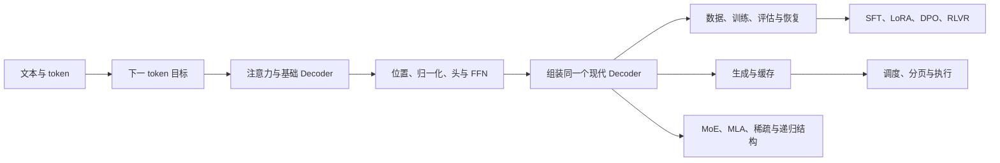
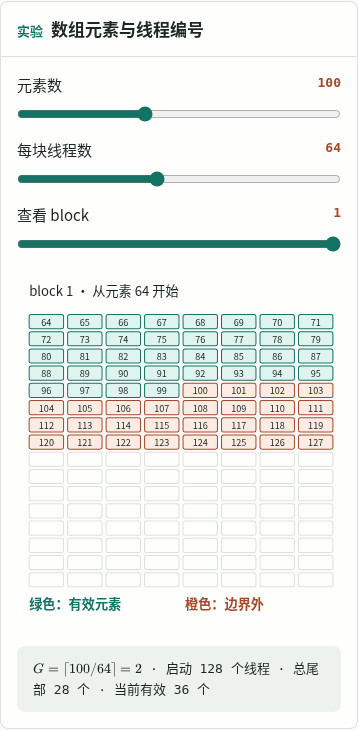
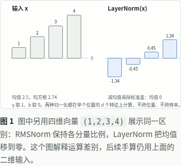

# MDX 全量审查与课程重构方案

审查日期：2026-10-02。对象：当前工作区的全部 68 篇 MDX（61 篇正文、7 篇导读）、图表与交互组件、`code/`、`transformer-lab/`。本报告按“彻底优化、可以重排和删除历史接口”评估，提供逐篇意见和具体迁移方案；不是已完成重构的声明。

## 1. 判断与证据

课程已有相当完整的推导、可重跑的教学数字和明确的证据边界。多数正文可以读懂，也有值得保留的练习。主要问题是不同章节、Python 实现和网页实验各自发展，读者需要反复切换数据、模型配置、符号和操作方式。继续单篇增加解释，会让这些切换更重。

建议将课程、实验和实现统一设计：MDX 是完整的教学入口；合并后的 Python 包提供模型、状态和训练原语；小型独立参考计算负责核对；网页实验使用同一案例，并与 Python 结果对照。Transformer Lab 应成为实现基础，现有 MDX 的逐步手算和阅读路线应成为它的讲解，而不是另维持一套平行教程。

### 本次核对结果

| 检查 | 结果 | 说明 |
| --- | --- | --- |
| MDX 清点 | 68 篇，逐篇审查意见见第 5 节 | 按当前章节编号定位，不沿用旧审计数量 |
| SVG 资源 | 64 个静态 SVG | 50 个不同资源通过字面量 `Figure` 挂载；14 个未找到站点源码引用 |
| 正文交互挂载 | 93 处、91 个组件名 | 另有 7 篇导读的 `CourseMap` 间接挂载；GPU 导读的实验已计入 93。首页另计 |
| 站点检查 | `pnpm check` 通过 | Astro 138 个文件无错误、警告或提示；包括项目已有模型自检 |
| 站点构建 | `pnpm build` 通过 | 70 页、3667 条内部链接通过；有 MDX 指令和大 chunk 的构建警告 |
| 浏览器 | 68 页 × 390/1440px，共 136 次页面核对 | Chromium，无运行时 pageerror、整页横向溢出或文章内重复 ID；滚动触发交互 hydration |
| 图中文字 | 390px 下，39 页有 SVG `text` 的实际字号小于 12px；26 页有小于 10px | 合计 1274 个小于 12px 的标签。按字号和屏幕变换矩阵估算，仅统计可见、有内容的 SVG text；不统计路径化字形，不等于逐字可读性评分 |
| Transformer Lab | 20 项 unittest 通过，1 项 CUDA 测试跳过 | 包含执行全部 25 章的测试。环境提示未安装 NumPy，但本次测试成功 |

本次没有验证 GPU 性能、正式 checkpoint 的质量或每个交互控件的全部状态，也没有把源码审查当成初学者阅读实验。深浅主题的视觉观察是抽样；未宣称所有外部资料和全部公式已独立复证。

### 最先处理的具体问题

| 优先级 | 位置与事实 | 影响与处理 |
| --- | --- | --- |
| 高 | [CodeFile](../site/src/components/mdx/CodeFile.astro) 只加载 `code/`，全文展开脚本 | P8 显示 315 行脚本；T3 两个脚本合计 382 行，另有正文代码。改为从统一源码提取当前讲解的符号/区域，完整文件折叠或外链；不可复制一份正文代码长期维护 |
| 高 | [损失函数](../code/principles/language_model.py) 对零有效目标报错；[Lab loss](../transformer-lab/src/transformer_lab/training/losses.py) 返回可微零；F5 明确选择可微零 | 各自有理由，但尚不是一套跨章节契约。统一损失和有效数量，区分局部空微批、全局空更新、未定义评估均值，见第 3 节 |
| 高 | [Definition](../site/src/components/mdx/Definition.astro) 的链接文本固定为“维基百科条目” | M1–M5 等实际链接包含 OpenStax、MIT、D2L、Google 等。用真实来源名称或通用“定义来源”，不能错标归属 |
| 高 | P4 与 Lab 01/02 的架构不一致 | P4 教学基础模型是 Pre-LN、GELU、学习式位置；Lab 01 是经典 Post-LN、ReLU、sin/cos，Lab 02 仍选 sin/cos。需明确定义教学配置及对照，不能换个 import 就宣称同一模型 |
| 高 | SVG 统一了部分颜色，未统一最终字号和布局 | G1 线程编号约 9.11px；P8 norm 图部分文字约 8.34px。既有交互图，也有静态图；共同规范必须约束实际显示尺寸 |
| 中 | [SamplingLab](../site/src/components/labs/SamplingLab.tsx) 标注历史 `[BOS,A]`，惩罚历史实际传 `[A]` | 改为完整历史，或明确“排除特殊 token，只惩罚 A”的策略；当前控件取消 A 后，标题仍声称固定完整历史，读者无法由 UI 理解真正输入 |
| 中 | M11 正文特征值 1/9，实验只允许 1–3；F4 正文向量分支，实验改用标量函数 | 文字已说明换例，不是隐蔽错误，但读者无法在图中核对主例。实验默认应恢复正文案例，迁移案例作为第二预设 |
| 中 | [lessons.ts](../site/src/lib/lessons.ts) 的阅读时长剔除代码块和展示公式，也看不到加载的源码 | 17 分钟的 M11 在移动端文章约 20515px；T3 约 23474px。改标“正文阅读”并另列实验/实践，或取消精确单一时长 |
| 中 | [部署 CI](../.github/workflows/deploy-pages.yml) 检查 `code/` 与站点，未运行 Lab 测试 | 合并前先建立共同验证入口，合并后只能保留一个必需 Python 检查矩阵 |

## 2. 课程结构应怎样重排

### 用任务主线组织阅读

保留数学、框架、模型、训练、GPU、推理系统这些学科入口，但让读者选择一个目标路线。建议主线是：



数学作为按需先修：概率→信息量→预测目标；线性代数→求导→反向传播→更新。谱分解是 LoRA/稳定性的分支。框架的 NumPy 部分适合补基础，已经熟悉 PyTorch 的读者应可直接从张量轴进入模型；编译应放到执行优化分支。

当前导读已经说明 M11 和高级章节可选、训练的实际数据处理顺序不同。但 `getLessons()` 仍建立跨所有学科的一条总序列，文章前后导航与这些建议不完全一致。新增明确的先修和路线标记，让导读、目录、推荐下一章使用同一份数据。只需显式维护先修路径和少数推荐顺序，无须构建通用图编辑器。

### 拆分、合并与补缺

| 当前内容 | 推荐处理 | 新的职责 |
| --- | --- | --- |
| P4 末尾三类 Transformer 概览 + Lab 01/03 | 新增“Encoder、Cross-Attention 与 Encoder–Decoder”分支 | 明确双向读取、两条长度轴、encoder memory、teacher forcing；回链 decoder 主线。经典 Transformer 有独立入口，而不要求 LLM 初学者先完成翻译模型 |
| P8 常见 Decoder 结构选择 | 拆为归一化/残差布局、MHA/MQA/GQA、门控 FFN；权重绑定在模型组装处讲透 | 每篇一次主要结构变化；同一基线逐步变更，每次有输出与成本对照 |
| P11 完整 Decoder | 成为原理路线的实践终章 | 组合前文选定配置，完整 logits、一次更新、生成与缓存；不再引入新的架构机制 |
| T3 从零训练 | 拆“文本训练与评估”与“checkpoint 精确恢复” | 一个讲数据到模型；一个讲同一实验的状态保存与后续轨迹。四 ID 案例作为恢复协议的最小参考 |
| T5 SFT 内的蒸馏 | 移到后训练分支的独立单元 | 硬标签 SFT 与教师软目标的契约、温度、mask 和生成数据质量各自完整 |
| A3 DPO、A5 RLVR | 移入后训练路线，接 T5/T6/T4 | 先认识回复监督与评估，再比较偏好目标与采样奖励；不在 MLA 和状态空间之间切换训练问题 |
| A4 长上下文 | 分位置/可见集合与窗口缓存执行两层讲解 | RoPE 扩展与长度评估属于模型；ring 地址和状态生存期接 P10/S5 |
| A7 混合层的安全前缀复用 | 移至系统进阶“异构状态缓存” | 合并 FULL/SWA/递归状态、快照与回滚；A7 聚焦递推和混合层数值 |
| G1/G2/G3/G4 | 原理正文 + 独立 kernel 实践单元 | G1 一维/二维编号主线，三维映射选读；G2 转置主线、归约实践；G3 GEMM 主线、Triton softmax/fusion 实践；G4 单 kernel 测量，完整模型 profile 独立 |
| 25 章 Lab 的历史顺序 | 映射到课程机制，不直接作为新章节编号 | MTP、残差变体、条件记忆、共享 KV 保留为明确研究分支，补足讲解后才接入主站 |

不设固定章节总数作为目标。需要拆分的是职责冲突，不是单纯字数超过某个阈值；需要合并的是共同案例和重复机制，不是所有名字相近的文章。

## 3. `code/` 与 Transformer Lab 合并方案

### 目标结构

```text
pyproject.toml / uv.lock       一个 Python 环境与锁定入口
src/llms_from_scratch/         由 Lab 现有实现整理出的唯一模型/状态/训练原语
examples/                     按课程命名的可运行实验与小型独立参考计算
tests/                        核心不变量、参考/实现对照与集成验证
site/src/content/lessons/      唯一完整教学正文
site/src/lib/                 浏览器所需的计算模型
site/src/components/          图表、控件与实验
```

这是目标路径，当前尚未迁移。已有 Lab 配置、层、attention、cache、实验入口优先复用；按课程职责整理，删除重复实现和已失效章节文档。数学/NumPy 教学脚本及 CUDA/Triton 实验放在 `examples/`；GPU 依赖仍为可选环境，不让 CPU 阅读路线必须安装 GPU 栈。

合并中的关键取舍：

1. **一个可训练模型实现。** 当前 `modern_decoder.py` 既是文章校验脚本又定义通用多层模型；训练和高级脚本依赖它，Lab 又有自己的模型。迁移后实验调用统一模型，文章直接展示它的真实实现。
2. **独立核对仍有价值。** P3 手算 attention、MLA naive/absorbed、online softmax 的朴素参考不能全部变成调用被测函数。分别保留短小的参考计算，检验输出、梯度或状态；避免“同一个函数等于自己”的测试。
3. **MDX 与 Lab 章文合一。** 将 Lab 的 shape 表、运行入口、检查不变量并入相应 MDX。其二三十行的机制摘要不能直接替代现有完整推导。Lab 的工程边界、研究目录可保留为开发文档，去掉两份平行课程目录。
4. **不保留历史兼容壳。** 更新所有文章源码链接、命令、README、CI、生成图脚本和实验 import 后，删除旧路径及旧包入口；合并同一逻辑，而不是把一个目录搬进另一个目录后继续两套实现。

### 先统一的计算契约

| 契约 | 统一建议 | 必须核对 |
| --- | --- | --- |
| 轴名 | `B,T,D,H_q,H_kv,D_h,D_ff,V`，不同长度用 `T_q,T_kv`；缓存前缀明确 `P` | MDX、docstring、图、TS readout 同步，区分残差宽与所有 Q 头总宽 |
| 矩阵方向 | 按代码存储解释 `nn.Linear` 权重 `[out,in]`，行批计算 `X @ W.T`；列向量推导显式注明 | F2/F3、P3、P8 的不同约定有转换表，不能读者自行猜转置 |
| token/目标 | 每个实验声明输入是否已移位、特殊 token、有效 mask、停止 token | 避免 `teacher_forcing` 与 `next_token_loss` 二次移位，SFT 按目标归属选行 |
| 布尔 mask | 名字区分 `allowed`、`padding`、`loss_valid`；适配 API 时明确取反 | SDPA 的 True 是允许读取，`masked_fill` 的 True 是填掉；不能直接混用 |
| 损失归约 | 底层获得 `loss_sum` 与 `valid_count`，由训练/评估协议决定均值 | 空局部 rank 可贡献可微零；全局无有效目标且无其他目标时跳过整个优化器更新，避免 weight decay/状态更新；评估均值标未定义 |
| 缓存 | 独立声明绝对位置、历史有效长度、层状态、存储所有权 | 非等长分块、含前缀查询、窗口、padding、跨请求隔离、拒绝后回滚 |
| 模型基线 | 显式教学配置；基础模型与现代模型有清楚的差异表 | Lab 暂无 learned-position 配置，不能直接替代 P4；先补齐或明确改写基线，再重算所有数字 |
| 数值精度 | 手算/参考优先 float64，展示值另行舍入；真实运行按声明 dtype | 输出和梯度容差分开，精确恢复限定同一受控环境，GPU 结果另验 |

这些接口约定有官方依据：[PyTorch Linear](https://docs.pytorch.org/docs/2.14/generated/torch.nn.Linear.html) 使用 `[out,in]` 权重；[SDPA](https://docs.pytorch.org/docs/2.14/generated/torch.nn.functional.scaled_dot_product_attention.html) 规定布尔 mask 的 True 为参与注意力，非方形 `is_causal` 有特定对齐。缓存分块仍须按绝对位置构造可见集合。本报告将这些作为迁移时必须核对的接口，并未据此断言当前所有调用错误。

### Lab 25 章的具体去向

| Lab | 接入当前课程/新单元 | 迁移边界 |
| --- | --- | --- |
| 01 Naive Transformer | 新 encoder–decoder 分支、P3/P4 对照 | 保留朴素/核心同权重核对；区别经典 Post-LN/ReLU/sin-cos 与课程基线 |
| 02 Decoder-only | P4/P11 | 原形态移除 encoder/cross；目前 sin-cos 教学配置不能称为 GPT checkpoint 复现 |
| 03 Encoder-only | 新双向 encoder 分支 | 补 MLM 的监督位置与双向性，避免只给输出 shape |
| 04 MQA | P8 拆出的头共享单元 | 与 11 合并讲 MHA/MQA/GQA，保留每头参考和缓存账 |
| 05 Normalization | P8 拆出的归一化单元 | 对照 Pre/Post、LN/RMS 两个不同变化，不一口气混成“现代化” |
| 06 Gated FFN | 门控 FFN 单元 | 对照相同参数预算与相同宽度，保留激活梯度 |
| 07 Efficient attention | A7/A8 的参考机制 | 线性与稀疏分别归位；不是一个通用“高效注意力”黑箱 |
| 08 RoPE | P7 | 同数值验证范数、相对位移、缓存 offset |
| 09 MoE | A1 | 复用真实 dispatch/router/shared expert/balance；正文解释容量与路由 |
| 10 FlashAttention | S3 | CPU online softmax 与输出/梯度核对；不能用 CPU 结果声称 GPU IO 或加速 |
| 11 GQA | 头共享单元、P11 | 与 04 一个讲解入口；模型保留多 KV 组能力 |
| 12 RoPE Scaling | A4 | 与频率/缓存策略一致；长度能力需另做质量评估 |
| 13 MLA | A2 | 保留 naive/absorbed 输出、参数梯度、cache 交叉对照 |
| 14 MTP | 新研究选读，接 P2/P11 | 完整讲多步标签对齐与泄漏边界，再接 speculative；不作为理解普通生成的先修 |
| 15 Hybrid | A7、异构缓存分支 | 递推、full/chunk/cache 对照接原理，运行期共同边界接系统 |
| 16 KV cache | P10/P11；cross-cache 接 encoder 分支 | 保留非等长 chunk、static cross memory 与多层对照 |
| 17 KV storage | S5/S7 | CPU 分页 COW 与 int8 误差有用，不能替代 GPU kernel 或真实引擎行为 |
| 18 Speculation | S8 中 greedy 对照 | 当前只验证 greedy、整前缀重算；缺随机 p/q、KV rollback。合并必须保留现有 S8 的随机分布证明与回滚讲解 |
| 19 Sequence compression | A8 后的压缩选读 | 保留压缩因果边界，解释选择、压缩和淘汰的区别 |
| 20 Qwen hybrid | A7 公开结构对照 | 实现中的短卷积、异构头状态逐项说明；按具体配置与版本引用 |
| 21 Learned sparse | A8 | 接 indexer/selection 与相同选择的 dense oracle，补选择训练目标和选择成本 |
| 22 Residual streams | 归一化/残差之后的研究分支 | mHC/GR/AttnRes 需要独立图和目标，不塞进 P4 残差入门 |
| 23 Conditional memory | 新研究分支 | 补检索身份、碰撞/读取、因果性与状态成本，再接主站 |
| 24 Shared KV | 缓存进阶分支 | 区分跨层共享与 GQA 的头共享，保留 chunk 绝对位置及梯度核对 |
| 25 Multimodal | A9 | Lab 提供 slots/projector 梯度；现有 A9 的像素→patch→encoder 讲解和实验不能被删成接口示意 |

### 网页与 Python 怎样结合

浏览器里的 TS 计算不能直接 import Python。用现有教学案例定义固定输入、参数、预设与期望 trace；构建前由统一 Python 实验导出小型结果文件，网页模型用相同案例重算并核对。记录案例版本、shape、dtype、容差和算法配置；构建发现差异即失败。

需要交互改变参数的实验继续在浏览器计算；共享固定预设只负责持续证明两端语义一致。不要引入服务器 Python 请求、WASM PyTorch 或把每次滑块操作变成网络调用。也不要用导出结果冒充任意参数下的实时计算。

## 4. 排版、SVG 与公共组件

### 当前统一到哪一步

[Lab.tsx](../site/src/components/labs/Lab.tsx) 已有 `LabFrame/Controls/Range/Button/Readout/pen`，静态图有 [FigureShell](../site/src/components/FigureShell.astro)，并非完全没有设计系统。问题在覆盖与约束：

- `Figure` 用固定十六进制映射到主题 token；交互图用 `pen`；Mermaid、静态 `.astro` 图和 Matplotlib 图还有自己的字体、边距、图例、线宽与图形尺度。颜色相近，读法和密度仍不同。
- `pen.canvas` 的 13px、mono 12px 是 SVG 内字号，`viewBox` 缩放后会更小。静态 `Figure` 默认最小宽 36rem 同样不保证大 viewBox 下最终文字可读。
- 数学文章额外给 h2 加分隔线、h3 改绿、段落行高变化，其他学科的同级标题规则不同。应建立统一正文层级，数学表达本身通过公式排版获得空间。
- SVG 数据表、正文表和 readout 常显示同一组完整数字；部分结构同时有静态图、Mermaid、交互图，读者连续看三遍拓扑，却不知道哪一次用于查结构、哪一次用于核对状态。
- `Figure` 清除原 title/desc，仅保留外部 alt；路径化文字不可选择。应为复杂图提供一句目的说明和等价数据/文字解释，不能只靠色彩与图中小字。
- `FigureShell` 所有图都加可聚焦“可横向滚动”region。让真正可滚动区域获得准确说明；无溢出的图不要制造冗余键盘停靠点。

移动端样例：



此例完整编号阵列保留下来了，但文字约 9.11px。应保持格子最小可读尺寸并局部滚动，或按 warp 分组显示；选中的线程用正文 readout 显示完整编号及有效性。



静态图已有局部滚动，并不代表字号足够；此图部分文字约 8.34px。需按最终字号重设画布/字号，或重排为上下对照，不应只把 `minWidth` 常量套到全部 SVG。

### 建议建立的共同规范

| 层 | 规范 | 验收方式 |
| --- | --- | --- |
| 正文 | 一套 h2/h3/段落/表/公式/代码间距；宽度适合长文阅读 | 各学科同级标题同语义；390/768/1440px 下查段落与公式，不只看首页 |
| 图题 | 说明本图要回答的事，图注解释如何读取与关键结果 | 静态图和实验都明确与正文哪个案例对应，编号体系不混淆 |
| 颜色 | 主输入/状态、变化/错误、辅助/参考各有固定语义 | 浅深主题均有足够对比；图例或纹理承担第二通道，色盲不靠红绿识别 |
| 字号 | 按最终 CSS px 检查：正文标签目标至少 13–14px，辅助标签至少 12px | 这是本项目建议门槛，不冒称通用标准；小于门槛必须重排、滚动或由清楚的等价文本补充 |
| 图形 | 统一节点内边距、圆角、箭头和线宽；区分数据流/控制依赖/缓存复用 | 同一种箭头表示同一关系，不将前向与执行时序画成同一读法 |
| 移动端 | 简单流程上下排；矩阵/内存格维持尺寸局部滚动；曲线删冗余标注保留尺度 | 不整页溢出，也不因 `w-full` 把文字无限缩小；滚动区域键盘可达 |
| 无障碍 | 控件 label、键盘操作、图的目的描述、数字表/文字回退 | SVG 中 clickable g 应有可操作语义；输出区只播报变化结果，避免读整段长说明 |

### 公共组件拆分清单

| 决策 | 当前重复 | 公共职责 | 不应混入 |
| --- | --- | --- | --- |
| 扩展已有 Lab 原语 | 多处手写 select/checkbox/button，字号和边距漂移 | `Select/Toggle`、预设/重置、`StepControls`；复用原生控件 | 具体章节的步骤数据、数学状态 |
| 统一图外壳 | FigureShell、LabFrame、静态 Astro diagram、Mermaid 容器 | 共同边距、标题/说明、caption、scroll policy、a11y；Astro/React 各自薄包装共享样式 | 强迫静态图片依赖 React hydration |
| 增加图画布职责 | 各 SVG 自设 viewBox、fontSize、min-width | `DiagramCanvas`/共用 class 与明确的响应式模式 | 通用布局引擎、所有图共享同一宽高 |
| 抽取重复数据表达 | token 行、数值矩阵、mask 网格、缓存格、两路径对照 | 能命名的 `TokenSequence/MatrixGrid`、图例和紧凑数值表；先从多个真实调用提取 | MoE/MLA/attention 的算法流程做成配置驱动万能组件 |
| 改造 CodeFile | 全文件一股脑展开 | 源码摘录、源码来源、运行命令、完整文件入口；构建验证摘录存在 | 两套缓存的代码字符串、手工复制片段 |
| 响应式 Figure | M11 用两份 Figure 在 mobile/desktop hidden 容器切换 | 单一语义 figure 下选资源、共用 alt/caption | 两个独立图号、同一描述重复维护 |
| 导航数据统一 | CourseMap、ChapterList、prev/next 对阅读路线分别处理 | 一份先修/路线数据；导读默认短 DOM 列表，完整图可选展开 | 所有章节都强制线性相邻 |
| 按实验拆文件 | `AdvancedLabs/SystemsLabs/TrainingTraceLabs/PrinciplesTraceLabs` 聚合多个职责，代码密集 | 一实验一可阅读实现；计算模型继续放 `lib/`，重复绘制移共享层 | 按每个 SVG rect/line 都新建文件 |

`Figure` 的 ID 前缀只由资源路径生成。同页重用同一有 ID 的资源会重复 ID；本次实际页面没有查出此问题，因此是组件能力缺口，不是现有线上故障。改造响应式和复用图时应改为实例唯一前缀并检验引用。

没有站点源码引用的资源为：`advanced/mla-cache.svg`、`frameworks/module-tree.svg`、`gpu/overall-model.svg`、`infra/03-phases.svg`、`infra/05-tiling.svg`、`infra/06-timeline.svg`、`infra/07-paging.svg`、`infra/08-parallel.svg`、`math/06-complex.svg`、`math/calculus-backprop.svg`、`math/calculus-tangent.svg`、`math/probability-batch.svg`、`principles/kv-cache-steps.svg`、`principles/shift-masks.svg`。这是源码引用扫描结果；实施时核对生成脚本/文档用途后，删除淘汰资产或明确其用途。

## 5. 逐篇审查

以下对每篇分别评价职责与连贯性、可读性/呈现、实现与实验去向。各篇还适用上面的共性排版问题；不为每篇重复罗列同一个 CodeFile 或字体问题。编号是审查定位用的旧编号，不要求新课程保留。

### 数学：M0–M11

#### M0 · [数学路线导读](../site/src/content/lessons/math/index.mdx)

- 规划：概率到损失、矩阵到更新两条依赖已讲清，保留按需回读思路。导航还应直接提供这两条路线，M11 标为谱/稳定性分支，避免页尾顺序又让它成为必经章。
- 呈现：CourseMap 与路线说明承担近似职责；移动端完整图过长。先给短路线和每条出口，完整地图可展开；符号约定集中引用，不在每章重讲。
- 实施：从统一先修数据生成路线和推荐下一章；与模型/训练入口连接，不能只有学科内部章节列表。

#### M1 · [随机事件与条件概率](../site/src/content/lessons/math/events.mdx)

- 规划：四条记录贯穿事件、联合、条件与独立性，起点合理，适合保留。互斥和零概率条件在结尾收束，不需要拆成多个小页。
- 呈现：保留事件范围与分母的逐步变化；定义来源修正归属。表格作为所有后续概率页的共同数据，命名和颜色固定。
- 实施：MathEventsLab 使用相同记录身份；重点练习改变条件集合而非重复读公式。

#### M2 · [贝叶斯与序列概率](../site/src/content/lessons/math/bayes.mdx)

- 规划：同表先正向汇总、再反向条件、再链式分解，连贯。属性表到 token 序列的转换需要一张明确的对象对应表。
- 呈现：两个 MathBayesLab 已分别承担来源与序列场景，可保留为共享组件的两个预设；避免把二次挂载误当重复实验删除。
- 实施：序列部分与 P2 使用统一符号和首项条件约定；突出链式法则不要求独立，来源边界说明紧随所用假设。

#### M3 · [概率与统计](../site/src/content/lessons/math/probability.mdx)

- 规划：损失随机变量→期望→方差→batch 均值是训练所需主线，清楚。区分这页人为损失与 M4 负对数损失，在转章处一次交代即可。
- 呈现：随机抽样展示保留，但先展示单次值、理论均值、样本均值三个可对照量；独立抽样假设在 batch 公式旁固定显示。
- 实施：样本数变化应复用同一抽样规则和可复现预设；把估计误差与 T4 的来源相关性接上，不能从小表外推真实数据置信度。

#### M4 · [信息量与熵](../site/src/content/lessons/math/information.mdx)

- 规划：同表贯通信息量、熵、条件熵、交叉熵和 KL，内容完整。主线保留，条件熵的详细展开可作为深入段，先让读者得到预测多付出的代价。
- 呈现：随机变量 U/V 在此重新定义，增加全路线一致的“标签/来源”符号，减少对象重命名。公式后用一个对应数字落地，避免连续多个定义框截断论证。
- 实施：MathInformationLab 的真实分布/模型分布配色固定；来源分别标 D2L/MIT 等，连接 M5 的实测单目标 NLL。

#### M5 · [分布与预测损失](../site/src/content/lessons/math/distributions.mdx)

- 规划：三类 logits→概率→NLL→稳定计算适合作为原理路线直接先修。二分类与连续值是迁移分支，保持与类别预测主线清楚分隔。
- 呈现：主例优先显出 target 的那一项以及 logsumexp；求导最优值已有选读标记，可保留。不要为每种分布再插一个同等级大面板。
- 实施：与 F5/P2 统一 logits、目标、loss_sum/count；连续值损失保留概率假设，不能把 MSE 写成所有任务的默认。

#### M6 · [向量与矩阵](../site/src/content/lessons/math/linear-algebra.mdx)

- 规划：坐标、点积、矩阵、batch、token 轴逐层扩展，组织合理。秩/正交在此只作直观入口，完整解释留 M11。
- 呈现：形状表和逐元素定位值得保留；静态图与 MathLinearLab 若展示同一乘法，分别承担轴说明与变量变化，不连续重复完整求和。
- 实施：选定与代码一致的权重存储方向；列向量推导明确转换。复用矩阵网格，不把线性层计算塞进展示组件。

#### M7 · [微积分与梯度](../site/src/content/lessons/math/calculus.mdx)

- 规划：差商→梯度→更新→复合求导构成完整路径。积分和二阶二次函数继续标选读，不应阻挡 M8。
- 呈现：DescentLab 优先默认正文函数与初值；同时画函数、局部线性预测和实际更新，读者先预测再调步长。
- 实施：二阶曲率与步长细节在 M11 深入，M7 保留必要直觉；不要在两篇复制完整谱推导。

#### M8 · [矩阵求导](../site/src/content/lessons/math/matrix-calculus.mdx)

- 规划：单误差、单样本、共享权重 batch、独立检查、VJP 顺序正确。微分/迹放选读合理。
- 呈现：MathLinearLab 的 gradient 模式是合理复用；前向与梯度图统一矩阵方向、高亮元素、归约轴，明确梯度是相加还是已平均。
- 实施：继续保留手算/autograd/中心差分三种独立依据；与 M9/F4 的 VJP 内容相互引用，免去第三次完整推导。

#### M9 · [链式法则与反向传播](../site/src/content/lessons/math/backprop.mdx)

- 规划：共享隐藏变量的双路径比纯线性链更有教学价值，保留。batch/微批接更新章节自然。
- 呈现：Mermaid 主拓扑与 SharedNodeLab 应统一成同一图的静态初态/逐步高亮；若实验使用另一标量例，增正文主例预设，降低模型切换。
- 实施：图边表示局部依赖、节点显示上游梯度，反向分支贡献显式相加。保留 ReLU 零点约定，避免换激活后继续用旧数字。

#### M10 · [神经网络训练](../site/src/content/lessons/math/training.mdx)

- 规划：XOR 的表达限制、固定初值、一次更新、持续训练形成很好的数学终章。这里应完成一次真实闭环，而不扩展成通用训练框架。
- 呈现：SoftmaxLossLab 与 MathTrainingLab 分别负责分类损失与训练过程，数据标签一致；损失、准确率、决策区域各明确用途。抽样检查图中文字与深色热图配色。
- 实施：保留能表示与能训练的区分；与 F6/T2 只共享优化概念，不强制 XOR 使用 Transformer 模型。

#### M11 · [谱分解、低秩与数值稳定性](../site/src/content/lessons/math/spectral.mdx)

- 规划：特征分解/二次损失步长与 SVD/低秩是两项独立学习目标，建议拆两篇；条件数、稳定 softmax 和浮点边界分别接各自应用。
- 呈现：正文 1/9 与交互 1–3 的换例应改为可复现主例。三组 mobile/desktop 静态图由单一 responsive figure 管理；控制图密度，避免长页中反复回找 A/W 的定义。
- 实施：LoRA 与截断 SVD 的区别保留，接 T6；中心差分、正规方程等数值提醒集中到对应实验，省去一篇承担全部数值分析的负担。

### 框架：F0–F7

#### F0 · [数组与框架导读](../site/src/content/lessons/frameworks/index.mdx)

- 规划：六个数走到一次更新，有清楚的课程对象。将 F7 编译标成执行优化出口，并给熟悉 NumPy/PyTorch 的读者可跳转路线。
- 呈现：短“已会什么→从哪开始”入口优先于完整 SVG 目录，避免导读在解释前占很长屏幕。
- 实施：框架路线明确提供存储、轴、图、参数、更新五种能力；后文模型页按能力回链，而不要求全部顺序阅读。

#### F1 · [NumPy 数组与存储](../site/src/content/lessons/frameworks/numpy-arrays.mdx)

- 规划：基本索引/高级索引、stride、reshape/transpose 用同一数组追踪，合理可保留。
- 呈现：存储位置和逻辑坐标的颜色/标记稳定；操作预测与 readout 放在同一实验范围，减少穿过长 API 清单找当前状态。
- 实施：静态图给别名关系，实验给写入后变化。底层地址/offset 采用共用网格表达，NumPy 专有行为保留在独立模型。

#### F2 · [NumPy 的轴与计算](../site/src/content/lessons/frameworks/numpy-computation.mdx)

- 规划：广播/归约/矩阵乘是主目标；gather、拼接和稳定 softmax 可作为后续迁移段，避免整章成为 API 目录。
- 呈现：正文、AxesLab、ContractionLab 用相同 X 与轴名；把当前选中坐标的计算展开到 readout，而不往矩阵每格塞所有注释。
- 实施：同形不同轴的错误对照保留，与 F3 拆头构成连续练习；方差 ddof 边界明确，不照搬统计估计分母到 LayerNorm。

#### F3 · [PyTorch 张量与轴](../site/src/content/lessons/frameworks/torch-tensors.mdx)

- 规划：NumPy→共享/复制→拆头→mask→合头是模型所需的清楚路径，保留。
- 呈现：等长轴示例需把非方形 T=3/H=2 从脚本提升为可见对照；仅看相同坐标数字会遮蔽轴交换。view/reshape/expand 总结放主过程之后。
- 实施：把 SDPA 允许 mask 与 masked_fill 禁止 mask 的转换讲明；shape、stride、dtype/device 仍各自核对。

#### F4 · [自动微分与梯度状态](../site/src/content/lessons/frameworks/autograd.mdx)

- 规划：同一向量损失贯穿叶子、分支、图寿命和别名边界，扎实。模式开关作为附加接口总结，主线聚焦一次图和下一次图。
- 呈现：实验改用 `x²+3x`，不能核对正文 `g_w=(40,-12),g_b=32`；改为正文主例，标量累积例保留第二预设。使用状态表统一展示数值、grad、图是否可复用。
- 实施：图内相加与跨 backward 累积区分保留；detach/clone 各自控制一条关系，不能为了压短文章删掉原地污染的反例。

#### F5 · [模块、参数与损失](../site/src/content/lessons/frameworks/modules-and-losses.mdx)

- 规划：模块登记→embedding/norm/dropout/head→有效损失与原理页联系紧密。框架页只解释接口如何保存和遍历参数，完整架构留 P4。
- 呈现：FrameworkModuleLab 与 MaskedLossLab 共享同一行/target 编号；参数对象、buffer 和 `.train/.eval` 以紧凑状态表说明。
- 实施：零有效损失的可微零选择已说明，但须接统一训练协议，不能只留“整步另行决定”。与 P2/Lab 统一归约接口。

#### F6 · [数据、更新与训练状态](../site/src/content/lessons/frameworks/data-and-training.mdx)

- 规划：样本、batch、随机状态、step 和 state_dict 全流程合理；与 T2/T3 的边界需要收紧：F6 解释 API，训练页解释实验协议。
- 呈现：BatchStreamLab 网格在移动端有小字，改为按 batch 分组、选中样本详情外置。训练循环的核心十余行作为主代码，全部验证放可展开源码。
- 实施：保留尾批、不等大小、随机游标和下一步更新检查；恢复详细流程移动到新 checkpoint 单元回链。

#### F7 · [torch.compile](../site/src/content/lessons/frameworks/torch-compile.mdx)

- 规划：guard、图中断、冷/热成本和稳定区域选取讲得完整，作为选读优化单元，不应在 P1 前成为必须完成的框架尾章。
- 呈现：实验让读者区分首次捕获、复用、重编译、图中断四个事件；使用共用 timeline，与 CUDA Graph 图例一致但保留不同机制。
- 实施：继续比较 eager/compiled 输出及梯度；API 和行为随版本变化，绑定受测版本，避免以机制模拟推断实际 kernel 数或速度。

### 模型原理：P0–P11

#### P0 · [模型原理导读](../site/src/content/lessons/principles/index.mdx)

- 规划：文本到可训练/可缓存 decoder 是正确主线。加入基础与现代配置的总差异表，标出经典 encoder–decoder 分支。
- 呈现：只先给主线几个节点，位置/结构细节可展开。图、导读文字和页尾下一章使用同一顺序。
- 实施：明确最后组装的模型就是后续 T/S/A 使用的实现与数据；Lab 作为运行入口嵌入，而非另给一张历史课程表。

#### P1 · [文本、token 与 embedding](../site/src/content/lessons/principles/tokenization.mdx)

- 规划：文本→byte/BPE→ID→embedding 层次合理；tokenizer 拟合和数据边界要与 T1/T8 共用管道。
- 呈现：198 行全文脚本打断初次模型学习，展示 merge 和查表的关键函数即可；TokenMergeLab/TokenLookupLab 各以一个问题呈现，避免细小 token 标注挤在图中。
- 实施：从此建立固定 toy vocab；真实文本分支使用同一 byte-BPE tokenizer 工件，后文训练/恢复/生成不再悄悄更换。

#### P2 · [下一 token 预测](../site/src/content/lessons/principles/language-modeling.mdx)

- 规划：移位、有效目标、PPL 和 bigram 基线很好，是之后所有训练目标的共同基础。
- 呈现：统一 token 行、目标行、loss mask 的格子组件；PPL 放在 NLL 之后作为刻度，不让另一实验重新建立不同模型。
- 实施：与 F5/Lab 明确空目标策略；保留错误的未移位损失对照。bigram 参数和评估集在 T3/T4 沿用，形成可比较基线。

#### P3 · [注意力与多头](../site/src/content/lessons/principles/attention.mdx)

- 规划：因果读取→头差异→拆合头内容完整。三个实验都能服务目标，但布局密度高；单头主例后再引入多头，不在同屏混三个解释层级。
- 呈现：移动端存在大量小标签；分数矩阵、权重矩阵和加权输出分步展示，完整矩阵局部滚动。Q/K/V 颜色和箭头贯穿全书。
- 实施：接 Lab attention 原语和独立手算；GQA 的投影宽度另章解释，P3 不先固定所有未来模型都满足 D=H_qD_h。

#### P4 · [基础 Decoder](../site/src/content/lessons/principles/decoder.mdx)

- 规划：完整前向、loss、反向与残差流是重要的第一座完整模型，值得保留。参数账和三类架构对照可移到组装/encoder 分支，降低一次首次阅读的目标数。
- 呈现：193 行源码换成当前 block/head 的摘录；ResidualTraceLab 与正文同输入，在选中位置逐个看两次残差，而非整图同时塞所有中间量。
- 实施：统一基础配置；Pre-LN/GELU/learned position 是教学选择，经典 Post-LN/ReLU/sin-cos 单独对照。合并 Lab 前重新验证手算值和梯度。

#### P5 · [注意力从哪里得到顺序](../site/src/content/lessons/principles/attention-order.mdx)

- 规划：去位置/去 mask 的受控交换实验非常有价值，应保留为位置机制的动机。
- 呈现：先让读者选择“交换内容”或“交换内容及槽位”，清楚显示可见集合，避免把双向置换等变和因果前缀变化混在同一结论里。
- 实施：PermutationLab 与同权重 Python 参考对照；后续 sin/cos/RoPE 回链此问题，不每章重新争论“位置是否必需”。

#### P6 · [多频率 sin/cos](../site/src/content/lessons/principles/sinusoidal.mdx)

- 规划：二维旋转、多频率、相对差值到 RoPE 过渡合理。极坐标/复数/矩阵指数深入段继续选读，不让模型读者为了位置机制先补完整复分析。
- 呈现：三个实验造成图密度高，旋转→频率→编码矩阵按层分步，编码矩阵维持最小格子尺寸，移动端横向滚动。
- 实施：Lab sinusoidal 的固定配置与经典架构对照；保留位置向量内积性质不等于经过任意内容投影后的注意力性质。

#### P7 · [相对位置与 RoPE](../site/src/content/lessons/principles/rope.mdx)

- 规划：二维证明→头内多维→调用位置→cache offset 很连贯，可以保留主体。
- 呈现：默认角度/Q/K 应恢复正文，绘制原向量与旋转结果、dot product 变化；复数记号在选读中与实矩阵一一对应。
- 实施：合入 Lab 08，统一维度配对布局、绝对位置和 scaling 配置；对不同布局写明确转换而非仅名叫 RoPE 即视为相同。

#### P8 · [常见 Decoder 结构选择](../site/src/content/lessons/principles/modern-decoder.mdx)

- 规划：RMSNorm、GQA、SwiGLU、绑定、成本、QK Norm、公开配置多种变化同章，是本次最应拆开的模型原理页。
- 呈现：手算有价值，但 D=2/H_q=2/D_h=2 的特意投影、epsilon=1 和新三词表增加理解负担。各新单元先用同一基线只改一项；完整现代手算放 P11 的可展开 trace。静态图与实验文字都需重排。
- 实施：Lab 04/05/06/11 分别接结构单元；315 行通用模型迁出实验脚本。QK Norm/真实配置作为具体组合对照，不假定所有模型绑定权重或 D=H_qD_h。

#### P9 · [生成、采样与对话格式](../site/src/content/lessons/principles/generation.mdx)

- 规划：循环→贪心/采样→温度/过滤→停止→输入模板顺序合理。模板与 SFT 共用一个格式案例，详细训练 mask 留 T5。
- 呈现：min-p/重复惩罚已有折叠，保留。修正实验历史的显示/计算差异；展示处理流水线与候选集合变化，而不是只报最终柱高。
- 实施：同一生成入口提供 greedy 和 sampling，随机协议明确；Lab 生成接口与 `code` 采样规则合并，特殊 token 是否允许生成/受惩罚可见。

#### P10 · [KV cache](../site/src/content/lessons/principles/kv-cache.mdx)

- 规划：历史行不变→缓存 K/V→offset→非等长 chunk→全量对照，整体很好，保留。
- 呈现：CacheIndexLab 和 CachedAttentionLab 分别展示地址/数值职责，索引颜色一致；重点给出 Q 长度不等于 K 长度时的可见集合。
- 实施：Lab 16 与统一模型缓存接入；保留不同切分 logits、causal 和 padding 的核对。存储分页/所有权留 S5，不把 P10 变为引擎章节。

#### P11 · [组装完整 Decoder](../site/src/content/lessons/principles/complete-transformer.mdx)

- 规划：应作为原理终章，沿已选模型做训练、生成、缓存三种调用。现在内容较完整，重排后只引用结构选择，不再重复展开全部公式。
- 呈现：TransformerFlowLab 用阶段选择显示当前 shape/数值/参数；代码摘录直接来自统一包，给清楚的“运行→应看到什么”入口。
- 实施：统一 PyTorch 模型供 T3、LoRA、RLVR、性能实验复用。将同案例、同配置、同权重的 full/cached 输出和更新作为贯穿全书的验收锚点。

### 训练与后训练：T0–T9

#### T0 · [训练与适配导读](../site/src/content/lessons/training/index.mdx)

- 规划：T1–T4 闭环与规模分支已说明清楚；保留先用干净文档学协议，再讲原料工程的教学顺序，实践顺序另列。
- 呈现：地图“先处理原始数据”切换与正文长解释重复。用“学一次更新/做真实预训练/适配现有模型”三条短入口更直接。
- 实施：新后训练路线包含 SFT、LoRA、蒸馏、DPO、RLVR，训练导读与高级架构导读分清目标。

#### T1 · [数据与样本构造](../site/src/content/lessons/training/data.mdx)

- 规划：文档身份、划分、移位、packing、注意力/损失 mask 是必需内容，保留。
- 呈现：PackingLab 有大量小格标签，选中行外置详情，矩阵局部滚动。token/target/valid 用 P2 的共同组件，先一个文档再多文档打包。
- 实施：文档边界与 block-diagonal mask 进入同一数据管道；P1 tokenizer 只在训练集拟合，T8 的分组信息一路保留到评估。

#### T2 · [优化与训练稳定性](../site/src/content/lessons/training/optimization.mdx)

- 规划：有效目标加权、SGD、AdamW 两步历史、裁剪很好，保留。初始化/schedule/省内存作为扩展，不抢主更新链。
- 呈现：TokenWeightLab 与 AdamHistoryLab 各一条轨迹、同一目标；梯度、裁剪后梯度、动量、更新量分行显示，避免参数数字全塞进图。
- 实施：损失 sum/count 是跨 T1/F6/T9 的同一契约；比较微批与大批的一步参数更新，不能只比较打印均值。

#### T3 · [从零训练小语言模型](../site/src/content/lessons/training/pretraining.mdx)

- 规划：四 ID 的 18+12 步恢复与 byte-BPE 真实文本训练构成两项完整实践，应拆。主文本训练沿 P11 模型；四 ID 保留为恢复协议最小参考。
- 呈现：391 行渲染代码（含正文片段）和长页阻碍定位；分别给简短运行步骤、预期输出、失败检查、源码入口。checkpoint 交互应对应真实连续/恢复轨迹。
- 实施：保留磁盘原子替换和下一轮更新检查。Decoder 未胜过 bigram 的结果有教学价值，不改写成成功叙事；所有结论注明 toy 数据与固定种子。

#### T4 · [模型评估与受控实验](../site/src/content/lessons/training/evaluation.mdx)

- 规划：四文档、NLL/PPL、窗口、任务、不确定性、选择规则内容扎实，是后续各分支的共同先修。
- 呈现：EvaluationReplayLab 移动端小字较多，文档选择/计分目标/聚合结果分层；同一批文档应有一张可读数据表，不把表内全部字段重复画到 SVG。
- 实施：toy 指标算法与实际统一模型评估并列，说明窗口变化改变条件。bootstrap/不确定性按来源或文档单位，不能默认 token 独立。

#### T5 · [指令微调](../site/src/content/lessons/training/instruction-tuning.mdx)

- 规划：两轮会话、生成前缀、目标归属、prompt 梯度与一次更新连贯。蒸馏移为独立后训练单元，正文只留入口。
- 呈现：ChatMaskLab 的 12 项序列改可滚动 token 行，roles/target/valid 纵向对齐；完整会话先展示内容再编码，帮助读者理解编号。
- 实施：与 P9 同模板工件；SFT 损失仍使用统一 sum/count。零回复目标跳过/重截策略落实到数据管道，不仅写在练习答案里。

#### T6 · [LoRA](../site/src/content/lessons/training/lora.mdx)

- 规划：低秩增量→初始梯度→冻结→adapter 状态→合并→资源边界很完整，保留。
- 呈现：双路径图只显示一个所选输入，参数数与训练状态另用表格；低秩 rank 与 tensor rank 中文称呼清楚区分。
- 实施：统一模型的目标模块替换，不另写第二个 Decoder；保存基座身份、adapter 配置。冻结仍有输入梯度，合并等价限定 eval/dropout/dtype 条件。

#### T7 · [缩放规律与计算预算](../site/src/content/lessons/training/scaling-laws.mdx)

- 规划：预算账→观测拟合→等 FLOP 分配有闭环。人工合成 16 个点与真实 pilot 必须保持两种证据的分隔。
- 呈现：图/实验初态明确写“合成曲线”；用损失/预算轴和固定比较切片呈现，少用长参数 readout 代替图例。
- 实施：真实 pilot 复用 T3 训练/T4 评估，保留数据重复/外推边界；不用恢复合成参数证明某条规律适用实际模型。

#### T8 · [预训练数据工程](../site/src/content/lessons/training/data-engineering.mdx)

- 规划：八原记录→提取过滤→相似性/候选→连接分组→来源混合是完整数据流程，作为预训练实践先行单元。
- 呈现：MinHash/LSH 细节可分深入段，主图突出每条记录留下/删除/分组原因；193 行全代码摘出当前阶段函数。
- 实施：重复连接分量与任意两篇相似的区别保留。输出数据版本、组 ID 和来源进入 T1/T4，避免只生成一张漂亮去重图。

#### T9 · [分布式训练与状态分片](../site/src/content/lessons/training/distributed-training.mdx)

- 规划：单进程参考→不等 token 数的两 rank→微批→时序→状态→恢复合理。正确更新与状态容量是两部分，可分主文/深入实践。
- 呈现：DdpReplayLab/StateAllocationLab 一张讲事件、一张讲占用，配色统一；请求级/进程级分母和通信时序不能只靠图中小注释。
- 实施：至少一项真实两 CPU 进程更新与单进程结果对照；讲 ZeRO/FSDP 状态预算时注明模拟/实现边界。局部零目标仍须共同通信，不能随意单 rank 提前返回。

### GPU：G0–G4

#### G0 · [从数组到 GPU kernel](../site/src/content/lessons/gpu/index.mdx)

- 规划：输出负责人、搬移、复用、测量四步很清楚，保留。GPU 是执行分支，数学/模型主线无需先会 CUDA。
- 呈现：GpuHierarchyLab 作为总览图合理，但导读不应再接一张同样长的全章节交互目录；一句区分 CPU 可核对与 GPU 可实测的入口即可。
- 实施：GPU 环境、CPU 地址参考、实际 kernel 命令分别可见，不让示意占用数字被误读成某卡实测。

#### G1 · [GPU 执行模型](../site/src/content/lessons/gpu/execution-model.mdx)

- 规划：100 元素→128 thread 尾部→warp→SM→二维矩阵合理。六个实验过密，三维 block/warp layout 移进可选实践。
- 呈现：线程阵列文字约 9px，按 warp 分组、保持格尺寸；选中 thread 的坐标和有效性外置。避免一页切换六种不同控制布局。
- 实施：向量加实际 CUDA 与 CPU 编号对照对应相同输入；保留“唯一负责人”不变量，不把逻辑线程数量讲成实体核心数量。

#### G2 · [内存与同步](../site/src/content/lessons/gpu/memory-and-sync.mdx)

- 规划：转置连起合并访问、shared bank、屏障、边缘 tile，很好的单案例。归约作为迁移实践单元，不再同时展开第二套完整算法。
- 呈现：地址条、bank 网格、同步 timeline 三种图使用共同选中 lane；可读地址显示在表，移动端格子不无限缩小。
- 实施：Triton/CUDA 实践明确具体代码；所有参与 block 的线程必须按程序条件到达屏障，尾部线程也有协作职责，边界例不能削掉。

#### G3 · [分块与融合 kernel](../site/src/content/lessons/gpu/kernel-design.mdx)

- 规划：GEMM tile 的负责人、K 累计、shared 生命周期、强度、epilogue 很连贯。Triton softmax 另给实践页，避免 GEMM 与行归约上下文互切。
- 呈现：生命周期实验与 tile 图共享阶段；融合需明确“完整累计后执行”，标出错误的每 tile 加 bias。三份完整源码改关键区域摘录。
- 实施：CPU 数量账、CUDA/Triton 算对、性能测量各自验收；Lab CPU online softmax 可与 S3 共享机制，不替代 GPU 实践。

#### G4 · [怎样测量 GPU kernel](../site/src/content/lessons/gpu/measurement.mdx)

- 规划：从 G3 的 T16/T32 假设起步，但实际 event 示例是 vector add，完整模型 profile 又换对象；需要用一对真正可运行的 GEMM tile 候选贯穿主测量。
- 呈现：occupancy、stream/event、三类时间保留为解释工具；模型 profile 划独立实践。表中每个时间都明确测量边界与单位。
- 实施：候选两种 tile 代码、同输入正确性、warmup、重复 event 时间和波动是一条完整任务。无 GPU 时标“未实测”，不要用模拟轨迹填实测表。

### 推理系统：S0–S10

#### S0 · [推理系统导读](../site/src/content/lessons/systems/index.mdx)

- 规划：账本/带宽→请求/分页/执行→量化/投机/多卡/容量顺序合理。明确两条入口：理解一轮执行、评估一个服务。
- 呈现：先简短展示一请求的 prefill/decode，再给系统扩展；完整地图可选，避免介绍再次重讲全部模型结构。
- 实施：各页尽量共用模型账和请求轨迹，架构变体另设对照；固定 nano-vLLM snapshot 保留在具体引擎段。

#### S1 · [prefill/decode 资源估算](../site/src/content/lessons/systems/ledger.mdx)

- 规划：参数去重、KV 存/读、运算、搬移、公开量级层层推进，保留。
- 呈现：LedgerLab 用一个统一模型配置，prefill/decode 仅改变负载；参数/缓存/bytes/FLOP 单位分列，不挤在一条公式读数里。
- 实施：接 Lab analysis 的实际参数核对与统一模型，不让第三套模型字段长期存在。绑定表去重、GQA、padding/window 明确影响哪一项账。

#### S2 · [单卡计算与带宽上限](../site/src/content/lessons/systems/accelerator.mdx)

- 规划：两种速率→roofline→decode/prefill→测量联系紧密。保留理论必要下界与真正延迟的区分。
- 呈现：RooflineLab 显示当前工作点和主约束，轴标签维持字号；公开硬件峰值使用具体精度/稀疏条件，非一张无条件 TFLOPS 牌。
- 实施：同 S1 账本字段；训练/GPU 的 roofline 段引用此统一定义，不维护多处相近单位转换。

#### S3 · [FlashAttention](../site/src/content/lessons/systems/flash-attention.mdx)

- 规划：同 Q/K/V→online m/l/o→重缩放→tile/IO→反向/API，推导清楚，保留。
- 呈现：六个键的分块过程用共用 StepControls，当前 max/normalizer/加权和清楚分列；避免正文表、图、readout 同时重复所有六键数值。
- 实施：合入 Lab 10 的输出/输入梯度核对，保留 dense 参考。GPU 性能与算子后端另验，调用 SDPA 不等于保证运行 FlashAttention。

#### S4 · [请求生命周期与连续批处理](../site/src/content/lessons/systems/engine-runtime.mdx)

- 规划：ID 比 KV 多一→重新选请求→chunk预算→抢占/结束/取消，系统主线合理。
- 呈现：SchedulerLab 用 timeline/状态表共同表达；被选 token 与已生成未缓存 token 视觉区分，暂停时显示原因，不只显示不同颜色。
- 实施：教学调度策略与 nano-vLLM 固定实现分别标识；与 S10 可共享请求事件格式，但计算模型不硬塞成同一个调度器。

#### S5 · [分页 KV 与前缀复用](../site/src/content/lessons/systems/paged-cache.mdx)

- 规划：通用尾块 COW 和 nano-vLLM 只复用完整块已经严谨区分，必须保留。这两个案例可并列为策略对照，不混成一个算法。
- 呈现：块表、引用数、有效长度在同一步显示；前缀身份实验与物理存储回放各有职责。二者使用统一 token/块颜色和所有权图例。
- 实施：Lab 17 提供通用 COW 原语；源码导览仍依据 pinned nano-vLLM。回收时机、在途写入、哈希命名空间与有效槽不能因“合并代码”削掉。

#### S6 · [引擎执行器与 CUDA Graph](../site/src/content/lessons/systems/engine-execution.mdx)

- 规划：三请求 packed/position/slot/length→decode→capture/replay 完整。Qwen3 模型层图移到模型结构对照，系统页保留运行映射。
- 呈现：NanoOverview/LaunchTimeline/PackedExecutionLab 形成一条 trace；实验 Graph 第四行只显示 slot，补齐 context_len=0 以核对正文 padding 条件。模型结构不再插入第三次大型图。
- 实施：快照 bucket 覆盖边界保留为实现核对。CPU 元数据自检与实际 eager/graph logits、KV 对照分开，Lab cache 不能证明该引擎 graph 正确。

#### S7 · [量化](../site/src/content/lessons/systems/quantization.mdx)

- 规划：整数码→异常值→对称/非对称→scale 开销→对象→实际收益，逻辑清楚，保留。
- 呈现：当前选中元素的原值/码/反量化/误差列在表中；容量计算与误差曲线分区，不以低 bit 的颜色暗示无损。
- 实施：Lab17 int8 storage 接 KV 例，权重/激活例仍有各自量化范围。量化格式、反量化计算与 GPU 执行速度分别验证。

#### S8 · [推测解码](../site/src/content/lessons/systems/speculative-decoding.mdx)

- 规划：有限 p/q 分布证明→多步候选验证→KV 回滚→收益是优秀完整结构，应保留。
- 呈现：分布实验和多步 timeline 两个视角合理；使用同一 token 名、接受/拒绝/bonus 图例，回滚 state 明确保留哪些位置。
- 实施：合并 Lab18 greedy 验证作为子例，不能用 argmax 前缀一致替代随机接受/残差分布。论文的分布保持保证来自特定接受算法，见 [原论文](https://arxiv.org/abs/2211.17192)。

#### S9 · [多卡推理](../site/src/content/lessons/systems/cluster.mdx)

- 规划：谁持结果→列/行切分→decoder/head/KV→布局→通信时间，完整可保留；不再同时详讲训练状态分片。
- 呈现：CollectiveLab 明确 replicated/sharded/partial 三种身份，矩阵颜色和 rank 标签固定；通信体积与最终张量布局分开读。
- 实施：小矩阵独立参考核对 collective 语义；真实多卡延迟另测。GQA 的 KV 头分配与不能均分的情况保留，不按卡数机械平分缓存。

#### S10 · [服务评估与容量规划](../site/src/content/lessons/systems/serving-evaluation.mdx)

- 规划：客户端事件→不同统计单位→分位数/吞吐→SLO/goodput→负载→缓存约束，非常扎实，作为系统终章保留。
- 呈现：先放一份完整请求事件表，逐步只亮当前统计的样本；单 token TPOT、取消、一个事件多 token 三个边界做可选预设，减轻连续说明负担。
- 实施：与 S4 共享事件格式，不把客户端观察伪装为每 token GPU 时间。工具版本的统计差异保留，并固定资料版本；真实容量需负载稳定性和尾延迟实测。

### 高级结构与方法：A0–A9

#### A0 · [进阶模型导读](../site/src/content/lessons/advanced/index.mdx)

- 规划：按问题选分支方向正确，但目录目前把结构、位置、后训练混在一轨。拆“高级架构”和“后训练”，研究机制另标证据与先修。
- 呈现：不按顺序连所有高级节点，按缓存/计算/序列状态/模态任务提供短入口；不用学习者先读全部最新模型名。
- 实施：Lab 新分支只有补齐正文和实例后接入；最新模型表作为带日期的具体结构对照，不成为课程排序依据。

#### A1 · [MoE](../site/src/content/lessons/advanced/moe.mdx)

- 规划：单 token 路由→多 token dispatch→容量/均衡→参数/通信账，内容合理。
- 呈现：MoeRouteLab 与 MoeDispatchLab 分别看路由和返回原行；统一专家色、原 token ID 与权重标注，移动端专家细字外置。
- 实施：合入 Lab09 的实际 router/dispatch/shared/bias 原语。活跃参数、总参数、通信和 dropped token 条件分别保留；不把稀疏调用说成免费容量。

#### A2 · [MLA](../site/src/content/lessons/advanced/mla.mdx)

- 规划：缓存出发、内容吸收、位置单存、latent 聚合、容量对照清楚，是适合深度保留的一篇。
- 呈现：naive/absorbed 双路径图默认同一 head/query，只展开当前对应矩阵，避免堆所有投影尺寸；明确 RoPE 那一路为何不能照样吸收。
- 实施：Lab13 提供同权重输出和全部参数梯度核对，替代重复通用实现；正文小数参考仍独立。旧未用 MLA SVG 删除或重画成真正需要的总览。

#### A3 · [DPO](../site/src/content/lessons/advanced/dpo.mdx)

- 规划：chosen/rejected→响应 log-prob→参考差→logistic→限制，推导连贯，移动到 SFT 后。
- 呈现：DpoLedgerLab 明确只对回复 token 求和，prompt 是条件；长回复与短回复的长度效应可做第二预设，避免主图塞多段 prose。
- 实施：统一模型/模板/目标位置，reference 冻结契约可见；推导假设仍选读，偏好对质量与离线目标的边界保留。

#### A4 · [长上下文与窗口](../site/src/content/lessons/advanced/long-context.mdx)

- 规划：位置外推和改变可见集合是两个不同改动；ring cache 又是执行表示。建议主文讲前两者，ring 转系统分支。
- 呈现：FrequencyCacheLab 与 WindowCacheLab 标清改变配置还是改变实现；同绝对位置、同窗口长度、同权重的对照用共同预设。
- 实施：Lab12 位置配置归一；保留滑动窗口与“截短输入重算”可能不等价的反例、生成中改频率导致旧缓存不兼容的检查。长距离任务质量另验。

#### A5 · [可验证奖励训练策略](../site/src/content/lessons/advanced/reasoning-rl.mdx)

- 规划：有限策略梯度→奖励→组内优势→裁剪→语言模型更新很完整，移后训练。XML 文本奖励与一 token 加法模型奖励是不同任务，需分为概念例/运行例并更直接对应。
- 呈现：三份策略的 Mermaid 与 GrpoLab 分别展示流程和一个 surrogate 项，清楚标明部分模型；把全对/全错组作为预设，读数不冒充完整 RL 模拟。
- 实施：保留未见题期望奖励下降这一观察；统一模型与 loss mask，回复/token 归约明确。KL 的一 token 精确枚举不能直接外推长回复。

#### A6 · [状态空间与递归模型](../site/src/content/lessons/advanced/state-space.mdx)

- 规划：标量→向量→选择性→仿射扫描→模型边界，组织合理。连续时间出处继续选读。
- 呈现：StateScanLab 表与递推图移动端字偏小，单步状态外置；顺序扫描与组合扫描显示同一终态，突出运算组织与算子定义的区别。
- 实施：Lab recurrence 可作统一原语，但标准 SSM、线性 attention、delta 不因都有 state 就共用一条未经说明的公式；保留各自状态含义与参数。

#### A7 · [递归线性注意力与混合层](../site/src/content/lessons/advanced/hybrid-attention.mdx)

- 规划：外积累积→delta 改写→gate→第二层 attention→状态账很好；FULL/SWA/递归共同前缀缓存移到系统进阶。
- 呈现：DeltaStateLab 恢复正文重复键例，先衰减再算误差的顺序可视；模型层与运行期资源投票分图，不在同一条原理主线突然增加缓存组件。
- 实施：合入 Lab15/20，短卷积历史、递归终态和全注意力 KV 分别列账；真实公开配置 pinned 对照。回滚不能裁矩阵一行，安全快照解释在新系统单元完成。

#### A8 · [稀疏注意力](../site/src/content/lessons/advanced/sparse-attention.mdx)

- 规划：dense 基准→固定集合→gather→indexer→漏读误差→成本→DSA，完整可保留。DSA/MLA 组合可选读。
- 呈现：集合选择与在集合内归一化明确两个动作；图中被排除项与数据未存储项不能同色同义。给选中集合的可读索引列表。
- 实施：Lab07/21 与相同 selection 的 dense oracle 对照；保留因果性、选择器成本和仍存全 KV 的区别，压缩另接 Lab19 分支。

#### A9 · [视觉语言模型](../site/src/content/lessons/advanced/multimodal.mdx)

- 规划：图像→patch→encoder→projector→slot展开→文本监督/梯度→生成，链路完整，值得保留。
- 呈现：MultimodalAlignmentLab 移动端 42 个小标签，视觉 patch 和语言 token 分区，选中槽详情外置；占位展开后的目标行严格对齐。
- 实施：Lab25 slots/projector 接现有图像例，保留端到端像素路径与梯度核对；不得将“接入视觉特征”改写为“已实现正式视觉编码器”。模态 token、文本 loss 和生成 cache 同协议。

## 6. 全文可读性改造规则

正文的价值是具体数字、明确条件、反例和能动手的练习，不能优化成一组薄概念卡。需要改变的是阅读组织：

1. 开篇给一个明确问题、必要先修和最终可完成的动作；不重复整条课程宣传。
2. 主例在文章开始定义一次，正文、图、实验、脚本默认用同一输入和参数。换例必须承担迁移任务，而不只是因为另一图更容易画。
3. 每段推导按“要算什么→为什么这样算→代入得到什么→下一步使用什么”推进。公式后解释当前量；不要靠章末再汇总救回阅读链。
4. 每个实验给短的“先预测→只改一项→核对结果”。控制说明留在实验里，正文讲机制，不连续插入大段按钮操作手册。
5. 一处“本例条件”集中说明 dtype、手工权重、无 dropout、是否真 GPU 等；会改变结论的限制在相关结果旁保留。重复“只证明/不证明”的长免责声明放深入边界，避免打断每一步计算。
6. 对默认错误、失效、结果未胜过基线的例子保持诚实。这些是实验教学的一部分，不为文风流畅删掉。
7. 习题优先改变一个条件、要求预测数值或失败原因；答案继续折叠。不要每篇都重复同一“看形状不够”的完整口号，用实际非方形轴、空目标、边界 chunk 检验它。
8. 区分正文阅读、交互试验和本地实践。源码全文、原始 API 边界、论文深入推导可展开；关键定义、当前公式与可读结果不得默认隐藏。
9. 技术资料用论文、官方文档和 pinned 源码解释对应结论。最新模型的发布日期、配置和实现范围需逐项核对，不从名称或项目模型表推出能力。

## 7. 实施顺序与验收

### 第一阶段：统一事实和实现

先统一词表/轴名/矩阵方向、loss/count、缓存与基础模型配置；将 Lab 测试加入共同 CI。以 P3/P4/P7/P10/P11 的输出、梯度、非等长缓存作为迁移对照，随后迁训练、LoRA、MLA/MoE/递归等依赖。建立统一 Python 包/环境和按课程命名的实验，完成全部 import/命令迁移后删除旧目录入口。

验收：每个保留机制有独立参考或清楚不变量；统一模型支持正文所选配置；训练、评估、生成使用同 tokenizer 与模板；空目标和多 rank 的协议有可运行对照；原 25 章的有效检查不因目录合并而丢失。

### 第二阶段：重排课程与改写文章

按第 2 节拆分 P8、M11、T3 和 GPU 实践，补 encoder/cross 分支，移动 DPO/RLVR/蒸馏与异构缓存。为全部页面定义先修、主目标、推荐后续和同案例运行入口。优先改模型主线，再训练闭环、系统路线、研究分支；逐篇核对新正文与运行输出，不只更新链接。

验收：每篇只有一个主要完成目标；读者能沿目标路线到达一个完整实践；前后导航不强制经过选读；所有旧路径引用替换，历史目录可直接删除。

### 第三阶段：统一阅读与实验表现

先改 CodeFile、共同正文层级、图壳/画布和实验控件，再按图类型改移动端。选 P3、P8 新单元、G1、T1/T5、S6、A9 做不同图类型的基准，形成能复用的 token/矩阵/timeline 表达，随后覆盖所有页。整理未使用 SVG 和聚合 Lab 文件。

验收：390/768/1440px、浅/深主题都检查；图内字号满足项目门槛或有明确替代读法；表/公式只局部滚动；控件可键盘操作；编号/slot/target 等身份不依赖颜色；屏幕阅读有等价目的说明和结果。

### 第四阶段：跨端和全书验收

统一实验导出固定案例 trace，TS 使用同输入重算，构建比较结果和 shape。执行 Python CPU 全套、站点检查/构建/链接、136 页以上浏览器烟测及重要状态交互。GPU 单独跑真实 CUDA/Triton 与性能测量，记录硬件、dtype、输入、同步边界和误差/波动；未执行项明确留下状态。

最终交付应能让读者从同一份文本/tokenizer 工件出发，训练并评估同一模型，保存恢复后续更新，用 full/cached 两种方式得到一致 logits，再解释分页、调度和结构变体改变了什么。达到这条闭环，才算课程与 Transformer Lab 完成合并。
