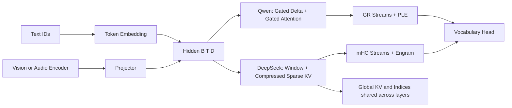

# 2026 主流模型结构对照

此记录从原 Lab 的研究资料迁入，保留原核对日期与 pinned revision；本次目录合并未重新验证所有外部链接、模型版本或公开规格。支持程度以源码与运行检查为准。

核对日期：**2026-10-02**。基于模型团队公开资料、官方config和公开推理实现；按结构选择代表模型，版本标签不是性能排名。课程是可运行的机制参考，不是官方checkpoint复现或转换工具。

## DeepSeek 与 Qwen 的演进

| 模型/阶段 | 公开结构中的核心变化 | 课程入口与实际实现 |
| --- | --- | --- |
| DeepSeek V2 / V3（2024） | 归一化joint KV latent、解耦RoPE、routed/shared experts；V3顺序MTP | 09/13/14章；naive/absorbed、router bias与MTP标签可数值核对 |
| DeepSeek V3.2（2025） | learned稀疏indexer选择token，再执行正式Attention | 21章；小维评分、因果Top-K、gather/dense对照，未训练官方indexer |
| DeepSeek V4（2026） | window + CSA/HCA sequence压缩、mHC，多路latent来源；继承MoE/MTP | 19/21/22章；pooling、selection、多流混合分别实现，未串成完整V4 |
| DeepSeek V4.1-Flash（2026-09） | causal lower/upper层、共享compressed KV与indices、hierarchical候选选择；Engram、Single-Pass mHC、视觉接入与独立DSpark | 21–25章；共享/查询/残差/lookup/视觉slot均有独立检查；完整压缩、调度、FP4和DSpark未实现 |
| Qwen3 dense / MoE（2025） | RMSNorm、SwiGLU、QK-Norm、GQA；Dense与稀疏FFN分支 | 05/06/09/11章；核心 `qwen3_dense` 配方 |
| Qwen3-Next、Qwen3.5 / 3.6 / 3.8（2025–2026） | Gated DeltaNet与gated full Attention混合；短卷积、非对称QK/V头、output gates；存在dense/MoE及VL分支 | 20章；短卷积、连续衰减、异构头状态、输出门独立参考；25章模态slot接口 |
| Qwen3.8-Flash-Next / Qwen4-Exp（2026） | Next报告明确给出3:1 GDN/global，继续训练用QSA替换global、四路GR与n-gram memory；Qwen4-Exp公开实现也有QSA/GR/PLE | 21/22/23章分别验证；这些结构对应特定版本，不能推广到全部Qwen3.8模型 |
| Qwen3.8 Omni / LiveTranslate（2026-09） | 多模态/音视频上下文；LiveTranslate公开Thinker–Talker与因果audio-text interleave路线 | 25章说明模态encoder→projector→语言序列，以及理解/语音生成分工；未实现音频codec/Talker |

DeepSeek资料：[V2](https://arxiv.org/abs/2405.04434)、[V3](https://arxiv.org/abs/2412.19437)、[V4代码](https://huggingface.co/deepseek-ai/DeepSeek-V4-Pro/blob/b5968e9190ef611bbf34a7229255be88a0e937c1/inference/model.py)、[V4.1代码](https://huggingface.co/deepseek-ai/DeepSeek-V4.1-Flash/blob/2cba9e42aa026125f3ed06c6d98c1db82f7ca027/inference/model.py)、[V4.1报告](https://arxiv.org/abs/2609.19969)。Qwen资料：[3.8-Next报告](https://arxiv.org/abs/2608.30320)、[3.8 config](https://huggingface.co/Qwen/Qwen3.8-27B/blob/1d4bf0f2ff6012fd82039f2fa52739d0dd7c60c0/config.json)、[3.6 MoE config](https://huggingface.co/Qwen/Qwen3.6-35B-A3B/blob/995ad96eacd98c81ed38be0c5b274b04031597b0/config.json)、[hybrid实现](https://github.com/huggingface/transformers/blob/35924ec379eec682bbdca219886e16eff4df8b09/src/transformers/models/qwen3_5/modeling_qwen3_5.py)、[Qwen4-Exp实现](https://github.com/huggingface/transformers/blob/35924ec379eec682bbdca219886e16eff4df8b09/src/transformers/models/qwen4_exp/modeling_qwen4_exp.py)、[LiveTranslate](https://qwen.ai/blog?id=qwen3.8-livetranslate)、[Omni](https://qwen.ai/blog?id=qwen3.8-omni-flash)。

## 其他代表家族

| 模型 | 公开结构与对应章节 | 尚未复刻的差异 |
| --- | --- | --- |
| Kimi Linear / Kimi K3 | KDA与MLA hybrid；K3进一步使用AttnRes、Stable LatentMoE、MoonViT-V2。15章channel-wise delta，13章MLA，22章depth Attention，25章模态接入 | 完整短卷积/output门、gated MLA、block AttnRes调度、LatentMoE/SiTU-GLU与视觉encoder |
| GLM-5.3-Flash | 公开模型卡说明sparse + linear hybrid、mHC与native VL，对应15/21/22/25章 | 不从相同机制推断其完整层周期、indexer或checkpoint兼容 |
| Gemma 4 12B | encoder-free多模态；image patches与audio frames直接投影到语言hidden，对照25章slots接口 | 本章输入已编码features；未实现原始patch/frame切分与factorized spatial embeddings |
| Llama 4 | iRoPE的RoPE/NoPE层交替、MoE与多模态，对应09/15/25章 | 专属温度、模态编码与官方路由策略 |
| gpt-oss | GQA、交替sliding/global Attention、MoE，对应07/09/11章 | 专属激活、attention sinks、MXFP4专家权重布局 |

来源：[Kimi K3模型卡](https://huggingface.co/moonshotai/Kimi-K3)、[Kimi Linear](https://arxiv.org/abs/2510.26692)、[AttnRes官方](https://github.com/MoonshotAI/Attention-Residuals)、[GLM-5.3-Flash模型卡](https://huggingface.co/zai-org/GLM-5.3-Flash)、[Google Gemma 4 12B指南](https://developers.googleblog.com/gemma-4-12b-the-developer-guide/)、[Llama 4代码](https://github.com/meta-llama/llama-models/blob/main/models/llama4/model.py)、[gpt-oss代码](https://github.com/openai/gpt-oss/blob/main/gpt_oss/torch/model.py)。闭源模型未公开的层内结构不作推断。

## 从官方config读shape

以下是两个实际config的字段，不是本库教学模型的规模。参数总量/激活量不从这些局部字段推断。

| 字段 | Qwen3.8-27B | Qwen3.6-35B-A3B |
| --- | --- | --- |
| hidden_size D / layers | 5120 / 64 | 2048 / 40 |
| full H_q / H_kv / D_h | 24 / 4 / 256 | 16 / 2 / 256 |
| linear H_k / H_v | 16 / 48 | 16 / 32 |
| linear D_k / D_v | 128 / 128 | 128 / 128 |
| full Attention interval | 每4层1个full | 每4层1个full |
| routed experts / Top-K | 此config为dense | 256 / 8 |

据此，Qwen3.8 full Q为`[B,24,T,256]`、K/V为`[B,4,T,256]`，合头宽6144经Output projection回5120；**不能硬写D=H_q*D_h**。Linear Q/K扩展到48个value heads后，state为`[B,48,128,128]`；除此还保存短卷积状态。Qwen3.6的full合头宽4096回2048；linear state为`[B,32,128,128]`。这些shape直接由各自config与[实现](https://github.com/huggingface/transformers/blob/35924ec379eec682bbdca219886e16eff4df8b09/src/transformers/models/qwen3_5/modeling_qwen3_5.py)推导。

## 2026专项数据流

这里的箭头是结构阅读地图；各机制是否叠加由具体模型决定。mHC/GR将hidden扩成`[B,T,N_streams,D]`，内部Attention/Expert仍处理`[B,T,D]`；conditional memory从token n-gram得到`[B,T,D]`的额外词法特征。Vision projector输出`[B,N_image,D]`，插入对应文本序列slot。

经典Encoder–Decoder先得到固定source memory，再经每层独立Cross投影。DeepSeek CED则应沿`kv_source_layers`、`index_source_layers`、`SharedAttentionRuntime`读：source层构造compressed KV，consumer读同一global缓存/selection，且有layer-local window。本库`causal_seq2seq`只演示经典因果stack；24章才明确核对跨层共享。具体prefill绕过upper计算的调度不由小样例自动实现。

## 已公开但未完整复刻的结构

| 组件 | 已实现的课程原理 | 官方结构仍缺少的部分 |
| --- | --- | --- |
| DeepSeek CSA/HCA/CSA2 | 因果pooling、learned selection、共享KV | learned gated compressor、不同压缩周期与重叠、hierarchical indexer、窗口ring、低秩grouped输出 |
| DeepSeek mHC / Qwen GR | dynamic stream mixing、Sinkhorn、低秩coordinate gate；Kimi AttnRes另做depth softmax | 官方初始化、归一化细节、Single-Pass传递、fused kernel |
| Engram / PLE | bigram hash、lookup、context gate、dilated causal conv | 多阶多headprime tables、tokenizer压缩、每层hash布局、增量lookup/conv状态 |
| Qwen hybrid | 3:1结构、short conv、异构heads、continuous decay与output门 | 全模块cached conv、正式chunkwise kernel、完整weight mapping、模型专属norm常数 |
| KV low precision | int8 per-vector storage与误差界 | FP4/FP8布局、打包/metadata、直接量化Attention kernel |
| DSpark / Omni | greedy验证与模态slot接口 | 独立draft网络/训练与cache管理、视觉encoder/2D-mRoPE、音频codec/Thinker–Talker |

课程默认只需要CPU，不下载任何模型。完整模型适配应另用官方权重和tokenizer核对多层结果；不能因为形状相同就宣称checkpoint兼容。

## 来源revision

| 已读来源 | Revision |
| --- | --- |
| Qwen/Qwen3.8-27B | `1d4bf0f2ff6012fd82039f2fa52739d0dd7c60c0` |
| Qwen/Qwen3.6-35B-A3B | `995ad96eacd98c81ed38be0c5b274b04031597b0` |
| deepseek-ai/DeepSeek-V4-Pro | `b5968e9190ef611bbf34a7229255be88a0e937c1` |
| deepseek-ai/DeepSeek-V4.1-Flash | `2cba9e42aa026125f3ed06c6d98c1db82f7ca027` |
| huggingface/transformers | `35924ec379eec682bbdca219886e16eff4df8b09` |

Qwen4-Exp公开实现可读，但模型config endpoint本次返回401，因此未给出未经核对的官方规模或完整层周期。版本“最新”以本次公开资料为界，未采用传闻版本。其他家族的结构参照见[来源索引](research.md)。
