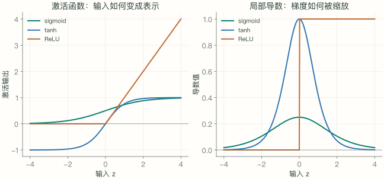
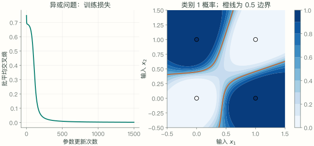

给网络四个输入，它能不能学会“两个数不同就输出 1，相同就输出 0”？这个异或问题足够小，可以逐步检查：网络能表示这个规则吗，预测有多错，哪个参数需要往哪个方向调整？本章沿着这三个问题，把前面学到的矩阵、概率与导数接成一个训练过程。先修是 [矩阵求导](math-05.html)、[链式法则](math-06.html) 和 [交叉熵](math-02.html)。

## 01 · 神经元与隐藏层：为什么需要非线性

一个神经元先做仿射变换，再做非线性激活：$a=\phi(w^\top x+b)$。权重 $w$ 决定沿哪个方向组合输入，偏置 $b$ 平移阈值，激活函数 $\phi$ 改变函数的形状。这里“神经元”是计算单元的名字，并不试图模拟完整生物神经元。

例如 $x=(2,1)^\top$，$w=(1,-1)^\top$，$b=-0.5$。加权和为 $w^\top x+b=0.5$；若激活采用 $\max(0,z)$，输出就是 $0.5$。输入换成 $(1,2)^\top$，加权和为 $-1.5$，输出变为零。这个单元由此对“第一个输入是否比第二个大至少 0.5”作出不同响应。

同一层中的多个单元接收同一个 $x$，各自使用一行权重，输出合成一个新的向量。这个向量叫隐藏表示，因为我们没有直接为它逐坐标提供正确答案；训练通过最终损失调整它。隐藏维度 $h$ 表示这一层有多少个这样的单元，不是样本数量，也不是类别数量。

### 两层线性变换为什么仍然只能给出直线边界

为什么不能只堆矩阵？两层仿射变换可以合并：

$$
W_2(W_1x+b_1)+b_2=(W_2W_1)x+(W_2b_1+b_2).
$$

如果中间没有非线性，再深也仍是一次仿射变换。以 XOR 为例，$(0,0),(1,1)$ 属于 0 类，$(0,1),(1,0)$ 属于 1 类。若一条直线 $a x_1+b x_2+c=0$ 严格分开两类，需要 $c<0$、$a+b+c<0$，同时 $a+c>0$、$b+c>0$。前两式相加给出 $a+b+2c<0$，后两式却给出它大于 0，矛盾。非线性隐藏层允许弯折决策边界。

### 先手工搭一个会做异或的网络

现在先不训练，直接构造两个隐藏单元：

$$
h_1=\max(0,x_1-x_2),\qquad h_2=\max(0,x_2-x_1),\qquad r=h_1+h_2.
$$

对二值输入，两者相等时 $h_1=h_2=0$；不同则恰有一个隐藏单元输出 1。因此 $r=|x_1-x_2|$ 在四个点上恰好等于异或标签。线性输出层只是把两个隐藏特征相加，非线性发生在两次截断操作中。

```python
import numpy as np

X = np.array([[0., 0.], [0., 1.], [1., 0.], [1., 1.]])
W1 = np.array([[1., -1.], [-1., 1.]])
H = np.maximum(X @ W1.T, 0.)
r = H @ np.ones(2)
np.testing.assert_array_equal(r, [0., 1., 1., 0.])
print(H, r, sep="\n")
```

`H` 的中间两行分别为 `[0,1]` 和 `[1,0]`，首尾两行都为零。这个例子证明网络结构能够表达规则，尚未证明随机初始化后的训练能找到它；输出 $r$ 也尚未被解释成概率。后文用两层 tanh 网络和交叉熵演示如何从数据学出一种可行解，不要求学到这组手写权重。

## 02 · 激活函数与初始化：表示和梯度怎样变化

| 函数 | 定义 | 导数 | 需要留意 |
| --- | --- | --- | --- |
| sigmoid（S 形函数） | $s(z)=1/(1+e^{-z})$ | $s(z)(1-s(z))$ | 两端饱和，导数趋近 0 |
| tanh（双曲正切） | $\tanh z$ | $1-\tanh^2 z$ | 输出在 $(-1,1)$，两端同样饱和 |
| ReLU（修正线性单元） | $\max(0,z)$ | 正半轴为 1，负半轴为 0 | 零点不可导；本系列采用 PyTorch 的零梯度约定 |

<figure class="math-figure">
<div class="math-figure-scroll" tabindex="0" role="region" aria-label="激活函数与导数曲线，可横向滚动"></div>
<figcaption>左图是激活输出，右图是对应局部导数。ReLU 零点的值是实现选择，不能从左右极限得到唯一导数。</figcaption>
</figure>

### 函数曲线与导数曲线要一起读

以 sigmoid 为例，在 $z=0$，输出为 $1/2$，局部导数为 $1/4$。同样大小的输入扰动 $0.01$ 只引起约 $0.0025$ 的输出变化。到 $z=8$，输出已经接近 1，导数约为 $0.000335$，相同扰动几乎无法改变输出。这种“大幅改变输入，输出仍然变化很小”的区域称为饱和区。

tanh 在零点的导数为 1，因此这一点附近的扰动尺度不会被激活单独压小；但它也有两端饱和的问题。ReLU 在正半轴保持输入，在负半轴输出零。若某单元对所有训练样本的输入长期为负，通过这个单元的局部梯度都为零，它可能无法仅靠自身梯度恢复；这与 sigmoid 的小但通常非零的导数不同。

反向传播沿路径连乘局部导数，因此很多小于 1 的因子可能让梯度迅速缩小；权重矩阵也会缩放梯度，不能只看激活函数就断言整个网络一定梯度消失或爆炸。后续模型中的初始化、残差连接和归一化都与这个问题有关。

### 随机初始化既要区分单元，也要控制尺度

初始化还要打破隐藏单元的对称性。如果每个隐藏单元的参数完全相同，收到的梯度也可能相同，训练不会自动让它们学到不同特征。[第 01 章的方差规则](math-01.html)帮助选择随机权重的尺度。可以把尺度问题看得更具体：若 $z=\sum_{j=1}^d w_jx_j$，并暂时假设各项相互独立、权重与输入独立、两者零均值，且每个权重方差为 $v_w$、输入方差为 $v_x$，则

$$
\operatorname{Var}(z)=\sum_{j=1}^d\operatorname{Var}(w_jx_j)=d\,v_wv_x.
$$

让 $v_w$ 与 $1/d$ 同阶，可以避免仅因输入维数变大而让加权和方差成倍增长。这只是线性部分的近似分析；激活函数随后会改变分布，实际初始化还要考虑它。不要将“随机”理解为任意尺度都可以，也不要把所有层都初始化为相同的零。本章使用 `nn.Linear` 的默认初始化，以固定种子保证教学实验可复现。

## 03 · 前向传播：把输入变成概率与损失

设批大小（batch size）$B$、输入维度 $d$、隐藏宽度 $h$、类别数 $C$。统一采用输出维在前的权重布局：

$$
\begin{aligned}
X&\in\mathbb R^{B\times d},\quad W_1\in\mathbb R^{h\times d},\quad b_1\in\mathbb R^h,\\
A&=XW_1^\top+b_1\in\mathbb R^{B\times h},\\
H&=\tanh(A)\in\mathbb R^{B\times h},\\
W_2&\in\mathbb R^{C\times h},\quad b_2\in\mathbb R^C,\\
Z&=HW_2^\top+b_2\in\mathbb R^{B\times C}.
\end{aligned}
$$

这里 $A$ 是激活前的加权和，$H$ 是激活后的隐藏表示，$Z$ 是最后一层的未归一化分数（logits）。它们都是中间计算结果，不是三组额外参数；可训练参数只有 $W_1,b_1,W_2,b_2$。例如 $d=2,h=8,C=2$ 时，参数总数为 $8\times2+8+2\times8+2=42$，与批大小无关。

每行沿类别维使用 softmax 函数，将各类别分数归一化为概率，得到概率矩阵 $P$；标签 $y_i$ 是类别索引，对应独热编码（one-hot）的标签矩阵 $Y$。下文类别索引从 0 开始，与数组一致；各求和覆盖全部 $C$ 个类别。普通、无类别权重、无标签平滑的批平均交叉熵为：

$$
P_{ic}=\frac{e^{Z_{ic}}}{\sum_k e^{Z_{ik}}},\qquad
L=-\frac1B\sum_i\log P_{i,y_i}.
$$

手算一个单样本：$x=(1,0)^\top$，$W_1=I$，$b_1=0$，$W_2=I$，$b_2=0$，正确类别为 0。隐藏输出和未归一化分数都为 $(\tanh 1,0)^\top\approx(0.7616,0)^\top$，概率约为 $(0.6817,0.3183)$，损失约为 0.3832。提高正确类别的分数 会降低这次损失，但需要通过共享参数完成，其他样本可能受到不同影响。

### 用四个数核对一次前向计算

这个手算可以拆成“隐藏值、两类概率、一个损失”逐项核对，避免直接调用完整模型后只看到一个标量：

```python
import numpy as np

x = np.array([1., 0.])
W1, W2 = np.eye(2), np.eye(2)
h = np.tanh(W1 @ x)
z = W2 @ h
shifted = z - z.max()
p = np.exp(shifted) / np.exp(shifted).sum()
ell = -np.log(p[0])
np.testing.assert_allclose(h, [0.76159416, 0.], atol=1e-8)
np.testing.assert_allclose(p, [0.68169974, 0.31830026], atol=1e-8)
np.testing.assert_allclose(ell, 0.38316598, atol=1e-8)
print(h, p, ell)
```

预测正确类别并不意味着损失为零。本例 `argmax` 已经选择类别 0，但仍只给它约 68% 的概率，因此交叉熵继续提供优化信号。若只优化“是否预测正确”的离散结果，参数微小变化通常不会改变这个结果，就难以获得有用的导数。

## 04 · 反向传播：从预测误差推回每个参数

对一个样本，交叉熵可重写为 $\ell=-z_y+\log\sum_c e^{z_c}$。固定标签 $y$，逐个对 $z_c$ 求偏导数。第一项在 $c=y$ 时导数为 -1，否则为 0；第二项先对对数求导，再对指数和求导：

$$
\frac{\partial}{\partial z_c}\log\sum_k e^{z_k}
=\frac{1}{\sum_k e^{z_k}}\frac{\partial}{\partial z_c}\sum_k e^{z_k}
=\frac{e^{z_c}}{\sum_k e^{z_k}}=p_c.
$$

因此 $\partial\ell/\partial z_c=p_c-\mathbf1_{c=y}$。正确类别的梯度通常为负，梯度下降会倾向于增加它的分数；错误类别的梯度为正，下降会倾向于降低它们的分数。这些是对独立分数的局部方向，真实网络共享参数后，还要把各样本贡献合并。对整个批量：

$$
G_2=\frac{\partial L}{\partial Z}=\frac{P-Y}{B}\in\mathbb R^{B\times C}.
$$

现在把 $G_2$ 看作第二层输出收到的上游梯度。第二层是线性层，因此它对隐藏表示的梯度为 $G_2W_2$。但第一层产生的是 $A$，中间隔着 $H=\tanh A$，还必须逐元素乘以 $1-H^2$ 才能传回第一层。应用第 05 章的线性层梯度和第 06 章的链式法则：

$$
\begin{aligned}
\nabla_{W_2}L&=G_2^\top H,&\nabla_{b_2}L&=\sum_i(G_2)_{i,:},\\
G_1&=(G_2W_2)\odot(1-H\odot H),\\
\nabla_{W_1}L&=G_1^\top X,&\nabla_{b_1}L&=\sum_i(G_1)_{i,:}.
\end{aligned}
$$

检查第一层：$G_1^\top$ 为 $h\times B$，乘 $B\times d$ 的 $X$ 得到 $h\times d$，正好与 $W_1$ 相同。偏置在每个样本上被使用一次，所以反向时沿样本维**求和**；$G_2$ 已除过 $B$，这里不能再除一次。

继续上节的单样本，$G_2\approx(-0.3183,0.3183)$，$G_1\approx(-0.1337,0.3183)$。于是第一层权重梯度的第一列为 $G_1$，第二列为零，因为该样本的第二个输入恰好是零。参数更新方向是梯度的负方向。

### 从一个梯度元素看参数怎样更新

取上面第一层的左上元素 $W_{1,00}=1$，其梯度约为 $-0.1337$。若学习率 $\eta=0.1$，一次普通梯度下降将其更新为 $1-0.1\times(-0.1337)\approx1.01337$。负梯度意味着这次应增加参数，而不是把所有参数都变小。同一次更新还需计算另外三组参数的梯度，所有梯度都使用更新前的同一组权重。

下面的完整 NumPy / PyTorch 对照核对四组参数，而不仅是最后一个标量。`np.eye(2)[y]` 把类别索引变成独热标签；`G2` 在此只除一次批大小；`G1` 对应通过输出线性层和 tanh 的两次链式传播：

```python
import numpy as np
import torch
import torch.nn.functional as F

rng = np.random.default_rng(7)
X = rng.normal(size=(4, 2))
y = np.array([0, 1, 1, 0])
W1, b1 = rng.normal(size=(3, 2)), rng.normal(size=3)
W2, b2 = rng.normal(size=(2, 3)), rng.normal(size=2)
H = np.tanh(X @ W1.T + b1)
Z = H @ W2.T + b2
shifted = Z - Z.max(axis=1, keepdims=True)
P = np.exp(shifted) / np.exp(shifted).sum(axis=1, keepdims=True)
G2 = (P - np.eye(2)[y]) / len(X)
G1 = (G2 @ W2) * (1 - H**2)
manual = [G1.T @ X, G1.sum(0), G2.T @ H, G2.sum(0)]
params = [torch.tensor(a, requires_grad=True) for a in (W1, b1, W2, b2)]
w1, c1, w2, c2 = params
logits = torch.tanh(torch.tensor(X) @ w1.T + c1) @ w2.T + c2
F.cross_entropy(logits, torch.tensor(y)).backward()
for expected, param in zip(manual, params):
    np.testing.assert_allclose(expected, param.grad.numpy(), rtol=1e-10, atol=1e-12)
print("四组参数梯度全部一致")
```

四组断言检查的是相同输入、参数和损失下的同一个梯度，而不是比较两种模型谁训练得更好。若断言失败，先核对 `manual` 与 `params` 的排列顺序，再核对批平均因子和激活导数；只检查损失相同不能保证反向实现正确。

## 05 · 训练循环：计算梯度与更新参数是两步

前面的例子只算一次梯度。训练是在同一目标下重复“前向计算 → 计算损失 → 反向传播 → 更新参数”。参数更新以后，下一次前向必须重新计算隐藏值和预测；沿用旧的中间值会把两个不同参数点的计算混在一起。

下面用全部四个异或样本，每步共同更新 42 个参数。损失使用批平均，所以梯度尺度不因为把同一批样本简单复制一遍而翻倍。学习率 0.3 是这个小实验的设置，不是普遍适用于神经网络的常数。

```python
import torch
from torch import nn
import torch.nn.functional as F

torch.manual_seed(7)
torch.set_num_threads(1)
X = torch.tensor([[0., 0.], [0., 1.], [1., 0.], [1., 1.]], dtype=torch.float64)
y = torch.tensor([0, 1, 1, 0])
model = nn.Sequential(nn.Linear(2, 8), nn.Tanh(), nn.Linear(8, 2)).double()
optimizer = torch.optim.SGD(model.parameters(), lr=0.3)
initial = F.cross_entropy(model(X), y).item()
for _ in range(1500):
    optimizer.zero_grad(set_to_none=True)
    logits = model(X)                    # 前向传播
    loss = F.cross_entropy(logits, y)    # 输入 logits，无需先 softmax
    loss.backward()                      # 反向传播：累积参数梯度
    optimizer.step()                     # SGD：参数减去学习率乘梯度
model.eval()
with torch.no_grad():
    final = F.cross_entropy(model(X), y).item()
    predictions = model(X).argmax(dim=1)
assert final < 0.02 and final < initial
assert torch.equal(predictions, y)
print(initial, final, predictions.tolist())
```

`CrossEntropyLoss` 内部处理稳定的 log-softmax；先做 softmax 再传入会把概率再次当未归一化分数，改变目标函数。循环中 `zero_grad` 开启一轮新的梯度累积，`backward` 计算导数，`step` 才改变参数。运行后应得到预测 `[0,1,1,0]`，最终交叉熵约为 0.00194；小数末位允许随环境略有变化，因此代码检查误差范围而不固定全部小数。

其输入语义见 [PyTorch 交叉熵文档](https://docs.pytorch.org/docs/stable/generated/torch.nn.CrossEntropyLoss.html)。`eval()` 切换特定层的训练行为，`no_grad()` 关闭该范围内的梯度记录，二者不同；本例没有随机失活（dropout）或批归一化（BatchNorm），但保留这个边界便于形成正确习惯。

<figure class="math-figure">
<div class="math-figure-scroll" tabindex="0" role="region" aria-label="XOR 实际训练损失与决策边界，可横向滚动"></div>
<figcaption>配套脚本实际运行 1500 次 SGD 更新后作图。左图为更新前记录的批平均损失，右图为最终参数下的类别 1 概率，橙线为 0.5。四个点外的颜色只是模型输出，不是新数据上的正确性证明。</figcaption>
</figure>

## 06 · 训练目标与泛化：为什么拟合成功还不够

这个实验每步使用全部四个样本，是全批量梯度下降。真实训练常从训练集抽取小批量（mini-batch），以批平均梯度近似训练集目标的梯度；学习率控制每次移动距离，批大小影响估计噪声和计算方式。小批量损失不必每步下降，训练损失下降也不等于验证损失下降。

### 小批量梯度近似的是哪个目标

设训练集一共有 $N$ 个样本，训练集目标为 $L_{\mathrm{train}}(\theta)=N^{-1}\sum_{i=1}^N\ell_i(\theta)$。若固定当前参数，独立均匀抽取 $B$ 个样本，梯度估计 $\widehat g=B^{-1}\sum_{i\in\mathcal B}\nabla_\theta\ell_i$ 的期望等于训练集目标的梯度。这一结论来自第 01 章的期望线性性；它不意味着每次更新都降低所有样本的损失，也不意味着训练集代表了全部未来数据。

如果某些类别被过采样而未作相应加权，优化的平均权重就变了。因而“小批量更大”“训练步数更多”都不能自动修复数据分布本身的偏差。随机梯度下降（SGD）是这种用样本梯度估计来更新参数的基本方法；本章代码调用的优化器名虽然叫 `SGD`，因为每次用了全部四点，实际执行的是全批量更新。

### 为什么要分开训练集、验证集和测试集

训练集用于优化参数，验证集用于选择超参数，测试集用于最终评估。XOR 的四点验证只是“实现能够拟合这个函数”的教学实验，没有独立测试集，不报告泛化成绩。过拟合、正则化和优化器选择需要在有独立数据的实验中判断。

例如用验证集选择隐藏宽度和学习率之后，再不断根据测试成绩更换这些设置，就已经把测试集间接用于模型选择，不能把最后的成绩看作一次独立检验。标准化统计量也应由训练数据估计，再应用于验证和测试数据，避免提前利用评估数据的信息。

参数多并不必然过拟合，但会增加拟合复杂规律的能力。一种简单约束是在训练目标中加入 $\frac\lambda2(\|W_1\|_F^2+\|W_2\|_F^2)$，于是两个权重梯度分别多出 $\lambda W_1$ 和 $\lambda W_2$。这是明确修改了目标函数；$\lambda$ 需要通过验证集选择，不能只因为训练损失更小就认定更好。本章异或演示没有加入该正则项，公式与代码保持同一目标。

神经网络并不局限于这两层：词嵌入把离散索引变成向量，注意力用点积构造数据相关的加权求和，前馈层继续使用线性变换与非线性。它们都能放进计算图，并按同一套链式法则训练。下一章先回到几何，解释位置怎样进入注意力。

## 07 · 常见误区

隐藏层输出不是标签概率。这里的 $H$ 可以含负数；只有最后按类别归一化后的 $P$ 才满足非负且每行和为 1。把激活函数、概率变换与损失函数混称为“归一化”，会掩盖它们不同的职责。

“梯度反向传播”描述导数怎样计算，“梯度下降”描述参数怎样更新。可以用同一套反向传播得到梯度，再选择不同优化器；换优化器并不改变链式法则本身。

低训练损失也不证明模型在新样本上表现好。本章四点全部参与训练，图中点以外的颜色只描述模型给出的概率，没有提供那些位置的真实标签。数值验证保证的是实现与推导一致。

## 08 · 练习与核对

<details>
<summary>1. 两个没有激活函数的线性层，能否严格分开异或四点？</summary>

不能。复合后仍为一次仿射变换，两类分数之差仍是仿射函数，其零集合为直线。将四点的分类条件写出并相加，会同时要求同一个数大于零和小于零。本章构造的 ReLU 隐藏层先改变了表示，才使相加得到异或结果。

</details>

<details>
<summary>2. 输入维度 3、隐藏宽度 4、类别数 2，共有多少个参数？</summary>

第一层权重为 $4\times3$，偏置为 4；第二层权重为 $2\times4$，偏置为 2。合计 $12+4+8+2=26$ 个。批大小改变中间数组的行数，不会改变这 26 个参数。

</details>

<details>
<summary>3. 把批平均损失改成求和，怎样保持一次普通 SGD 更新相同？</summary>

固定同一批 $B$ 个样本，求和损失和梯度都是原来的 $B$ 倍，因此把学习率除以 $B$ 可以保持本次更新相同。这个结论针对此处无额外项的普通 SGD；如果加入其他损失项或不同优化器，不能未经分析直接照搬。

</details>

<details>
<summary>4. 为什么不能更新第二层后，再用新权重给第一层反传？</summary>

第一层收到 $G_2W_2$，其中 $G_2$ 来自原来那次前向。如果 $W_2$ 已更新，这个乘积就混用了两个不同参数点的信息，不再是本次前向损失的梯度。先完成所有反向计算，再统一更新参数。

</details>

<details>
<summary>5. 预测标签已经正确，交叉熵为什么还没有归零？</summary>

`argmax` 只要求正确类别分数最大；交叉熵还考察它的概率。本章手算给正确类别约 0.6817 的概率，损失为 $-\log0.6817\approx0.3832$。有限分数下它通常仍大于零，因此标签正确和损失为零是两件事。

</details>

配套 `foundations/neural_network.py` 核对四组梯度并训练异或网络，加 `--plot` 重建本章图像。下一章 [旋转与位置编码](math-08.html) 把关注点从“参数怎样学”转到“位置怎样进入表示”，仍然使用相同的向量、点积与求导规则。
