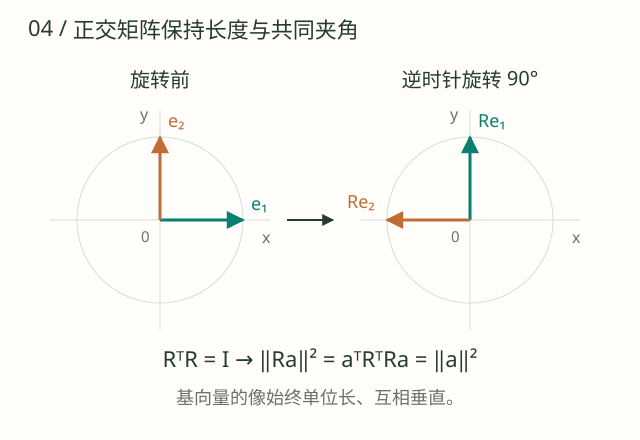
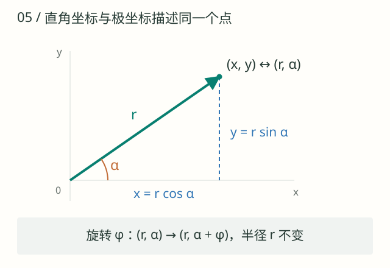
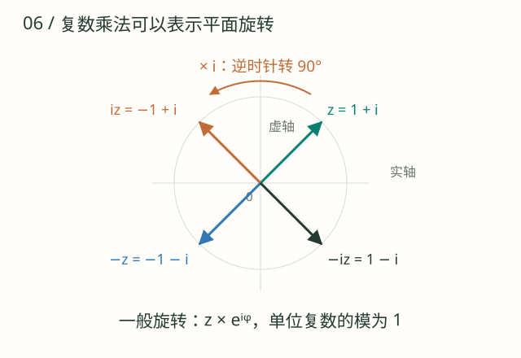
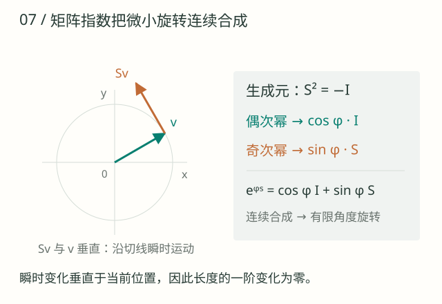
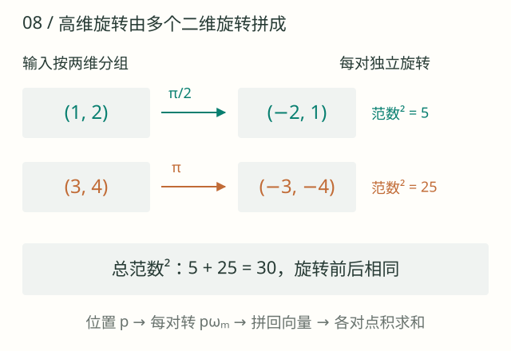
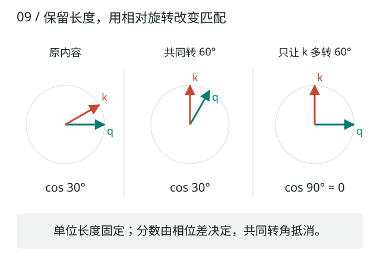

同一个词出现在两个位置，注意力怎样区分它们，又怎样比较它们的相对距离？一种做法是保留表示的长度，按照位置旋转表示。本章先研究这种运算本身，再解释它怎样让两个位置的差进入点积。先读 [03 向量与矩阵](math-03.html) 的范数、点积和转置；矩阵指数是选读，其余各节构成一条完整路线。角度默认使用弧度，范数均指欧氏范数。

读到最后，可以把二维旋转矩阵、复数乘法和代码中的坐标配对对应起来，并检验共同平移不变性。这里讨论的是固定内容向量上的位置变换，不把它直接等同于整个模型在所有上下文下的行为。

## 01 · 矩阵与正交变换：旋转为什么保长

<figure class="math-figure">
<div class="math-figure-scroll" tabindex="0" role="region" aria-label="正交旋转保持基向量的长度和夹角，可横向滚动"></div>
<figcaption>两支单位基向量一起转过 90°，长度仍为 1，彼此仍然垂直。矩阵的列记录它们的新坐标，正交性把这个几何事实写成 RᵀR = I。</figcaption>
</figure>

矩阵 $M\in\mathbb R^{m\times d}$ 将 $d$ 维列向量映射为 $m$ 维列向量：$(Ma)_r=\sum_s M_{rs}a_s$。其第 $s$ 列是第 $s$ 个标准基向量变换后的结果；$ABa$ 表示先应用 $B$，再应用 $A$。单位矩阵 $I$ 不改变向量，逆矩阵则撤销变换。

普通矩阵可以拉伸、压缩或剪切向量。若方阵满足 $R^\top R=I$，则称为正交矩阵，并有 $R^{-1}=R^\top$。二维逆时针旋转是其中一种：

$$
R(\phi)=\begin{bmatrix}\cos\phi&-\sin\phi\\\sin\phi&\cos\phi\end{bmatrix},
\qquad
\|Ra\|^2=a^\top R^\top Ra=a^\top a=\|a\|^2.
$$

这就证明旋转保持范数。正交矩阵也包括反射，不能把所有正交变换都叫旋转。两个向量施加**同一个**正交变换时，$(Ra)^\top(Rb)=a^\top b$，夹角也保持；RoPE 能改变分数，是因为不同位置通常使用不同旋转。下面先展开这个保长条件，再推导两个位置之间为什么出现角度差。

### 把矩阵乘法逐项算一次

取 $M=\begin{bmatrix}2&1\\0&1\end{bmatrix}$，则：

$$
M\begin{bmatrix}3\\4\end{bmatrix}
=\begin{bmatrix}2\times3+1\times4\\0\times3+1\times4\end{bmatrix}
=\begin{bmatrix}10\\4\end{bmatrix}
=3\begin{bmatrix}2\\0\end{bmatrix}+4\begin{bmatrix}1\\1\end{bmatrix}.
$$

最后一种写法说明“矩阵的列就是基向量的去向”。它也解释了线性：$M(ua+vb)=uMa+vMb$。原向量范数为 5，变换后为 $\sqrt{116}$，可见线性变换并不自动保长。

转置把矩阵的行列互换：$M^\top=\begin{bmatrix}2&0\\1&1\end{bmatrix}$。它一般不是逆矩阵；本例 $M^{-1}=\begin{bmatrix}1/2&-1/2\\0&1\end{bmatrix}$。只有在正交条件下，转置才恰好撤销原变换。

### 为什么转置乘积能判断保长？

若矩阵的两列记作 $u,v$，那么：

$$
R^\top R=
\begin{bmatrix}u^\top u&u^\top v\\v^\top u&v^\top v\end{bmatrix}.
$$

等于单位矩阵意味着两列长度都是 1，且彼此垂直。对旋转矩阵，令 $c=\cos\phi,s=\sin\phi$，实际相乘得到：

$$
\begin{bmatrix}c&s\\-s&c\end{bmatrix}
\begin{bmatrix}c&-s\\s&c\end{bmatrix}
=\begin{bmatrix}c^2+s^2&-cs+sc\\-sc+cs&s^2+c^2\end{bmatrix}=I.
$$

所以前面的 $\|Ra\|^2=a^\top R^\top Ra$ 证明没有跳过任何额外假设。也可以直接把旋转后坐标平方相加，交叉项抵消，剩下 $(x^2+y^2)(c^2+s^2)=x^2+y^2$。

### 为什么相对旋转里出现减号？

旋转有三条后面反复使用的规则：$R(0)=I$，$R(\phi)^{-1}=R(-\phi)=R(\phi)^\top$，$R(\phi)R(\psi)=R(\phi+\psi)$。最后一条可以用三角加法公式逐项验证，也可以理解为先转 $\psi$ 再转 $\phi$。

注意转置乘积会倒序：$(AB)^\top=B^\top A^\top$。于是两个分别旋转的向量做点积时：

$$
\begin{aligned}
(R(\phi)a)^\top(R(\psi)b)
&=a^\top R(\phi)^\top R(\psi)b\\
&=a^\top R(-\phi)R(\psi)b\\
&=a^\top R(\psi-\phi)b.
\end{aligned}
$$

也可以给两个已旋转的向量共同施加 $R(-\phi)$：第一个回到 $a$，第二个变成 $R(\psi-\phi)b$。共同旋转不改变点积，因而只需比较这个剩余转角。取 $\phi=\psi$，额外转角为零，点积不变；取 $\phi=i\omega,\psi=j\omega$，便留下 $(j-i)\omega$。

二维旋转彼此可交换，但普通矩阵乘法不可随意交换。尤其学习到的 Q/K 投影矩阵一般不与旋转矩阵交换，所以“先投影再旋转”不能任意改为“先旋转再投影”。

## 02 · 极坐标与三角函数：把旋转变成相位相加

<figure class="math-figure">
<div class="math-figure-scroll" tabindex="0" role="region" aria-label="从直角坐标转换到极坐标，可横向滚动"></div>
<figcaption>横纵坐标由半径 r 和相位 α 决定。旋转时半径不变，只把相位从 α 改成 α + φ；展开三角加法公式即可得到旋转后的两个坐标。</figcaption>
</figure>

对非零二维向量 $(x,y)^\top$，令 $r=\sqrt{x^2+y^2}$，用 $\alpha=\operatorname{atan2}(y,x)$ 确定所在象限，就有：

$$
x=r\cos\alpha,\qquad y=r\sin\alpha.
$$

$r$ 是半径，也就是向量范数；$\alpha$ 是相对横轴的有向角，也叫相位，允许相差整数个 $2\pi$。相位与两个向量间取值为 $[0,\pi]$ 的夹角不是同一个概念。本文角度均用弧度：一周是 $2\pi$。

旋转 $\phi$ 只需把 $(r,\alpha)$ 改为 $(r,\alpha+\phi)$。转回直角坐标并展开三角加法公式，即得到 $R(\phi)(x,y)^\top$。这解释了为什么旋转改变方向却不改变长度。

### 用极坐标把旋转矩阵推出来

从 $x=r\cos\alpha,y=r\sin\alpha$ 开始，旋转后的坐标是：

$$
\begin{aligned}
x'&=r\cos(\alpha+\phi)
=r\cos\alpha\cos\phi-r\sin\alpha\sin\phi
=x\cos\phi-y\sin\phi,\\
y'&=r\sin(\alpha+\phi)
=r\sin\alpha\cos\phi+r\cos\alpha\sin\phi
=x\sin\phi+y\cos\phi.
\end{aligned}
$$

按 $x,y$ 的系数排列，就是前面的旋转矩阵。例如 $(3,4)^\top$ 旋转 $\pi/2$ 后得到 $(-4,3)^\top$；原相位约为 $53.13^\circ$，新相位约为 $143.13^\circ$，范数仍然为 5。角度制只用来帮助读图，公式和程序中的三角函数使用弧度。

为什么使用 `atan2(y,x)`？仅看 $\arctan(y/x)$，$(1,1)$ 和 $(-1,-1)$ 的比值同为 1，无法区分象限；还会遇到 $x=0$ 的除零问题。`atan2` 结合两个坐标的符号确定相位。RoPE 实现不需要真的计算 `atan2`，这里只用它解释内容向量原本的方向。

### 相位、夹角、频率与周期不要混在一起

两个非零二维向量相位为 $\alpha,\beta$ 时，有向相位差是 $\delta=\beta-\alpha$；几何夹角是 $\theta=\arccos(\cos\delta)\in[0,\pi]$。比如 $\delta=3\pi/2$ 与 $\delta=-\pi/2$ 指向同一个方向，相应夹角都是 $\pi/2$。这就是“不断增加旋转角”不等于“不断增大夹角”的原因。

位置 $p$ 是 token 索引，角频率 $\omega$ 表示每移动一个 token 转多少弧度，二者相乘得到无量纲相位 $p\omega$。例如 $\omega=\pi/4$ 时，位置 0、1、2 对应转角 0、$\pi/4$、$\pi/2$，每走 8 个 token 转完一周。一般连续位置下的周期为 $2\pi/\omega$；整数位置要精确重复，还要求存在非零整数 $N$ 满足 $N\omega=2\pi k$。不能把任意实数周期直接当成整数序列的重复步数。

## 03 · 复数与欧拉公式：用乘法完成旋转

<figure class="math-figure">
<div class="math-figure-scroll" tabindex="0" role="region" aria-label="复数乘虚数单位对应四分之一圈旋转，可横向滚动"></div>
<figcaption>从 z = 1 + i 出发，反复乘 i，每次逆时针转 90°，四次后回到原来的向量。一般角度用单位复数 e^(iφ) 表示。</figcaption>
</figure>

将 $(x,y)^\top$ 对应到复数 $z=x+\mathrm{i}y$，其中 $\mathrm{i}^2=-1$，不要将虚数单位 $\mathrm{i}$ 与 词元下标 $i$ 混淆。复数的模 $|z|=\sqrt{x^2+y^2}$ 对应向量范数。欧拉公式把极坐标和指数连接起来：

$$
e^{\mathrm{i}\alpha}=\cos\alpha+\mathrm{i}\sin\alpha,
\qquad z=r e^{\mathrm{i}\alpha}.
$$

可从指数的幂级数验证：利用 $\mathrm{i}^2=-1$，把偶次项与奇次项分别收集，得到

$$
e^{\mathrm{i}\alpha}
=\left(1-\frac{\alpha^2}{2!}+\frac{\alpha^4}{4!}-\cdots\right)
+\mathrm{i}\left(\alpha-\frac{\alpha^3}{3!}+\frac{\alpha^5}{5!}-\cdots\right)
=\cos\alpha+\mathrm{i}\sin\alpha.
$$

于是 $ze^{\mathrm{i}\phi}=r e^{\mathrm{i}(\alpha+\phi)}$：乘单位复数就是旋转，模仍为 $r$。这与旋转矩阵是同一运算的两种表示，不要求模型学习复数参数。

共轭 $\bar z=x-\mathrm{i}y=r e^{-\mathrm{i}\alpha}$ 让相位变号。若 $w=u+\mathrm{i}v$，则 $\operatorname{Re}(\bar z w)=xu+yv$ 正好是实向量点积；结合极坐标，又得到 $\operatorname{Re}(\bar z w)=|z||w|\cos(\beta-\alpha)$。后面 RoPE 的“相对位置差”，就来自共轭变号与相位相加。

### 为什么乘虚数单位就转了 90 度？

直接计算 $\mathrm{i}(x+\mathrm{i}y)=-y+\mathrm{i}x$，坐标从 $(x,y)$ 变成 $(-y,x)$，正好是逆时针四分之一圈。连续乘两次得到 $-z$，四次得到 $z$，与 $\mathrm{i}^2=-1,\mathrm{i}^4=1$ 完全一致。

一般复数乘法则为：

$$
(x+\mathrm{i}y)(u+\mathrm{i}v)
=(xu-yv)+\mathrm{i}(xv+yu).
$$

因此“把实向量写成复数”本身没有改变数据；特殊之处在于复数乘法刚好同时完成了两个坐标的交叉组合。取 $u=\cos\phi,v=\sin\phi$，上式立即变成旋转坐标公式。

在极坐标下，$(r e^{\mathrm{i}\alpha})(s e^{\mathrm{i}\beta})=rs e^{\mathrm{i}(\alpha+\beta)}$，所以一般复数乘法既缩放又旋转。RoPE 乘的是模为 1 的 $e^{\mathrm{i}p\omega}$，才只旋转、不缩放。若额外乘幅度因子，保范数结论就需要重新检查。

### 共轭为何必不可少？逐项展开一次

$$
\begin{aligned}
\bar z w&=(x-\mathrm{i}y)(u+\mathrm{i}v)
=(xu+yv)+\mathrm{i}(xv-yu),\\
\operatorname{Re}(\bar z w)&=xu+yv.
\end{aligned}
$$

若漏掉共轭，$\operatorname{Re}(zw)=xu-yv$，就不是原来的实点积。取 $z=3+4\mathrm{i},w=4$，$\bar z w=12-16\mathrm{i}$，实部 12 等于 $(3,4)^\top$ 与 $(4,0)^\top$ 的点积。复数内积整体可能是复数；这里用于注意力的，是它对应的**实部**。

给两个向量分别乘位置相位后：

$$
\begin{aligned}
\overline{z e^{\mathrm{i}i\omega}}\,w e^{\mathrm{i}j\omega}
&=\bar z e^{-\mathrm{i}i\omega}\,w e^{\mathrm{i}j\omega}\\
&=\bar z w e^{\mathrm{i}(j-i)\omega}.
\end{aligned}
$$

矩阵表示中，转置把查询旋转变为逆旋转；复数表示中，共轭把查询相位变为负相位。两种推导的减号来自同一件事。

## 04 · 矩阵指数：连续旋转从哪里来？

<figure class="math-figure">
<div class="math-figure-scroll" tabindex="0" role="region" aria-label="用生成元和矩阵指数描述连续旋转，可横向滚动"></div>
<figcaption>绿色 v 从原点指向圆周，橙色 Sv 从终点沿切线指向瞬时运动方向。把这样的无穷小变化连续合成，得到保持长度的有限旋转。</figcaption>
</figure>

前面已经从几何和复数理解了旋转。这一节进一步回答：如果希望一个变换连续变化、可以组合，并且始终保长，为什么二维旋转会自然出现？这部分使用导数与幂级数；可以先读图和结论，掌握本章前三节与第 04 章的导数后再回来看推导。

一维正交变换只有 $+1$ 和 $-1$，没有丰富的连续变化。二维中，考虑与单位矩阵连续相连、可微的一族正交变换 $R(t)$。记 $G=R'(0)$。对 $R(t)^\top R(t)=I$ 在零点求导：

$$
G^\top+G=0.
$$

这里还要求 $R(0)=I$，并且 $R(t+s)=R(t)R(s)$：先走一段参数，再走另一段，应与一次走完等效。参数 $t$ 可以理解为连续的位置变量；这里只是为推导暂时将整数词元位置推广到实数。

$G$ 叫作生成元，描述刚开始时向量朝哪个方向变化。上面的求导使用乘积法则：$R'(0)^\top R(0)+R(0)^\top R'(0)=0$。代入 $R(0)=I$ 后，就得到 $G^\top=-G$，即反对称条件。对任意 $v$，它意味着 $v^\top Gv=0$，所以瞬时变化 $Gv$ 与当前位置 $v$ 垂直；图中的切线方向正是在表示这一点。

本节用 $S$ 表示固定的四分之一圈旋转矩阵，区别于前面求导章节的雅可比矩阵 $J$。二维反对称矩阵只能形如 $G=\omega S$，其中：

$$
S=\begin{bmatrix}0&-1\\1&0\end{bmatrix},\qquad S^2=-I.
$$

由合成律求导得 $R'(t)=R(t)G$，且 $R(0)=I$，因此 $R(t)=\exp(tG)$。现在展开矩阵指数，将偶次幂与奇次幂分别收集：

$$
\begin{aligned}
e^{t\omega S}
&=\left(1-\frac{(t\omega)^2}{2!}+\frac{(t\omega)^4}{4!}-\cdots\right)I\\
&\quad+\left(t\omega-\frac{(t\omega)^3}{3!}+\frac{(t\omega)^5}{5!}-\cdots\right)S\\
&=\cos(t\omega)I+\sin(t\omega)S\\
&=\begin{bmatrix}\cos(t\omega)&-\sin(t\omega)\\\sin(t\omega)&\cos(t\omega)\end{bmatrix}.
\end{aligned}
$$

这里的矩阵指数由幂级数定义：$e^A=I+A+A^2/2!+\cdots$，每个幂都表示矩阵乘法，不能理解为把矩阵中每个元素分别取指数。因为 $S^2=-I$，高次幂只在 $I,S,-I,-S$ 之间循环，所以整个级数能收集为两个标量函数乘矩阵。

例如取 $\omega=1,t=\pi/2$，得到 $e^{(\pi/2)S}=S$，它将 $(3,4)^\top$ 变成 $(-4,3)^\top$，与前面的几何旋转一致。只保留线性近似 $I+\varepsilon S$ 则不是精确旋转：$(I+\varepsilon S)^\top(I+\varepsilon S)=(1+\varepsilon^2)I$。这说明“小步沿切线移动”只是瞬时直觉，有限角度的精确保长需要完整的旋转算子。

sin/cos 在这里不是被随意塞进公式的：**连续、可组合、保长度的二维平移表示，可以通过旋转实现，而旋转矩阵指数自然包含 sin/cos。** 这是一条帮助理解的数学构造路线，不应当冒充原论文完整的历史推导，也不是证明所有位置编码只能这样设计。

## 05 · 分块矩阵与多频率：从二维走到高维

<figure class="math-figure">
<div class="math-figure-scroll" tabindex="0" role="region" aria-label="四维向量分成两个独立旋转平面，可横向滚动"></div>
<figcaption>第一对旋转 π/2，第二对旋转 π。每对的平方范数分别保持为 5 和 25，总平方范数因此保持为 30；多频率 RoPE 为各对分配不同旋转速度。</figcaption>
</figure>

二维图方便理解，但实际注意力头通常不止两个坐标。高维 RoPE 的做法是把坐标分成若干对，让每一对在自己的平面内旋转，然后把结果拼回去。

### 四维算例：两个平面，各转各的

设 $q=(1,2,3,4)^\top$。第一对 $(1,2)^\top$ 旋转 $\phi_0$，第二对 $(3,4)^\top$ 旋转 $\phi_1$。用一个矩阵同时表达这两件事，就是分块对角矩阵：

$$
T=\begin{bmatrix}
\cos\phi_0&-\sin\phi_0&0&0\\
\sin\phi_0&\cos\phi_0&0&0\\
0&0&\cos\phi_1&-\sin\phi_1\\
0&0&\sin\phi_1&\cos\phi_1
\end{bmatrix}
=\operatorname{diag}(R(\phi_0),R(\phi_1)).
$$

“分块”指把小矩阵当作大矩阵的组成单位；“对角”指两个旋转块之外的系数都为零。因此第一对不会混入第二对的坐标。取 $\phi_0=\pi/2,\phi_1=\pi$，便有：

$$
Tq=(-2,1,-3,-4)^\top,\qquad
\|Tq\|^2=4+1+9+16=30=\|q\|^2.
$$

第一对的平方范数始终为 5，第二对始终为 25，总平方范数就是两者之和。更一般地，每个块都满足 $R_m^\top R_m=I_2$，所以整个矩阵满足 $T^\top T=I$。高维保范数由各二维分块的保范数直接得到。

### 为什么每对使用不同频率？

令第 $m$ 对在位置 $p$ 旋转 $p\omega_m$。如果所有频率都相同，所有分块会按同一种速度绕圈；使用不同频率，则让某些分块对短位移敏感，另一些随位置缓慢变化。多个尺度的响应共同参与最终点积。

标准 RoPE 常用几何频率 $\omega_m=\beta^{-2m/d_h}$，其中 $d_h$ 为偶数头维度，$m=0,\ldots,d_h/2-1$。其含义是让 $\log\omega_m$ 等间隔；底数 $\beta$ 是设计选择，并不是保范数或相对位置性质要求的唯一常数。

当 $d_h=4,\beta=10000$ 时，两对的频率是 1 和 0.01 弧度/位置步。相同位移 10，在两个平面内分别累积 10 和 0.1 弧度。两者都保长，但改变方向的速度不同。

### 总点积为什么是各平面贡献之和？

将向量按坐标对写成 $q=(q^{(0)},\ldots,q^{(M-1)})$，其中 $M=d_h/2$。这里的括号表示拼接，$q^{(m)}$ 是一个二维列向量。由于点积按坐标相乘再求和：

$$
(T_iq)^\top(T_jk)
=\sum_{m=0}^{M-1}(q^{(m)})^\top R((j-i)\omega_m)k^{(m)}.
$$

若第 $m$ 对的长度为 $r_{q,m},r_{k,m}$，相位为 $\alpha_m,\beta_m$，每一项又可以写成：

$$
r_{q,m}r_{k,m}\cos\big(\beta_m-\alpha_m+(j-i)\omega_m\big).
$$

所以高维 RoPE 分数是多个“长度乘积 × 相位差余弦”的和。不同分块可以相互加强，也可以相互抵消。不能把这个和一般化为某个统一频率下的单一二维转角，也不能仅凭距离变大就断言它单调下降。零向量分块的贡献为零，不需要给它定义相位。

### 为什么代码不用真的构造大矩阵？

大矩阵中绝大部分元素都是零。直接对每对坐标计算 $x'=x\cos\phi-y\sin\phi$、$y'=x\sin\phi+y\cos\phi$，就能得到相同结果，运算量随头维度线性增长。分块矩阵适合证明，逐对计算适合实现。

具体模型可能采用相邻维度配对，也可能把前后两半维度配对。只要排列与模型权重及实现约定一致，几何原理相同；随意改变配对方式则会改变实际计算。

## 06 · 旋转位置编码：把位置差写进注意力分数

<figure class="math-figure">
<div class="math-figure-scroll" tabindex="0" role="region" aria-label="共同旋转和相对旋转对点积的不同影响，可横向滚动"></div>
<figcaption>三组向量的长度都为 1。共同旋转后夹角仍为 30°，点积不变；只让 k 额外转 60°，夹角变为 90°，点积变为零。</figcaption>
</figure>

| 操作 | 实向量／矩阵 | 极坐标 | 复数 |
|---|---|---|---|
| 表示一个二维内容向量 | $(x,y)^\top$ | $(r,\alpha)$ | $x+\mathrm{i}y=r e^{\mathrm{i}\alpha}$ |
| 长度 | $\sqrt{x^2+y^2}$ | $r$ | $\lvert z\rvert$ |
| 旋转 $\phi$ | $R(\phi)a$ | $(r,\alpha+\phi)$ | $ze^{\mathrm{i}\phi}$ |
| 撤销旋转 | $R(\phi)^\top$ | 相位减去 $\phi$ | 乘 $e^{-\mathrm{i}\phi}$ |
| 两向量点积 | $a^\top b$ | $rs\cos(\beta-\alpha)$ | $\operatorname{Re}(\bar z w)$ |

旋转位置编码（rotary position embedding，RoPE）把上述旋转应用于查询向量 $q$ 和键向量 $k$。实际阅读论文时，先确认向量排列方式、旋转正方向，以及共轭落在哪一侧，再比较正负号。本讲义统一使用列向量、$(x,y)$ 对应 $x+\mathrm{i}y$、逆时针正旋转，因此相对旋转写作 $j-i$。

### 沿一条计算链把这些工具接起来

给定二维内容 $q=(1,0)^\top,k=(\sqrt3/2,1/2)^\top$，先使用第 03 章的范数公式，知道两者长度都为 1；再使用本章的极坐标表示，知道它们的内容相位分别为 0 与 $\pi/6$。第 03 章的点积公式于是给出原分数 $\cos(\pi/6)$。

接着给两个向量分别添加位置转角 $i\omega,j\omega$。本章的正交性质保证两个长度仍为 1，本章的复数乘法说明相位分别增加这些角度。新的分数因此为：

$$
\cos\left(\frac\pi6+j\omega-i\omega\right)
=\cos\left(\frac\pi6+(j-i)\omega\right).
$$

取 $\omega=\pi/6,i=0,j=2$，新相位差是 $\pi/2$，点积降为零。若同时把两个位置加 10，新增的共同角度抵消，结果仍为零。图中展示的就是这个区别：共同转角不改变相对方向，只给一个向量额外旋转才会调节点积。

矩阵指数一节解释了为什么旋转可以用可组合、保长的连续变换构造；分块矩阵一节则把上述二维分数扩展成多个频率分块的贡献之和。到这里，RoPE 所需的数学工具已经齐备。至于为什么把这种结构放在 Q/K 上、它与其他位置编码有何差别，继续由位置编码篇讨论。

## 07 · 数值验证：矩阵、坐标对与梯度是否一致

先固定两个二维内容向量，只改变位置角度。第一条断言核对正交性，第二条核对长度，第三条核对相对角度，第四条核对共同平移。`atol` 允许三角函数计算中接近零的浮点误差，不把数值近似当成代数等号。

```python
import numpy as np

def rotation(theta):
    return np.array([[np.cos(theta), -np.sin(theta)],
                     [np.sin(theta), np.cos(theta)]], dtype=np.float64)

q = np.array([1., 2.])
k = np.array([3., -1.])
a, b = 0.3, 0.9
np.testing.assert_allclose(rotation(a).T @ rotation(a), np.eye(2), atol=1e-14)
np.testing.assert_allclose(np.linalg.norm(rotation(a) @ q), np.linalg.norm(q))
np.testing.assert_allclose((rotation(a) @ q) @ (rotation(b) @ k),
                           q @ rotation(b - a) @ k)
np.testing.assert_allclose((rotation(a + 2) @ q) @ (rotation(b + 2) @ k),
                           (rotation(a) @ q) @ (rotation(b) @ k))
print("旋转保长、相对转角、共同平移：全部通过")
```

这里 `(2,)` 数组的 `@` 表示向量点积，数学推导中的列向量形状在 [03 章](math-03.html) 有显式版本。需要自动求导与注意力实现时，继续位置编码章节的 PyTorch 数值验证。


### 不构造大矩阵，直接旋转每一对坐标

取四维向量 $(1,2,3,4)^\top$，配对后是两行两列：每行存一个平面中的两个坐标。第一对转 $\pi/2$，第二对转 $\pi$，应该得到 $(-2,1,-3,-4)^\top$。代码中的 `reshape` 只改变数组组织方式，旋转真正发生在两个乘加公式里。

```python
import numpy as np

x = np.array([1., 2., 3., 4.])
angles = np.array([np.pi / 2, np.pi])
pairs = x.reshape(2, 2)
c, s = np.cos(angles), np.sin(angles)
rotated = np.stack([pairs[:, 0] * c - pairs[:, 1] * s,
                    pairs[:, 0] * s + pairs[:, 1] * c], axis=1).reshape(4)
np.testing.assert_allclose(rotated, [-2., 1., -3., -4.], atol=1e-14)
np.testing.assert_allclose(rotated @ rotated, x @ x)
complex_pairs = pairs[:, 0] + 1j * pairs[:, 1]
complex_rotated = complex_pairs * np.exp(1j * angles)
np.testing.assert_allclose(complex_rotated.real, rotated[::2], atol=1e-14)
np.testing.assert_allclose(complex_rotated.imag, rotated[1::2], atol=1e-14)
print(rotated)
```

两条复数断言说明复数乘法没有额外创造某种信息；它只是把相同的两个实数乘加打包成另一种表示。把这个实现推广到批量和多位置时，要为角度数组保留可广播的轴，并让配对方式与权重约定一致。

### 旋转在反向传播中做什么

固定角度时，$z=R(\phi)x$ 是一个线性层，雅可比为 $R(\phi)$。若输出收到梯度 $g$，输入收到 $R(\phi)^\top g$。因为转置也正交，这一步保持梯度的欧氏范数；这不保证整个网络保持梯度尺度，后续投影、激活和损失还会改变它。

```python
import torch

phi = torch.tensor(0.7, dtype=torch.float64)
c, s = torch.cos(phi), torch.sin(phi)
R = torch.stack([torch.stack([c, -s]), torch.stack([s, c])])
x = torch.tensor([1., 2.], dtype=torch.float64, requires_grad=True)
g = torch.tensor([3., -4.], dtype=torch.float64)
z = R @ x
(z @ g).backward()
torch.testing.assert_close(x.grad, R.T @ g)
torch.testing.assert_close(torch.linalg.vector_norm(x.grad), torch.linalg.vector_norm(g))
print(x.grad)
```

这里 `z @ g` 只是构造上游梯度为 $g$ 的标量损失，和反向传播章节的梯度种子相同。角度被视为常量；如果它也是可学习参数，还要对正弦和余弦求导，不能只用输入梯度公式代替。

## 08 · 常见误区

“正交”与“旋转”不能完全互换。反射同样满足 $R^\top R=I$，却不一定能从恒等变换沿连续旋转到达。这里的二维旋转矩阵同时满足保长和角度合成规则，矩阵指数推导还明确使用了可微性及合成律。

长度相同不意味着向量表达相同，更不意味着语义相同。旋转保持的是范数这一标量，点积还受两个方向的相对关系影响。位置差增加时，相位会绕圈，分数一般并不单调下降。

公式里的位置下标与虚数单位必须区分：$i,j$ 是整数位置，$\mathrm{i}$ 才是平方为 -1 的虚数单位。底数 $\beta$ 决定频率安排，批大小仍写作 $B$；本节旋转矩阵 $S$ 也不应与雅可比矩阵 $J$ 混淆。

最后，“点积只依赖相对位置”要带上固定内容的条件。实际模型中的 $q,k$ 来自上下文，整体移动一段文字还可能改变内容表示、掩码或其他运算；本章证明的是位置旋转这一步的代数性质。

## 09 · 练习与核对

先独立回答，再展开核对。这里都只讨论旋转这一步，保持输入内容不变。

<details>
<summary>1. 将 a = (3, 4) 旋转 90°，结果与范数是什么？</summary>

结果是 $(-4,3)^\top$，范数仍为 $\sqrt{16+9}=5$。坐标变了、方向变了、长度没变。非零向量的单位化则会把长度改为 1，因此不能用单位化解释旋转。

</details>

<details>
<summary>2. 两个向量都旋转 90°，点积会改变吗？只旋转其中一个呢？</summary>

同转不变。取 $a=(1,0)^\top,b=(1,1)^\top$，原点积为 1；同转后分别为 $(0,1)^\top,(-1,1)^\top$，点积仍为 1。只旋转 $b$ 后，点积变为 -1。后一种情况中两个范数依旧不变，但相对方向改变了。

</details>

<details>
<summary>3. 为什么不能说“范数相同，所以语义相同”？</summary>

同一个圆上的向量范数全部相同，方向却不同，面对同一查询的点积可以完全不同。范数是表示的一个标量属性；它是否与某种语义特征相关，需要在具体模型中通过测量或干预验证。

</details>

<details>
<summary>4. 为什么不能说“位置越远，夹角越大”？</summary>

位置差改变有向相位，而几何夹角会随相位绕圈反复增减。取相同单位内容向量、$\omega=\pi/2$，位移 0、1、2、3、4 的点积依次为 1、0、-1、0、1，显然不是单调下降。

</details>

### 原始资料与继续阅读

- [Chasnov：旋转矩阵与正交矩阵](https://math.libretexts.org/Bookshelves/Differential_Equations/Applied_Linear_Algebra_and_Differential_Equations_(Chasnov)/02:_II._Linear_Algebra/01:_Matrices/1.04:_Rotation_Matrices_and_Orthogonal_Matrices)：正交条件与保长性质。
- [MIT：极坐标与复数](https://ocw.mit.edu/courses/res-18-001-calculus-fall-2023/resources/mitres_18_001_f17_ch09_pdf/)：极坐标、复数和欧拉公式。
- [RoFormer，§3](https://arxiv.org/html/2104.09864v5#S3)：二维旋转、多频率分块及相对位置结构。

本章的图解、手算例和教学路线是为讲解组织的内容。接下来阅读 [01 位置编码](../training/position-encoding.html)，看模型为什么需要这些数学结构，以及怎样把它们应用到 Q/K。
