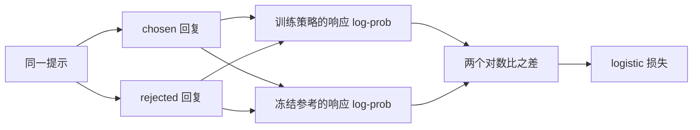

[T5](/training/instruction-tuning/) 给定一个示范回复，最大化其条件似然。有时数据只告诉我们：同一提示下，回复 $y^+$ 比 $y^-$ 更好。直接把 $y^+$ 当 SFT 样本，会忽略比较对象；把 $y^-$ 中每个 token 都当绝对错误，又可能惩罚两个回复共有的正确部分。直接偏好优化（direct preference optimization，DPO）用两个完整回复的相对似然构造目标。

先修为 [M2](/math/distributions/)、[T4](/training/evaluation/) 和 T5。以下采用原始 DPO 的序列求和、固定参考策略和 logistic 目标，系数记为 $\lambda_{\mathrm{DPO}}>0$，避免占用 RoPE 的频率底数 $\beta$。原论文中的 beta 对应本章这个系数。

## 回复概率：条件包含提示，求和只包含回复

提示为 $x$，回复含 $m$ 个 token，语言模型策略为 $\pi_\theta$：

$$
\log\pi_\theta(y\mid x)
=\sum_{t=0}^{m-1}\log\pi_\theta(y_t\mid x,y_{<t}).
$$

这里沿用 [P2](/principles/language-modeling/) 的标签错位：生成首个回复 token 的 logits 位于最后一个提示 token 的输出位置。计算 mask 时应该标记“这一输出预测的目标是否属于回复”，不是简单标记输入 ID 是否属于 assistant。

提示仍作为上下文参与注意力，但提示自身的续写标签不计入这个条件似然。padding 也不计入。是否把 EOS 纳入回复需要固定协议；本章默认数据显式列出的回复 token 都参与，生产训练应说明包含哪些结束符。

假设 chosen 的两个目标概率为 0.8、0.7，rejected 为 0.6、0.4：

$$
\pi_\theta(y^+\mid x)=0.56,\qquad
\pi_\theta(y^-\mid x)=0.24.
$$

它们的对数概率为 $\ln0.56$、$\ln0.24$。不要先平均 token 对数概率；那会将序列概率比换成长度归一化目标，已不是这里的定义。

## 参考策略：测量相对基线的改变

设固定参考策略 $\pi_{\mathrm{ref}}$ 来自 SFT checkpoint。定义一个回复的对数比：

$$
r_\theta(x,y)=\lambda_{\mathrm{DPO}}
\left[\log\pi_\theta(y\mid x)-\log\pi_{\mathrm{ref}}(y\mid x)\right].
$$

这个量可以理解为从策略相对参考的变化推导出的隐式评分，不是另外训练的独立奖励网络。chosen 与 rejected 的差为：

$$
z=r_\theta(x,y^+)-r_\theta(x,y^-)
=\lambda_{\mathrm{DPO}}\left[
\log\frac{\pi_\theta(y^+\mid x)}{\pi_\theta(y^-\mid x)}
-\log\frac{\pi_{\mathrm{ref}}(y^+\mid x)}{\pi_{\mathrm{ref}}(y^-\mid x)}\right].
$$

加入参考不是要求每个 chosen 的绝对概率都增大，而是衡量模型把 chosen 相对 rejected 的优势扩大了多少。数据只观察部分回复，模型其它输出的行为仍取决于参数共享、数据覆盖和约束强度。

冻结参考既指参数不更新，也指它提供的概率不随着每步新策略一起漂移。可以预计算固定数据的参考 log-prob；必须绑定 checkpoint、tokenizer、模板、截断和 mask，否则“缓存的参考值”与当前样本并不是同一个序列。

## Logistic 目标：为什么梯度推动偏好差扩大

使用 sigmoid $s(z)=1/(1+e^{-z})$ 将差值转成 chosen 胜出的概率。单对损失：

$$
\ell_{\mathrm{DPO}}=-\ln s(z)=\ln(1+e^{-z}).
$$

后者用稳定 `softplus(-z)` 实现，避免先求 sigmoid 再取 log 的极端数值问题。对 $z$ 的导数为：

$$
\frac{\partial\ell}{\partial z}=s(z)-1=-s(-z).
$$

所以最小化损失会推动 $z$ 增大。在把两个回复 log-prob 暂时看成独立标量时，chosen 的导数为 $-\lambda_{\mathrm{DPO}}s(-z)$，rejected 为正的对应值。回到模型参数时，两条序列共享网络，更新不是对这两个标量分别独立修改。

<Figure src="advanced/dpo-loss.svg" alt="DPO 损失随偏好差 z 单调下降，梯度幅度 s(−z) 在 z 很大时趋近零">实线是单对损失，虚线是它对 z 的梯度幅度。z 为负时梯度接近 1，模型正在偏好 rejected，更新最强；z 越大梯度越小，已经分得开的偏好对几乎不再贡献更新。起点 z = 0 的损失是 ln 2。</Figure>

沿用上一节概率，参考给 chosen 0.4、rejected 0.3，系数 0.2：

$$
z=0.2\ln\left(\frac{0.56/0.24}{0.4/0.3}\right)
=0.2\ln1.75\approx0.111923,
\qquad\ell\approx0.638751.
$$

若训练策略与参考完全相同，则 $z=0$、损失 $\ln2$。这是初始比较对称，不意味着模型给两条回复的原始概率相同。若参考已经强烈偏好 chosen，训练策略也必须在这个基线之上扩大相对差才会得到正 $z$。

系数不仅是“学习率的另一名字”。它位于概率比内部，改变 logistic 饱和范围和参考相对变化所对应的评分尺度；优化器学习率在参数更新外部。改变系数后不能只根据损失数值比较质量。

## 推导背景：从 KL 约束到隐式奖励

原始动机是在每个提示上最大化奖励，同时约束策略偏离参考：

$$
\max_\pi\;\mathbb E_{y\sim\pi}[r(x,y)]
-\lambda_{\mathrm{DPO}}D_{\mathrm{KL}}(\pi(\cdot\mid x)\Vert\pi_{\mathrm{ref}}(\cdot\mid x)).
$$

对离散候选空间，加上概率和为 1 的拉格朗日约束，求导可得最优策略与 $\pi_{\mathrm{ref}}\exp(r/\lambda_{\mathrm{DPO}})$ 成比例。整理为奖励等于 $\lambda_{\mathrm{DPO}}\log(\pi/\pi_{\mathrm{ref}})$ 加上只依赖提示的常数。比较同提示两回复时，常数抵消，从而得到上面的对数比差。

这一代数动机需要参考在候选上有支持，奖励与偏好模型满足相应假设；有限数据和神经网络训练并不自动达到理想最优策略。正文的数值计算与梯度是定义后的直接推导，DPO 理论出处见 [原论文](https://arxiv.org/abs/2305.18290)。

## 数据与实现：需要固定的五项约定

一对数据必须来自同一提示上下文。若 chosen 带 system 消息、rejected 不带，两概率不再是在相同 $x$ 下的比较。模板、特殊 token、EOS 和截断规则也要一致。截断若切掉唯一体现偏好的结尾，就可能让原始标签与实际训练输入冲突。

参考参数设为不求导，推理时用 eval 保证 dropout 关闭。训练策略是否保留 dropout 应按实现说明；CPU 检查关闭随机扰动。chosen/rejected 可以拼进一个批次加速，但不能打乱配对关系；输入长度不同，padding 后仍各自求有效回复 token 的 log-prob 总和。

偏好来源可以是人工比较、规则或另一个模型，每种来源有噪声和覆盖限制。DPO 不会凭空校验事实；偏好标签本身错误，模型仍可能朝错误方向更新。训练损失下降要配合 [T4](/training/evaluation/) 的独立质量、格式、长度与基座能力评估。

## 与 SFT、在线 RL 的关系

SFT 对示范逐 token 做交叉熵。原始 DPO 使用固定偏好对，不需要每个梯度步在线采样，也不需要单独拟合一个奖励网络。在线强化学习则采样当前或旧策略的回复、获取奖励、使用相应策略优化算法。DPO 的理论来自奖励约束问题，不代表执行流程与 PPO/GRPO 相同。

也可以组合 SFT 与偏好目标，或采用长度归一化、label smoothing 等变体，但必须重新给出目标。很多名称接近的方法在序列归约、参考策略和数据生成方面不同；不能只把实现里的一个 mean 改成 sum，然后仍引用原论文定义作为完全相同的算法。

## CPU 核对：掩码、稳定损失与梯度方向

运行 `python code/advanced/dpo.py`。它给每条序列四个 logits 行，其中两行参与响应似然，另外两行代表提示与 padding。padding 标签故意设成无效 ID，mask 后不得触发词表索引错误。脚本核对手算 margin/损失、冻结参考、被屏蔽 logits 的直接梯度为零，以及 chosen/rejected 目标 logit 的梯度符号。

<CodeFile path="code/advanced/dpo.py" />

直接 logits 梯度为零不意味着 prompt embedding 的梯度为零：回复概率可以经因果注意力依赖提示，梯度会沿网络内部回到提示表示。这与 T5 的响应-only 训练边界一致。

## 常见误区

rejected 回复并不是每个 token 都错误，DPO 处理的是整条条件概率的相对比较。chosen 原始概率高于 rejected，也不一定代表 margin 为正，因为参考可能有更大的优势。DPO 训练损失不能与 SFT 的每 token NLL 直接比较，两者对象、归约和尺度都不同。

## 练习与核对

策略概率比和参考概率比都为 3，DPO margin 和损失是多少？

两对数比抵消，margin 为零，损失为 $\ln2$。策略已经偏好 chosen，但相对参考没有扩大优势。

为什么不能在每次更新后把参考权重同步成当前策略？

那会让基线随训练漂移，下一步的零差值不再对应固定 checkpoint 的约束；它是另一个训练算法，需要单独定义。固定参考是本章目标的组成部分，不是可随意省略的缓存细节。

chosen 有四个 token，rejected 有两个，把每条 log-prob 除以长度会怎样？

原始比较是两个序列联合概率的比。除长度后比较的是每 token 几何平均概率，可能反转排序，因此改变训练目标。长度效应确实需要研究，但应命名并评估所采用的变体。

偏好优化依赖回复数据，长上下文则先要求输入和状态规则一致。[A4](/advanced/long-context/) 将把位置变换、窗口与评估分开讨论。

## 原始资料

- [Direct Preference Optimization](https://arxiv.org/abs/2305.18290)：KL 约束动机、成对目标及实践。本文使用原始 sum log-prob 定义，教学概率由本章给定。
