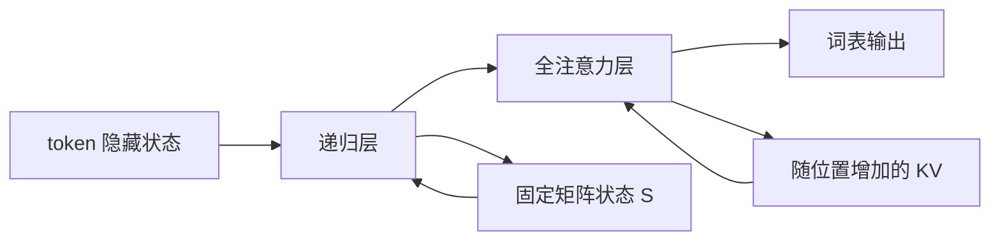

import DeltaStateLab from '../../../components/labs/DeltaStateLab'

[A6](/advanced/state-space/) 展示有限状态递推，[P3](/principles/attention/) 保留历史位置并按查询重新分配权重。能否让多数层用固定矩阵状态处理序列，在少数层保留逐位置注意力？混合模型这样安排计算，但首先需要定义每一类层自己的算子，不能只把它们都叫“注意力”就共用同一个缓存。

先修是 P3、A6 与 [P8](/principles/modern-decoder/)。本章的键、值、查询仍为列向量，状态矩阵 $S_t\in\mathbb R^{d_v\times d_k}$，值作为行方向、键作为列方向。论文或代码若把状态转置存储，运算方向也要同步转置。

## 线性累积：先对历史求和，再读当前查询

标准注意力对当前查询 $q_i$ 与每个历史键 $k_j$ 点积，再对这一行 softmax。一个更简单的线性形式直接使用特征内积：

$$
y_i=\sum_{j\le i}v_j\,\phi(k_j)^\top\phi(q_i).
$$

其中 $\phi$ 是某个特征映射；本节不假定它近似 softmax。按结合律：

$$
S_i=\sum_{j\le i}v_j\phi(k_j)^\top,
\qquad S_i=S_{i-1}+v_i\phi(k_i)^\top,
\qquad y_i=S_i\phi(q_i).
$$

这样只需固定大小的矩阵状态。若要求非负权重的归一化版本，还要保留 $z_i=\sum_{j\le i}\phi(k_j)$，将输出除以 $z_i^\top\phi(q_i)$，并规定分母接近零的处理。本章后面的 DeltaNet 算子不采用这个 softmax 式分母，不能偷偷添加。

“线性注意力”中的线性通常指序列长度成本：固定头数和特征维度下，每步状态更新工作量固定，整段约 $O(Td_kd_v)$。特征映射、gate、MLP 可以是非线性的，所以不是说整个语言模型是一个线性函数。

## Delta 更新：新值纠正旧关联

单纯外积累加会让重复键的关联不断叠加。假设状态将键 $k_t$ 映射到预测值 $S_{t-1}k_t$，实际希望关联的值为 $v_t$，差值是：

$$
e_t=v_t-S_{t-1}k_t.
$$

delta 规则按这个误差修正：

$$
S_t=S_{t-1}+\eta_t e_tk_t^\top,
\qquad y_t=S_tq_t.
$$

$\eta_t$ 是状态更新强度，区别于训练优化器的学习率；本章不使用论文的 beta 记号，避免与 RoPE 底数冲突。若 $\|k_t\|_2=1,\eta_t=1$，则更新后 $S_tk_t=v_t$，沿当前键方向的旧关联被准确替换。对与 $k_t$ 正交的方向 $u$，$k_t^\top u=0$，修正项对 $S_tu$ 没有影响。

这不是凭空获得无限记忆：不同键不正交时仍会互相影响。若不限制键范数，更新系数还受 $\|k_t\|_2^2$ 放大，可能过冲。所以键的单位化要写为实际 $k/\|k\|_2$，不能与 P8 的 RMSNorm 混称。

## 门控 delta：先遗忘，再有针对性地写入

门控 DeltaNet（Gated DeltaNet）加入保持系数 $a_t$。先衰减状态 $\overline S_{t-1}=a_tS_{t-1}$，再纠正当前关联：

$$
S_t=a_tS_{t-1}
+\eta_t(v_t-a_tS_{t-1}k_t)k_t^\top.
$$

整理成矩阵仿射形式：

$$
S_t=a_tS_{t-1}(I-\eta_tk_tk_t^\top)
+\eta_tv_tk_t^\top.
$$

$a_t$ 控制整体遗忘，$\eta_t$ 控制当前键关联纠错。$a_t\to0$ 会清除原状态，$a_t\to1$ 则趋近普通 delta 更新。两者作用不同，不能用一个权重笼统描述。[Gated DeltaNet 原论文](https://arxiv.org/html/2412.06464v1#S3.SS1)

例如 $S_{-1}=0$。第一步 $k=q=(1,0)^\top$、$v=(2,1)^\top$、$a=1,\eta=0.5$，得到：

$$
S_0=\begin{bmatrix}1&0\\0.5&0\end{bmatrix},
\qquad y_0=(1,0.5)^\top.
$$

第二步换成 $k=q=(0,1)^\top$、$v=(0,2)^\top$、$a=0.5,\eta=1$。先将第一列衰减一半，再将第二列写成新值：

$$
S_1=\begin{bmatrix}0.5&0\\0.25&2\end{bmatrix},
\qquad y_1=(0,2)^\top.
$$

第一列仍有旧信息，但被保持 gate 减弱；第二列精确保存当前正交键对应的值。注意读取发生在当前写入之后，因此该算子包含当前 token，和因果 self-attention 的约定一致。

<DeltaStateLab client:visible />

交互固定两条正交键和第一步结果，分别改变第二步保持系数与更新强度。保持系数影响旧键方向，更新强度影响新关联写入；初始状态恰好在新方向为零，所以这组算例没有旧关联纠错项的额外抵消。非正交键时应重新套完整公式，不能把这个简图的两列独立性当一般规律。

## 并行训练：小秩修正可以组织成块

给定当前输入投影产生的 $a_t,\eta_t,k_t,v_t$，状态更新对旧 $S$ 是仿射的。右乘传播矩阵为 $a_t(I-\eta_tk_tk_t^\top)$，具有单位阵加秩一修正的结构。按 [A6](/advanced/state-space/) 的仿射组合思想，可组织块内运算和块间状态传递。

实际高效训练利用这种结构减少显式大矩阵组合成本，而不是每步保存一个完全稠密传播矩阵，再做通用矩阵扫描。训练块尺寸、临时中间量、融合 kernel 都影响速度。CPU 顺序参考只说明公式，不是论文 GPU 吞吐的复现。

完整模块还包含 Q/K/V 投影、短卷积、非线性、输出门控和归一化。混合模型的权重兼容需要全部这些步骤一致，仅复现状态更新公式并不能加载一个公开 checkpoint 后得到相同 logits。

## 混合层：每层保留自己的历史类型

一个教学混合模型先做一层 gated delta，再把每个位置的输出送进一层标准因果注意力。第一层 decode 仅需矩阵状态 $S$；第二层保留逐位置 K/V。层间残差、FFN、归一化仍可沿用 P4/P8 的组织。

图中两条状态边不能交换。给递归层分配 `(B,n_kv,T,d_h)` 的普通 KV cache 会浪费或误解其更新；给全注意力层只留一个固定矩阵则改变模型。请求结束时两种状态都要释放，重用请求槽时都要重置，否则不同请求会串扰。

一层递归状态的纯元素数为 $n_s d_vd_k$；若还含短卷积，需额外保留卷积历史。一层全注意力缓存为 $Tn_{\mathrm{kv}}(d_k+d_v)$。总历史占用按层相加，不能因为多数层是递归，就将整个混合模型写成 $O(1)$ 序列状态。

## Qwen3.5 固定案例：先读层列表，再算账

本章核对的是官方 [Qwen3.5-0.8B 的 2b48083 修订配置](https://huggingface.co/Qwen/Qwen3.5-0.8B/blob/2b48083/config.json)，读取日期 2026-09-27，避免将同一家族的稠密、MoE 和不同规模参数混在一起。

其文本配置有 24 层，`layer_types` 明确按三个 `linear_attention`、一个 `full_attention` 重复，得到 18 个递归层和 6 个全注意力层。递归分支设 16 个值头、键/值维度各 128，卷积核宽 4；全注意力分支有 8 个查询头、2 个 KV 头、头维度 256。隐藏宽度 1024 不等于查询头数乘头维度，这延续 P8 的形状提醒。

因此仅按递归矩阵的结构元素计算，一层为 $16\times128\times128=262144$ 个元素；若其状态使用配置的 float32，纯矩阵占 1 MiB。该数不含卷积、权重、临时激活和实现额外状态。全注意力层仍随历史长度增加。配置中的最大位置 262144 是案例设置，不是本章实验得到的任务能力。

对应 [Transformers 官方 Qwen3.5 文档](https://huggingface.co/docs/transformers/main/en/model_doc/qwen3_5) 解释 Gated DeltaNet 与 full attention 的混合。生产加载时还需固定库版本、kernel 后端、视觉处理器和位置布局；本文教学脚本不是该 checkpoint 的替代加载器。

## 推理功能：回滚与前缀缓存要重新设计

普通 KV 可以根据有效长度截断，递归状态却已经汇总了后来 token。删除末尾几步不能通过裁剪矩阵恢复此前状态，可能需要保存检查点或重新计算。在 [S8](/systems/speculative-decoding/) 投机拒绝后，缓存提交和回滚协议因此要按层类型设计。

同理，前缀缓存保存的可以是某前缀末尾的递归状态，而非每个 token 的 KV 块；复用时必须绑定同一权重、位置规则、模板与完整状态。全注意力层仍可能共享分页块，递归层则需要复制或引用对应终态。混合模型给系统提出的是多种状态的共同生命周期，不只是换一个 attention kernel。

## CPU 核对：递推与仿射参考

运行 `python code/advanced/hybrid_attention.py`。先验证上面两步二维算例，再用 seed=17、float64 生成四步输入，比较“先衰减再误差更新”与展开的矩阵仿射公式。最后将递归输出送入因果注意力，核对形状和有限值。二维递归状态有 4 元素；教学四位置全注意力的双份二维 K/V 有 16 元素。

<CodeFile path="code/advanced/hybrid_attention.py" />

这条链完成一个小型混合序列算子，不宣称具有语言能力。训练完整模型仍需遵循 P2 的目标和 T3 的数据、checkpoint 与质量评估。

## 常见误区

线性序列成本不等于整个网络线性。DeltaNet 的单位化与 RMSNorm 不同。多数递归层不等于整个混合模型常量状态。公开配置的 `linear_attention` 是模块类型标签，不足以解释其全部运算和缓存。

## 练习与核对

单位键、更新强度 1、保持系数 1，delta 更新后当前键读取什么？

$S_tk=S_{t-1}k+(v-S_{t-1}k)(k^\top k)=v$。若键范数不是 1，最后乘因子不等于 1，这个精确替换结论不成立。

两层递归加一层 full attention，总状态会随历史长度增长吗？

会，全注意力层仍保留历史 K/V。递归层贡献常量项，全注意力层贡献长度线性项，二者求和而非只算占多数的类型。

投机草稿拒绝后，为什么不能对递归状态执行与 KV 相同的截断？

矩阵状态不是按 token 存储的数组，后来更新已改变所有相关方向。恢复此前终态需要保存旧快照、使用可证明的回滚算法，或重跑已提交前缀。

混合模型改变记忆算子。[A8](/advanced/sparse-attention/) 保留逐位置状态，但减少每个查询实际读取的位置。

## 原始资料

- [Gated Delta Networks](https://arxiv.org/html/2412.06464v1)：门控 delta 公式和分块训练，本文统一为列向量与 $\eta_t$ 记号。
- [Qwen3.5 官方文档](https://huggingface.co/docs/transformers/main/en/model_doc/qwen3_5)、[固定 0.8B 配置](https://huggingface.co/Qwen/Qwen3.5-0.8B/blob/2b48083/config.json)：逐层模型案例。
