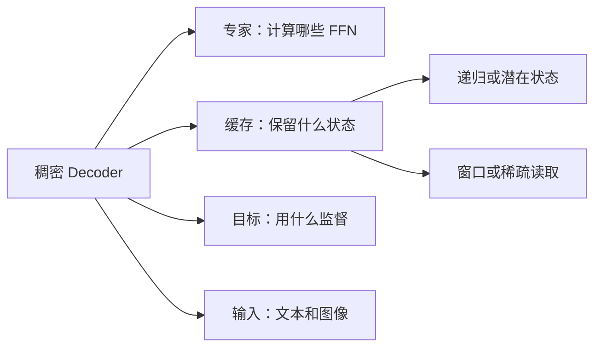

主线已经把下一 token 预测闭合为模型、训练和服务。进阶专题研究改变其中一部分之后，哪些结论仍然成立、哪些需要重新证明。这里沿用数学基础的列向量、维度和位置记号；无需同时记住所有模型名称。

图中每条边是一个不同的改变。MoE 稀疏的是专家，稀疏注意力减少的是位置；MLA 改变 K/V 的参数化和缓存；FlashAttention 保留原注意力算子，只改变执行。把这些轴分开，才能合理比较成本。

先修按章标注。A1/A2 从 [P8 现代 Decoder](/principles/modern-decoder/) 和 [P10 缓存](/principles/kv-cache/) 进入；A3/A5 从 [T5 指令微调](/training/instruction-tuning/) 进入；A6→A7 先建立递推，再讨论混合模型。A9 的第一条形状链只需要 P4，训练讨论需要 T5。章节顺序提供一条完整阅读路线，也允许按问题进入。

<ChapterList track="advanced" />

每章的 CPU 脚本验证本章算子的数学性质，不下载大型权重，也不生成未经测量的性能结论。公开配置是定位架构的固定案例，教学尺寸是可手算的独立例子；两者不混用。
