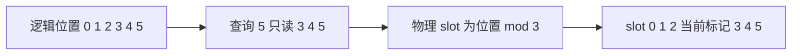

import WindowCacheLab from '../../../components/labs/WindowCacheLab'

一个 RoPE 模型训练时只见过几千位置，而 sin/cos 在任意实数上都有定义。把最大长度改为十万，程序也许仍能前向，但此前的证明只说明旋转可计算，没有说明模型学会在这个范围使用信息。长上下文必须同时回答三个问题：位置规则是否与训练匹配、注意力可见哪些历史、系统能否存储和计算这些历史。

先修为 [P7](/principles/rope/)、[P10](/principles/kv-cache/) 和 [T4](/training/evaluation/)。本章保持 0 起点位置和固定模型参数，先解释几何变化，再给同窗口 cached/full 验证。长度上限、有效能力和硬件容量是三项不同的指标。

## 位置范围：训练改变了什么经验分布

二维频率块 $r$ 的角频率为 $\omega_r=\beta^{-2r/d_{\mathrm{rot}}}$，$d_{\mathrm{rot}}$ 是参与 RoPE 的偶数维数。固定内容时位置差 $\Delta=j-i$ 带来角度 $\Delta\omega_r$。训练长度为 $T_{\mathrm{train}}$，观测到的位置差大致被限制在该范围；推理更长时，相位组合、候选数量和内容关系一起变化。

相位周期并不证明模型失效，也不证明模型外推成功。多个频率组合可以区分很多位置，但网络如何利用这些组合，要由数据和训练决定。模型配置的 `max_position_embeddings` 表示实现或训练约定的一部分，不能作为任意长距任务准确率的证明。

若是 [P4](/principles/decoder/) 的学习式位置表，超出表长甚至没有已定义参数；若是 RoPE，函数仍定义。这是两种不同的首要限制，不能直接把 learned embedding 的表外问题套到 RoPE。

## 位置插值：统一压缩所有频率的角度

希望把训练范围扩为 $sT_{\mathrm{train}}$，$s>1$。位置插值（positional interpolation）将推理位置替换为 $p/s$：

$$
R(p\omega_r)\longrightarrow R(p\omega_r/s).
$$

这等价于每个频率都除以 $s$。原本远端位置 $p=sT_{\mathrm{train}}$ 的角度回到约 $T_{\mathrm{train}}\omega_r$。代价是原本相邻两位置的角度差也从 $\omega_r$ 变成 $\omega_r/s$，局部位置信号更紧密。

取 $\omega=\pi/4,s=2$，原位置 0、1、2 的角度是 0、$\pi/4$、$\pi/2$；插值后成为 0、$\pi/8$、$\pi/4$。位置 4 的新角度相当于旧位置 2，但新位置 1 也不再与训练时位置 1 相同。因此插值通常需要匹配的继续训练和质量检验。[位置插值原论文](https://arxiv.org/abs/2306.15595)

另一条路径是改变频率底数 $\beta\to\beta'$：

$$
\frac{\omega'_r}{\omega_r}=
\left(\frac{\beta'}{\beta}\right)^{-2r/d_{\mathrm{rot}}}.
$$

比值依赖频率块，$r=0$ 的频率甚至不变。所以“增大底数”不等于“所有位置除同一个倍数”。按频段混合原频率与缩放频率，再调整注意力尺度，是 YaRN 一类方案的核心方向；具体分段、阈值和 scale 必须使用 checkpoint 训练时对应的实现。[YaRN](https://arxiv.org/abs/2309.00071)

本章没有将上述方法压成一个所谓通用 RoPE 配置。看到 `rope_scaling` 字段时，需要把类型、扩展因子、原训练长度与分数尺度一起解释，不能只读取一个 factor 就完成模型兼容。

## 动态频率：历史键和新查询必须使用同一规则

历史键按旧频率旋转成 $R(j\omega)k_j$，新查询若突然改用 $R(i\omega')q_i$，点积是：

$$
q_i^\top R(-i\omega')R(j\omega)k_j
=q_i^\top R(j\omega-i\omega')k_j.
$$

目标新规则却要求 $R((j-i)\omega')$。两者只在特殊情况下相同。本章脚本取历史位置 5，旧频率 0.4、新频率 0.2，旧旋转键 $(\cos2,\sin2)$ 与新规则键 $(\cos1,\sin1)$ 不同。

单层原始键如果仍保留，可以按新规则重旋转；但完整多层模型的历史隐藏状态可能已经因为旧注意力而不同，只改一层缓存键不能保证获得新规则整段前向的结果。严格比较应重跑完整前缀，或在请求开始前锁定频率方案。某些实现有专门的动态缓存处理，应按其定义验收，不能只凭缓存尺寸正确判定兼容。

在固定频率下移动共同坐标原点又是另一件事：所有参与配对的 Q/K 同步变换可以保留相对点积。只重置新查询或只改部分历史，不满足共同平移条件。

## 滑动窗口：修改的是可见历史集合

现在保持位置频率固定，让每个查询只读最近 $T_w$ 个位置。定义窗口包含当前 token：

$$
\operatorname{visible}(i,j)
\iff \max(0,i-T_w+1)\le j\le i.
$$

取 $T_w=3$，位置 0 可见 $\{0\}$，位置 2 可见 $\{0,1,2\}$，位置 5 可见 $\{3,4,5\}$。这个约定与“最近三条历史，再加当前”不同；后者窗口容量为四。实现字段必须明确包含当前与否，避免一格错误。

窗口减少候选，softmax 分母也改变。完整注意力可能给旧位置 0 高权重，窗口将其设成零，两者输出一般不同。窗口缓存与“同窗口的整段 masked attention”可以等价，与原 full attention 不应要求等价。

即使多层局部注意力让信息通过中间位置逐层传播，当前层仍不能直接读取窗口外的原始键。感受野扩大不等于原 full attention 的读取能力，具体任务要测试。

## Ring cache：物理槽重复使用，逻辑位置不重置

长度不断增加时，可用固定 $T_w$ 个物理槽，位置 $p$ 写到 $p\bmod T_w$。为了知道槽属于哪个 token，再保留绝对位置 tag。查询 $i$ 的有效历史按逻辑位置升序映射为槽列表，核对 tag 后读取。

本章 $T_w=3$。写位置 3 时覆盖位置 0 的槽 0；写位置 4 时覆盖位置 1 的槽 1。这是释放已经不可见的状态，不是把新 token 的位置编号变成 0、1。RoPE 仍使用绝对位置 3、4。

一步只追加一个 token，先写当前，再读窗口，是安全的。若一次追加许多 token，不能先把全部新 K/V 写进小 ring，然后为较早新查询计算：后面的写入可能覆盖较早查询仍需读取的历史。可逐步执行、分块控制写入，或使用足够大的临时段，验收标准仍是每个查询的可见集合相同。

<WindowCacheLab client:visible />

初始位置 5、窗口 3 对应本章图例。上排展示逻辑可见集合，下排展示重复使用的物理槽和当前绝对 tag；向前推进时槽数保持不变，tag 继续增长。改变窗口是在比较不同可见规则，不是在一个真实请求里无代价地改缓存布局。

位置、slot、有效长度必须是三个变量。把 `slot` 当 RoPE 位置会每 $T_w$ 步重复相位；把 allocated capacity 当可见长度会读取尚未写入或已过期的槽。这样的错误常常维度全对，但 logits 已不等价。

## 局部与全局层：缓存账按层类型求和

一些模型穿插局部层和全局层。例如 [Gemma 3 技术报告的固定架构](https://arxiv.org/html/2503.19786v1#S2) 用五个局部层对应一个全局层，局部窗口 1024；不同规模的最大上下文并不全部相同。这里引用架构机制，不将宣传的最大长度转成任意任务保证。

若局部层有 $n_l$ 层、全局层有 $n_g$ 层，二者头尺寸暂设相同，普通 GQA 缓存容量可写为：

$$
2B\,n_{\mathrm{kv}}d_h b_{\mathrm{elem}}
\left[n_l\min(T,T_w)+n_gT\right].
$$

全局层仍随 $T$ 线性增长，所以整个混合模型通常不能称为常量历史状态。若各层使用不同头数、维度或精度，应逐层相加。局部与全局层也可能使用不同 RoPE 底数，其缓存规则按层固定，不应在全模型共用一套旋转表时遗漏这些差异。

## 质量评估：读得长、找得到、用得对

长上下文能力可以按 [T4](/training/evaluation/) 的受控实验逐层检查。先固定模型、tokenizer、模板、生成预算与位置规则，然后改变长度和信息位置。至少分开以下任务：精确检索、跨段组合、长文本摘要、含干扰信息的推理。一个针式检索分数不能代表所有长距能力。

在长度 $T$ 中，把答案证据放在开头、中间、末尾并固定干扰强度，报告每种位置的准确率。进一步加入需要同时使用两条远距证据的问题，避免模型只读最近一条就得分。任务语料与训练污染也需检查。

资源报告分别给输入 token 数、prefill 时间、KV 容量、decode 读量和实际输出长度。窗口可能省缓存，但改变任务能力；插值可能保留全部历史，却不降低 full attention 的二次 prefill 运算。两个方法解决的问题不同，比较应明确预算。

## CPU 核对：同窗口 cached/full

运行 `python code/advanced/long_context.py`。seed=3、float64，八位置二维 Q/K/V，窗口大小 3。第一条路径构造整段窗口 mask；第二条路径使用 ring 和绝对 tag 逐步追加。两条输出相同，完整 full attention 则故意不同。另核对中途改频率导致旧键失配。

<CodeFile path="code/advanced/long_context.py" />

这验证缓存协议，不测长文本语义能力。若延长脚本位置数，ring 的元素数仍固定，计算正确也不表示原模型能在新长度上完成任务。

## 常见误区

窗口释放的是不可见缓存，逻辑位置仍可继续增长。增加配置长度不替代继续训练与评估。动态频率只改新 token 会破坏缓存协议，多层重建还要考虑隐藏状态。局部/全局混合模型的总缓存不能只按局部窗口计算。

## 练习与核对

窗口大小 4 包含当前，查询位置 7 应读取什么位置和 slot？

逻辑位置是 4、5、6、7，对应 slot 0、1、2、3。tag 必须分别为 4、5、6、7；当前位置 RoPE 使用 7，不使用 slot 3。

为什么分块追加超过窗口大小时，先写后统一计算会出错？

物理槽反复覆盖。块内较早查询需要的旧历史，可能已经被块内较晚 token 覆盖。需安排计算与写入，使每个查询读取时对应历史仍然存在，或临时保留未读数据。

六层中五层窗口 1024、一层全局，历史长 8192，缓存的层位置总数是多少？

$5\times1024+8192=13312$。再乘双份 KV、批大小、KV 头数、头维度与元素字节数。不能用 $6\times1024$，因为全局层仍保留全部历史。

位置长度解决输入范围，[A5](/advanced/reasoning-rl/) 接下来研究训练策略和生成预算怎样影响多步推理。

## 原始资料

- [Positional Interpolation](https://arxiv.org/abs/2306.15595)：位置压缩与继续训练。
- [YaRN](https://arxiv.org/abs/2309.00071)：分频扩展和注意力尺度，使用时应绑定对应模型实现。
- [Gemma 3 Technical Report](https://arxiv.org/html/2503.19786v1)：局部/全局混合的固定案例，读取日期 2026-09-27。
