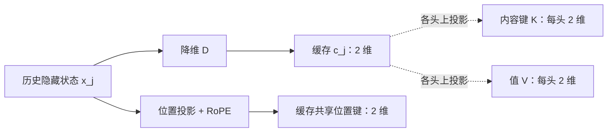

import { MlaPathsLab } from '../../../components/labs/AdvancedLabs'

[P10](/principles/kv-cache/) 的 KV cache 为每层每个已处理 token 保存键和值。[P8](/principles/modern-decoder/) 的 GQA 让多个查询头共享一组完整的键和值。现在换一个问题：**若每个历史位置只保存一条较短的向量，当前查询能否仍算出模型定义的注意力？**多头潜在注意力（multi-head latent attention，MLA）通过在训练时就规定这种参数化来做到这一点。

本章使用 [M6 的矩阵乘法](/math/linear-algebra/)、[P7 的 RoPE](/principles/rope/) 和 P10 的因果缓存。读完应能区分两件事：同一组 MLA 参数下，显式恢复键和值与吸收投影的计算相等；把已有 MHA 权重事后压成 MLA 则没有这个等价保证。

## 从缓存出发：每个位置留下什么

先看一层中的三个位置 $j=0,1,2$。教学例的隐藏状态 $x_j\in\mathbb R^3$ 与降维矩阵 $D\in\mathbb R^{2\times3}$ 是

$$
X=\begin{bmatrix}1&0&1\\0&1&1\\1&1&1\end{bmatrix},
\qquad D=\begin{bmatrix}1&0&0\\0&1&0\end{bmatrix},
\qquad c_j=Dx_j.
$$

每行是一个位置。于是三个共享潜变量依次为 $c_0=(1,0)^\top$、$c_1=(0,1)^\top$、$c_2=(1,1)^\top$。实际模型会学习 $D$，这里用选坐标矩阵让计算可手算；它不是训练后对普通 K/V 做的一次压缩。两个头 $h=0,1$ 各有自己的内容键上投影 $U_{K,h}\in\mathbb R^{2\times2}$ 和值上投影 $U_{V,h}\in\mathbb R^{2\times2}$：

$$
k_{j,h}^{\mathrm C}=U_{K,h}c_j,\qquad
v_{j,h}=U_{V,h}c_j.
$$

上标 $\mathrm C$ 表示内容分支。**两个头共享的是输入 $c_j$，不是各头算出的 $k_{j,h}^{\mathrm C}$ 或 $v_{j,h}$。**下图从一个历史位置读：沿虚线向右恢复的各头 K/V 可以参与计算，但持久缓存只放在中央的两项。

降维只限制模型**如何表示** K/V；并未让历史位置消失，也没有把注意力权重变成统一值。每个新查询仍可分别读取所有可见的 $c_j$。真实模型通常使潜变量维度远小于全体头的 K/V 总宽度，教学例中的 2 维仅用于算术检查。

## 内容键：把历史上投影移到当前查询

先给头 0 固定参数和当前位置 $i=2$ 的内容查询：

$$
U_{K,0}=\begin{bmatrix}1&1\\0&1\end{bmatrix},
\qquad q_{2,0}^{\mathrm C}=\begin{bmatrix}2\\1\end{bmatrix}.
$$

显式恢复三个键得到 $(1,0)^\top,(1,1)^\top,(2,1)^\top$，与查询点积的内容分数为 $(2,3,5)$。但矩阵乘法可以重新加括号：

<KeyEq label="内容键投影吸收">

$$
(q_{i,h}^{\mathrm C})^\top U_{K,h}c_j
=\big(U_{K,h}^{\top}q_{i,h}^{\mathrm C}\big)^\top c_j.
$$

</KeyEq>

对头 0，只需算**一次当前查询** $\widehat q_{2,0}=U_{K,0}^{\top}q_{2,0}^{\mathrm C}=(2,3)^\top$；它与三个缓存潜变量的点积还是 $(2,3,5)$。历史长度增加时，右式无需为每个历史位置恢复内容键。头 1 用另一组参数 $U_{K,1}=\left[\begin{smallmatrix}1&0\\1&1\end{smallmatrix}\right]$、$q_{2,1}^{\mathrm C}=(1,2)^\top$，其内容分数是 $(3,2,5)$。脚本分别比较两个头的显式与吸收分数。

若 $q_{i,h}^{\mathrm C}=W_{Q,h}x_i$ 且两投影之间没有非线性，还可以预先合并 $U_{K,h}^{\top}W_{Q,h}$。有归一化或激活函数隔在两块矩阵之间时，不能任意合并；吸收等式只需要上面点积两侧的参数一致。

## RoPE：位置键为何另存一份

[P7](/principles/rope/) 把位置 $p$ 的二维向量乘旋转矩阵 $R_p$。若直接旋转内容键，点积变成 $(R_iq)^\top R_jU_Kc_j$。旋转 $R_j$ 随**历史位置**改变，无法把它并入一块与所有 $j$ 通用的当前查询投影。一般的 $U_K$ 也不与 $R_j$ 交换；不能直接把 $U_K$ 穿过 RoPE。

MLA 因此让位置键走独立分支。本例在每个 $x_j$ 中取第三个坐标作为未旋转的 $(1,0)^\top$，转角为 $j\pi/2$；共享位置键 $\widetilde k_j^{\mathrm R}$ 依次为 $(1,0)^\top,(0,1)^\top,(-1,0)^\top$。两个头在 $i=2$ 的位置查询分别为 $\widetilde q_{2,0}^{\mathrm R}=(-1,0)^\top$、$\widetilde q_{2,1}^{\mathrm R}=(0,-1)^\top$。前者由 $(1,0)^\top$ 旋转得到，后者由 $(0,1)^\top$ 旋转得到；位置**键**跨头共享，位置**查询**仍可因头而异。

内容与位置沿特征维拼接，$[u;v]$ 表示拼接。对两个头，本例查询和键都是 4 维，分数要按模型定义的 4 维缩放：

$$
s_{ij,h}=\frac{(q_{i,h}^{\mathrm C})^\top U_{K,h}c_j
+(\widetilde q_{i,h}^{\mathrm R})^\top\widetilde k_j^{\mathrm R}}{\sqrt{2+2}}+M_{ij}.
$$

$M_{ij}$ 是 causal mask：未来位置给 $-\infty$，可见位置给 0。当前位置 2 可见三个历史位置。把内容与位置两项分别列出，就能检查缩放前的分数：

| 头 | 内容分数，位置 0/1/2 | 位置分数，位置 0/1/2 | 相加后 | 除以 2 后 softmax 权重 |
| --- | --- | --- | --- | --- |
| 0 | $2,3,5$ | $-1,0,1$ | $1,3,6$ | $0.062890,0.170953,0.766157$ |
| 1 | $3,2,5$ | $0,-1,0$ | $3,1,5$ | $0.244728,0.090031,0.665241$ |

**吸收只改变乘法位置，不改变 softmax 前的尺度。**若误把分母改成潜变量宽度 $\sqrt2$，两个头的概率都会变。教学例选择 $\pi/2$ 使旋转容易手算；模型中的 RoPE 频率按维度配置，见 P7。

## 值：先在潜在空间加权，再投影

<MlaPathsLab client:visible />

图按本章两个头分别核对内容分数、位置分数和输出。吸收选项改变乘法所在的路径，持久缓存始终为共享 c 和共享位置键；显式 K/V 仅在计算中展开。最终两路径的误差应为零。头 0/1 的权重不同，潜在加权向量也不同；不能因它们读取同一 c 就合并成一次加权和。

设上表的权重为 $a_{ij,h}=\operatorname{softmax}_j(s_{ij,h})$。头 0 的值投影取 $U_{V,0}=\left[\begin{smallmatrix}1&0\\0&2\end{smallmatrix}\right]$，头 1 取 $U_{V,1}=\left[\begin{smallmatrix}0&1\\1&1\end{smallmatrix}\right]$。对任意一个头，权重一旦算好，值的线性上投影也可移到加权和之后：

<KeyEq label="值投影吸收">

$$
o_{i,h}=\sum_{j\le i}a_{ij,h}U_{V,h}c_j
=U_{V,h}\underbrace{\sum_{j\le i}a_{ij,h}c_j}_{z_{i,h}}.
$$

</KeyEq>

头 0 的 $z_{2,0}\approx(0.829047,0.937110)^\top$，输出约为 $(0.829047,1.874220)^\top$。头 1 的 $z_{2,1}\approx(0.909969,0.755272)^\top$，输出约为 $(0.755272,1.665241)^\top$。两个头**不能共用同一个 $z$**，因为表中权重不同。令输出投影 $O$ 把两头输出的同名坐标相加，最终输出约为 $(1.584319,3.539461)^\top$。该结果由显式恢复所有值与先混合潜变量两条路径算出。

若 $O$ 是一般线性矩阵，也可把每头的 $U_{V,h}$ 吸收到 $O$ 对应的列块中。softmax 仍须先对历史位置计算；这个式子没有把注意力改造成固定大小的递归状态。

## 容量账：比较同样的历史长度

本例每个历史位置缓存 $c_j$ 的 2 个元素和共享位置键的 2 个元素，共 **4 个**；三个位置共 **12 个**。若按同一组拼接后形状显式保存两头的 K/V，K 是每头 $2+2=4$ 维，V 是每头 2 维，合计每位置 $2(4+2)=12$ 个；一个查询头共享 K/V 的假想 GQA 对照为每位置 6 个。这里仅比较状态形状，不声称这三种参数化是同一模型或拥有相同质量。

一般地，若潜变量宽度 $d_c$，共享位置键宽度 $d_{\mathrm R}$，元素各占 $b_{\mathrm{elem}}$ 字节，则历史长度 $T_{\mathrm{past}}$、batch 大小 $B$、层数 $n_{\mathrm{layers}}$ 的持久缓存为

$$
M_{\mathrm{MLA}}=B\,n_{\mathrm{layers}}\,T_{\mathrm{past}}
(d_c+d_{\mathrm R})b_{\mathrm{elem}}.
$$

这里没有额外乘查询头数，也没有 K/V 两份的系数 2：潜变量供各头的内容键和值共同使用，位置键跨头共享。[DeepSeek-V3 报告 §2.1.1](https://arxiv.org/html/2412.19437v2#S2.SS1.SSS1) 给出 $d_c=512,d_{\mathrm R}=64,n_q=128$、内容头维 128；因此其每位置每层保存 **576 个元素**。若这两部分都按 2 字节计，则为 1152 字节。报告还给出 61 层和查询压缩宽度 1536；查询压缩可减训练激活，不作为历史 KV 的第三份缓存。

这个容量式没有计分页块表、分配碎片、不同精度的 metadata 或 prefill 临时张量。[S5](/systems/paged-cache/) 负责物理块地址，[S1](/systems/ledger/) 区分容量、读取流量和乘法量。较短的缓存并不保证所有 batch、长度或 GPU kernel 上都更快：吸收后的潜在点积维度、权重读取、融合方式和实现路径仍影响执行时间。训练或 prefill 也可能临时恢复完整 K/V，以使用已有高效注意力 kernel；临时工作区不等于 decode 时必须持久缓存它们。

## 用同一例子核对两条路径

运行 `python code/advanced/mla.py`。脚本直接使用本页的 $X,D,U_K,U_V$ 和两个查询，断言两头的显式分数与吸收分数相等，再比较最终输出；另给出一个矩阵与旋转不交换的反例。`float64` 降低舍入差异；断言覆盖这组参数的计算与形状，不是 MLA 对任何既有 MHA 的无损转换证明。

<CodeFile path="code/advanced/mla.py" />

## 练习与核对

只把头 0 的内容查询从 $(2,1)$ 改为 $(1,1)$，保持三个缓存位置和位置查询不变。吸收后的查询及缩放前分数各是多少？

$U_{K,0}^{\top}(1,1)^\top=(1,2)^\top$，与 $c_0,c_1,c_2$ 点积得到内容分数 $(1,2,3)$。位置项仍为 $(-1,0,1)$，所以相加后是 $(0,2,4)$。分母仍是 2，因为模型定义的拼接查询与键还是 4 维；不能因这次只改数值而改缩放维度。

若两个头的注意力权重恰好相同，能否只算一次潜在加权和？若头 1 权重与头 0 不同呢？

权重完全相同时，$z_{i,0}=z_{i,1}$，可以复用一次求和，再分别乘各头的 $U_{V,h}$。只要权重不同，一般就需各头自己的 $z_{i,h}$；共享历史 $c_j$ 不等于共享查询结果。本页的两头概率表正是反例。

16 条请求，每条已缓存 10000 个位置；61 层，每位置每层保存 512 维潜变量和 64 维位置键，均为 2 字节。持久张量的字节数是多少？

$16\times10000\times61\times(512+64)\times2=11{,}243{,}520{,}000$ 字节，约 $10.47$ GiB。这个数还不含块表、碎片或临时工作区；若两部分精度不同，要分别乘各自元素字节数。

下一章 [A3 DPO](/advanced/dpo/) 转向训练目标；若继续研究缓存执行，可回读 [S5](/systems/paged-cache/) 的地址与所有权。

## 原始资料

- [DeepSeek-V3 技术报告 §2.1.1](https://arxiv.org/html/2412.19437v2#S2.SS1.SSS1)：共享 KV 潜变量、解耦 RoPE、查询压缩、输出计算与公开维度。本页小矩阵是独立教学例，并非报告参数。
- [DeepSeek-V2 技术报告](https://arxiv.org/abs/2405.04434)：MLA 的早期模型报告。
