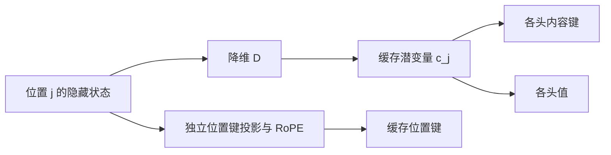

[P10](/principles/kv-cache/) 保存每层的历史 K/V，[P8](/principles/modern-decoder/) 用 GQA 减少 KV 头。多头潜在注意力（multi-head latent attention，MLA）进一步让内容 K/V 从较短的潜变量生成，缓存改为潜变量和位置键。decode 时重组计算，无需恢复整段历史的完整 K/V。

先修是 [M3](/math/linear-algebra/) 的矩阵乘法结合律、P7 的旋转和 P10 的缓存逻辑。这里证明同一组 MLA 参数的两种计算相等，不能由此推出任何预训练 MHA 都能无损转换为 MLA。

## 潜变量：把键和值共同写成低维来源

对位置 $j$ 的隐藏状态 $x_j\in\mathbb R^d$，先做降维：

$$
c_j=D x_j,\qquad D\in\mathbb R^{d_c\times d},\qquad c_j\in\mathbb R^{d_c}.
$$

内容键和值分别由它产生。单头先写为：

$$
k_j^{\mathrm C}=U_Kc_j,\quad U_K\in\mathbb R^{d_{\mathrm C}\times d_c},
\qquad
v_j=U_Vc_j,\quad U_V\in\mathbb R^{d_v\times d_c}.
$$

上标 $\mathrm C$ 表示内容分支。$D,U_K,U_V$ 都是训练参数，而非训练完成后临时求一个矩阵近似。若 $d_c$ 较小，完整 K/V 的变化被限制在这些上投影的列空间内；训练学到怎样利用这个结构。

多头时每个头有自己的 $U_{K,h},U_{V,h}$，但同一位置可以共享 $c_j$。把头的上投影按行堆叠，就得到整层一次投影。GQA 是多个查询头共享直接键和值，MLA 是多个头通过不同上投影读取共同潜变量，两者不是相同的共享方式。

实线表示参数化的数据来源。图中缓存两项，不是缓存内容 K、V 和潜变量三份。训练或 prefill 的实现可能临时恢复 K/V 以调用高效内核；永久缓存账与临时工作区必须分开。

## 键投影吸收：改算查询，不恢复历史键

忽略位置分支，一个查询 $q_i^{\mathrm C}$ 与历史内容键的点积是：

$$
(q_i^{\mathrm C})^\top U_Kc_j
=\big(U_K^\top q_i^{\mathrm C}\big)^\top c_j.
$$

左侧先把每个历史 $c_j$ 恢复成键；右侧只将当前查询变成 $\widehat q_i=U_K^\top q_i^{\mathrm C}\in\mathbb R^{d_c}$，然后与缓存潜变量点积。结合律保证相等，没有省略或近似一个历史位置。

例如 $d_c=3,d_{\mathrm C}=2$，取

$$
U_K=\begin{bmatrix}1&0&2\\0&1&-1\end{bmatrix},\quad
q_i^{\mathrm C}=\begin{bmatrix}2\\1\end{bmatrix},\quad
c_j=\begin{bmatrix}1\\3\\2\end{bmatrix}.
$$

显式键为 $(5,1)^\top$，点积为 11。吸收后的查询为 $(2,1,3)^\top$，与 $c_j$ 点积也是 $2+3+6=11$。$d_c$ 在教学例中甚至大于内容头维，方便看到形状；真实缓存收益取决于它相对整层多头 K/V 的尺寸，并不要求小于每一个头。

若原始查询又来自 $q_i^{\mathrm C}=W_Qx_i$，可预先计算 $U_K^\top W_Q$，于是一次当前投影直接进入潜在空间。实际模型还可能有查询低秩投影、归一化和其他操作，只有相邻线性矩阵能这样直接合并，不能跨过非线性。

## 值投影吸收：先混合潜变量，再恢复输出

令注意力权重为 $a_{ij}$，满足对可见位置求和为 1。值输出：

$$
o_i=\sum_j a_{ij}U_Vc_j
=U_V\sum_j a_{ij}c_j.
$$

先得到潜在加权和 $z_i=\sum_j a_{ij}c_j$，只为当前输出恢复一次值。若输出投影 $O\in\mathbb R^{d\times d_v}$，最终为 $OU_Vz_i$，两矩阵还能预乘。需要注意 $a_{ij}$ 由键与查询决定；同一头内可以提出 $U_V$，不同头的注意力权重通常不同，不能把所有头的 $z_{i,h}$ 不加区分地合成一份。

这一步省的是历史值恢复，不是把 softmax 变成线性函数。先 softmax 再加权和的順序仍然保留；MLA 不等于 [A7](/advanced/hybrid-attention/) 的有限递归状态。

## RoPE：为什么不能直接跨过所有投影

若把完整内容键旋转，分数会包含

$$
q_i^\top R_i^\top R_j U_Kc_j.
$$

$R_j$ 依赖历史位置 $j$。试图吸收到当前查询，需要 $U_K^\top R_j^\top R_iq_i$，仍然每个 $j$ 一份，失去了一个当前查询读取全部潜变量的简单形式。一般矩阵也不与旋转交换。

例如二维旋转 $R$ 与 $U=\begin{bmatrix}1&2\\0&1\end{bmatrix}$，$RU$ 和 $UR$ 通常不同。只有额外受限的矩阵结构可能交换，不能将其当作默认性质。

因此 MLA 把键分成内容分支和独立位置分支：

$$
q_{i,h}=[q_{i,h}^{\mathrm C};\widetilde q_{i,h}^{\mathrm R}],
\quad k_{j,h}=[U_{K,h}c_j;\widetilde k_j^{\mathrm R}],
\qquad \widetilde k_j^{\mathrm R}=R_jW_{KR}x_j.
$$

$[u;v]$ 表示沿特征维拼接；位置键在头间共享，位置查询可因头不同。分数拆成两个点积：

$$
s_{ij,h}=\frac{(U_{K,h}^\top q_{i,h}^{\mathrm C})^\top c_j
+(\widetilde q_{i,h}^{\mathrm R})^\top\widetilde k_j^{\mathrm R}}
{\sqrt{d_{\mathrm C}+d_{\mathrm R}}}+M_{ij}.
$$

缩放分母使用模型定义的查询/键拼接维度，不能因为实际点积改在 $d_c$ 空间，就随意改为 $\sqrt{d_c+d_{\mathrm R}}$。同理，长上下文方案额外调整分数尺度时，应按照具体配置处理。

## 缓存账：潜变量加位置键

一层每个历史位置需保留 $d_c+d_{\mathrm R}$ 个元素，若两个分支使用相同元素字节数，则：

$$
\operatorname{bytes}_{\mathrm{MLA}}
=B\,n_{\mathrm{layers}}\,T_{\mathrm{past}}
(d_c+d_{\mathrm R})\,b_{\mathrm{elem}}.
$$

没有普通 KV 公式中的固定倍数 2，因为共享潜变量同时提供 K 和 V。也不乘查询头数，因为这两份缓存跨头共享。若混合精度或量化分别处理两分支，应按它们自己的字节数分别相加，再算 metadata。

官方 [DeepSeek-V3 e815299 配置](https://huggingface.co/deepseek-ai/DeepSeek-V3/blob/e815299/config.json) 中 $d_c=512,d_{\mathrm R}=64$，所以这种潜在表示每位置每层为 576 个元素；这只是结构容量，运行时可能另有临时缓存或内核工作区。其内容头维 128、查询头数 128 不应再直接代入 GQA 的双份 KV 公式。[报告 §2.1.1](https://arxiv.org/html/2412.19437v2#S2.SS1.SSS1)

<Figure src="advanced/mla-cache.svg" alt="每层每位置缓存元素数：MHA 32768，假想 GQA 2048，MLA 576">三根条按同一比例画出。GQA 一行是为比较而假设的 8 个 KV 头，不是 DeepSeek-V3 的配置；MLA 的条最短，因为一份潜变量同时服务所有头的 K 与 V。</Figure>

缓存更短不保证所有形状上更快：吸收后查询维可能大于普通单头维，后端能否高效执行潜在注意力、批大小和权重搬移也会影响时间。[S1](/systems/ledger/) 的成本方法仍适用，只需重新列矩阵和状态。

## CPU 核对：相同参数的两条计算链

运行 `python code/advanced/mla.py`。教学设置是五个历史位置、潜在维 3、内容维 2、位置维 2、值维 4、输出维 6，seed=11、float64。脚本先恢复 K/V，算 softmax 后输出，再用吸收后的查询和输出矩阵计算；分别比较分数与最终向量。另用不交换矩阵否定“RoPE 可任意穿过投影”的错误。

<CodeFile path="code/advanced/mla.py" />

脚本五位置缓存元素数为 $5(3+2)=25$。这是当前单层教学尺寸，不是 DeepSeek 全模型占用，也不含生成器状态。若要核对 cached/full，固定 $D,U_K,U_V$、位置频率和 mask，分块追加 $c_j,\widetilde k_j^{\mathrm R}$ 后应用同一分数公式即可；因果不变性的逐层证明沿用 P10。

## 常见误区

低秩参数化可以训练出良好模型，但压缩既有权重通常是近似问题；前者的实现等价证明不替代后者的误差评估。MLA 缓存潜变量并非删除旧 token，当前查询仍可为每个历史位置生成不同权重。训练中出现完整 K/V 临时张量也不说明缓存压缩失效，它可能只是另一种执行路径。

## 练习与核对

潜在维 4，内容维 2，位置维 2，缩放分母应是多少？

按本章定义是 $\sqrt{2+2}=2$，因为模型原分数使用拼接后的内容键与位置键。吸收改变乘法组织，不改变原算子的尺度。改成 $\sqrt6$ 会改变 softmax。

两个头能否共享一个潜在加权和，随后分别上投影？

仅当两个头对所有历史位置的权重相同时可以。一般 $a_{ij,0}\ne a_{ij,1}$，必须分别得到 $z_{i,0},z_{i,1}$。共享缓存的输入不意味着共享读取结果。

若缓存 512 维潜变量和 64 维位置键，各为 2 字节，一层一万位置是多少字节？

$10000(512+64)\times2=11520000$ 字节。这里是十进制字节；换 MiB 时再除 $2^{20}$。批大小、层数、分片和 metadata 要另外纳入，不能直接称为全模型显存。

专家与潜在缓存改变架构。下一章 [A3 DPO](/advanced/dpo/) 保留架构，改变训练数据和损失。

## 原始资料

- [DeepSeek-V2](https://arxiv.org/abs/2405.04434)：MLA 与专家结构的早期报告。
- [DeepSeek-V3 §2.1.1](https://arxiv.org/html/2412.19437v2#S2.SS1.SSS1)：潜变量、解耦位置分支与查询参数化。本文统一了维度与转置记号，数值例为独立教学参数。
