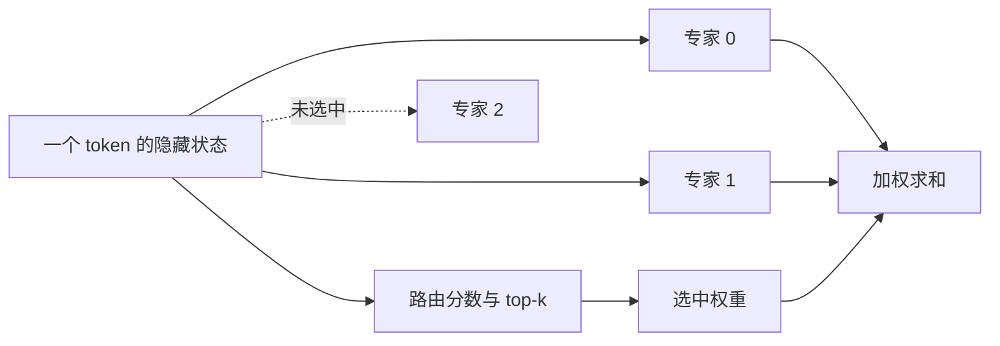

import MoeRouteLab from '../../../components/labs/MoeRouteLab'

在 [P8](/principles/modern-decoder/) 中，每个位置都调用同一个 SwiGLU 前馈网络。假设增加许多组 FFN 参数，却允许一个 token 只使用其中两组：参数容量增加，单 token 的 FFN 计算可以保持有限。问题随之变成“选哪组、怎样混合、没有被选中的参数怎样学习”。混合专家（mixture of experts，MoE）回答这三个问题。

先修是 P8 的 FFN 和 [T2](/training/optimization/) 的梯度更新。本章用四个线性专家完成可核对的路由，再把同一结构换成 SwiGLU。它不是将一个任意稠密 FFN 无损拆分；路由和专家从训练开始就是模型的一部分。

## 路由器：从隐藏状态得到专家分数

设 token 隐藏状态为 $x\in\mathbb R^d$，有 $n_e$ 个路由专家，专家 $e$ 为 $F_e:\mathbb R^d\to\mathbb R^d$。路由器（router）通常用矩阵 $W_{\mathrm{r}}\in\mathbb R^{n_e\times d}$ 产生未归一化分数：

$$
a=W_{\mathrm{r}}x,\qquad a\in\mathbb R^{n_e}.
$$

这里 $a$ 是局部专家分数，不是词表 logits。选择最高的 $k_e$ 个分数所对应的索引集合 $\mathcal E(x)$。$k_e$ 是每 token 活跃专家数，不是 [P9](/principles/generation/) 中截断词表概率的 top-k；两者操作相似，作用对象不同。

本章先采用“选中后 softmax”约定：

$$
g_e(x)=\frac{\exp(a_e)}{\sum_{r\in\mathcal E(x)}\exp(a_r)},
\quad e\in\mathcal E(x),\qquad
y=\sum_{e\in\mathcal E(x)}g_e(x)F_e(x).
$$

未选中专家的权重为零。另一种实现先对全部专家 softmax，再取 top-k；如果对选中权重再次归一化，结果与上式相同，因为公共分母抵消。如果不再次归一化，选中权重和小于 1，输出尺度随遗漏概率变化。这是模型定义差异，不能在代码中随意替换。

读图时注意隐藏状态被送到两个专家，而不是按隐藏维度切成两半。每个选中专家都看到完整 $x$；专家并行与张量并行因此传输不同的数据。

## 四个专家：逐项算出一条路由

取 $d=2,n_e=4,k_e=2$，让专家仅为 $F_e(x)=(e+1)x$。输入 $x=(1,2)^\top$ 的分数为 $(4,3,1,0)^\top$。选中专家 0、1，权重为：

$$
g_0=\frac{e^4}{e^4+e^3}=s(1)\approx0.731059,
\qquad g_1\approx0.268941.
$$

其中 $s$ 沿用数学基础的 sigmoid 记号。输出逐坐标为：

$$
y=0.731059(1,2)^\top+0.268941(2,4)^\top
\approx(1.268941,2.537883)^\top.
$$

同一批另外两条分数为 $(0,1,4,3)$、$(4,0,3,1)$，分别选专家 $(2,3)$、$(0,2)$。三个 token 一共六次专家调用，负载是 $(2,1,2,1)$，而非每个专家都处理三个 token。

<MoeRouteLab client:visible />

交互中的初始分数和专家函数与本节手算相同。改变分数会在跨过边界时改变选中集合；同一集合内权重连续变化，离散选择边界处则不必连续。并列分数按专家编号打破平局，这是实验的确定性约定，真实 kernel 应核对其自身规则。

此时有两种等价的验证方式：先算所有四个专家再选择；或按专家收集命中的 token，仅计算被选中的输入，最后散射加回原 token 行。两者必须使用同一索引和权重，才是同一个 MoE 算子。与某个普通 FFN 输出相等并不是这里的验收目标。

## 稀疏 dispatch：如何保留原位置

把 $B\times T$ 个有效位置暂时展平为 $N$ 行。路由索引是 $(N,k_e)$，权重也是 $(N,k_e)$。专家 0 的命中表可能含原行号 0、2；专家 2 的命中表含行号 1、2。每个专家处理自己的紧凑输入矩阵，输出带着原行号返回。

最后必须是加法散射：一个 token 被两个专家处理，两个贡献汇总到同一行。普通赋值会覆盖第一个贡献。脚本中的 `index_add_` 对应 [M6](/math/backprop/) 共享节点的分支累加，只是发生在前向数据组织阶段。

top-k 索引是离散选择，标准反向传播不会求“索引怎样连续变化”的导数。在固定选中集合内，softmax 权重和专家输出仍然可微，选中 router logits 能收到梯度。若采用只选一个专家且对其权重归一化为 1，主任务对这个局部权重的梯度会消失；很多路由训练机制正是为此需要额外设计。不能看到索引不可微，就断言整个 MoE 不可训练。

## 参数与运算：三本账分别计算

若每个专家是无偏置 SwiGLU，前馈宽度为 $d_{\mathrm{ff},e}$，gate/up/down 共约 $3d\,d_{\mathrm{ff},e}$ 个参数。忽略共享专家、归一化和偏置，一层专家部分：

$$
N_{\mathrm{experts}}=n_e\,3d\,d_{\mathrm{ff},e},
\qquad N_{\mathrm{r}}=n_e d.
$$

每 token 活跃的专家线性运算约 $2k_e\,3d\,d_{\mathrm{ff},e}$ FLOP，另有路由 $2n_e d$ FLOP、激活与组合。总参数约乘 $n_e$，专家计算约乘 $k_e$。但实际权重读取不是“总参数乘 $k_e/n_e$”这样一个固定比例：一个大批量可能覆盖所有专家，每张卡上的权重需要常驻或搬运，热点还决定等待时间。

教学线性专家各有 $2\times2=4$ 个参数，四个专家总计 16；一条 token 调两组共涉及 8 个专家参数。本章的路由分数直接给定，所以这 16 不包含 router 矩阵。切换成端到端模型时须另加 $n_e d=8$，不要把两种算例的参数表混在一起。

## 负载与容量：概率正确不保证运行均衡

如果所有 token 都选同两个专家，剩余专家闲置，热门专家的队列变长。一个常见容量策略为每专家预留 $C_e=\lceil c\,Nk_e/n_e\rceil$ 个输入槽，$c$ 是容量因子。取 $N=3,k_e=2,n_e=4,c=1$，每专家容量 2，本例恰能容纳；若全部三行选择专家 0，容量就溢出。

溢出可以通过扩大容量、等待、改路由、丢弃专家贡献等方式处理。它们对质量和确定性影响不同；训练时使用丢弃策略，推理时也不能假装仍计算了完整定义。容量不是 MoE 数学所必需的常数，而是实现约束。

常见辅助负载目标使用命中比例 $f_e$ 与平均路由概率 $p_e$：

$$
L_{\mathrm{balance}}=\lambda_{\mathrm{balance}}n_e\sum_e f_e p_e.
$$

这里令 $f_e$ 为总共 $Nk_e$ 次命中的比例，所以 $\sum f_e=1$，$p_e$ 为全专家 softmax 在 $N$ 行上的平均，因此也和为 1。均匀时上式为 $\lambda_{\mathrm{balance}}$；在 top-1 的极端对照中，一专家吸收全部概率与命中时为 $\lambda_{\mathrm{balance}}n_e$。top-2 每行选择两个不同专家，不能把全部命中集中在一个专家。这是本章约定；论文可能将 $k_e$ 放在其他归一化位置，比较系数前先检查定义。命中计数不可微，通常作为固定统计量，梯度从 $p_e$ 回到路由器。

均衡只是一项约束，过强会干扰任务分工。专家的“专长”也不应仅由 token 名称猜测，须看路由分布、消融和任务表现。

## 公开模型：共享专家与路由约定要逐项核对

截至 2026-09-27 核对的两个固定案例：

| 配置字段 | Qwen3-30B-A3B | DeepSeek-V3 |
|---|---:|---:|
| 路由专家数 | 128 | 256 |
| 每 token 路由专家数 | 8 | 8 |
| 每专家 FFN 宽度 | 768 | 2048 |
| 独立共享专家 | 此配置未设 | 1 |
| 路由打分与选中权重 | softmax，选中后归一化 | sigmoid，选中后归一化并使用缩放 |

数字来自官方配置 [Qwen3 的 d47d535 修订](https://huggingface.co/Qwen/Qwen3-30B-A3B/blob/d47d535/config.json) 与 [DeepSeek-V3 的 e815299 修订](https://huggingface.co/deepseek-ai/DeepSeek-V3/blob/e815299/config.json)。它们不是本章四专家脚本的参数。

共享专家对每个 token 都调用，所以输出是在路由混合之外加上共享 FFN，参数和 FLOP 也要另加。DeepSeek-V3 的负载控制把校正偏置用于选择专家，混合权重仍取原 affinity；报告还保留了序列级辅助约束。因此“auxiliary-loss-free”不能展开成“训练没有任何辅助负载损失”。[报告 §2.1.2](https://arxiv.org/html/2412.19437v2#S2.SS1.SSS2)

## 专家并行：通信的是 token 状态

专家并行（expert parallelism，EP）把不同专家放在不同设备。一次前向先按专家目的地分发隐藏状态，设备计算本地专家，再将输出发回并组合。同一 token 选择跨两设备专家，就可能产生两份输入传输。总通信字节取决于有效 token 数、$k_e$、$d$、精度与专家布局，不能只由总参数得出。

路由元数据、排序、all-to-all 的固定延迟和不均衡都可能抵消省下的 GEMM 时间。低批量 decode 尤其可能让每个专家只有很少行输入。多卡 collective 的具体语义见 [S9](/systems/cluster/)；这里先明确通信对象，避免把 EP 与切矩阵列的 TP 混为一谈。

## CPU 核对：同一路由的两种实现

运行 `python code/advanced/moe.py`。脚本比较 sparse dispatch 与先算全部专家的参考，检查权重和、命中计数、参数数和反向传播。固定 seed=7、float64。打印负载 `[2, 1, 2, 1]` 只证明这三个输入的调度计数，不是性能测试。

<CodeFile path="code/advanced/moe.py" />

## 常见误区

活跃参数少不意味着全部权重无需存储；每批覆盖多个专家时也可能读取全部专家。MoE 不会自动减少 KV cache，因为它通常替换 FFN，注意力头和历史状态可能没有变化。一个 token 调两个专家也不是将词表分成两半，最后仍由共同 LM head 预测下一 token。

## 练习与核对

把本章 top-2 改为 top-1，选中后 softmax 权重对 router 分数还有主任务梯度吗？

单元素 softmax 恒为 1，导数为零。专家参数仍可接收梯度，但主任务经这个局部权重不能训练 router。若保留全专家 softmax 后的被选概率，目标又不同；辅助目标和路由估计也可能提供梯度，必须先说明采用哪一种。

八个专家中每次选两个，再加一个共享专家，专家大小相同，总容量与活跃计算各算几份？

总专家参数是九份，每 token 专家计算是三份；另加 router、注意力、归一化等共同模块。共享专家不是从八个里再选一个，因此不能计为八份总参数或两份计算。

为什么 sparse dispatch 的散射要加法，不能直接写回？

两个选中专家可能返回同一个原行号。输出定义为两贡献之和，直接赋值只能保留最后一份。逐项检查本章第一个 token，即可发现覆盖导致输出缺少 $g_0F_0(x)$ 或 $g_1F_1(x)$。

MoE 改变的是 FFN 计算选择；[A2 MLA](/advanced/mla/) 将研究另一条轴：怎样改变注意力的参数化和缓存。

## 原始资料

- [Qwen3 Technical Report](https://arxiv.org/html/2505.09388v1)：稠密与专家模型的架构背景。
- [DeepSeek-V3 Technical Report §2.1.2](https://arxiv.org/html/2412.19437v2#S2.SS1.SSS2)：共享专家、sigmoid 路由和负载控制。
- [Switch Transformers](https://arxiv.org/abs/2101.03961)：容量与辅助均衡的早期完整讨论。本文的 top-2 算例不是 Switch 的 top-1 配置。
