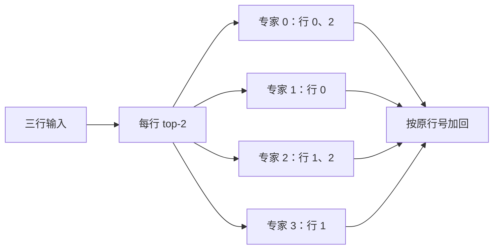

import MoeRouteLab from '../../../components/labs/MoeRouteLab'
import { MoeDispatchLab } from '../../../components/labs/AdvancedLabs'

[P8](/principles/modern-decoder/#swiglu对同一位置的隐藏状态做门控变换) 的每个 token 都经过同一组 SwiGLU 权重。如果把前馈层换成许多组独立权重，又让每个 token 只调用其中少数几组，模型就能拥有较多参数而不在每个位置计算全部参数。这种结构叫混合专家（mixture of experts，MoE）。它的关键不是把训练好的普通 FFN 无损拆开，而是在模型中加入**路由**，让专家与路由器共同学习。

本章需要 P8 的 FFN、[M5 softmax](/math/distributions/) 和 [T2 梯度更新](/training/optimization/)。读完要能给定一张路由分数表，独立算出每条 token 的输出，并分别回答：参数总共存多少、每条 token 算多少、专家分布到多卡时传什么。

## 从一条 token 开始：路由器决定调用谁

设隐藏状态为 $x\in\mathbb R^d$，有 $n_e$ 个专家 $F_e:\mathbb R^d\to\mathbb R^d$。路由器可用可训练矩阵 $W_{\mathrm r}\in\mathbb R^{n_e\times d}$ 得到每个专家的 `logits`（softmax 前的分数）：$a=W_{\mathrm r}x$。从 $a$ 中取分数最高的 $k_e$ 个专家，记索引集合为 $\mathcal E(x)$。这里的 top-k 在**专家轴**上选择，和 [P9](/principles/generation/) 从词表中选候选 token 是两件事。

先固定一种混合约定：只对选中的分数做 softmax。未选中的权重为零，选中者的权重之和为一，输出为

$$
g_e(x)=\frac{\exp(a_e)}{\sum_{r\in\mathcal E(x)}\exp(a_r)}
\quad(e\in\mathcal E(x)),\qquad
y(x)=\sum_{e\in\mathcal E(x)}g_e(x)F_e(x).
$$

先对全部专家 softmax、选 top-k 后**再次归一化**，也得到这组 $g_e$：公共分母会约掉。不再次归一化则是另一种模型，选中权重之和通常小于一。选择规则、混合权重与是否归一化都须一起写清。

本章教学例取 $d=2,n_e=4,k_e=2$。四个专家先用易手算的线性函数 $F_e(x)=(e+1)x$；真实 Decoder 通常把每个 $F_e$ 换成独立的 SwiGLU。下表把一个 batch 展平后的三行记为 token 0、1、2，并**直接给定**路由器输出的分数。表并不声称这些数来自某个已给定的 $W_{\mathrm r}$；后面的代码把它们当作可求导的分数输入。

| token | $x$ | 专家 0/1/2/3 的分数 | top-2 |
| --- | --- | --- | --- |
| 0 | $(1,2)$ | $(4,3,1,0)$ | 0、1 |
| 1 | $(2,-1)$ | $(0,1,4,3)$ | 2、3 |
| 2 | $(-1,3)$ | $(4,0,3,1)$ | 0、2 |

token 0 的两项权重为 $g_0=e^4/(e^4+e^3)\approx0.731059$ 与 $g_1\approx0.268941$。于是

$$
y_0=g_0(1,2)+g_1(2,4)
\approx(1.268941,2.537883).
$$

token 1 也有分数差 1，故以相同的两项权重混合 $F_2(x)=(6,-3)$ 与 $F_3(x)=(8,-4)$，得到 $(6.537883,-3.268941)$。token 2 混合 $F_0(x)=(-1,3)$ 与 $F_2(x)=(-3,9)$，得到 $(-1.537883,4.613648)$。三行各调用两次专家，共六次调用；专家 0/1/2/3 的命中数为 $(2,1,2,1)$。每个选中专家看到完整的二维 $x$，并非各分到一个坐标。

<MoeRouteLab client:visible />

交互图保持 token 0 的输入和四个专家函数不变。先保持活跃专家数为 2，把专家 0 的分数从 4 降到 0；此时专家 1、2 入选，检查输出由这两位专家加权组成。专家 2、3 的分数固定为 1、0。

再把专家 1 的分数从 3 改为 2，保持其他设置。入选集合仍为 `{1,2}`，但两项权重和输出连续变化。比较这两次操作：改变权重与跨越入选边界会产生不同的输出变化。相同分数时，演示按专家编号打破平局。

## 把三个 token 位置分给专家：为何要加回原行

上面的公式按 token 写；实际执行往往按**专家**收集输入。对 $(B,T,d)$ 的隐藏状态，先把有效位置展平成 $(N,d)$，选中索引与权重都是 $(N,k_e)$。本例专家 0 收到原行 0、2，专家 1 收到行 0，专家 2 收到行 1、2，专家 3 收到行 1。每个专家只对自己收到的行运行一次小 batch，随后带着原行号返回。

读图时沿 token 0 的两条路走：专家 0、1 的结果都回到输出行 0，分别乘 $g_0,g_1$ 后**相加**。直接赋值会让后一项覆盖前一项。`moe.py` 中的 `index_add_` 正是这种散射求和；它将稀疏执行结果与“先计算四个专家，再按**同一路由**挑出两项”的参考结果比较。两者相等只证明 dispatch 实现正确，不证明 MoE 等于原来的稠密 FFN。

top-k 索引本身是离散的；在选中集合固定的一小片区域内，选中权重的 softmax 和专家输出仍可求导，主损失可以更新选中专家及对应的路由分数。若 $k_e=1$ 且对唯一选中分数做单元素 softmax，权重恒为 1，主损失不再通过这个权重给 router 梯度；这不等于所有 MoE 路由都无法训练。

## 负载先于性能：容量和均衡各解决什么

<MoeDispatchLab client:visible />

回放继续使用上表三行，保留原 token 行号、专家编号和混合权重。默认每专家容量为 2；最后的 gather 与逐行参照应完全一致。拥挤预设把三个 token 都送到专家 0/1；默认通过额外批次等待执行所有贡献，选择丢弃才改变输出。本图的容量策略是教学对照，不是 DeepSeek-V3 的 token 丢弃机制。

六次调用分到四个专家，理想平均每专家 $Nk_e/n_e=3\times2/4=1.5$ 次。若为方便批处理，每个专家分配 $C=\lceil cNk_e/n_e\rceil$ 个槽位，容量因子 $c=1$ 时就是 2 个。本例命中数 $(2,1,2,1)$ 均能放下；若三个 token 都选专家 0、1，命中数变为 $(3,3,0,0)$，两位专家各有一次调用超出容量。

容量是执行系统的资源约束，不是上面 MoE 公式的一部分。可以扩大槽位、分批等待，也可以丢掉溢出的专家贡献；最后一种会改变 $y(x)$，尤其不能默默把丢掉的分支仍算作已执行。DeepSeek-V3 报告明确其训练与推理采用不丢 token 的策略，因此不能把这里的容量示例当成它的规则。

训练常用额外信号避免路由长期集中。一个**教学定义**是令 $f_e$ 为专家 $e$ 在 $Nk_e$ 次命中中的比例，$p_e$ 为当前 batch 中全专家 softmax 概率的平均值，再定义

$$
L_{\mathrm{bal}}=\lambda n_e\sum_{e=0}^{n_e-1}f_ep_e,
\qquad \sum_e f_e=\sum_e p_e=1.
$$

在本例，$f=(2,1,2,1)/6$；由上表三行分数算得 $p\approx(0.468510,0.101204,0.329082,0.101204)$，因此 $L_{\mathrm{bal}}\approx1.198394\lambda$。若命中和概率都恰好均匀，式子为 $\lambda$。求梯度时，离散命中比例 $f_e$ 通常当作固定统计量，梯度从 $p_e$ 回传。这个式子只展示一种可核对的负载目标，具体论文对 $f$、概率和系数的定义可能不同；辅助目标太强还会妨碍专家形成有用分工。路由均衡也不保证延迟均衡：输入长度、设备放置和专家耗时仍可能不同。

## 分开记账：总权重、活跃计算和跨卡传输

四个教学专家各有一块无偏置 $2\times2$ 矩阵，总共 **16 个**专家参数。每条 token 只调用两块，活跃专家权重是 **8 个**；若在真实可训练 router 中使用 $W_{\mathrm r}$，另加 $n_ed=8$ 个参数。本例直接提供分数，所以脚本只实例化那 16 个专家权重。16 个总权重与 8 个活跃权重不是同一种计数。

对 P8 的无偏置 SwiGLU 专家，gate、up、down 三块矩阵合计每专家 $3dd_{\mathrm{ff},e}$ 个权重。若共有 $n_e$ 个同宽路由专家，每条 token 选 $k_e$ 个，则这一层的专家部分大致为

| 问题 | 数量，不含注意力与共享模块 |
| --- | --- |
| 常驻专家参数 | $3n_e d d_{\mathrm{ff},e}$ |
| 单 token 活跃专家参数 | $3k_e d d_{\mathrm{ff},e}$ |
| 单 token 专家线性层乘加 | 约 $2\times3k_e d d_{\mathrm{ff},e}$ FLOP |

一次乘加按 2 FLOP，激活函数、router、加权合并另算。总参数必须为后续 token 保留；少算专家并不自动省去权重容量。一个大 batch 也可能触及全部专家，使权重读取接近全部专家权重。与 [S1 的稠密模型账](/systems/ledger/) 比较时，应先明确替换的是 FFN，而非把整模参数直接乘 $k_e/n_e$；MoE 也没有直接减少注意力的 KV cache。

若四位专家放在不同设备，token 0 的二维隐藏状态须送往专家 0、1 所在设备，两个结果再回到原 token 行。专家并行（expert parallelism，EP）传的是**被路由的 token 状态及其结果**，可能还有索引和权重；它不像 [S9 张量并行](/systems/cluster/) 那样按矩阵输入或输出维求部分和。分发可用 all-to-all，通信量与 token 数、$k_e$、$d$、数据类型和放置有关，还要计消息延迟、排序与不均衡。特别在 decode 的小 batch 中，每位专家可能只收到很少几行，省下的乘法未必抵得过等待；时间结论需要目标系统实测。

## 对照公开模型：相似结构有不同路由

以下只对照已发布的固定配置和原始报告，不把四专家例中的 softmax 权重套给其他路由。配置于 2026-09-28 核对：

| 项目 | Qwen3-30B-A3B | DeepSeek-V3 |
| --- | ---: | ---: |
| 路由专家数 / 每 token 选中数 | 128 / 8 | 256 / 8 |
| 每专家 SwiGLU 中间宽度 | 768 | 2048 |
| 另有每 token 都调用的共享专家 | 无 | 1 个 |
| 路由与混合 | 全专家 softmax，选中后再归一化 | sigmoid affinity 选中后归一化并缩放 |
| 负载处理 | 配置含辅助损失系数 | 选人时加校正偏置，另有序列级辅助约束 |

[Qwen3-30B-A3B 配置](https://huggingface.co/Qwen/Qwen3-30B-A3B/blob/d47d535/config.json) 给出专家数、`norm_topk_prob=true` 和 `router_aux_loss_coef=0.001`；[Qwen3 MoE 实现](https://github.com/huggingface/transformers/blob/main/src/transformers/models/qwen3_moe/modeling_qwen3_moe.py) 展示路由器与稀疏 FFN 块。配置里的系数本身不能证明某次训练一定把辅助项加入损失。[DeepSeek-V3 配置](https://huggingface.co/deepseek-ai/DeepSeek-V3/blob/e815299/config.json) 给出共享专家、sigmoid、缩放与专家尺寸；[原报告 §2.1.2](https://arxiv.org/html/2412.19437v2#S2.SS1.SSS2) 进一步说明校正偏置只改变选择，混合权重仍来自原 affinity。报告所谓“auxiliary-loss-free”指批级均衡的主机制，**并非**训练完全没有任何辅助损失；它还保留序列级辅助目标。共享专家每条 token 都执行，统计总参数与活跃 FLOP 时均需另加。

## 用脚本核对同一路由

运行 `python code/advanced/moe.py`。脚本固定本章三条输入与分数，逐项核对三条输出、六次命中、容量与负载项、参数数、同路由的稀疏/稠密参考以及选中分数的梯度；它不测 EP 通信或 GPU 性能。

<CodeFile path="code/advanced/moe.py" />

## 常见误区

- top-k 是选择专家，绝非把一个 token 的隐藏坐标切给不同专家；输出必须把所选专家的贡献加起来。
- “活跃 8 个专家”只描述单 token 的专家计算。总模型参数、共享专家、router 和多 token 的权重读取须分开算。
- `k_e=1` 时选中后 softmax 的主任务梯度问题，不能直接套到未归一化或另有训练信号的路由。
- MoE 改 FFN 选择，不等于缩小 KV cache；[A2 MLA](/advanced/mla/) 才改变注意力缓存的参数化。

## 练习与核对

把 token 0 的分数改为 $(4,3,5,0)$，其余条件不变。选择谁、输出是多少？

选专家 2、0，分数 5 与 4。专家 2 的权重为 $0.731059$，专家 0 的权重为 $0.268941$；输出是 $0.731059(3,6)+0.268941(1,2)\approx(2.462117,4.924234)$。只改变 router 分数，专家函数和输入仍是本章的那一组。

八个路由专家、每次选两个，再加一个同尺寸共享专家。总专家份数与每 token 活跃份数是多少？

总共九份专家参数，每条 token 执行三份：一位共享专家总执行，另两位由 router 选择。router 参数和其余 Decoder 模块要另计。

若本章三个 token 都选专家 0、1，$c=1$ 时每专家容量为 2，能否仍声称按原公式得到全部三个输出？

不能。专家 0、1 各有三次命中，均超过两槽容量一次。若采用丢弃策略，至少有专家贡献没有执行，原输出公式就不成立；若要保留公式，需扩大容量或安排额外批次等待。

至此，FFN 的参数数量与每个 token 的计算量已能单独估算。[A2 MLA](/advanced/mla/) 接着研究注意力另一条轴：历史 K/V 能否换成更短的缓存状态。

## 原始资料

- [Qwen3 Technical Report](https://arxiv.org/html/2505.09388v1) 与 [Qwen3-30B-A3B 固定配置](https://huggingface.co/Qwen/Qwen3-30B-A3B/blob/d47d535/config.json)。
- [DeepSeek-V3 Technical Report §2.1.2](https://arxiv.org/html/2412.19437v2#S2.SS1.SSS2) 与 [DeepSeek-V3 固定配置](https://huggingface.co/deepseek-ai/DeepSeek-V3/blob/e815299/config.json)。
- [Switch Transformers](https://arxiv.org/abs/2101.03961)：top-1 路由、容量与辅助负载目标；本文的 top-2 教学例不照搬它的配置。
