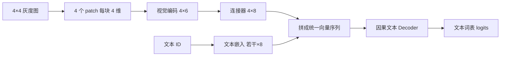

文本在 [P1](/principles/tokenization/) 中通过词表 ID 变成向量，图像则是一张数值数组。把图像附在对话请求中，并不会自动让文字 tokenizer 读懂像素：需要一个视觉输入通路，将局部图像编码成与文本隐藏维度兼容的向量，再定义它们怎样进入序列、位置和损失。

先修是 [P4](/principles/decoder/)、[P9](/principles/generation/) 和 [T5](/training/instruction-tuning/)。本章从 LLaVA 式“视觉编码器—连接器—文本 Decoder”开始，最后对照更复杂的 Qwen VL/3.5。CPU 实验完成真实数值的形状链与梯度链，不宣称随机权重具有图像理解能力。

## 像素到 patch：先定义数组与顺序

图像可存为 $I\in\mathbb R^{C_I\times H_I\times W_I}$，轴为通道、高、宽。$C_I=3$ 通常对应 RGB，也可能有灰度或其他模态；这些轴与文本批大小 $B$、时间 $T$ 不同。读入时的整数像素常在 0–255，视觉处理器会按固定缩放、均值与标准差处理，不能只因为形状相同就随意换归一化。

将图像切成边长 $P_I$ 的不重叠 patch，若高宽整除，则 patch 数：

$$
N_I=\frac{H_I}{P_I}\frac{W_I}{P_I},
\qquad d_{\mathrm{patch}}=C_IP_I^2.
$$

本章生成一张灰度 $4\times4$ 图，像素值按行从 0 到 15，再除以 15。patch 边长 2，按行扫描得到四块。第一块展平为 $(0,1,4,5)/15$，第二块为 $(2,3,6,7)/15$。不是先取图像前四个数；切块必须保留二维相邻关系。

| patch 编号 | 原图行范围 | 原图列范围 | 展平整数值 |
|---|---|---|---|
| 0 | 0–1 | 0–1 | 0,1,4,5 |
| 1 | 0–1 | 2–3 | 2,3,6,7 |
| 2 | 2–3 | 0–1 | 8,9,12,13 |
| 3 | 2–3 | 2–3 | 10,11,14,15 |

这个可复现图像没有外部版权和下载依赖，适合验证索引。真实模型的 resize、crop、padding、动态分辨率和视频时间切块由其 processor 决定，不一定满足本章整除假设。

## 视觉编码器：patch 不只是像素列表

最简教学投影把 $d_{\mathrm{patch}}=4$ 维向量变成 $d_{\mathrm{vision}}=6$ 维：

$$
h_r=W_{\mathrm{vision}}p_r+b_{\mathrm{vision}},
\qquad W_{\mathrm{vision}}\in\mathbb R^{6\times4}.
$$

真实视觉编码器通常还含位置编码和多层注意力，让一个 patch 的表示依赖其他 patch，并通过视觉预训练学到结构。CLIP、SigLIP 或视觉 Transformer 的名称表示不同训练和模块选择，不是“把矩阵宽度设成 6”就复现它们。

视觉编码器是否保留分类 token、取哪一层特征、是否拼接多层、是否合并相邻 patch，都会改变视觉 token 数与维度。连接器输入必须与实际输出一致，不能只根据原图 patch 数推断最终送入语言模型的长度。

## 连接器：进入文本隐藏空间

文本 Decoder 的隐藏宽度设为 $d=8$。用连接器（connector/projector）把视觉特征转成：

$$
z_r=W_{\mathrm{conn}}h_r+b_{\mathrm{conn}},
\qquad W_{\mathrm{conn}}\in\mathbb R^{8\times6}.
$$

它的输出与文本 embedding 在维度上相容；是否语义相容则需要训练。连接器可以是线性层、MLP、查询压缩器或更复杂的跨模态模块。此处只使用一层线性投影，目的是能直接手算形状和梯度，不把它当作完整生产架构。

按本章形状，两层的参数分别为：

$$
\begin{aligned}
N_{\mathrm{vision}}&=6\times4+6=30,\\
N_{\mathrm{conn}}&=8\times6+8=56.
\end{aligned}
$$

只冻结视觉编码器并训练连接器时，30 个参数不更新，56 个参数可更新；输入图像本身不需要是参数。冻结与取消整条计算图不同，须按实际训练配置设置。

图中词表输出仍预测文本 token，不是为每个像素输出类别。视觉特征直接作为输入向量，不一定拥有普通文字词表 ID。

## 占位展开：模板长度与实际序列长度不同

假设对话模板文本为 `USER, IMAGE, QUESTION, ASSISTANT, ANSWER, EOS`。`IMAGE` 是图像占位，不应简单当成一个可学习文本 token 而忽略实际图像。把它替换为四个视觉向量后，实际输入有九个位置：

| 位置 | 输入来源 | 向量维度 | 该输出预测的有效回复标签 |
|---|---|---:|---|
| 0 | USER 的文本 embedding | 8 | 屏蔽 |
| 1–4 | 四个视觉向量 | 8 | 屏蔽 |
| 5 | QUESTION 的文本 embedding | 8 | 屏蔽 |
| 6 | ASSISTANT 的文本 embedding | 8 | ANSWER |
| 7 | ANSWER 的文本 embedding | 8 | EOS |
| 8 | EOS 的文本 embedding | 8 | 无下一目标，屏蔽 |

标签错位依旧遵循 P2。有效回复 loss mask 应标记位置 6、7，不是把位置 7、8 的输入身份当成损失位置。多模态输入更容易因插入向量导致原文本标签整体错位，必须在展开后的序列上重新对齐。

<Figure src="advanced/multimodal-expand.svg" alt="4×4 图像切成四个 2×2 patch，经视觉编码器与连接器变成四个向量，替换对话模板中的 IMAGE 占位后形成九个位置">左上图的格内数字是像素下标，颜色标出所属 patch。四个视觉向量按 patch 顺序填入位置 1–4；之后的文本位置整体后移，损失遮罩只保留位置 6、7。</Figure>

生产处理器可能预先将一个图像占位展开为多个专用 token 再替换 embedding，也可能使用其他布局。无论表示方式怎样，都必须核对占位数量、视觉向量数量、batch 内图像归属和位置索引。一条请求中有两张图时，两组视觉特征不能串到另一请求。

## 位置：文本顺序与图像几何是两个层次

在基础 LLaVA 式教学结构中，视觉编码器首先保留二维 patch 位置，送入语言模型后这些特征再按一维序列位置参与 Decoder。图像内空间关系并不是由一串 ID 的大小产生，而由切块、视觉编码位置及特征形成。

更复杂的视觉语言模型可能使用多维 RoPE，为图像高宽或视频时间维分配位置分量。公开模型的 `mrope_section`、布局和部分旋转维度需要按实际实现解释；不能直接对九位置教学序列套普通一维公式，再声称与 Qwen VL 相同。

截至 2026-09-27，[Qwen3.5-0.8B 固定配置 2b48083](https://huggingface.co/Qwen/Qwen3.5-0.8B/blob/2b48083/config.json) 列有图像/视频特殊 ID、视觉 patch/merge 设置和多模态 RoPE 参数。[官方实现文档](https://huggingface.co/docs/transformers/main/en/model_doc/qwen3_5) 说明其原生多模态接口。此处使用它说明额外维度和 processor 契约，不将本章四 patch 线性编码视为等价实现。

## 训练阶段：向量相容与指令任务分别学习

LLaVA 的典型路线先使用图文对训练连接，再用视觉指令数据学习问答。不同版本可能冻结语言模型、视觉塔或训练更多参数，必须按报告版本区分。连接训练需要让视觉特征能影响正确文本概率，SFT 还需相同对话模板、assistant mask 和生成边界。[LLaVA 原论文](https://arxiv.org/abs/2304.08485)

本章目标是响应交叉熵：

$$
L=-\frac{1}{N_{\mathrm{valid}}}\sum_{i\in\mathcal I_{\mathrm{response}}}
\log P_\theta(y_i\mid\text{文本与视觉前缀}).
$$

视觉位置通常没有文字预测标签，但它们会通过注意力影响回复，因此连接器和视觉编码器仍可收到梯度。“视觉 logits 没有直接 loss”与“视觉模块无梯度”是不同命题。冻结哪些参数属于训练配置，不由 loss mask 自动决定。

如果任务要求生成图像，则输出空间、解码器和训练目标不同；本章只研究图像作为条件、文本作为输出的视觉语言模型。不要把输入视觉 token 与生成视觉 token 混为一谈。

## 生成与缓存：图像通常在 prefill 编码一次

请求先处理图像和文字，构造统一前缀，执行 prefill，再按 [P9](/principles/generation/) 逐 token 输出。因果 Decoder 各层的历史视觉位置也可以纳入 KV cache；后续 decode 通常无需每步重新运行视觉编码器，只需读取已有前缀状态。

因此图像多、分辨率高或切成很多 crop，会增加有效前缀长度、视觉编码时间和 KV 占用。原请求文字很短，不等于 prefill token 很少。服务报告需分别列图像预处理、视觉编码、文本 prefill 与输出时间；缓存键还应绑定图像内容、处理器配置和模型版本。

若复用视觉特征或多模态前缀，图像 identity、crop 顺序和模板必须相同。只拿相同文本 prompt hash 复用，会让不同图像错误共享状态。多请求 packing 的边界和取消释放也要覆盖视觉状态。

## 评估：图像理解不能只看形状

最小正确性检查包括：切块顺序、视觉向量数量、文本位置对齐、有效标签、梯度链、cached/full 一致。质量则需要看未见图像的描述、OCR、定位、视觉问答和依赖图像证据的任务。应加入“同一问题换图”的对照，判断模型是否只凭文字先验作答。

真实数据还应控制分辨率、crop、文字清晰度和答案评判协议。模型可能语言流畅却在视觉证据上出错；图像为空或换成不相关图片的消融能帮助识别这种情况。CPU 随机网络本章只检验数据契约，不报告准确率。

## CPU 核对：真实像素到文本损失

运行 `python code/advanced/multimodal.py`。seed=23、float64，生成上面的 $4\times4$ 图，检查第一块像素、四 patch 到 6 维、连接到 8 维、九位置序列，再用一个因果注意力参考和词表头计算回复损失。有效 logits 行是 6、7，被屏蔽行直接梯度为零，而视觉连接器梯度非零。

<CodeFile path="code/advanced/multimodal.py" />

它完整走通输入与监督的数值链，但视觉层为线性教学编码，语言层也只是单算子参考，不是预训练 LLaVA。下一步若训练完整视觉语言模型，应复用成熟视觉骨干和处理器，再按 T3/T5 的恢复与评估协议组织实验。

## 常见误区

图像占位不代表只有一个视觉位置。维度匹配不代表语义已经对齐。视觉位置无直接文本标签不代表视觉模块无梯度。文字 tokenizer、视觉 processor、模板与权重共同构成 checkpoint 的输入契约，遗漏任一项都会改变模型行为。

## 练习与核对

RGB 图 8×8，patch 边长 2，有几个 patch，每块几维？

共有 $(8/2)^2=16$ 块，每块 $3\times2^2=12$ 维。这是未进行视觉合并的输入 patch 数，不能直接推断真实模型最终视觉 token 数。

本章把四个视觉向量换成六个，其后文本的位置与 loss mask 怎么变？

序列总长从 9 变为 11，QUESTION/ASSISTANT/ANSWER/EOS 位置变为 7/8/9/10，有效预测行变为 8、9。必须同步调整位置、attention mask 和标签，不只扩充 embedding 矩阵。

冻结视觉塔但训练连接器，是否应该把连接器输出也 detach？

不应。冻结视觉塔可以使其特征作为固定输入，但连接器输出还需要将文本损失梯度传回连接器参数。detach 连接器输出会切断这条训练链。

这条路线从专家、缓存与训练目标走到递归、稀疏读取和视觉输入。继续研究新模型时，先问改变了哪条计算边、状态或监督，再沿 [T4](/training/evaluation/) 与 [S10](/systems/serving-evaluation/) 的协议核对质量和服务成本。

## 原始资料

- [Visual Instruction Tuning / LLaVA](https://arxiv.org/abs/2304.08485)：视觉连接与指令训练的基础结构。
- [Qwen2-VL](https://arxiv.org/abs/2409.12191)：动态视觉输入与多模态位置背景。
- [Qwen3.5 官方实现文档](https://huggingface.co/docs/transformers/main/en/model_doc/qwen3_5)、[固定配置](https://huggingface.co/Qwen/Qwen3.5-0.8B/blob/2b48083/config.json)：更复杂的生产输入契约，本文未声称复现其视觉理解能力。
