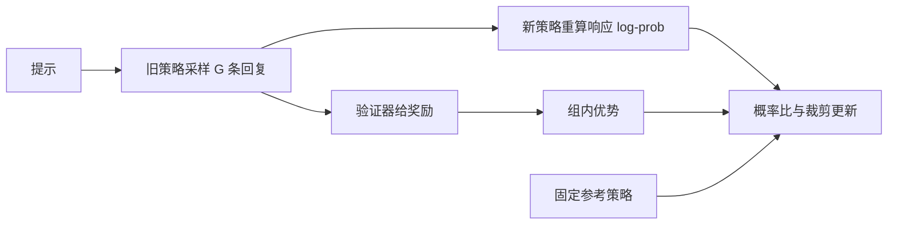

[T5](/training/instruction-tuning/) 学习示范，[A3](/advanced/dpo/) 学习成对偏好。有些任务能直接核对结果，例如算术答案、代码测试或形式化证明检查。能否采样多个回复，让得分更高的生成路径更容易出现？可验证奖励强化学习（reinforcement learning with verifiable rewards，RLVR）将这种验证信号接入策略更新。

先修是 [M1](/math/probability/)、[M2](/math/distributions/)、T5 和 A3；完整 LM 实验还用到 [P11](/principles/complete-transformer/)。本章从四候选有限策略走到奖励模型、PPO/GAE 与真实 LM 更新，最后解释 DeepSeek-R1。教学实验不称为在 CPU 上复现大型推理模型。

## 策略与轨迹：学习对象仍是下一 token 分布

提示为 $x$，模型策略为 $\pi_\theta$。一条轨迹就是从提示开始生成的完整回复 $y=(y_0,\ldots,y_{m-1})$，其中可含推理文本、最终答案和终止符。其概率仍是：

$$
\pi_\theta(y\mid x)=\prod_{t=0}^{m-1}\pi_\theta(y_t\mid x,y_{<t}).
$$

训练更新网络参数，采样得到的文本本身不是参数。所谓推理模型可以沿用原 Decoder 架构；变化可能来自数据、目标、提示模板和推理时的输出预算，不能根据名称就推断新增了一个“推理层”。

先给本章一个严格的小奖励：题目 $2+3$，输出必须完全匹配 `<answer>整数</answer>`，整数为 5 时奖励 1，否则 0。`5` 没有标签，格式不合格；正确标签后再加额外文字也不合格。这只是可审计的教学协议，生产数学任务需要更完整的等价答案处理。

四候选及奖励是：

| 回复 | 奖励 |
|---|---:|
| `<answer>5</answer>` | 1 |
| `<answer>4</answer>` | 0 |
| `5` | 0 |
| `<answer>5</answer>` | 1 |

两个相同文本仍可作为两次采样记录出现。它们是四条轨迹样本，不是四个不同词表 token。

## 期望奖励：不能直接对离散采样文本求导

固定提示的目标是 $J(\theta)=\mathbb E_{y\sim\pi_\theta}[r(x,y)]$。有限候选时可展开：

$$
J=\sum_y\pi_\theta(y\mid x)r(x,y).
$$

假设奖励来自固定验证器且不依赖参数，使用 $\nabla\pi=\pi\nabla\log\pi$：

$$
\nabla_\theta J
=\mathbb E_{y\sim\pi_\theta}\left[r(x,y)\nabla_\theta\log\pi_\theta(y\mid x)\right].
$$

奖励不必可微；梯度经过所采轨迹的 log-prob，验证器只给一个数。这是策略梯度（policy gradient）的基本恒等式。实际采样有限且轨迹长，估计方差可能很大。

对有限四类 logits $u$，概率 $p=s_{\mathrm{softmax}}(u)$，可直接算：

$$
\frac{\partial J}{\partial u_e}=p_e(r_e-J).
$$

均匀 $p_e=1/4$ 时，本章平均奖励 $J=1/2$，两个正确候选梯度为 $+1/8$，两个错误候选为 $-1/8$。做梯度上升会提高正确候选的相对分数。语言模型中完整候选空间极大，无法枚举，脚本用四类只是为了独立核对这条恒等式。

## Baseline：降低估计波动，不改变理想期望

对只依赖提示的常数基线 $b(x)$，有 $\mathbb E[\nabla\log\pi]=0$，所以可用 $r-b$ 替代 $r$，理想期望梯度不变。差值称为优势（advantage）：比基线更好的轨迹有正优势。

这条无偏说明要求 baseline 不依赖当前采样的动作。用包含当前样本的组内均值作 baseline 时，有有限组统计细节；不能直接把上述独立 baseline 证明照搬成所有 group-relative 变体的无偏性保证。GRPO 使用组内比较和标准化作为实际优化目标设计。

组大小 $G=4$，奖励 $(1,0,0,1)$，均值 $\overline r=0.5$。本章使用总体标准差约定（分母 $G$）：

$$
s_r=\sqrt{\frac1G\sum_{g=1}^G(r_g-\overline r)^2}=0.5,
\qquad A_g=\frac{r_g-\overline r}{s_r+\epsilon}.
$$

优势近似 $(1,-1,-1,1)$。如果所有奖励都为 1 或都为 0，方差为零，分子也为零，按本章约定优势为零。这样的组不提供区分信号；加一个 epsilon 避免 NaN，却不会凭空创造学习信息。

## GRPO：旧策略采样、概率比与裁剪

组相对策略优化（group relative policy optimization，GRPO）以同一提示的一组回复构造优势，减少对独立价值网络的依赖。令采样策略为 $\pi_{\mathrm{old}}$，新策略在同一轨迹位置的概率比：

$$
\rho_{g,t}(\theta)=
\frac{\pi_\theta(y_{g,t}\mid x,y_{g,<t})}
{\pi_{\mathrm{old}}(y_{g,t}\mid x,y_{g,<t})}.
$$

一个常见 token 级裁剪 surrogate 是：

$$
\min\left(\rho_{g,t}A_g,
\operatorname{clip}(\rho_{g,t},1-\epsilon_c,1+\epsilon_c)A_g\right).
$$

最大化它时，正优势样本的过大概率增长被限制，负优势样本的过大概率下降也被限制。`min` 的符号不能因 $A_g<0$ 就想当然反转；可代入数值核对。$\epsilon_c$ 是裁剪宽度，和优势分母 epsilon 是不同参数。

旧策略与参考策略也不同：旧策略用于采样与 importance ratio，可能在若干更新后刷新；参考策略用于限制整体漂移，通常固定。再加一个相对参考的 KL 惩罚，得到完整目标的一种常见形式。具体 GRPO 变体会改变 token/序列归约、长度权重和 KL 实现，应使用对应报告与代码的定义，不把任意 group loss 都称为同一 GRPO。

在首次更新前，新旧策略相同，所有比值都是 1，优势均值可能为零，所以 surrogate 数值为零；但梯度通常并非零，因为概率比的导数保留。损失当前值不能直接作为是否“有训练信号”的判断。

### 参考约束怎样计算？

对固定上下文，精确词表 KL 是 $D_{\mathrm{KL}}(\pi_\theta\Vert\pi_{\mathrm{ref}})=\sum_v\pi_\theta(v)\log[\pi_\theta(v)/\pi_{\mathrm{ref}}(v)]$。逐位置枚举完整词表可能增加成本，一种采样量使用所采 token 上的 $h=\log\pi_{\mathrm{ref}}-\log\pi_\theta$：

$$
\widehat D=e^h-h-1.
$$

由 $e^h\ge1+h$ 可见每项非负。若 token 真从当前策略采样且参考支持一致，取期望：$\mathbb E_{\pi_\theta}[e^h]=\sum_v\pi_{\mathrm{ref}}(v)=1$，所以 $\mathbb E[\widehat D]=D_{\mathrm{KL}}(\pi_\theta\Vert\pi_{\mathrm{ref}})$。这一计算解释数值量的期望，不自动等于所有采样/自动微分实现的梯度估计；对从旧策略得到的固定样本，分布已经不同，需要按所采用算法的概率比与估计约定处理。

在完整优化目标中，可对每个回复的有效 token 平均裁剪 surrogate 减 $\lambda_{\mathrm{KL}}\widehat D$，再对组和提示平均。这里 $\lambda_{\mathrm{KL}}$ 与 A3 的 DPO 系数不是同一超参数，裁剪与 KL 也不是重复约束：前者限制当前对旧采样策略的局部变化，后者控制相对固定参考的偏移。若采用每序列平均，长短回复在组内权重相同；若按全部 token 平均，长回复权重更大。这些归约差异可能改变训练行为，报告与代码须一起记录。

## RLHF 奖励模型：偏好怎样变成一个打分器

可验证任务能直接给规则奖励；开放回复通常只有人类或评判器的成对偏好。奖励模型 $r_\phi(x,y)$ 给回复一个标量，常用 Bradley–Terry 偏好模型：

$$
P(y^+\succ y^-\mid x)=s(r_\phi(x,y^+)-r_\phi(x,y^-)),\qquad
\ell_{\mathrm{RM}}=-\log s(r_\phi(x,y^+)-r_\phi(x,y^-)).
$$

令差值为 Δ，损失等于 `softplus(-Δ)`，对 Δ 的导数为 $s(\Delta)-1$。在 Δ=0 时为 −0.5，梯度下降提高偏好回复相对于拒绝回复的分数。给两者同时加同一常数不改变差值，所以偏好训练没有确定一个绝对奖励零点。

脚本最后用固定三维回复特征与线性打分器核对梯度方向。这个小打分器说明偏好损失的行为，不声称训练出语言理解奖励模型。真实模型需要处理完整上下文、响应长度、标注分布和泛化；策略还可能利用奖励模型的漏洞，因此固定的评分器也要独立评估。

典型 RLHF 流程是先 SFT，再训练偏好奖励模型，最后采样策略回复并优化奖励与参考约束。[A3 DPO](/advanced/dpo/) 从 KL 约束出发消去显式奖励拟合，直接训练偏好对；两者可以共享偏好数据，但执行流程不同。RLVR 则用规则验证器替代学习奖励，不代表也没有策略优化或参考控制。

## PPO 与 GAE：组内比较之外怎样估计优势

PPO 常同时训练策略和价值函数。策略决定动作 token，价值函数 $V(s_t)$ 估计从当前前缀出发的期望后续回报。奖励可能在最后答案处给出，也可能包含逐 token 的参考 KL 惩罚。参考模型用于约束漂移，旧策略用于采样与概率比，价值函数用于优势估计，三者角色不同。

对一个终止轨迹，时序差分误差为

$$
\delta_t=r_t+\gamma V(s_{t+1})-V(s_t),\qquad V(s_T)=0.
$$

广义优势估计（generalized advantage estimation，GAE）将之后的残差折扣相加：

$$
\widehat A_t=\sum_{k=0}^{T-t-1}(\gamma\lambda)^k\delta_{t+k}
=\delta_t+\gamma\lambda\widehat A_{t+1}.
$$

γ 是奖励折扣，λ 控制估计的偏差/方差权衡。λ=1、γ=1 时残差望远镜相消，优势等于未来奖励和减当前价值；λ=0 时只保留一阶 TD 残差。若轨迹只是被截断而非真正终止，末端价值通常需要 bootstrap，不能无条件写零。本脚本只接受真正终止的一条轨迹。

奖励为 `(0,0,1)`、价值为 `(0.2,0.3,0.4,0)`，TD 残差为 `(0.1,0.1,0.6)`。取 γ=λ=1，反向累加得到优势 `(0.8,0.7,0.6)`。脚本用该手算核对，避免把 terminal 与最后一个非终止前缀的价值混淆。

PPO 策略项也使用前文的裁剪 surrogate，但优势来自价值估计。另有价值回归损失，常以冻结的回报目标训练 V；还可能添加熵奖励。旧 log-prob、回报和优势在当前更新中停止梯度。GRPO 使用同一提示的回复组构造比较信号，避免这个独立价值网络；它不是把 PPO 的值函数变量换一个名字。

## 奖励工程：正确答案不自动代表过程可靠

若只奖励最终答案，模型可能通过猜测得到正分，也可能输出错误中间推理但碰巧答对。若验证器只用宽松 substring 找“5”，模型还可能通过堆列候选答案钻空子。需要先规定语义与格式，再对验证器做对抗样例检查；奖励分数高仅说明当前规则下高分。

代码测试还存在超时、测试覆盖和执行环境问题；数学字符串要处理分数、单位、等价表达与无法解析。无效格式、超长、未终止回复、验证器失败都应有明确结果，而不是静默跳过导致样本分布变化。长度奖励若设置不当，还可能鼓励无意义扩展。

本章的正则使用完整匹配，避免额外文字穿过简单规则。这不意味着它适合真实数学评测，只是小实验边界可核对。也没有将“展示一段推理文本”定义为真实正确推理的充分条件。

## R1、R1-Zero 与蒸馏：训练流程不能混同

[DeepSeek-R1 初版报告](https://arxiv.org/html/2501.12948v1) 的 R1-Zero 从基座策略直接探索 RL，R1 则结合冷启动示范、多阶段采样与训练。报告讨论了前者的可读性和语言混杂问题。这里将它们作为不同训练流程的案例，不把报告中的特定结果推广成“任何基座加规则奖励都能得到同样提升”。

蒸馏又是另一条路径：强教师生成回复，经过筛选后用于学生 SFT，学生最小化示范 NLL，而非一定在线优化可验证奖励。R1 的蒸馏学生与大教师的参数量和架构可以不同。使用教师推理样本不等于复制教师内部算法；学生表现仍要独立评测。

因此至少区分三个数据动作：在线采样当前策略并奖励、离线收集教师轨迹进行 SFT、离线收集偏好对进行 DPO。它们可以在多阶段流程中组合，但每阶段更新目标需要清楚。

## 推理预算：质量比较要固定采样成本

输出更长意味着更多 decode 步数和服务占用，不等于每一步都有效推理。比较推理模型时应固定或报告最大输出 token、温度、采样次数、超时、答案提取器和失败处理。一次样本准确率与多次采样择优的结果不是同一个指标；多样本 selection 还要计入验证器成本。

评估至少覆盖未参与训练的新题、不同题型、格式鲁棒性和基座通用能力。组内奖励提升可能只来自适应格式或记住题目。[T4](/training/evaluation/) 的污染检查与消融同样适用。真实服务再结合 [S10](/systems/serving-evaluation/) 的 TTFT、输出时间与有效吞吐，避免只报告任务得分而遗漏使用成本。

## 真实 LM 闭环：一 token 回复也必须经过模型

第二个实验使用 [P11](/principles/complete-transformer/) 的两层现代 Transformer，词表十六项，输入为 `[BOS,a,b]`，回复正确 token 为 `8+a+b`。训练四组输入 `(0,0)、(0,1)、(1,0)、(1,1)`，未见题四组为 `(0,2)、(2,0)、(1,2)、(2,1)`。回复仅一个 token，因此没有将未训练的文本解释器加入奖励规则。

每轮对四个提示各采样二十四个回复，总共九十六条轨迹。`torch.multinomial` 按旧策略完整词表分布采样，奖励来自 token 是否等于预定答案。采样阶段用 `no_grad` 保存旧 log-prob、奖励与组内优势；同一批轨迹随后执行两次当前策略更新。

重算当前响应 log-prob 后形成概率比与裁剪项；参考策略是初始化模型的冻结副本，整个实验不更新。本实验词表很小，直接枚举每个提示的完整分布 KL，因此不把旧策略样本上的无修正采样 KL 当成当前策略的精确期望。更新目标是负 surrogate 加 0.02 倍精确 KL，梯度有限检查与全局裁剪后执行 AdamW。

一 token 环境使前缀固定，KL 可以精确枚举；多 token 环境会出现旧策略访问的状态分布、不同响应长度与终止位置，不能把该实验的无 mask 写法直接套到真实长回复。扩展时需对每个实际响应 token 重算条件 log-prob，冻结旧概率与优势，明确 token/序列归约及 padding/EOS 规则。

实验运行二十四轮；未见题的精确期望奖励从约 0.060535 降至 0.018448。这个量通过完整词表的正确答案概率计算，不受抽样次数随机波动影响。训练题奖励另行输出，未见题始终不参与更新；代码不通过挑选种子或删除失败题把它包装成泛化提升。

该结果说明更新链真实工作，但四道题与稀疏奖励没有保证学会加法。训练集提高、参考漂移、未见题退化可能同时发生。应先按 [T4](/training/evaluation/) 保留逐题分布和更多独立数据，再研究 SFT 冷启动、训练题覆盖、奖励密度与 KL 系数，不能仅根据训练平均奖励选择结论。

## CPU 核对：奖励、组统计与精确梯度

运行 `python code/advanced/reasoning_rl.py`。前半核对格式奖励、总体标准差优势、零方差组、有限策略精确梯度与裁剪项；后半实际运行现代 LM 的 rollout/reward/update，断言模型权重改变、旧概率与优势停止梯度、参考权重不变、梯度有限。最后核对偏好打分器与终止 GAE。全程 CPU float64，独立报告训练与未见题结果。

<CodeFile path="code/advanced/reasoning_rl.py" />

## 常见误区

奖励器不需要可微，但生成策略需要可求导的 log-prob。组内均值 baseline 与价值网络不是同一个对象。R1 蒸馏的 SFT 与在线 RL 不应混称。采样更长、显示 `<think>` 标签或奖励更高，都不足以单独证明泛化推理能力提升。

## 练习与核对

四个奖励都为 1，增加 epsilon 后组内优势是多少？

仍全部为零，因为每个奖励减去均值为零。epsilon 只避免除零，不能把一个没有比较差异的组变成有用的优势样本。

正优势 1、概率比 1.4、裁剪区间 [0.8,1.2]，surrogate 是多少？负优势 -1 呢？

正优势取 $\min(1.4,1.2)=1.2$；负优势取 $\min(-1.4,-1.2)=-1.4$。错误回复的概率增大仍被惩罚，不能把两个符号都机械改为裁剪值。

教师给出正确回复，学生用交叉熵学习，这是 RLVR 吗？

该更新是监督学习或序列蒸馏。教师回复可能由 RL 训练出的模型生成，但数据来源不改变学生当前损失的性质。只有明确采样、奖励及策略更新的阶段才按其实际 RL 定义描述。

学习目标改变之后，序列计算本身还可以改变。[A6](/advanced/state-space/) 从一个标量递推开始，研究不保留所有历史 K/V 的模型。

## 原始资料

- [DeepSeekMath](https://arxiv.org/abs/2402.03300)：GRPO 的早期定义与数学训练背景。
- [DeepSeek-R1 初版报告](https://arxiv.org/html/2501.12948v1)：R1-Zero、R1 多阶段与蒸馏流程。本文不复述其排行榜结果，教学奖励是本章自定义协议。
- [PPO](https://arxiv.org/abs/1707.06347)、[GAE](https://arxiv.org/abs/1506.02438)、[InstructGPT](https://arxiv.org/abs/2203.02155)：裁剪策略更新、价值优势估计与偏好奖励模型流程。
