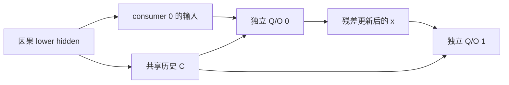

GQA 让同一层的多个查询头共享 K/V；常规 decoder 的不同层仍各有一份历史。现在再改变共享范围：由下层因果模型建立全局历史，多个上层 consumer 只生成自己的查询并读取同一份状态。本章要解释共享的是哪份张量，以及为什么共享历史并不让所有层产生相同输出。

[YOCO 原论文](https://arxiv.org/abs/2405.05254) 研究 self-decoder 建立全局 KV、cross-decoder 复用的 decoder–decoder 结构。下面的参考进一步让同一 latent 同时充当 K 和 V，用小算子检查位置与共享；它没有复刻完整 YOCO 的 lower mixer、训练配置或 prefill 调度。

## 从因果下层建立共享历史

设 lower stack 对 token IDs 输出 $H\in\mathbb R^{B\times T\times D}$。它必须是因果的：历史位置 j 不能因后来追加 token 而改变。再将 H 投影成共享张量 $C\in\mathbb R^{B\times1\times T\times D_h}$，以后多个 consumer 使用 C，不各自重新投影一份历史 K/V。

这里不是 [经典 encoder–decoder](/principles/encoder-cross-attention/) 的完整源文本：所有位置属于同一条待生成时间线，因此上层在位置 i 只能读取 $j\le i$。函数名含 cross 并不决定 mask；要看条件序列是否已经全部给定。

本参考令共享 K=V=C。真实架构可以分别产生 K/V；跨层共享与 K/V 参数绑定是两种不同选择，不能将本例额外节省的张量数量归功于跨层共享本身。

图中的共享 C 没有随 consumer 复制；两次读取的查询输入和投影分别确定。残差通道的更新与历史张量的共享是两种职责。

## 一个查询：同一份历史怎样得到不同读取

取单头标量例，$B=1,T=3,D=D_h=1$，共享历史为 $C=[1,2,3]$。输出投影取单位矩阵。位置 1 的第一 consumer 查询 q=2，只能读历史值 1、2，分数为 `(2,4)`。头宽为 1，缩放因子也是 1，所以

$$
\alpha=(1/(1+e^2),e^2/(1+e^2))
\approx(0.119203,0.880797),
\qquad y=1\alpha_0+2\alpha_1\approx1.880797.
$$

第二 consumer 若有不同的 Q 投影，令同位置 q=−2，则分数为 `(−2,−4)`，权重顺序反过来，输出约为 1.119203。两 consumer 读取完全相同的 C，输出仍由各自查询与投影决定。

若 consumer 还把读取结果加回自己的隐藏状态，下一层的查询输入又会改变；共享 K/V 没有让上层残差状态共享。参考运行中的两个 consumer 各有独立 Q/O，并按顺序更新当前 x。

## 多头和位置偏移：共享不改变查询身份

一般 consumer 的 Q 投影将输入 $(B,T_q,D)$ 映到 $(B,H_q,T_q,D_h)$。共享 C 头轴为 1，可以展开为 $H_q$ 个只读 view；这些 view 引用同一底层存储，而非新增 $H_q$ 份缓存。

本次查询绝对起点为 P，局部行 r 的位置为 $P+r$；历史键位置为 j，允许关系为

$$
\operatorname{visible}(r,j)\iff j\le P+r.
$$

若已有两项历史，新块有一行查询，其位置为 2，读取键 0、1、2。若只对 $(1,3)$ mask 左上角 `tril()`，就只读键 0。共享 K/V 的身份正确也救不回错误位置偏移。

<CodeFile path="src/llms_from_scratch/chapters/ch24_shared_kv.py" symbol="read_shared_kv" />

该函数没有额外为上层 Q/K 应用 RoPE：它直接使用已经定义好的 lower 表示和 consumer 投影。不能将主线 RoPE 模型的“旋转后 K 缓存”契约自动搬到这个 latent 接口；若加入上层旋转，必须另行定义双方的频率和位置处理。

## 状态账：一份共享历史与各层私有状态

本参考共享张量的元素数为 $BTD_h$，consumer 数为 L 时，物理复制 L 份会占 $LBTD_h$。运行例 $B=1,T=6,D_h=8,L=2$，共享为 48 个元素，复制两份为 96。K/V 在这里是同一张量，只计一次。

若真实方案分别共享 K/V，一般账为 $BTH_{\mathrm{kv}}(D_k+D_v)$，不是 $BTD_h$。还要计入 lower stack 自己的缓存，以及每个 upper consumer 的私有局部状态；“全局 KV 只建一次”不等于整个模型只有这一份缓存。

训练时多个 consumer 对共享 C 的梯度汇合，再经共享投影回到 lower stack，和重复引用同一参数的梯度规则一致。把 C 复制成与计算图断开的副本会截断这条路径；“张量数值相同”不等于“共享梯度正确”。

## 运行：同定义的整段与分块读取

运行 `uv run llms-from-scratch chapter --chapter 24`。实验用统一 `Transformer` 的因果 encoder 模式建立 `(1,6,32)` lower hidden，投影为 `(1,1,6,8)` 共享 C，再让两个独立 consumer 读取。每个 consumer 都比较整段和按绝对位置逐行读取的输出，并检查共享投影、lower embedding 的梯度。

<CodeFile path="src/llms_from_scratch/chapters/ch24_shared_kv.py" symbol="run" run="uv run llms-from-scratch chapter --chapter 24" />

这验证上层共享读取的定义与位置一致性；lower hidden 在该实验中预先整段建立，没有测量整个 lower stack 的增量执行、生产显存或延迟。它也没有实现各层局部窗口、分层压缩索引或 prefill 跳过上层的执行策略。这些策略是否成立，要根据具体模型另作计算图与运行期核对。

## 练习与核对

标量例查询仍为 q=2，改成位置 0。输出是多少？

只有键 0 合法，softmax 权重为 1，输出为 1。共享历史数组虽然有三项，位置 0 仍不能读后两项；如果结果随 C 的第三项改变，就泄漏了未来。

B=2、T=5、D_h=4、三个 consumer，共享 K=V 一个 latent。共享与物理复制各多少元素？

一份共享 latent 为 $2\times5\times4=40$，三份复制为 120。若 K/V 其实是两个独立张量，应各自计账，不能继续沿用 40。

把 lower stack 改成双向 encoder，能否直接按主线缓存规则冻结旧 C？

不能。追加新 token 可能改变所有旧 lower hidden，旧 C 随之改变。上层虽仍有因果 mask，缓存里却保存了另一份 lower 计算；必须保留 lower 的因果条件，或重新定义允许重算的执行协议。

