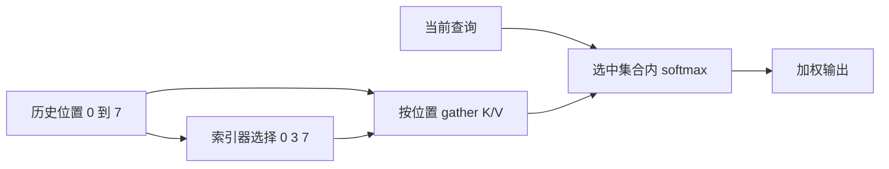

全注意力为每个查询访问所有可见历史。[A4](/advanced/long-context/) 固定窗口删去远处位置，若有用证据可能在任意位置，就可以先挑出少量候选，再对它们执行注意力。稀疏注意力（sparse attention）的核心不仅是少算分数，还包括“谁来挑、漏掉什么、挑选本身花多少成本”。

先修为 [P3](/principles/attention/)、[P10](/principles/kv-cache/)、[A2](/advanced/mla/) 和 [S3](/systems/flash-attention/)。本章先固定选择集合，明确等价边界，再引入内容相关索引器。教学选择三位置不代表公开模型使用同一数量。

## 固定选择：softmax 的分母也随集合改变

查询位置 $i$ 的可读集合为 $\mathcal S_i\subseteq\{0,\ldots,i\}$。定义：

$$
a_{ij}=\frac{\exp(s_{ij})}{\sum_{r\in\mathcal S_i}\exp(s_{ir})},
\quad j\in\mathcal S_i,
\qquad y_i=\sum_{j\in\mathcal S_i}a_{ij}v_j.
$$

分数仍可采用 $s_{ij}=q_i^\top k_j/\sqrt{d_h}$ 加位置规则。未选位置权重为零。只计算三个候选再 softmax，与计算完整分数后把未选项设成 $-\infty$ 再 softmax 等价；与完整 softmax 后把部分权重删除但不重归一化不同。

取八历史位置，集合 $\{0,3,7\}$，这三个分数分别为 $\ln1,\ln2,\ln4$，标量值分别为 0、30、70。选中权重为 $1/7,2/7,4/7$，输出：

$$
y=\frac{1\times0+2\times30+4\times70}{7}
=\frac{340}{7}\approx48.571429.
$$

若完整注意力的另外五个位置也有概率质量，完整输出一般不是这个数。稀疏化改变模型算子或其近似，不是单纯换存储布局。

<Figure src="advanced/sparse-selection.svg" alt="稠密因果读取全部历史，滑动窗口只读最近三个位置，内容选择每行读三个按分数挑出的位置">三张 8×8 矩阵的行是查询、列是键，右上的浅色格是未来位置。滑动窗口的选择只由位置决定；内容选择的集合每行不同，需要额外的索引器打分与 gather。最后一行 {0, 3, 7} 即上面的算例。</Figure>

## Gather：选择必须对应唯一的逻辑位置

将历史 K/V 按索引收集成小矩阵，形状从 $(T,d_h)$ 变为 $(k_s,d_h)$，$k_s=|\mathcal S_i|$。查询与 gathered K 乘法，再读取对应 gathered V。一次查询的注意力主体约从 $O(Td_h)$ 变成 $O(k_sd_h)$。

索引应无重复、非空且在当前可见历史内。如果列表包含同一位置两次，它的指数质量被计入两次，相当于额外改变先验权重。不是“重复也没关系，因为最后 softmax”。按逻辑位置的稳定顺序通常便于调试，但只要 K/V 同步排列，数学输出不要求选择结果天然有序。

gather 可能是不连续读，理论字节减少后仍可能损失访存效率。后端会按块、头或批次组织稀疏读取；粒度大可能多读一些无用位置，却换来更规则的执行。模型选择粒度和 kernel tile 粒度必须区分。

## 内容索引器：低成本评分不是主注意力分数

最简单的教学 indexer 用低维投影：$u_i=W_{IQ}x_i\in\mathbb R^{d_I}$，$z_j=W_{IK}x_j\in\mathbb R^{d_I}$，然后 $I_{ij}=u_i^\top z_j$，选最高的 $k_s$ 个历史索引。主注意力仍用它自己的 Q/K/V 和分数，indexer 只决定读取集合。

若 $d_I\ll d_h$ 或主注意力有很多头，先用便宜 indexer 扫历史再做昂贵注意力可能有收益。但 indexer 若为每个查询扫描全部 $T$ 个位置，整个 prefill 仍可能包含 $O(T^2d_I)$ 的评分；只是常数和昂贵部分的候选数降低。不能仅因主注意力选固定 $k_s$ 就宣布整个模型严格线性。

一个学习型 indexer 可以从主注意力分布获取监督，或有独立任务目标；top-k 的离散索引本身不提供普通连续导数。若只把索引插进网络、不定义 indexer 学习信号，就还没有完整训练方案。

## 选择误差：遗漏的概率质量说明什么

固定 full attention 的权重，遗漏质量为 $\delta=\sum_{j\notin\mathcal S_i}a_{ij}$。保留集合内重新归一化之后，若 $\|v_j\|_2\le M$，可以把完整输出写成 $(1-\delta)y_{\mathrm{selected}}+\delta y_{\mathrm{omitted}}$，因此：

$$
\|y_{\mathrm{full}}-y_{\mathrm{selected}}\|_2
=\delta\|y_{\mathrm{omitted}}-y_{\mathrm{selected}}\|_2
\le2M\delta.
$$

这只是同一层、固定值与分数的一个边界。它不能保证后续多层误差或任务准确率，因为后续状态可能改变，indexer 也可能逐层作不同选择。实际模型可以继续训练适应稀疏规则；训练后不应再拿某个旧稠密层的遗漏质量当完整质量证明。

高分位置未必总是事实证据：重复 token、格式标记和位置模式也会吸收注意力。检查选择分布时要结合具体任务、长距证据和消融，不把“画出高 attention 的词”当因果解释。

## DSA 与 MLA：少读位置和压缩状态是两件事

DeepSeek Sparse Attention（DSA）在 MLA 主干上加入索引器，先挑 token 再执行主注意力。[DeepSeek-V3.2 初版报告](https://arxiv.org/html/2512.02556v1#S2) 区分索引器预热与稀疏继续训练，并给出训练选择 2048 个 K/V token 的具体案例。这里保留架构和训练角色，不复用其性能宣传作为本机实测。

MLA 决定每位置保留潜变量和位置键；DSA 决定查询读取哪些位置。缓存仍可覆盖全历史，因为未来查询可能选择此前没选中的位置。当前一步的选择不构成“以后永不再读”的证明，不能据此随意释放所有未命中状态。

indexer 也可能需要自己的历史键状态，它应加入容量账。普通双份 KV、MLA 潜变量、indexer 缓存、选中索引和临时工作区是不同项。生产后端还可能将它们分页或量化，字节要按实际类型逐项计算。

## 与 MoE、窗口、FlashAttention 的区别

| 技术 | 稀疏或改变的对象 | 是否保留原 dense softmax 算子 |
|---|---|---|
| MoE | FFN 专家 | 注意力本身可以完全不变 |
| 固定窗口 | 历史位置范围 | 相对 full attention 改变 |
| 内容稀疏注意力 | 查询相关候选位置 | 相对 full attention 改变 |
| MLA 吸收实现 | K/V 参数化与执行 | 同一 MLA 算子可等价 |
| FlashAttention | IO 与计算组织 | 同 mask 下保留 |

FlashAttention 可以用于执行一个已经定义好的稀疏块，但它自身的经典目标是精确计算同一注意力，减少显式矩阵和 IO。不能把它归入“删除低权重 token”的模型近似。MoE 的 expert top-k 和 DSA 的 token top-k 也不是同一维度，两者可同时存在。

## 系统成本：不要遗漏选取与不规则读取

对单次 decode，把总时间至少分成 indexer 投影、历史评分、top-k、索引处理、gather、主注意力和输出投影。真实速度取决于 GPU、精度、批大小、长度和选取数。长序列上省掉昂贵多头历史读取可能明显，但短序列上 top-k 固定开销也可能主导。

容量与本步流量不同：保留十万位置状态，本步只读其中两千，不代表缓存只存两千。还要考虑 indexer 为选择而扫描的数据。多卡分片后，候选是否跨设备、如何 gather 和汇总也会改变通信账，[S9](/systems/cluster/) 的 collective 语义应按实际分片使用。

## 实验设计：相同选择核对，选择变化评估

第一层检查是固定索引，对比 gathered 与 dense+mask 输出，确认实现没有错误。第二层让 indexer 变化，观察不同选择的输出；这不是期望等价，而是定义模型变化。第三层才在固定任务上测量稀疏训练模型的 NLL、答案准确率、证据距离、速度和容量。

受控实验可以在相同模型权重上先用 oracle 选择、固定窗口、随机选择和 learned indexer 对比，再区分继续训练带来的收益。报告应说明是否在相同 token 预算、长度分布与 kernel 后端上比较，避免同时改模型、训练和硬件后只把差异归因于稀疏选择。

## CPU 核对：固定索引的精确参考

运行 `python code/advanced/sparse_attention.py`。seed=19、float64，八历史位置、查询/键维 4、值维 3，集合 `{0,3,7}`。脚本比较 gathered attention 与 dense+相同 mask，断言它通常不同于未稀疏化输出，再演示一个二维教学 indexer，并拒绝重复索引。

<CodeFile path="code/advanced/sparse_attention.py" />

脚本没有实现 DSA 的完整训练或 GPU 稀疏 kernel，验证的是其前置算子协议。主公式、索引边界和相同选择下的参考全部能在 CPU 独立核对。

## 常见误区

固定选中数不自动消除 indexer 的二次 prefill 评分。未被当前查询读取的位置不代表未来可释放。相同选择的 gathered/dense 等价不代表稀疏/dense 全模型等价。选择分布好看也不替代质量和性能测量。

## 练习与核对

选中位置 3 出现两次，softmax 会自动去重吗？

不会。两份相同分数各占一份指数质量，位置 3 的总权重相对其他位置增加。索引应显式无重复，或另行定义重复的模型意义。

全模型有十万位置，主注意力选两千，为什么还可能需要十万份状态？

未来查询的候选不同，此前未选位置仍可能有用。只有模型可见规则证明其永久不可见时才可释放。indexer 也常需读取全历史的低维键来决定新集合。

遗漏质量为 0.01、值范数上界 5，单层输出差上界是多少？

按本章固定分数条件的界为 $2\times5\times0.01=0.1$。这是向量范数界，不是任务错误率，也不是所有层累计误差的保证。

到这里改变了历史的读取方式。[A9](/advanced/multimodal/) 将回到模型输入，看看图像如何变成可被文本 Decoder 读取的向量序列。

## 原始资料

- [DeepSeek-V3.2](https://arxiv.org/html/2512.02556v1)：DSA、indexer 与继续训练。读取日期 2026-09-27，数值案例使用本章独立尺寸。
- [DeepSeek-V3](https://arxiv.org/html/2412.19437v2#S2.SS1.SSS1)：MLA 主干的状态定义。
- [FlashAttention](https://arxiv.org/abs/2205.14135)：精确注意力的 IO 优化，区别于改变选择集合。
