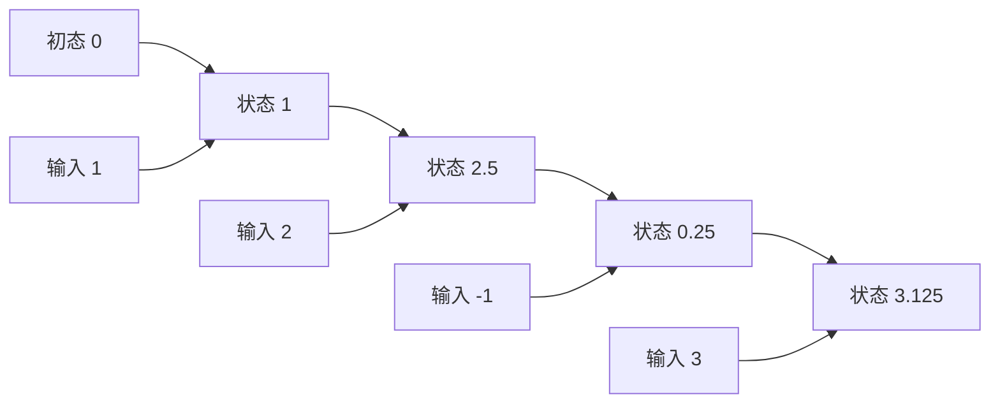

注意力缓存保留每个历史位置，是因为新查询能重新选择各位置。如果每一步把过去压进固定状态，下一步只读取这个状态，存储就可以不随序列长度增长。代价是旧信息经过递推汇总，之后不能总像 softmax attention 那样重新逐位置分配权重。状态空间模型（state space model，SSM）从这种递推结构出发。

先修是 [P2](/principles/language-modeling/)、[P4](/principles/decoder/) 和 [M3](/math/linear-algebra/)。我们先用离散递推建立完整计算，不要求读者已经学过连续时间微分方程。Mamba 名称在算子定义之后出现。

## 一个标量：四步怎样压成最后一个数

输入依次为 $u_0=1,u_1=2,u_2=-1,u_3=3$。状态初始为 $s_{-1}=0$，递推：

$$
s_t=0.5s_{t-1}+u_t,\qquad y_t=s_t.
$$

逐步计算：$s_0=1$，$s_1=2.5$，$s_2=0.25$，$s_3=3.125$。推理每步只保留一个 $s$，不需要保存四个输入。但最终状态 3.125 不足以唯一恢复四条输入；例如改变早期输入并在后来补偿，也可以得到同一状态。

展开最后一步：

$$
s_3=0.5^3u_0+0.5^2u_1+0.5u_2+u_3.
$$

一般为 $s_t=\sum_{j=0}^{t}a^{t-j}u_j$，$a=0.5$。时间越早，权重按几何衰减。若 $|a|>1$，旧状态影响可能放大，数值与梯度不稳定；若 $a=0$，状态只保留当前输入。递推参数因此直接影响记忆模式。

<Figure src="advanced/ssm-decay.svg" alt="a 为 0.5 时早期输入的权重迅速衰减到接近零，a 为 0.9 时八步前的输入仍有约一半权重">每根柱子是 s7 展开式中输入 uj 的系数。左右两组输入相同、只换 a：a 越接近 1，状态记得越久，但也越难忘掉无关内容。</Figure>

每条状态箭头都乘 0.5，每条输入箭头都相加。图没有一条从最终状态直接指回全部原始输入的读取边，这正是它与保留 KV 的结构差异。

## 矩阵递推：状态可以有多个记忆方向

把状态扩为 $s_t\in\mathbb R^{d_s}$，输入 $u_t\in\mathbb R^{d_u}$，输出 $y_t\in\mathbb R^{d_y}$：

$$
s_t=As_{t-1}+Bu_t,\qquad y_t=Cs_t+Eu_t.
$$

$A\in\mathbb R^{d_s\times d_s}$ 控制状态传播，$B\in\mathbb R^{d_s\times d_u}$ 将输入写入状态，$C\in\mathbb R^{d_y\times d_s}$ 读取状态，$E\in\mathbb R^{d_y\times d_u}$ 是直接输入分支。本节的 $B$ 是状态模型的输入矩阵，不是批大小；实际容量公式将批大小写为 $B_{\mathrm{batch}}$，局部同名不能省略说明。

初态为零时：

$$
s_t=\sum_{j=0}^{t}A^{t-j}Bu_j,
\qquad y_t=\sum_{j=0}^{t}CA^{t-j}Bu_j+Eu_t.
$$

固定 $A,B,C$ 的系数只依赖时间差。这是一种因果卷积结构；可以逐步递推，也可以用展开的核计算整段输出。把两条路径比较，只能证明同一个线性状态算子的实现等价，不是与 Transformer 注意力等价。

若 $A$ 是对角矩阵，各状态方向具有不同衰减率。多个时间尺度可以同时保留短距和长距信息；但信息仍进入有限维状态，不能由“有很多尺度”推出任意记忆检索能力。

## 选择性：让输入决定保留与写入

固定系数意味着所有 token 按相同规则写入。希望读到标记时加强保留、遇到无关内容时减少写入，可以让系数依赖当前输入：

$$
s_t=A_t(u_t)s_{t-1}+b_t(u_t),
\qquad y_t=C_t(u_t)s_t.
$$

例如标量保持系数 $a_t=s(w_a^\top u_t)$，写入向量 $b_t=W_bu_t$。此时 $s_t$ 对旧状态仍是仿射变换，但整个输入到输出映射一般非线性，因为系数由输入产生。

固定卷积核不再适用：历史输入 $u_j$ 的影响包含从 $j+1$ 到 $t$ 的输入相关传播矩阵乘积。选择性不是任意删除梯度或人工挑选历史 token，而是网络学习每步状态更新的参数。

[Mamba](https://arxiv.org/abs/2312.00752) 用输入相关的选择机制与硬件执行设计发展这个方向。完整模块还包含投影、局部卷积、门控和残差等组成，不应把本章一行递推说成完整 Mamba 实现。教学模型只负责暴露状态更新原则。

## 并行训练：递推不等于训练必须串行

对每步仿射变换 $f_t(s)=A_ts+b_t$，两步组合仍是仿射：

$$
f_r\circ f_l(s)=A_rA_ls+(A_rb_l+b_r).
$$

因此可将一对 $(A,b)$ 定义为更新摘要，组合规则为：

$$
(A_l,b_l)\star(A_r,b_r)
=(A_rA_l,\;A_rb_l+b_r).
$$

顺序是先左后右。组合满足结合律，因为函数复合与矩阵乘法结合；一般不交换，时间顺序不能倒转。若每步系数可从整段输入预先生成，就可以通过前缀扫描（prefix scan）并行计算每个前缀的摘要，再应用初态。

取三步，左结合得到 $A_2A_1A_0$ 与 $A_2A_1b_0+A_2b_1+b_2$；右结合也一样。这解释并行组织的依据，而非要求手写一个新的扫描框架。实际高效扫描依赖 $A$ 的结构；若每步是任意大稠密矩阵，摘要乘法成本可能非常高，结合律不自动带来速度优势。

如果 $A_t,b_t$ 依赖前一步隐藏状态而非可预先得到的当前输入，这种简单扫描不能直接使用。要区分可扫描的仿射状态模型与任意非线性 RNN。

## Mamba-2：结构化状态空间与双重计算形式

[Mamba-2 的原论文](https://arxiv.org/abs/2405.21060) 研究结构化状态空间对偶（structured state space duality，SSD），把受约束的状态递推与矩阵形式连接起来，组织分块计算。这里的“对偶”涉及特定结构，不是断言所有 SSM 与标准 softmax attention 相同。

可以先从标量衰减版本看到结构：展开的权重矩阵是下三角，元素含连续区间传播系数的乘积。块内可用矩阵运算，跨块用紧凑状态传递。同一模型可以在 prefill/训练采用并行块算法，decode 时逐步递推，计算路径不同但目标算子一致。

选择性参数、状态维度、head 分组和局部卷积都影响缓存类型。比较某个具体 Mamba-2 checkpoint 时，先列其递归状态与卷积状态，再列精度；不能简单拿一个标量递推的常量字节数描述实际模型。

## 状态容量：序列常量不等于模型常量

若每层有 $n_s$ 个状态通道，每通道状态维 $d_s$，批大小 $B_{\mathrm{batch}}$、层数 $n_{\mathrm{layers}}$，相同精度下递归缓存为：

$$
B_{\mathrm{batch}}\,n_{\mathrm{layers}}\,n_s d_s b_{\mathrm{elem}}.
$$

它不含 $T_{\mathrm{past}}$，但会随模型、批大小和精度增加。局部卷积若保留 $k_c-1$ 个历史输入，也需另外计入。权重和临时激活同样没有消失；训练反向传播的显存需求不能由 decode 状态公式直接推出。

一维 float64 教学递推状态仅 8 字节。保留四步输入则是 32 字节，但这个比较只展示状态形式，CPU Python 循环的对象开销远大于上述纯元素字节。不要用它报告真实引擎显存或吞吐。

## 连续时间：有微积分先修的回读

若读过 [M4](/math/calculus/) 的微分方程说明，可将连续系统写成 $\frac{ds(t)}{dt}=A_cs(t)+B_cu(t)$。一个时间间隔 $\Delta$ 上输入保持常量时，离散状态传播矩阵是 $\overline A=\exp(\Delta A_c)$，输入项是 $\int_0^\Delta\exp((\Delta-v)A_c)B_c\,dv$ 乘输入。

标量 $A_c=a_c\ne0$ 时，输入系数为 $b_c(e^{\Delta a_c}-1)/a_c$，$a_c=0$ 时极限为 $\Delta b_c$。这些关系说明离散系数可以来自时间尺度参数化，而不是所有离散状态模型都必须从连续物理系统构造。主线的递推、展开和扫描并不依赖这一节。

## CPU 核对：循环、展开与组合

运行 `python code/advanced/state_space.py`。第一组输入核对 $[1,2.5,0.25,3.125]$，第二组二维仿射更新比较串行与组合结果，第三组检查结合律。使用 float64、固定 seed=13，不引入真实 Mamba 的 GPU kernel。

<CodeFile path="code/advanced/state_space.py" />

这些检查建立完整离散状态算子的闭环：输入、状态、输出和两种执行均有定义。进一步训练语言模型时，仍需 embedding、残差、输出头和 P2 的下一 token 目标，改变序列算子并不会取消这些模块。

## 常见误区

常量历史状态是相对序列长度说的，不代表状态可以无限精确保留任意输入。可结合扫描保留时间顺序，不能交换更新。展开矩阵形式不是自动等于 softmax attention。连续时间解释是可选参数化背景，离散递推无需提前掌握全部微分方程。

## 练习与核对

本章标量递推再输入 0，状态是多少？

$0.5\times3.125=1.5625$。没有新信息时状态仍衰减，最终旧输入影响会逐渐减小。这由具体 $a$ 决定，不是所有递归模型都同样遗忘。

两步分别为 $s\mapsto2s+1$ 与 $s\mapsto3s+4$，交换顺序会相等吗？

先第一步再第二步得到 $6s+7$，反过来得到 $6s+9$。因此更新组合可结合但不交换，扫描不能打乱序列。

状态矩阵只依赖当前输入时能预先生成，若依赖上一状态会怎样？

上一状态尚需计算，因此各步更新摘要不再是预先已知的一组仿射变换，不能直接应用本章简单并行扫描。仍可串行计算，或需要新的结构与算法论证。

[A7](/advanced/hybrid-attention/) 将把有限矩阵状态与显式注意力层放在同一个网络，继续检查逐层状态类型。

## 原始资料

- [Mamba](https://arxiv.org/abs/2312.00752)：选择性状态模型与执行设计。
- [Mamba-2 / SSD](https://arxiv.org/abs/2405.21060)：结构化状态空间对偶和分块算法。本章离散例子独立给定，不宣称复现论文模型或性能。
