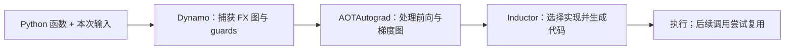

import FrameworkCompileLab from '../../../components/labs/FrameworkCompileLab'

在 [F4 自动微分](/frameworks/autograd/) 中，PyTorch 边运行前向计算边记录求导关系；[F6 数据与训练](/frameworks/data-and-training/) 把它放进重复执行的训练循环。若同一段张量运算会执行很多次，框架能否先分析这段计算，再复用分析结果？本章用一个输入向量和一个函数回答：编译**保存什么**、**何时不能复用**、**怎样判断值不值**。

## 从 eager 开始：明确要保持的结果

用三个数构成向量 $x=(-2,0,2)$，逐元素计算

$$
y_i=x_i^2+3x_i,\qquad L=\sum_i y_i.
$$

因此 $y=(-2,0,10)$，$L=8$；[M9 反向传播](/math/backprop/) 的链式法则给出 $\partial L/\partial x_i=2x_i+3$，梯度为 $(-1,3,7)$。这是本章所有编译实验的独立参照，不能用“编译结果等于编译结果”验证正确性。

```python
import torch

def polynomial(x):
    return x * x + 3 * x

x = torch.tensor([-2., 0., 2.], dtype=torch.float64, requires_grad=True)
result = polynomial(x)          # eager：按 Python 执行路径逐个调用张量算子
result.sum().backward()
```

这里的 eager 指即时执行：Python 调到乘法、加法时，PyTorch 分别派发算子，并为反向传播建立所需关系。调用 `torch.compile(polynomial)` 会返回另一个可调用对象；通常遇到实际输入的首次调用才捕获与编译。新对象应实现同一函数的可见计算，**不是**把首次输入的 $(-2,0,2)$ 和答案写死。脚本用 `backend="aot_eager"` 检查上述输出与梯度；这个后端让求导图经过编译管线，但不生成 Inductor 优化代码。

为什么可能加速？eager 中多个张量算子各有派发与中间结果；默认后端可能把可兼容的逐元素工作合并，减少派发和中间张量读写。以 `x*x + 3*x` 为例，单独执行时乘法的结果可能分别写到中间张量，再被加法读取；融合实现有机会在一次遍历中计算一个输出。但实际内存流量、算子数和速度取决于设备、输入大小及生成代码，不能从 Python 中的三个运算符直接推断。

## 一次调用：从 Python 到可执行计算



图中的箭头是默认编译路径的职责顺序，不是“一层对应一次 GPU kernel”。[PyTorch 编译器概览](https://docs.pytorch.org/docs/2.14/user_guide/torch_compiler/torch.compiler.html) 介绍这些组件；自定义 backend 可以改变后半段。

1. **TorchDynamo 捕获计算。** 它在 Python 执行过程中识别可追踪的张量操作，生成 FX 图。对本例，图记录乘法与加法的依赖，输入数值仍留到运行时提供。FX 是运算关系的表示，不是设备机器码。
2. **AOTAutograd 处理梯度。** 若需要求导，它把相关前向和反向运算交给编译路径处理。本例的反向仍须给出 $2x+3$；`backward()` 仍向 `.grad` 累积，`optimizer.step()` 仍是另外的更新动作。“Ahead of time”是相对这段图后续运行而言，不表示安装软件时已离线编译了整个训练程序。
3. **TorchInductor 生成执行方案。** 默认 backend 可进一步降低运算、选择融合并生成 CPU 或 GPU 实现，也可能调用已有库。生成的一张图不必是一枚 kernel；矩阵乘、归约与逐元素计算的实现边界可能不同。

为了单独观察捕获，脚本还定义一个计数 backend：每收到一张 FX 图就计数，执行时返回该图的 `forward`。它**不做设备优化**，因此捕获次数的实验不能作为加速证据。要核对后端生成的数值，可运行脚本的 `--inductor` 选项；它额外需要本地可用的 C++ 编译工具链。

## 第二次调用：guard 决定能否复用

假设 `polynomial` 第一次收到长度 2 的 CPU float64 向量。编译实现可以依赖输入的 dtype、设备、rank、尺寸、stride 或其他状态。**guard** 是复用某个版本前检查的条件；若条件不满足，PyTorch 可能再捕获并生成另一版本。普通输入张量的每个元素值并不因此固定，所以把 $(1,2)$ 换成 $(4,5)$ 通常无需重新编译。

脚本在 `dynamic=False` 下依次输入长度 `2, 2, 3`，计数 backend 收到两张图：第二次复用，第三次尺寸改变。再用 `dynamic=True` 输入 `2, 3, 5`，这个简单函数只捕获一张能覆盖这些长度的图；接着把 dtype 从 float64 改成 float32，捕获数又增加。这里是**本函数与本次配置的可观察结果**，不是所有模型或全部尺寸只需一张图的承诺。符号尺寸也有范围与关系约束；依赖 `if x.shape[0] > 4` 的 Python 分支仍可能在越过边界时要求另一个版本。[动态形状文档](https://docs.pytorch.org/docs/2.14/user_guide/torch_compiler/torch.compiler_dynamic_shapes.html) 说明特殊化与符号尺寸的取舍。

| 调用 | 输入元数据变化 | 本例静态模式 | 本例动态模式 |
| --- | --- | --- | --- |
| 第一次长度 2 | 首次调用 | 捕获第 1 张 | 捕获第 1 张 |
| 再次长度 2、数值改变 | 仅元素值 | 复用 | 复用 |
| 长度 3 | 尺寸改变 | 捕获第 2 张 | 复用 |
| 改成 float32 | dtype 改变 | 需要相容版本 | 捕获第 2 张 |

上表里静态模式最后一格没有给出脚本计数，因为脚本只在动态模式验证那一步。它表达的是旧 float64 版本不能直接充当任意 float32 输入的通用保证。重编译日志比猜测某个 guard 更可靠：`TORCH_LOGS="recompiles,guards" uv run python -m examples.frameworks.torch_compile`。

## 捕获不到的部分：图中断如何改变边界

现在仍做逐元素计算，却要求中间的加一运算留在 Python/eager 区域：

```python
@torch.compiler.disable
def python_region(value):
    return value + 1

def segmented(value):
    return python_region(value * 2) * 3
```

输入 $(1,2)$ 经三步得到 $(2,4)\to(3,5)\to(9,15)$。默认允许**图中断**：Dynamo 可在禁用区域前后各捕获一段图，中间按 eager 执行；脚本的计数 backend 因此收到两张图。设 `fullgraph=True` 要求整个调用属于可捕获区域，此例会报错。这里的“两张”是同一调用被分段，上一节的“两张”是不同输入需要不同版本；原因和排查方式不同。

实际图中断可能来自不支持的 Python 行为、外部调用或显式禁用。张量数值驱动的 Python 分支也要审查，因为捕获时无法只靠 shape 判断分支；具体处理能力随版本与写法变化。不要为了消除中断而无条件改写语义：`torch.where` 会计算其参数表达式，不能充当任意惰性 `if`。先用 `TORCH_LOGS="graph_breaks" uv run python -m examples.frameworks.torch_compile` 确定发生位置，再决定把 I/O 移到编译区域外、接受分段，或改写可捕获的计算。[Dynamo 核心概念](https://docs.pytorch.org/docs/2.14/user_guide/torch_compiler/compile/programming_model.dynamo_core_concepts.html) 给出图中断与 guards 的定义。

下面的回放只用 shape 作为教学 guard，初始向量为开篇的 $(-2,0,2)$。它展示版本复用的规则；实际 PyTorch 的全部 guards 和捕获次数须由日志及计数 backend 核对。

先不勾选中断案例，将“已提交调用”从 0 逐步调到 4，输入长度依次为 `3,3,4,3`。每次提交前，预测会复用还是新增版本。尤其检查第四次：长度回到 3，是否能命中第一次保存的版本？同时用 $x^2+3x$ 与 $2x+3$ 核对当前输入的值和梯度。

然后勾选中断案例。函数改为前面解释的 `segmented`，初始输入改为 $(1,2)$；先手算结果 $(9,15)$，再观察图 A、eager 加一、图 B 三个区域。分别数“保存的 shape 版本”与“一次调用中的图段”，说明为什么它们不能当作同一个数量。

<FrameworkCompileLab client:visible />

## 值得编译吗：正确性、冷启动和稳态分开

先在同一输入、dtype 与模式下比较 eager 和编译后的前向值、损失、梯度；浮点运算的执行顺序可能改变，应选与 dtype 相称的容差，不能要求所有算子逐位相同。再检查代表性尺寸是否持续重编译，最后才测时间。脚本默认完成捕获和求导的**正确性核对**，不输出性能数字。

设首次编译额外耗时 $C$，eager 每次耗时 $t_e$，编译后稳态每次耗时 $t_c$。执行 $n$ 次且中途不再编译时，回本条件是

<KeyEq label="编译成本的回本条件">
$$
C+n t_c<n t_e
\quad\Longleftrightarrow\quad
n>\frac{C}{t_e-t_c},\qquad t_e>t_c.
$$
</KeyEq>

例如纯教学假设 $C=30$ 秒、$t_e=10$ 毫秒、$t_c=8$ 毫秒：每次省 2 毫秒，必须运行**超过** 15000 次才严格划算；如果 $t_c\ge t_e$，增加次数也无法在这个模型里回本。新 shape 的重编译、首次反向编译和自动调优都会增加实际的 $C$。若服务只执行几十次，稳态加速也可能不足以抵偿准备成本。

公平测量分两本账：冷启动从创建编译包装开始，包含第一次调用和训练时可能发生的首次反向；稳态在预热**将被测的所有形状与路径**后计时。两组用相同输入、设备、dtype、线程设置与完整计算边界，重复多次并报告分布。GPU 提交是异步的，端到端计时须在边界同步；只测 CPU 发射时间会遗漏设备工作。[G4 性能测量](/gpu/measurement/) 给出 GPU event 与同步的具体做法。计数 backend 只能验证捕获路径，不能代替默认 Inductor 的真实时间；本章没有宣称任何 GPU 加速倍数。

## 放回模型：选择稳定的编译区域

在 [P13 现代 Decoder](/principles/complete-transformer/) 中，RMSNorm 与 SwiGLU 都包含可分析的张量计算；注意力还涉及矩阵乘与专用算子。可以先对模型调用编译，并把数据加载、日志、checkpoint 保存放在调用之外。保存仍使用原模型的 `state_dict()`；编译缓存不能替代 F6 中恢复模型与优化器状态的协议。

```python
compiled_model = torch.compile(model)
optimizer.zero_grad(set_to_none=True)
logits = compiled_model(inputs).logits
loss = loss_fn(logits, targets)
loss.backward()
optimizer.step()
```

这里 `compiled_model` 的前向及其求导路径可能参与编译，外面的数据、损失函数调用和优化器步骤没有因这行代码自动进入同一张图。LLM 推理的 prefill 与 decode 输入形状、缓存状态不同，也要分别核对正确性、重编译与时间；[P12 KV cache](/principles/kv-cache/) 定义缓存语义，[S6 GPU 执行器](/systems/engine-execution/) 再区分算子编译与 CUDA Graph 重放。尺寸分桶可减少形状种类，却引入 padding 计算，并要求正确处理 mask 与真实长度；不能只为减少编译次数而忽略输出语义。

## 完整验证

<CodeFile path="examples/frameworks/torch_compile.py" symbol="polynomial" />

运行 `uv run python -m examples.frameworks.torch_compile`，应看到解析梯度、静态两份图、动态一份图、dtype 新版本和图中断断言均通过。使用 `--inductor` 时还会在 CPU 上核对默认后端的前向与反向；这一步生成实际代码，但仍没有测量加速。`torch.compiler.reset()` 只为隔离脚本中的实验缓存，不该放进训练循环逐步调用。

## 常见误区

- **`torch.compile(fn)` 一执行就付完全部编译成本。** 实际输入的首次调用、首次反向和新版本可能分别触发工作。
- **换数据就重编译。** 改普通张量元素与改 dtype、尺寸或被 guard 依赖的 Python 状态不是一回事。
- **`fullgraph=True` 就只有一个 kernel。** 它约束 Dynamo 捕获边界，不规定后端的 kernel 数量。
- **一次 CPU 断言通过说明模型会加速。** 数值、后端实现和实际工作负载的耗时需分别验证。

## 练习与核对

<details>
<summary>多项式收到长度 2 的 `(1,2)`，接着收到 `(4,5)` 和长度 3 的向量。静态模式预计在哪一步新增版本？</summary>

第一步捕获长度 2 的版本；第二步只换元素值，沿用该版本；第三步长度改变，静态尺寸前提不再满足，需要适用于长度 3 的版本。实际复杂函数还有其他 guards，应以日志确认。

</details>

<details>
<summary>把脚本中 `segmented` 的 `python_region` 去掉，改成 `(value * 2 + 1) * 3`，对 `(1,2)` 的结果和图中断各有什么变化？</summary>

数值仍是 $(9,15)$，因为计算顺序与运算相同；显式的禁用区域已不存在，若这些算子都受支持，Dynamo 可以捕获为一段图。输出相等本身不能证明捕获范围相同，需看计数 backend 或图中断日志。

</details>

<details>
<summary>若首次编译 30 秒，稳态从 10 毫秒降至 8 毫秒，运行 1000 次是否省总时间？</summary>

不能。eager 总计 10 秒，编译路径为 $30+1000\times0.008=38$ 秒；只有超过 15000 次且没有额外重编译时才按这个简化模型严格获益。

</details>

F7 解决的是**已有张量程序怎样执行**。下一步可回到 [P1 文本与 token](/principles/tokenization/) 构造模型输入，再用 [G3 kernel 设计](/gpu/kernel-design/) 与 G4 判断自动编译和手写 kernel 各自的适用边界。

## 原始资料与边界

- [PyTorch `torch.compile` API](https://docs.pytorch.org/docs/2.14/generated/torch.compile.html)：`backend`、`fullgraph` 与 `dynamic` 的接口。
- [PyTorch 编译器概览](https://docs.pytorch.org/docs/2.14/user_guide/torch_compiler/torch.compiler.html)、[Dynamo 核心概念](https://docs.pytorch.org/docs/2.14/user_guide/torch_compiler/compile/programming_model.dynamo_core_concepts.html)：捕获、guards 和图中断。
- [PyTorch 动态形状](https://docs.pytorch.org/docs/2.14/user_guide/torch_compiler/torch.compiler_dynamic_shapes.html)、[入门教程](https://docs.pytorch.org/tutorials/intermediate/torch_compile_tutorial.html)：符号尺寸、前后向与计时。

本文依据 PyTorch 2.14 文档与配套 CPU 断言；不同 2.x 版本的默认捕获行为、后端支持和编译时间可能不同。性能数字仅用于回本公式示例，不是本机基准测试。
