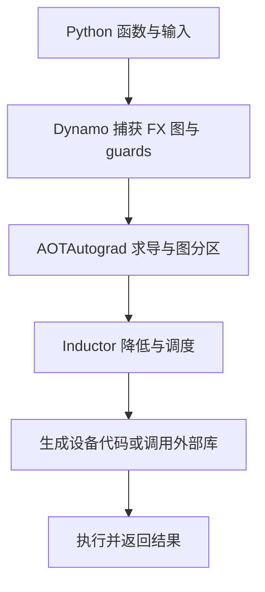
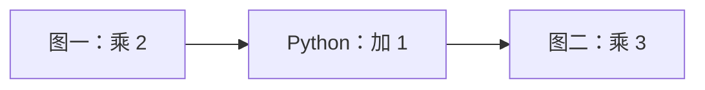

你已经会用张量计算和 `backward()`，但一个新问题出现了：两份实现返回同样的值与梯度，为什么把其中一份交给 `torch.compile` 后，第一次特别慢，后面却可能更快？又为什么换一个批大小，迟缓会重新出现？这些现象来自程序捕获、编译和缓存的不同阶段，需要逐层解释。

先修是 [F3 张量](/frameworks/torch-tensors/)、[F4 自动微分](/frameworks/autograd/) 与 [F5 模块](/frameworks/modules-and-losses/)。本章先在 CPU 上核对捕获、缓存与梯度；讨论融合和计时的时候，结合 [G3 kernel](/gpu/kernel-design/) 与 [G4 测量](/gpu/measurement/)。不需要先写出编译器，但要始终分清：Python 程序、编译器计算图、自动微分图和设备执行图并非同一个对象。

## 编译动机：相同算术为什么有不同执行成本

考虑一个长为 $N$ 的向量 $x$，对每个位置做四个逐元素运算：

```python
def pointwise(x):
    a = x + 1
    b = a * 2
    c = torch.relu(b)
    return c + 3

fast_pointwise = torch.compile(pointwise)
```

即时执行（eager execution）按 Python 的运行顺序调用各算子。一次调用可能涉及解释器、框架派发（dispatch）、输出分配，以及 GPU 上的 kernel 启动。算子本身也可以高度优化；问题是每个算子只看到自己的输入输出，通常无法把后续整段表达式一起优化。

假设四个算子分别产生完整中间向量，且每次都读一个向量、写一个向量，逻辑流量为 $8N$ 个元素。若融合后每个位置在寄存器里依次算完，只需从全局内存读 $x$、写最终结果，逻辑流量降为 $2N$ 个元素。以 $N=10^6$、float32 每元素 4 byte 计算，分别是 32 MB 和 8 MB。这里 MB 指 $10^6$ byte；常数、地址计算、缓存命中和实际总线流量没有包含在模型中。

融合同时可能把四次启动变成更少启动。大向量可能受搬运限制，小向量则可能更受派发与启动成本影响。同一项优化在两种输入上有不同收益，必须测量。这个流量模型不能推出“必然快四倍”：还有编译、guard 检查、设备算术、资源压力和未融合操作。

`torch.compile` 的价值是把一段计算交给后端，让它在保持程序语义的前提下选择更好的执行方式。它不自动改变模型架构、精度、损失定义或 batch size，也不保证对每种输入都更快。短到只执行一次的函数，可能根本无法摊销编译成本。

## 编译管线：一次调用经过哪些层

`torch.compile(pointwise)` 通常先返回包装后的可调用对象。真正昂贵的捕获与编译一般发生在它第一次遇到相应输入时。训练中的第一次反向传播还可能触发后续编译，所以只调用一次 forward 并不等于完成训练预热。



沿箭头阅读：前端回答“这段 Python 执行了什么张量操作”；求导阶段回答“梯度需要哪些操作与保存值”；后端回答“这些操作怎样变成循环、内核和库调用”。图展示默认后端的典型路线，推理不需要训练梯度，自定义后端也可以绕过其中某些步骤。[官方编译器概览](https://docs.pytorch.org/docs/2.14/user_guide/torch_compiler/torch.compiler.html) 给出了这些组件的职责。

| 层 | 输入和产物 | 不能据此推断什么 |
| --- | --- | --- |
| TorchDynamo | Python 执行帧到 FX 图及 guards | 捕获成功不证明后端能够生成代码 |
| FX | 操作、参数、输入输出之间的图表示 | 一个节点不一定对应一个设备 kernel |
| AOTAutograd | 可求导计算到前后向图与保存值接口 | 编译梯度不等于永久保存每次训练的激活 |
| TorchInductor | 张量图到可调度的计算与后端代码 | 所有节点不一定都融合，也不一定都写成 Triton |
| 设备代码与库 | 实际运行的 CPU/GPU 工作 | kernel 更快不等于完整服务同样比例更快 |

默认后端 `inductor` 可为支持的 GPU 生成 Triton 等代码，也可为 CPU 生成 C++ 等代码，或调用现有矩阵乘库。具体路线依设备、算子、布局与版本而异。“PyTorch 全部变成 Triton”不是准确的模型。

## Dynamo 捕获：Python 的哪些行为进入图

TorchDynamo 在 Python 执行帧层面介入，使用字节码分析与符号执行追踪张量计算，并生成可交给后端的 FX 图。它不是把全部 Python 源码逐行翻译成 CUDA。可追踪的 Python 函数可能被内联，固定长度的循环可能展开；不能可靠表示的行为则需要其他处理。[Dynamo 概览](https://docs.pytorch.org/docs/2.14/user_guide/torch_compiler/torch.compiler_dynamo_overview.html) 解释了帧拦截与图捕获机制。

捕获时不必对每个中间张量都分配真实设备数据。FakeTensor 等机制以形状、dtype、device、stride 和别名信息描述运算结果，使编译器能够推断后续操作的元数据。例如 `(B,d) @ (d,m)` 产生 `(B,m)`；它需要知道收缩轴是否相容，却不需要先读完整输入的实际数值。FakeTensor 是编译分析工具，不能拿来执行最终推理。

对于多项式：

```python
def polynomial(x):
    return x * x + 3 * x
```

概念图可以写成 `x → 两个乘法 → 加法 → 返回`。其中整数 3 可以成为常量，`x` 的实际元素由运行时输入提供。编译后的程序仍接受新数据；它不是只记住第一次输入对应的答案。

### guards 为什么不可省

假设第一次输入是连续的 CPU float64 向量，长度为 2。后端可以利用这些条件简化索引或选择代码。如果以后输入换成 float32、非连续视图或 CUDA 张量，直接套用旧代码可能不合法。守卫条件（guards）描述一份编译结果成立所需的前提，在复用前检查这些前提。

guard 可能涉及张量元数据、符号尺寸关系、Python 常量、对象身份和模块状态；具体检查集合由捕获过程决定。普通参数张量的每个数值并不会普遍被固定下来，因此 optimizer 原地更新权重不意味着每一步都要重编译。相反，被特殊化的 Python 标量每次改变，可能使对应 guard 失效。

缓存不是“按输入数值存答案”。它保存不同前提下可执行的编译版本。调用时命中适用版本，就运行它；没有匹配版本时，可能重新捕获并编译。相关缓存与 Python code object 有联系，不能认为重新包装同一个函数就获得完全独立的编译历史。缓存上限和退回 eager 的策略属于版本配置，排查时应看实际日志，而非依赖固定次数。[Dynamo 核心概念](https://docs.pytorch.org/docs/2.14/user_guide/torch_compiler/compile/programming_model.dynamo_core_concepts.html) 将捕获、guards 与重编译联系起来。

## AOTAutograd：梯度怎样一起进入编译

普通 autograd 按前向操作建立求导关系；编译训练路径需要让后端也看到反向计算。AOTAutograd 中的 AOT 指 ahead-of-time：相对于这一段图的后续执行，提前构造和处理求导图，不代表整个程序已在部署之前离线编译完成。

以逐元素多项式为例，令 $y_i=x_i^2+3x_i$，标量损失为所有输出之和：

$$
L=\sum_i y_i,\qquad
\frac{\partial L}{\partial x_i}=2x_i+3.
$$

输入 $x=[-2,0,2]$ 时，输出为 $[-2,0,10]$，梯度为 $[-1,3,7]$。这给出了不依赖 eager 实现的解析参考。完整脚本用 `backend="aot_eager"` 捕获求导路径，并用这些数值核对前向和反向；该后端执行图中算子，但不做 Inductor 的设备代码优化。

编译求导时，常见步骤包括把原地修改与视图关系转成更容易分析的形式，即函数化（functionalization），并将部分高级算子分解为较基础的 ATen 运算。ATen 是 PyTorch 的张量算子层。函数化不允许编译器忽略可见副作用：如果接口需要更新输入或保持别名关系，返回边界仍要实现相应语义。

前向和反向可以共同分析，再划分成可执行的图。反向所需的中间值，有的从前向保存，有的可以重新计算。保存会增加激活内存，重算会增加算术；分区策略在二者间取舍，并受依赖与算子性质限制。对多项式而言，反向知道 $x$ 就能构造梯度，不必永久保存所有逐元素前向中间结果。

每次训练仍产生本次运行所需的激活与 autograd 状态，`backward()` 仍遵循相应生命周期。`.grad` 的累计与 `zero_grad()` 也仍需由训练代码管理。编译 forward 不会自动把 DataLoader、日志和整个优化器循环全部编译进去。自定义 `autograd.Function`、hooks、混合精度和随机层还需要针对实际版本核对支持与语义，不能把一个小多项式的通过推广到任意训练程序。

## Inductor 降低：为什么图与 kernel 数量不同

降低（lowering）是把高层操作转换成后端能够实现的表示。Inductor 会分析张量依赖与布局，将计算表示为适合调度的循环和读写关系，再选择融合、分块及代码生成方案。图节点说明计算含义；循环表示说明每个输出怎样被计算；设备 kernel 则是最后提交的执行单位。

逐元素链中的一个位置无需读取其他位置，很适合在同一个循环或 kernel 内计算。但归约不同：RMSNorm 的缩放因子需要读取一行的多个特征，只有行统计量完成后，才能产生归一化输出。是否把归约和后续操作放在一起，要看行宽、线程协作、寄存器压力和后端能力，不能只数 Python 语句。

矩阵乘也不同。一个大型 GEMM 可能交给外部库，后续逐元素运算可能独立执行，也可能进入支持的 epilogue 模板。自动调优（autotuning）在候选实现中测量并选择配置，但会增加首次准备成本。候选范围、硬件支持与选择策略均有版本差异。

布局同样影响代码生成。[F3](/frameworks/torch-tensors/) 中的转置能改变 stride，后端必须选择合法索引，必要时插入复制；省去了 Python 中间对象，不等于所有真实数据搬运都消失。融合太多操作还可能增加寄存器使用，降低驻留或造成 spill，相关资源约束见 [G4](/gpu/measurement/)。

因此，`fullgraph=True` 的“一张图”只表示指定捕获区域没有图中断，并不要求后端生成一个 kernel。要知道是否融合、是否产生额外复制、是否仍调用矩阵乘库，需要看生成代码和 profiler。

## 图中断：为什么程序可以分段执行

图中断（graph break）发生在捕获当前区域时：Dynamo 无法或被要求不要把某一段行为放进当前图。默认 `fullgraph=False` 可以在支持的情况下结束当前图，执行 Python 部分，再继续捕获后面的计算。结果可能仍然正确，但多了跨边界开销，也失去了部分融合机会。



本图对应完整脚本中的 `python_region`：使用 `@torch.compiler.disable` 显式让这一段运行在 eager，前后的乘法仍能分别捕获。对输入 `[1,2]`，三个阶段依次得到 `[2,4]`、`[3,5]` 和 `[9,15]`。计数 backend 观察到两次图提交；改成 `fullgraph=True` 后，这个显式禁用区域应使捕获报错。

常见问题包括日志与 I/O、不支持的第三方调用，以及基于张量数值的 Python 控制流。例如：

```python
def choose(x):
    if x.sum() > 0:
        return x * 2
    return x - 2
```

分支取决于设备数据，单凭 shape 无法决定路径。若不能把它表达成受支持的结构化控制流，就可能图中断或在完整图模式下报错。可以考虑 `torch.cond`，但必须满足它的分支输入输出与副作用约束；若语义确实适合逐元素选择，也可改写成张量表达式。`torch.where` 不是通用惰性分支，作为参数的两个表达式通常已被计算，不能靠它保护本来不允许执行的操作。

`.item()` 的情况需要看版本与上下文：提取标量可能触发图中断，也可能被配置为捕获标量输出；在 GPU 上实际取值还可能要求主机等待。PyTorch 2.14 的 `fullgraph=True` 默认启用一些标量与动态输出捕获机制，但这不意味着任意数据相关 Python 分支都能捕获。[API 文档](https://docs.pytorch.org/docs/2.14/generated/torch.compile.html) 明确说明了完整图模式的这些行为。

实际修正从边界开始：把日志、保存与数据整理放在编译区域外；将稳定张量计算留在内部；对于确定要 eager 执行的辅助函数，可以显式禁用编译。在允许分段的接口里，这是一种可见边界。不要全局压掉所有编译错误后，再根据没有异常就宣称程序已被完整编译。

## 重编译：形状变化怎样影响缓存

重编译（recompilation）与图中断是两个轴。一个函数可以始终完整捕获，却因输入变化而生成多份版本；也可以有固定的图中断，但每个片段长期复用原版本。前者通常表现为某次新输入额外停顿，后者则可能持续影响每次调用。

`dynamic` 控制尺寸特殊化的策略：

| 参数 | 主要意图 | 仍需注意 |
| --- | --- | --- |
| `dynamic=False` | 对实际尺寸特殊化 | 新尺寸可能需要新版本 |
| `dynamic=None` | 默认，发现尺寸变化后尝试更动态的版本 | 初始版本和后续泛化仍可能有编译成本 |
| `dynamic=True` | 从开始尽量采用符号尺寸 | 不保证任意输入都能复用同一份代码 |

符号尺寸把某个长度写成变量 $s$，例如用循环边界 $0\le i<s$ 代替固定长度 2。但 dtype、device、rank、stride 和约束仍然存在。两份 `(B,d)` 输入可以只让 $B$ 动态，不能据此推断从二维换成三维也会复用。尺寸 0/1 可能涉及特殊广播或布局规则，常见的符号化不会简单把所有边界都混为一类。[动态形状文档](https://docs.pytorch.org/docs/2.14/user_guide/torch_compiler/torch.compiler_dynamic_shapes.html) 解释了这种泛化与特殊化。

若代码有 `if x.shape[0] > 4`，分支依赖的是尺寸。Dynamo 可以沿当前成立的分支捕获，并记录类似 $s>4$ 的约束；之后 $s=3$ 跨过边界，仍可能需要其他图。符号维度没有自动把所有 Python 分支改成运行时设备分支。由张量数值决定输出长度的 `nonzero` 等操作又属于数据相关尺寸，要单独核对支持范围。

完整脚本用同一个多项式核对三件事：静态模式输入长度 `2,2,3` 捕获两份图；动态模式输入长度 `2,3,5` 复用一份图；动态模式下把 float64 改成 float32 又产生新版本。这是该简单函数的观察结果，不是对复杂模型编译次数的保证。

### 变长请求怎样控制版本数

LLM 请求的 $B,T$ 不断变化，直接追求每个尺寸的一份最佳静态 kernel 可能积累编译与缓存成本。尺寸分桶（bucketing）把输入组织到少数容量，如序列长度 128、256、512；代价是 padding 引入额外工作。

例如实际长度 129 放进容量 256，增加 127 个 padding 位置。必须保留真实长度，并在注意力 mask、损失 mask、KV 写入和输出切片中排除无效部分。只补零不能确保模型语义正确，也不能保证比分别编译更快。应比较实际长度分布、额外计算、冷启动、峰值内存和稳态收益，再选择符号尺寸、分桶或两者组合。

## LLM 应用：先编译稳定的计算区域

[P8 现代 Decoder](/principles/modern-decoder/) 中的 RMSNorm 和 SwiGLU 都包含密集逐元素计算，适合作为理解编译收益的入口。设一行有 $d$ 个特征，RMSNorm 为：

$$
r=\sqrt{\frac{1}{d}\sum_{j=1}^{d}x_j^2+\epsilon},\qquad
y_j=\frac{x_j}{r}\gamma_j.
$$

这里 $\gamma_j$ 为可学习缩放，$\epsilon$ 保证分母稳定。平方、求均值、加常数、倒平方根与缩放提供归约和逐元素融合机会。SwiGLU 则有 $\operatorname{SiLU}(u)\odot v$，其中 $\operatorname{SiLU}(u)=u\odot\operatorname{sigmoid}(u)$，可把多个逐元素步骤一起分析。是否实际形成一个融合 kernel 仍由后端决定。

注意力通常包含大型矩阵乘与专用实现。编译器可能保留 SDPA 或其他算子边界；给模型加 compile 并不保证把朴素注意力自动替换为符合你期望的 FlashAttention 路径。内核选择还受 dtype、设备、mask 和布局影响，[S3](/systems/flash-attention/) 中的算法收益不能直接归因于 compile。

训练时可以先编译模型调用，保持批次读取、梯度清空、记录与保存的边界明确：

```python
compiled_model = torch.compile(model)  # model and optimizer are already created
optimizer.zero_grad(set_to_none=True)
prediction = compiled_model(inputs)
loss = loss_fn(prediction, targets)
loss.backward()
optimizer.step()
```

这里编译区域主要是模型前向及相应求导路径，损失调用位于包装外，优化器步骤也仍在外面。保存时持有原始 `model`，使用它的 `state_dict()`；恢复时重建模型、装载状态，再创建编译包装。模型权重与编译缓存不是同一类状态，后者不代替 [F6](/frameworks/data-and-training/) 的恢复协议。

prefill 一次处理多个输入位置，decode 每次追加少量新 token。即使使用同一个模型，二者的形状、控制路径与性能瓶颈也可能不同，宜分别预热与测量。[P10 KV cache](/principles/kv-cache/) 解释了缓存等价性；本章关心的是地址与形状稳定程度。

若每步用 `torch.cat` 扩大 KV，长度和存储都可能变化，容易带来新版本或设备图捕获困难。固定容量缓冲区能稳定一些元数据，但逻辑长度、位置、写入槽位和 mask 仍需准确维护；容量相同不意味着每步可以读全部未初始化位置。原地写缓存的路径也须核对别名与设备图约束。

### compile 和 CUDA Graph 怎样配合

`torch.compile` 优化计算程序，CUDA Graph 捕获设备工作及依赖以便重放，从而降低重复提交成本。两者能够配合：先得到合适的 kernel，再把稳定的设备执行录下来。[S6 执行器](/systems/engine-execution/) 讲静态缓冲和 replay；这里解释其中 RMSNorm/SwiGLU 编译的另一层作用。

CUDA Graph 通常要求可捕获的设备操作与受管理的地址生命周期。编译器支持符号 shape，不代表任意形状都能重放同一个 CUDA Graph。某些编译模式会自动尝试设备图优化，但缓存原地更新、不支持的操作或 CPU 行为可能使它不适用。需要看日志和实际执行，不能把 `reduce-overhead` 当作保证成功的开关。

## 配置与排障：先定位失败发生在哪层

从默认设置开始，确认正确性与编译边界，再选 mode。增加调优强度可能提高稳态收益，也会增加准备成本。

| mode | 用途 | 衡量代价 |
| --- | --- | --- |
| `default` | 通用起点 | 编译成本与稳态时间 |
| `reduce-overhead` | 在适用场景尝试减少提交开销，包括 CUDA Graph | 捕获条件、额外工作区与显存 |
| `max-autotune` | 对支持的操作测量候选实现，GPU 上也可能启用 CUDA Graph | 调优耗时和不同输入的摊销 |
| `max-autotune-no-cudagraphs` | 调优但不启用该模式的 CUDA Graph | 隔离调优与重放的影响 |

这些是 Inductor 常用模式，不能假定每个自定义 backend 都支持相同 mode。详细可用项应以安装版本的 API 为准。`fullgraph` 管捕获边界，`dynamic` 管尺寸策略，`mode` 管后端优化策略；三者没有谁替代谁。

出现异常时，用同一输入依次比较：

1. eager：先排除模型本身的 shape、dtype、数值与副作用问题。
2. `backend="eager"`：加入 Dynamo 捕获，执行 FX 图而不做设备代码优化。
3. `backend="aot_eager"`：再加入求导图处理，适合定位前后向问题。
4. `backend="inductor"`：最后加入后端降低与代码生成。

第一个失败层帮助缩小范围，但不是绝对的责任判定：配置、分解和随机行为可能改变表现。缩减输入、保持触发条件、记录 Torch/Python/设备版本，比盲目切换大量私有选项更容易形成可复现问题。`torch._dynamo.explain(fn)(*args)` 可辅助检查图与中断原因，但它是版本相关的诊断接口，也会实际调用程序，不能把带副作用的训练步骤当作无害查询。

可运行以下命令观察本章实验：

```sh
TORCH_LOGS="graph_breaks,recompiles" python3 code/frameworks/torch_compile.py
TORCH_LOGS="guards,dynamic" python3 code/frameworks/torch_compile.py
TORCH_LOGS="output_code" python3 code/frameworks/torch_compile.py --inductor
```

第一条查捕获中断与新版本；第二条查哪些前提被记录、哪些尺寸被符号化；第三条实际运行 CPU Inductor 并查看生成代码。`TORCH_LOGS` 必须在启动进程前设置。更多选项和最小复现流程见 [官方排障文档](https://docs.pytorch.org/docs/2.14/user_guide/torch_compiler/torch.compiler_troubleshooting.html)。

数值验证先固定输入与状态，比较 forward、loss、梯度，必要时比较一次更新后的参数。使用 dtype 和运算规模合适的容差；归约次序、融合乘加与后端实现可能使浮点结果不逐位相同。固定 seed 也不保证 eager 与编译随机 kernel 使用同样的随机序列，因此 Dropout 的检查要另行设计，不能从单次逐位不等就判定语义错误。

## 性能测量：编译成本多久才能收回

把一次性编译成本记为 $C$，eager 每次耗时为 $t_e$，编译版本稳态耗时为 $t_c$。若执行 $n$ 次且中间没有新的编译成本：

<KeyEq label="编译摊销">
$$
C+n t_c<n t_e
\quad\Longleftrightarrow\quad
n>\frac{C}{t_e-t_c},\qquad t_e>t_c.
$$
</KeyEq>

假设编译花 30 秒，eager 每次 10 ms，编译后 8 ms，每次节省 0.002 秒，因此要超过 15000 次才能严格收回成本。若只调用 100 次，总时间分别是 1 秒与 30.8 秒。数字是教学假设，没有代表任何设备实测；如果 $t_c\ge t_e$，这个模型中没有靠更多调用实现的回本点。

实际的 $C$ 可能包含图捕获、代码生成、本地编译、autotune、首次反向编译与 CUDA Graph 捕获，还可能在新形状出现时再次发生。磁盘缓存能改变后续进程成本，但不会取消每次运行时的合法性检查。报告冷启动要注明缓存状态，不能把预热过的缓存称为全新编译。

测量稳态时先覆盖预期的形状、模式、dtype 与完整步骤，观察是否仍重编译，再进入计时区间。GPU 是异步的，端到端计时边界要正确同步；只测 CPU 提交而未等设备完成会低估时间。GPU event 测的是其包围的设备时间，不能代表编译和完整服务时间。具体命令、event 示例和多 stream 边界直接沿用 [G4](/gpu/measurement/)，完整编译测量示例见 [官方端到端教程](https://docs.pytorch.org/tutorials/intermediate/torch_compile_full_example.html)。

除了耗时，还应记录峰值内存、编译次数、典型与尾部延迟、数值容差。训练测完整 forward/backward/update，推理区分 prefill/decode；对服务则回到 [S10](/systems/serving-evaluation/) 的 TTFT、ITL 和请求边界。CPU 小多项式证明捕获与梯度行为，不能提供大型 GPU 模型的加速结论。

## 完整验证：把概念对应到真实 API

<CodeFile path="code/frameworks/torch_compile.py" />

运行 `python3 code/frameworks/torch_compile.py`，预期报告 `static=2, dynamic=1`，并说明 AOT 梯度、dtype guard 与图中断通过。自定义计数 backend 返回 `graph_module.forward`，只记录 Dynamo 交给后端多少张图，因此默认不要求本地 C++ 编译器，也不验证设备融合性能。脚本使用 `torch.compiler.reset()` 隔离实验中的进程内缓存，这不是训练循环里应该每步调用的函数。

加 `--inductor` 后，脚本还会为 17 个 CPU float64 元素生成真实前后向代码，并与 eager 对照，需要兼容的系统 C++ 工具链。该检查没有计时，不宣称提速。显式图中断实验使用禁用函数，避免依赖不同版本对 `.item()` 的处理；捕获错误只接受对应的不支持异常，不把任意后端故障当作实验通过。

## 常见误区

- **调用 compile 就完成了编译。** 实际输入触发的首次调用、首次反向或新版本仍可能有准备成本。
- **换一批数据必然重编译。** 普通张量元素可变化；应检查 guard 所约束的元数据和状态。
- **fullgraph 等于一个 kernel。** 它约束捕获边界，后端仍可生成多个 kernel 和库调用。
- **dynamic=True 就没有 guards。** 符号尺寸也有约束，dtype、rank、布局和分支仍可能特殊化。
- **图中断就是重编译。** 一个发生在捕获边界，一个发生在旧版本不适用时，需分别查日志。
- **compile 是模型导出。** 它提供优化后的 Python 调用路径；`torch.export` 的导出图契约与后续部署是另外的接口。
- **CPU 断言通过证明 GPU 加速。** 正确性、设备实现和性能是不同证据，必须各自核对。

## 练习与核对

<details>
<summary>四个逐元素操作的 32 MB 与 8 MB 怎样得到？为什么不能推出四倍加速？</summary>

每个独立操作读写各 $N$ 个元素，四次为 $8N$，乘以 4 byte，在 $N=10^6$ 时为 32 MB。融合的理想逻辑请求为一次输入读取与一次输出写入，即 $2N$，得到 8 MB。实际还受缓存、算术、launch、资源和编译成本影响，流量比例不等于时间比例。

</details>

<details>
<summary>静态模式输入长度 2、2、3，为什么脚本捕获两份图？如果第二批只改了元素值呢？</summary>

前两次尺寸与其他 guard 相同，第二次复用长度 2 的版本；长度 3 不满足该尺寸前提，需要新版本。只改变普通输入张量元素不会改变这里的元数据条件，因此通常仍复用；若程序读取数值以决定 Python 分支，就要另外分析捕获边界。

</details>

<details>
<summary>dynamic=True 的函数含有 shape[0] > 4，长度从 5 变成 3 时一定复用吗？</summary>

不一定。初次捕获可能沿大于 4 的分支，并记录符号条件。3 跨过条件边界，可能需要另一张图。符号化允许一个条件范围内复用，不等于让 Python 分支变成支持所有路径的单一设备程序。

</details>

<details>
<summary>编译 30 秒，每次从 10 ms 降到 8 ms；15000 次是严格获益了吗？</summary>

15000 次恰好节省 30 秒，抵消准备成本，两者在简化模型下总时间相等。严格获益需要超过 15000 次，且假设没有新形状编译、缓存维护或其他额外成本。

</details>

<details>
<summary>默认模式能运行，但 fullgraph 因禁用辅助函数失败，应该怎样判断？</summary>

先确认这个边界是否有意保留。如果辅助函数负责 I/O 或其他确实需要 eager 的行为，可以让调用者位于编译区域之外，或接受分段。如果希望完整捕获，就应移除该区域中的禁用调用并验证支持情况。默认成功只证明程序可分段运行，不证明所有操作都被优化。

</details>

接下来进入 [P1 文本、token 与嵌入](/principles/tokenization/) 构建模型；已有模型的读者可回到 [G3](/gpu/kernel-design/) 对照融合，或到 [S6](/systems/engine-execution/) 区分算子编译与设备图重放。

## 原始资料与边界

资料读取日期 2026-09-28。以下链接固定到 PyTorch 2.14 文档或官方教程；仓库允许 PyTorch 2.x，编译支持范围、默认捕获行为、日志和私有诊断接口会随版本变化。

- [torch.compile API](https://docs.pytorch.org/docs/2.14/generated/torch.compile.html)：完整图、动态尺寸、后端与模式的接口定义。
- [编译器概览](https://docs.pytorch.org/docs/2.14/user_guide/torch_compiler/torch.compiler.html)、[Dynamo 概览](https://docs.pytorch.org/docs/2.14/user_guide/torch_compiler/torch.compiler_dynamo_overview.html)：组件职责与 Python 捕获。
- [Dynamo 核心概念](https://docs.pytorch.org/docs/2.14/user_guide/torch_compiler/compile/programming_model.dynamo_core_concepts.html)、[动态形状](https://docs.pytorch.org/docs/2.14/user_guide/torch_compiler/torch.compiler_dynamic_shapes.html)：guards、图中断、特殊化与符号约束。
- [入门教程](https://docs.pytorch.org/tutorials/intermediate/torch_compile_tutorial.html)：前后向与代码观察。
- [排障](https://docs.pytorch.org/docs/2.14/user_guide/torch_compiler/torch.compiler_troubleshooting.html)、[端到端实验](https://docs.pytorch.org/tutorials/intermediate/torch_compile_full_example.html)：诊断与冷启动/稳态计时。

流量、回本次数和图分段采用本章明示的教学输入；没有使用 GPU 实测加速倍数，也不声称覆盖分布式、任意自定义算子或全部混合精度行为。
