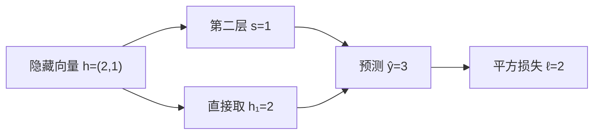

import SharedNodeLab from '../../../components/labs/SharedNodeLab'

[M8 矩阵求导](/math/matrix-calculus/)给出了线性层的局部梯度；真实网络还会把线性层、激活和损失接起来，同一个中间结果也可能被多处使用。本章用一个两层网络追踪这些依赖，最终手算出全部参数梯度。[M7 微积分](/math/calculus/)中的导数和 M8 中的矩阵形状是先修；参数如何更新留给 [M10 神经网络训练](/math/training/)。

## 先做前向：一份隐藏值被用了两次

取单样本列向量 $x=(1,1)^\top$，两层网络定义为

$$
z=W_1x+b_1,\qquad h=\operatorname{ReLU}(z),\qquad
s=W_2h+b_2,\qquad \hat y=s+h_1,\qquad
\ell=\tfrac12(\hat y-y)^2.
$$

这里 $W_1\in\mathbb R^{2\times2}$、$b_1,z,h\in\mathbb R^2$，$W_2\in\mathbb R^{1\times2}$，$b_2,s,\hat y,y,\ell$ 都是标量。ReLU 是逐坐标计算的函数 $\operatorname{ReLU}(t)=\max(0,t)$；它让隐藏层具有非线性。$h_1$ 一方面进入第二层 $s$，另一方面直接加到预测值，因而是一份被使用两次的中间结果。这个直连分支只是为了看清梯度合并，M10 会用标准的两层分类网络完成训练。

固定参数与目标：

$$
W_1=\begin{bmatrix}1&1\\2&-1\end{bmatrix},\quad
b_1=\begin{bmatrix}0\\0\end{bmatrix},\quad
W_2=\begin{bmatrix}1&-2\end{bmatrix},\quad b_2=1,\quad y=1.
$$

按依赖顺序逐步求值，$z=(2,1)^\top$，两个坐标都为正，所以 $h=(2,1)^\top$；接着 $s=1\cdot2-2\cdot1+1=1$，$\hat y=1+2=3$，最终 $\ell=\tfrac12(3-1)^2=2$。反向必须从这个实际前向结果出发。特别是不能先换激活或目标，却继续使用误差 $\hat y-y=2$。



箭头表示前向依赖。$h_1$ 通过第二层和直接加法两次影响预测；反向读图时，这两条路径的贡献必须都返回 $h_1$。

## 从损失返回预测：为什么沿路径相乘

<Definition term="反向传播" source="https://zh.wikipedia.org/wiki/反向传播算法">
  对标量损失，按计算依赖的逆序使用链式法则，把损失对当前结果的梯度传回其输入；一个输入被多处使用时，将每条路径的贡献相加。反向传播计算梯度，不执行参数更新。
</Definition>

记 $g_v=\partial\ell/\partial v$。从 $g_\ell=1$ 开始，对平方损失和加法分别求局部导数：

$$
g_{\hat y}=\frac{\partial\ell}{\partial\hat y}=\hat y-y=2,
\qquad
g_s=g_{\hat y}\frac{\partial\hat y}{\partial s}=2.
$$

例如让 $s$ 增加很小的 $\Delta s$，预测也增加约 $\Delta s$，损失再增加约 $2\Delta s$。两段变化率相乘给出从 $s$ 到损失的变化率。这就是标量链式法则；若漏掉其中一段，求到的是另一个变量的导数。

这里容易漏掉的是 $h_1$：它既经 $s$ 影响损失，又直接进入 $\hat y$。暂时只看直接路径，它贡献 $g_{\hat y}\cdot1=2$；经第二层的贡献还要继续往回算。两条路径必须都抵达 $h_1$，才能把总梯度传给第一层。

## 经第二层返回隐藏值：乘法与分支求和

对 $s=W_2h+b_2$，第 $j$ 个权重改变 $\Delta W_{2,j}$，会让 $s$ 改变约 $h_j\Delta W_{2,j}$。因此局部梯度乘上上游的 $g_s$：

$$
\nabla_{W_2}\ell=g_s h^\top
=2\begin{bmatrix}2&1\end{bmatrix}
=\begin{bmatrix}4&2\end{bmatrix},
\qquad \nabla_{b_2}\ell=g_s=2.
$$

这两个梯度分别与 $W_2$、$b_2$ 同形状。沿第二层返回隐藏值时，$W_2$ 的两个系数分别给出 $g_sW_{2,1}=2$ 与 $g_sW_{2,2}=-4$。再加上 $h_1$ 的直接路径：

$$
g_h=W_2^\top g_s+\begin{bmatrix}g_{\hat y}\\0\end{bmatrix}
=\begin{bmatrix}2\\-4\end{bmatrix}
+\begin{bmatrix}2\\0\end{bmatrix}
=\begin{bmatrix}4\\-4\end{bmatrix}.
$$

如果只沿 $s$ 返回，第一坐标会被误算为 $2$。同一个隐藏值的两个使用位置，对应两条独立贡献；即使两个节点恰好数值相等，只要不是同一个计算依赖，也不能凭数值相等合并它们。

下面把共享节点缩成 $a=x^2$、$b=3a$、$\ell=a+b$。这是用来观察汇合顺序的小图，和正文的两层网络使用同一条规则。在 $x=2$，两路给 $a$ 返回 $1$ 和 $3$，合并为 $4$，再乘 $da/dx=4$，得到 $d\ell/dx=16$。

保持两条路径都勾选，将“反向阶段”从 0 调到 3。每进入一个阶段，先指出这一步应处理的依赖，再看蓝色高亮。特别检查：经过 b 的贡献何时抵达 a，总贡献何时继续返回 x？如果漏掉直接路径，最后会少多少梯度？

<SharedNodeLab client:visible />

## 穿过激活和第一层：梯度怎样到达每个参数

ReLU 在正数处的局部导数为 $1$，负数处为 $0$。本次 $z=(2,1)^\top$ 都为正，所以 $g_z=g_h\odot(1,1)^\top=(4,-4)^\top$。在零点经典导数不存在；PyTorch 为该点的反向选用 $0$，不能用跨过折点的中心差分判断这个选择是否错误。

第一层仍用 M8 的线性层规则，把输出梯度 $g_z$ 与输入 $x$ 做外积：

$$
\nabla_{W_1}\ell=g_zx^\top
=\begin{bmatrix}4&4\\-4&-4\end{bmatrix},
\qquad \nabla_{b_1}\ell=g_z=\begin{bmatrix}4\\-4\end{bmatrix}.
$$

若还关心输入的梯度，则 $g_x=W_1^\top g_z=(-4,8)^\top$。例如第一列权重的两条贡献分别为 $4\cdot1$ 与 $-4\cdot2$，所以 $\partial\ell/\partial x_1=-4$；输入梯度的形状必须回到二维输入，而非第一层输出的形状。此时本章主问题已经完成：从一个损失出发，两个线性层、激活和共享分支的所有梯度都已算出。`backward()` 只计算并存放这些梯度，尚未改变任何参数。

### 用同一个网络检查算例

下面的代码与手算使用同一组参数、目标和归约方式。`h.retain_grad()` 仅为读出中间值收到的总梯度；反向计算本身不需要调用它。

```python
import torch

torch.set_default_dtype(torch.float64)
x = torch.tensor([1., 1.], requires_grad=True)
W1 = torch.tensor([[1., 1.], [2., -1.]], requires_grad=True)
b1 = torch.zeros(2, requires_grad=True)
W2 = torch.tensor([[1., -2.]], requires_grad=True)
b2 = torch.tensor(1., requires_grad=True)

z = W1 @ x + b1
h = torch.relu(z)
h.retain_grad()
prediction = (W2 @ h).squeeze() + b2 + h[0]
loss = 0.5 * (prediction - 1.) ** 2
loss.backward()

torch.testing.assert_close(loss.detach(), torch.tensor(2.))
torch.testing.assert_close(h.grad, torch.tensor([4., -4.]))
torch.testing.assert_close(W2.grad, torch.tensor([[4., 2.]]))
torch.testing.assert_close(b2.grad, torch.tensor(2.))
torch.testing.assert_close(W1.grad, torch.tensor([[4., 4.], [-4., -4.]]))
torch.testing.assert_close(b1.grad, torch.tensor([4., -4.]))
torch.testing.assert_close(x.grad, torch.tensor([-4., 8.]))
```

这组断言同时检查前向值、分支汇总及两个权重矩阵的方向。脚本 `code/math/backprop.py` 还用同一网络核对批量与微批变体。

## 从逐分量到 VJP：为什么反向用转置

刚才 $s=W_2h+b_2$ 的输入梯度是 $W_2^\top g_s$。对一般向量函数 $z=f(x)$，设 $x\in\mathbb R^d$、$z\in\mathbb R^m$，其雅可比矩阵 $J\in\mathbb R^{m\times d}$ 的第 $(i,j)$ 项为 $\partial z_i/\partial x_j$。若输出收到列梯度 $g_z\in\mathbb R^m$，每个输入坐标汇总所有输出路径：

$$
(g_x)_j=\sum_{i=1}^{m}(g_z)_i\frac{\partial z_i}{\partial x_j},
\qquad g_x=J^\top g_z\in\mathbb R^d.
$$

这就是列梯度写法的 **vector-Jacobian product（VJP）**；若把上游梯度写成行向量，则同一运算是 $g_z^\top J$。在本章第二层，$J=W_2$，于是 $J^\top g_s=(2,-4)^\top$；直连分支再补上 $(2,0)^\top$。在第一层，$J=W_1$，所以 $g_x=W_1^\top g_z$。实际反向通常直接做局部乘积，不需显式构造整个雅可比矩阵。

注意前向的小扰动是 $\Delta z\approx J\Delta x$，反向传播的是标量损失的梯度 $J^\top g_z$。仅对向量输出调用“全一梯度”相当于先把输出求和，不会得到完整雅可比；若只关心某个标量损失，反向一次便能同时得到许多参数的梯度。

## 扩展到 batch：共享参数怎样收集多个样本

把同一个网络作用到 $B$ 个按行排列的样本，记 $X\in\mathbb R^{B\times2}$，$Z=XW_1^\top+b_1$，$H=\operatorname{ReLU}(Z)$。把每条样本的第一个隐藏坐标组成列向量 $c=(H_{11},\ldots,H_{B1})^\top\in\mathbb R^{B\times1}$，则批预测为 $\hat y=HW_2^\top+b_2+c$，形状是 $B\times1$。

代码中用 `H[:, 0:1]` 取这个直连列，保留长度为 1 的输出轴；`H[:, 0]` 只有 `(B,)`，直接相加可能广播成 `(B,B)`。每条样本仍用 $\ell_i=\tfrac12(\hat y_i-y_i)^2$，目标取平均 $L=B^{-1}\sum_i\ell_i$。

若 $G_Z=\partial L/\partial Z$，每个样本都使用同一组参数，于是批量线性层的梯度为

$$
\nabla_{W_1}L=G_Z^\top X,\qquad
\nabla_{b_1}L=\sum_{i=1}^{B}(G_Z)_{i,:},\qquad
\nabla_XL=G_ZW_1.
$$

偏置在前向被广播到每行，所以反向必须沿样本轴求和；这和 $h_1$ 两条路径的相加一样，都是一个量被多次使用后的贡献汇总。$G_Z$ 已经包含平均损失带来的 $1/B$，不可再除一次。例如两条样本对同一参数的单样本梯度为 $2$ 与 $6$，那么总损失的梯度为 $8$，平均损失的梯度为 $4$。若输出有多个坐标，还要先说明每条样本是对输出坐标求和还是求平均，不能只写一个含糊的 `.mean()`。

### 进阶应用：不等长 microbatch 的累积

显存放不下整个 batch 时，可切为多个 microbatch，保持参数不变，分别前向、反向，最后更新一次。第 $k$ 段有 $n_k$ 条样本、其平均损失为 $L_k$，总样本数 $N=\sum_k n_k$，则整批目标恰好是

$$
L=\frac1N\sum_i\ell_i=\sum_k\frac{n_k}{N}L_k.
$$

因此每段反向前须乘 $n_k/N$。例如三条样本切成两条和一条，权重分别是 $2/3$ 与 $1/3$，不是把两个 microbatch 的均值各乘 $1/2$。这些梯度在同一参数的 `.grad` 中累加，直到更新前才清零。这个结论要求前向可按样本拆开且每段参数相同；跨样本计算的层可能破坏逐段与整批的等价。训练中按有效 token 数而非样本数加权的版本见 [T2 优化](/training/optimization/)。

## 求导边界：何时需要记录计算图

本章手算描述数学依赖；PyTorch 还要决定哪些依赖被记录。参数用 `requires_grad=True` 才会沿参与的可微运算积累梯度，`.grad` 是反向结果的存储处；`.grad is None` 不等于已计算出零梯度。反向通常只自动保存需要求导的叶子张量的 `.grad`，前面用 `h.retain_grad()` 才额外读到隐藏值的梯度。

`torch.no_grad()` 使上下文中的通常运算不记录反向路径，适合参数更新或无需求导的前向；它不清空已有 `.grad`，也不切换模块的训练/评估行为。`detach()` 将一个张量结果从当前求导路径中分离，前向数值可以相同，返回原参数的梯度却会改变。例如令 $a=x^2$、$x=2$，$a+a$ 的值为 $8$、对 $x$ 的梯度为 $8$；`a + a.detach()` 的值仍为 $8$，梯度只剩第一项的 $4$。`detach()` 与原张量共享存储；需要独立可修改的数据时还须复制。

`retain_grad()` 保存中间结果的梯度，`retain_graph=True` 则保留已用过的计算图资源以供再次反向，职责不同。正常训练每步重新前向建立图，microbatch 也各自前向，通常无需 `retain_graph=True`。关于叶子张量、`clone()`、`inference_mode()` 和这些 API 的完整边界见 [F4 自动求导](/frameworks/autograd/)；不要因为梯度报错就随意添加 `detach()` 或 `retain_graph=True`。

## 常见误区

1. **共享值只沿一条路径返回。** 在本章 $h_1$ 处，这会漏掉直连的 $2$；必须等两路贡献都到达，再把总梯度传给 $z_1$。
2. **激活后的梯度直接等于激活前的梯度。** 本次两个 $z_j$ 都为正，等式恰好成立；若 $z_j<0$，ReLU 会把该样本的这一路局部梯度置零。
3. **反向之后权重已更新。** `backward()` 只算梯度，优化器的 `step()` 才改变参数；重复反向还会累加到未清零的 `.grad`。
4. **`retain_graph=True` 能解决重复训练步。** 它不清空梯度，也不应拿来跨步保存旧前向。先检查新步是否重新前向、旧梯度是否按预期清零。

## 练习与核对

<details>
<summary>1. 保持本章参数和输入，删掉预测中的直连项 $h_1$，目标仍为 $y=1$。梯度怎样变？</summary>

此时预测为 $s=1$，恰等于目标，损失与全部参数梯度均为零。不能从原来的 $g_h=(4,-4)^\top$ 简单减去直连路径贡献，因为改变前向也改变了损失的上游梯度。

</details>

<details>
<summary>2. 仍用原网络，把输入改成 $x=(0,1)^\top$、目标改成 $y=2$。第一层两行收到什么梯度？</summary>

前向得 $z=(1,-1)^\top$、$h=(1,0)^\top$、$s=2$、$\hat y=3$，所以 $g_{\hat y}=1$。两条路径合并给 $g_h=(2,-2)^\top$，ReLU 使 $g_z=(2,0)^\top$，于是 $\nabla_{W_1}\ell=g_zx^\top=\begin{bmatrix}0&2\\0&0\end{bmatrix}$。第二行的局部梯度为零，并不表示它在其他样本上也没有梯度。

</details>

<details>
<summary>3. 一个向量节点有三维输入、五维输出，输出收到五维列梯度。输入梯度的形状与计算式是什么？</summary>

雅可比矩阵形状为 $5\times3$，输入梯度为 $J^\top g$，形状 $3\times1$。不能把 $Jg$ 当作列梯度规则，因为内维不匹配。

</details>

<details>
<summary>4. 两个 microbatch 各有 4 条与 1 条样本，怎样还原整批平均损失的梯度？</summary>

分别把两个 microbatch 的平均损失乘 $4/5$ 与 $1/5$ 后反向，并在两次反向之间保持参数不变。直接平均两个均值会让最后一条样本权重过大。

</details>

本章从一个损失求得了所有局部梯度；[M10 神经网络训练](/math/training/) 将用这些梯度更新参数，并区分表达能力、训练集拟合与泛化需要的证据。

## 原始资料

- [反向传播算法的定义与计算图](https://zh.wikipedia.org/wiki/反向传播算法)。
- [PyTorch Autograd mechanics](https://docs.pytorch.org/docs/stable/notes/autograd.html)：图记录、反向累积与不可导点的处理。
- [PyTorch `Tensor.backward`](https://docs.pytorch.org/docs/stable/generated/torch.Tensor.backward.html)：向量输出的 `gradient` 参数及梯度累积。
