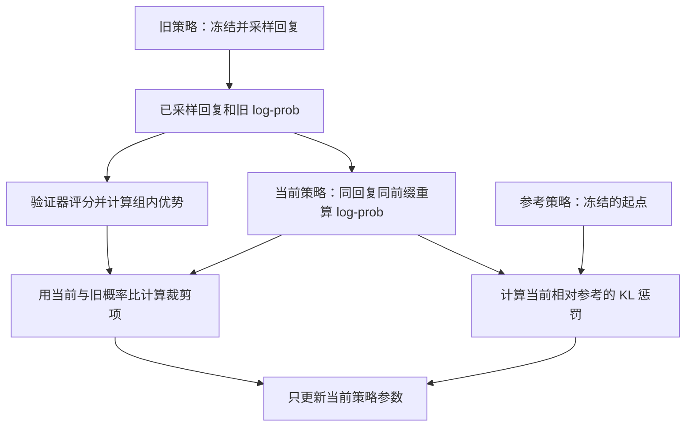

import GrpoLab from '../../../components/labs/GrpoLab'

[H1](/post-training/instruction-tuning/) 让模型模仿示范回复，[H4](/post-training/dpo/) 用成对偏好调整回复概率。如果题目有确定答案，还可以让模型自己生成回复，再用规则核对。问题是：规则只给“对或错”，不对模型参数求导，怎样用它更新模型？

本章只追踪题目 `2+3=?`。先把回复当作有限候选，手算一次更新方向；再用同一加法任务检查语言模型中的采样、奖励和更新。需要 [M3 概率](/math/probability/) 的期望、[M5 分布](/math/distributions/) 的 softmax、[M7 微积分](/math/calculus/) 的导数与链式法则，以及 [P2 语言模型](/principles/language-modeling/) 的下一 token 概率。策略、奖励和训练目标将在使用前逐一确定。

## 策略与回复：到底改变哪个概率

语言模型给定提示 $x$，每一步为下一个 token 给出概率。把生成的完整回复记为 $y=(y_1,\ldots,y_m)$，包括结束 token；这个随机生成过程称为策略 $\pi_\theta$，其中 $\theta$ 是模型参数。一条回复也称一条轨迹。由概率链式法则，

$$
\pi_\theta(y\mid x)=\prod_{t=1}^{m}\pi_\theta(y_t\mid x,y_{<t}),
\qquad
\log\pi_\theta(y\mid x)=\sum_{t=1}^{m}\log\pi_\theta(y_t\mid x,y_{<t}).
$$

例如生成 `<answer>5</answer>` 的概率，是该回复所有 token 在各自前缀下的条件概率相乘；不是只看数字 `5` 的概率。采样出的文本不会被“改写”为参数，训练改变的是以后再采样时这些回复的概率。

为了把梯度算在纸上，暂时令策略只可能生成以下四条**不同**的完整回复，初始概率各为 $1/4$。这是有限策略教具，不是语言模型的词表。

| 候选 $i$ | 完整回复 $y_i$ | 规则奖励 $r_i$ |
| --- | --- | ---: |
| 1 | `<answer>5</answer>` | 1 |
| 2 | `<answer>4</answer>` | 0 |
| 3 | `5` | 0 |
| 4 | `<answer> 5 </answer>` | 1 |

## 可验证奖励：先固定规则再采样

本例只接受**整条回复**形如 `<answer>整数</answer>`；标签内可以有空格，整数必须等于 5。于是候选 1 和 4 得 1，候选 2 答错，候选 3 缺少标签。脚本使用完整匹配检查这条协议。规则奖励不需要训练一个打分网络；这类用可核对结果作奖励的训练称为 RLVR（reinforcement learning with verifiable rewards）。

格式是本例的教学约束，不是“没有标签就不会做加法”的判断。真实数学题还需处理等价表达、单位、解析失败与未终止回复；代码任务需限定执行环境和测试覆盖。验证器定义什么是高分行为，设计错误就会奖励错误行为。

## 期望奖励：为什么离散回复也能训练

固定题目时，目标是提高策略采样的平均奖励：

$$
J(\theta)=\mathbb E_{y\sim\pi_\theta(\cdot\mid x)}[r(x,y)]
=\sum_y\pi_\theta(y\mid x)r(x,y).
$$

四候选均匀时，$J=(1+0+0+1)/4=0.5$。直接对“采到哪段文本”求导行不通，但可以对文本的**生成概率**求导。验证器固定、不依赖 $\theta$，且采样候选的概率为正时，链式法则给出 $\nabla_\theta\log\pi_\theta=(1/\pi_\theta)\nabla_\theta\pi_\theta$；移项后对上式逐项求导，得

<KeyEq label="可验证奖励的策略梯度">

$$
\nabla_\theta J
=\mathbb E_{y\sim\pi_\theta}
\left[r(x,y)\nabla_\theta\log\pi_\theta(y\mid x)\right].
$$

</KeyEq>

等式右边可用采样回复估计：奖励只给系数，梯度经过模型计算的 log-prob。对本例四个候选的 logits $u_i$，令 $p_j=e^{u_j}/\sum_k e^{u_k}$。对分子和分母求导：若 $i=j$，分子导数为 $e^{u_j}$；无论 $i$ 是否等于 $j$，分母导数都是 $e^{u_i}$。商法则整理成 $\partial p_j/\partial u_i=p_j(\mathbf1_{i=j}-p_i)$，再代回 $J=\sum_jp_jr_j$ 得

$$
\frac{\partial J}{\partial u_i}=p_i(r_i-J).
$$

初始 $p_i=1/4$、$J=1/2$，四个导数依次为 $(+1/8,-1/8,-1/8,+1/8)$。沿梯度上升，两个合格回复的相对分数提高。这个结论没有对奖励规则求导，也没有假设四条候选的文本相似。真实模型的候选空间无法枚举，所以使用采样估计；有限采样会带来波动。

## 组内比较：同一道题的四次采样怎样使用

假设这一轮恰好各采到表中一条，奖励组为 $(1,0,0,1)$。同题回复的平均奖励是 $\bar r=0.5$，按总体标准差（分母为组大小 $G=4$）计算得 $s_r=0.5$。将每条回复与本组比较：

$$
A_g=\frac{r_g-\bar r}{s_r+\epsilon_a},
\qquad
\bar r=\frac1G\sum_g r_g,\qquad
s_r=\sqrt{\frac1G\sum_g(r_g-\bar r)^2}.
$$

小的 $\epsilon_a>0$ 只防止除零。忽略它的微小数值影响，优势 $A\approx(1,-1,-1,1)$：候选 1、4 高于本组平均，候选 2、3 低于平均。组内均值来自同一批样本，不能把“独立于动作的 baseline 不改变期望梯度”的证明直接套用，宣称这个有限组估计严格无偏；这里的优势是优化目标的设计。

如果四条都答对，或四条都答错，$s_r=0$ 且每个分子也为零，本章约定 $A_g=0$。这样的组没有**组内区分**信息。它不证明模型已学会任务：全错组尤其可能只是奖励太稀疏，需要调整题目或采样分布，而不是增大 $\epsilon_a$。

## GRPO：从组内优势到一次受限更新

组相对策略优化 GRPO（group relative policy optimization）用同题多条回复的分数估计优势，无须为每个前缀另训练价值网络。采样时冻结一份旧策略 $\pi_{\mathrm{old}}$；更新时在**同一条已采样回复的同一前缀**重算当前策略概率。单个实际生成 token 的概率比是

$$
\rho_{g,t}(\theta)=
\frac{\pi_\theta(y_{g,t}\mid x,y_{g,<t})}
{\pi_{\mathrm{old}}(y_{g,t}\mid x,y_{g,<t})}.
$$

若 $A_g>0$，希望提高该回复的概率；若 $A_g<0$，希望降低。重复用同批样本更新时，$\rho$ 可能偏离 1，于是对每个有效回复 token 最大化裁剪项

$$
\min\!\left(
\rho_{g,t}A_g,\;
\operatorname{clip}(\rho_{g,t},1-\epsilon_c,1+\epsilon_c)A_g
\right).
$$

例如取 $\epsilon_c=0.2$。本题正优势回复若 $\rho=1.4$，贡献只按 $1.2$ 计算；负优势回复若 $\rho=0.6$，两项为 $-0.6$ 和 $-0.8$，取 $-0.8$，继续降低其概率不会改善目标。两个方向的限制都来自同一个 `min`，不能因为优势为负就交换顺序。$\epsilon_c$ 控制概率比范围，与优势分母的 $\epsilon_a$ 无关。

还可用冻结的参考策略 $\pi_{\mathrm{ref}}$ 限制长期漂移：在裁剪项外减去带权 KL 惩罚。此时需要分清三份策略各在哪一步使用：

沿图跟踪一次更新：旧策略提供这批样本与概率比分母，在重复使用这批样本时保持固定；参考策略提供长期比较起点；只有当前策略参数收到更新。旧策略与参考策略的作用不同，不能合并成一份不断更新的模型。

多 token 目标还须明确按回复长度还是按全部 token 平均，并排除 padding。这些选择会改变长短回复的权重。[DeepSeekMath 的 GRPO 定义](https://arxiv.org/html/2402.03300v3)和 [R1 报告](https://arxiv.org/html/2501.12948v1)给出了各自的目标及训练流程。

在第一步更新前，当前与旧策略相同，$\rho=1$。本例优势之和为零，裁剪目标的**数值**可能也是零，但对参数的导数不为零。脚本分别核对有限策略的精确梯度与这一点；不要用损失当前值猜测梯度是否消失。

## 用同一道题检查语言模型闭环

<GrpoLab client:visible />

图仍用本题四回复的奖励组 [1,0,0,1]，优势为 [1,-1,-1,1]；ρ 与裁剪系数只改变所选样本的 surrogate 项。负优势也先相乘再取 min，不能交换规则。全零奖励预设约定优势为零。读数中的梯度是所选样本对 logρ 的损失偏导，未加入语言模型共享参数效应、token 平均或 KL 项，不是完整 GRPO 训练模拟。

运行 `uv run python -m examples.post_training.reasoning_rl`。脚本先用上表四条文本核对奖励、零方差组、精确有限策略梯度与裁剪方向，再用 [P13 现代 Decoder](/principles/complete-transformer/) 做一个 CPU 实验。为了让实验很快结束，仍是加法题，但把提示编码为三个 token `[BOS,a,b]`，正确回复编码为一个 token `8+a+b`。**这个实验只奖励算术正确性，不检查也不奖励 XML 格式**：表中的 XML 字符串没有进入小词表，完整回复格式协议在这里不适用。两部分共用“采样回复、核对结果、更新概率”的方法，奖励函数则不同。

对四道训练题各从旧语言模型采样 24 个一 token 回复，核对正确 token，按每题的样本组计算优势；冻结旧 log-prob 与参考模型，再做两次裁剪更新。由于回复只有一个 token，脚本能枚举整个十六项词表计算当前策略到参考策略的精确 KL。真实长回复还要处理不同前缀、终止符、padding、长度归约与采样分布，不能直接复制这个一 token 实验的 KL 实现。

训练题是 $(0,0),(0,1),(1,0),(1,1)$；保留未参与更新的 $(0,2),(2,0),(1,2),(2,1)$。脚本输出两组题的**精确期望奖励**，即正确 token 的概率均值，而不是碰巧采对的比例。本固定种子实验训练题概率上升，未见题概率下降：更新链有效，不代表学会了加法或获得泛化推理能力。四道训练题太少、奖励稀疏，不能用一个种子的结果作性能结论。

<CodeFile path="examples/post_training/reasoning_rl.py" region="rollout_update" />

## 从教学目标到 R1：哪些结论不能直接外推

两个教学奖励都只核对最终答案，文本版还要求规定格式；它们都不检查解题过程。模型可能猜对、给错误过程却答对，或钻格式规则的空子。要研究“推理能力”，需要未见题型、独立答案提取器、格式失败统计，并报告输出 token 预算、采样次数和超时。采样更长或奖励更高，本身都不证明过程可靠。[T4 评估](/training/evaluation/)的方法仍要使用；实际服务还应记录 [S10 推理成本](/systems/serving-evaluation/)。

[DeepSeek-R1 初版报告](https://arxiv.org/html/2501.12948v1)区分了两条路径：R1-Zero 从基座模型直接做强化学习，报告指出可读性与语言混杂问题；R1 使用冷启动示范及多阶段 SFT/RL。报告中的规则包括正确性和格式检查，其大规模结果不是本章 CPU 实验的复现。另有蒸馏学生：用教师生成并筛选的数据做监督学习，学生最小化示范的负对数似然，而非在该阶段对自己采样的回复做在线 RL。模型结构可以相同，“推理模型”的差异也可能来自训练与生成策略，并非必有一个专门的推理层。

[H4 DPO](/post-training/dpo/)从偏好对直接优化回复的相对概率；RLVR 用可验证结果评价当前策略采样。对于无法规则核对的开放回复，可以另训练偏好奖励模型，但它的误差与可被利用之处也需要评估。PPO 的价值网络和 GAE 是另一种优势估计路径；理解本章 GRPO 的组内比较不要求先掌握那套推导。

## 常见误区

- 奖励不必可微，模型对已采样 token 的 log-prob 必须可微。
- 两条不同文本都能得 1，不代表格式规则可以只靠搜到字符 `5`；本章检查整条回复。
- 全错组优势为零，只说明本组没有比较信号，不说明题目没有学习价值。
- R1 蒸馏学生的 SFT 与教师所经历的 RL 是不同的参数更新。

## 练习与核对

把本题四候选的初始概率改为 $(0.4,0.3,0.2,0.1)$，期望奖励及对四个 logits 的精确梯度是多少？

$J=0.4+0.1=0.5$。由 $p_i(r_i-J)$ 依次得到 $(0.2,-0.15,-0.10,0.05)$。正确候选概率不同，梯度幅度也不同；只写“对的为正”没有算完。

同题四次采样得到奖励 $(0,0,0,0)$。把优势分母的 $\epsilon_a$ 增大，能产生更新信号吗？

不能。每个 $r_g-\bar r$ 都是 0，优势始终为 0。需要让采样有机会得到不同奖励，或改变任务与训练设置；调整防除零常数不会提供对错比较。

本题一条负优势回复的概率比从 1 降到 0.6，$\epsilon_c=0.2$。裁剪项是多少？若换成正优势呢？

负优势 $A=-1$ 时取 $\min(-0.6,-0.8)=-0.8$；正优势 $A=1$ 时取 $\min(0.6,0.8)=0.6$。同一概率比对不同优势的意义不同，必须先乘优势再取最小值。

这里改变的是生成策略的训练目标。下一章 [A4 状态空间模型](/advanced/state-space/) 转向序列计算：能否不用为每个历史位置保留 KV cache？

## 原始资料

- [DeepSeekMath](https://arxiv.org/html/2402.03300v3)：GRPO 的组内优势、裁剪目标和参考约束。
- [DeepSeek-R1 初版报告](https://arxiv.org/html/2501.12948v1)：R1-Zero、R1 多阶段训练与蒸馏的区别；文中性能结论依赖其训练及评估设置。
