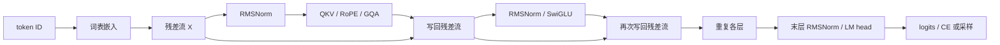

import TransformerFlowLab from '../../../components/labs/TransformerFlowLab'
import CachedAttentionLab from '../../../components/labs/CachedAttentionLab'
import SoftmaxLossLab from '../../../components/labs/SoftmaxLossLab'

RMSNorm、RoPE 和 GQA 单独通过数值检查后，还要核对它们之间的连接：查询总宽度可以不同于隐藏宽度，缓存要存旋转后的键，第二个解码块的位置从历史长度开始，绑定词表权重时参数只计一次。

先修是 [P4 基础 Decoder](/principles/decoder/)、[P7 RoPE](/principles/rope/)、[P8 现代模块](/principles/modern-decoder/) 与 [P10 缓存](/principles/kv-cache/)。本章给出一个完整现代 **decoder-only** 语言模型。它包含训练前向、自动微分、增量前向和文本生成，不含原论文的 encoder 与 cross-attention，也不宣称与某个公开 checkpoint 兼容。

## 先确定任务：同一段文字怎样产生多个预测

考虑一段玩具文本 `[BOS, 春, 风, 来, EOS]`。这里一个汉字就是一个玩具 token，只用于解释移位；真实文本训练继续使用 P1 的字节 BPE。模型输入前四项，目标是后四项：

| 位置 | 模型可读到的前缀 | 该位置的目标 |
| --- | --- | --- |
| 0 | BOS | 春 |
| 1 | BOS、春 | 风 |
| 2 | BOS、春、风 | 来 |
| 3 | BOS、春、风、来 | EOS |

训练时这四个目标可以在一次前向里同时计算：因果 mask 保证每行只能读自己的前缀。生成时下一个 token 尚未确定，所以必须先预测，再将采样结果作为输入继续预测。这是同一个条件分布 $p_\theta(x_{t+1}\mid x_{\le t})$ 的两种执行方式。

本章按这个任务向下展开：ID 查表成为向量，注意力从前缀搬运信息，FFN 处理每个位置的特征，词表头给下一 token 打分，CE 把所有位置的误差传回参数。随后才将这条完整路径改成缓存执行。先看清训练前向，缓存优化就不再是一套独立算法。

## 配置与轴：先把整条路径写下来

使用词表 8、隐藏宽度 12、两层、查询头 4、KV 头 2、头宽 4、前馈宽 20 的手算配置。输入 ID 形状为 $(B,T)$，输出 logits 为 $(B,T,8)$。查询总宽是 $4\times4=16$，大于隐藏宽 12；输出投影负责把 16 映回 12。因此 `reshape` 中不能把最后一轴悄悄设成隐藏宽。

| 对象 | 形状 | 改变它的是哪个操作 |
| --- | --- | --- |
| ID | $(B,T)$ | 分词器与文档窗口 |
| 隐藏状态 $X$ | $(B,T,d)$ | 嵌入、残差、FFN |
| $Q$ | $(B,n_q,T,d_h)$ | Q 投影、头轴重排、RoPE |
| 新增 $K,V$ | $(B,n_{\mathrm{kv}},T,d_h)$ | K/V 投影，K 再旋转 |
| 历史 $K,V$ | $(B,n_{\mathrm{kv}},T_{\mathrm{past}},d_h)$ | 每层缓存 |
| 分数 | $(B,n_q,T,T_{\mathrm{past}}+T)$ | 查询乘全部键 |
| 词表输出 | $(B,T,n_{\mathrm{vocab}})$ | 最后归一化与 LM head |



图中旁路携带的是完整隐藏状态；注意力和 FFN 写回的分支输出都必须回到宽度 $d$。缓存属于每一层的注意力，不是把同一份 K/V 传给所有层。

<TransformerFlowLab client:load />

实验保留查询总宽 16 与隐藏宽 12 的差异。改变 KV 头数时，Q 的四个头不变，K/V 投影与缓存大小改变；改变历史 P 时，当前查询数 U 不变，分数矩阵的键轴增长。阶段菜单将每一步对应到源代码，最后两层的缓存和参数账始终按完整配置计算。

### ID 查表不等于把数字当成大小

设嵌入表 $E\in\mathbb R^{V\times d}$，位置 t 的输入为 $X_{0,t}=E_{\mathrm{id}_t,:}$。ID 2 不比 ID 1“语义大一倍”，相邻 ID 也不保证词义相近。查表等价于 one-hot 行向量乘 E，但实现无需分配 V 维 one-hot。

对于一批输入 `[0,1,2]`，PyTorch 得到 `embedding(ids)` 的形状为 `(1,3,12)`。每行是一个位置，每列是残差特征。所有 token 使用同一张表；各层会不断修改隐藏状态，之后的状态不再只是“单词自己的向量”，而是带有允许前缀信息的表示。

下面所有线性层采用 PyTorch 约定：`Linear(d, k).weight` 实际存成 `(k,d)`，前向是 $XW^\top$。教材若把投影写作 $XW$，往往是把 W 定义成 `(d,k)`。两种记法都可以，映射到代码时必须统一。

## 一个现代块：残差流怎样被两次更新

将 [P8](/principles/modern-decoder/) 的模块放入同一条数据路径。输入是 $X_\ell$，完整块为

$$
Z_\ell=X_\ell+\operatorname{GQA}_\ell(\operatorname{RMSNorm}_{\ell,a}(X_\ell)),
\qquad
X_{\ell+1}=Z_\ell+\operatorname{SwiGLU}_\ell(\operatorname{RMSNorm}_{\ell,f}(Z_\ell)).
$$

两次 RMSNorm 有独立可训练缩放，FFN 读取的是注意力写回后的 $Z_\ell$。若第二个归一化仍读取旧 $X_\ell$，得到的是另一个结构；形状完全相同，因此只检查 shape 找不到这个错误。

SwiGLU 的 gate、up、down 都是无偏置线性层；Q、K、V、O 也无偏置。归一化没有平移参数，末层再做一次 RMSNorm。学习式位置表在这个模型里不存在，位置只进入 Q/K 的 RoPE。V 不旋转，嵌入也不与 sin/cos 相加。

RMSNorm 先把 FP16/BF16 输入提升到 float32 计算平方平均，再将归一化值转回输入类型；float64 核对保留原精度。此举保护统计量，不表示其余矩阵运算也必须全用 float32。epsilon 既影响数值，也属于 checkpoint 的配置。

### RMSNorm：规范的是每个 token 的特征尺度

取一行 $x=(1,2,3,4)$，先令缩放权重全为 1，暂忽略 epsilon：

$$
\operatorname{RMS}(x)=\sqrt{(1+4+9+16)/4}=\sqrt{7.5},
\qquad \widehat x\approx(0.365,0.730,1.095,1.461).
$$

结果平方均值为 1，但均值不等于零。RMSNorm 不减均值，与 LayerNorm 的差别就在这里。每个位置独立算自己的分母，不能沿时间轴归一化，否则未来位置也可能进入当前位置的统计量。

一般式是 $y_i=\gamma_i x_i/r$，$r=\sqrt{d^{-1}\sum_jx_j^2+\epsilon}$。$\gamma_i$ 是可训练缩放，初值为 1；epsilon 防止零向量出现除零。对输入求导得到

$$
\frac{\partial y_i}{\partial x_j}
=\gamma_i\left(\frac{\delta_{ij}}r-\frac{x_ix_j}{d r^3}\right).
$$

这里 $\delta_{ij}$ 是 i=j 时为 1、否则为 0 的 Kronecker 符号。公式中第二项说明同一 token 的所有特征通过分母耦合；RMSNorm 不是简单的每列乘常数。反向时 autograd 会沿平方、平均、倒数平方根这条链计算这些贡献。

### 残差为什么值得保留一条直接路径

对 $z=x+f(x)$，Jacobian 是 $I+J_f(x)$。反向除了经过 f 的路径，还有经过恒等项 I 的路径；这使一个分支变小时，已有表示仍可继续向下一层传递。它不保证任意深模型不会出现梯度问题，但解释了“更新当前状态”与“完全替换当前状态”的结构差异。

本实现让 attention 输出投影与 FFN down 投影的初始化标准差为 $0.02/\sqrt{2L}$，其他线性与嵌入使用 0.02。每层有两条残差分支，深度相关缩放用来控制初始分支量级；它是本课的初始化选择，训练仍要监测激活、梯度与验证损失。

## 多头与旋转：从投影宽度走到注意力

Q 投影为 `Linear(d, n_q*d_h)`，K/V 各为 `Linear(d, n_kv*d_h)`。输出先 reshape 为 $(B,T,n_q,d_h)$，再转置成 $(B,n_q,T,d_h)$。K/V 类似，但头数不同。头维是最后一轴，时间是倒数第二轴。

位置 $p$ 按相邻坐标对旋转，复用 [P7 的 `apply_rope`](/principles/rope/)。第 $r$ 对的频率为 $\omega_r=\beta^{-2r/d_h}$。本实现要求 $d_h$ 为正偶数，只采用相邻配对约定；公开模型可能按两半配对，权重转换必须一起处理。

对查询头 h，使用 KV 头 $\lfloor h/g\rfloor$，其中 $g=n_q/n_{\mathrm{kv}}$。以四个 Q 头、两个 KV 头为例，映射是 `0,0,1,1`。参考实现用 `repeat_interleave` 展开用于运算的 K/V，实际保存的缓存仍只有两个 KV 头。

### 用一行查询手算：相似度怎样变成信息混合

先隔离注意力内部的计算。下面的 Q/K **已经完成位置旋转**，只计算某个头、某个查询位置；头宽为 2，当前查询可见两条键：

$$
q=(1,0),\quad k_0=(1,0),\quad k_1=(0,1),\quad
v_0=(2,0),\quad v_1=(0,4).
$$

缩放分数为 $s=(1/\sqrt2,0)\approx(0.707,0)$。softmax 后

$$
a_0=\frac{e^{0.707}}{e^{0.707}+1}\approx0.670,\qquad a_1\approx0.330,
\qquad y=a_0v_0+a_1v_1\approx(1.340,1.321).
$$

Q/K 决定从哪里读，V 决定读到什么。较大分数并不直接成为输出特征，而是成为加权平均的权重。若再有一条未来键，它必须先设为负无穷，指数为零，才能完全退出分母；先 softmax 再清零会让剩余概率和小于 1。

除以 $\sqrt{d_h}$ 的直觉来自方差：若 q/k 每维近似独立、零均值、方差 1，点积的方差约为 $d_h$。除以平方根后约为 1，减少头宽增长带来的 softmax 饱和。真实特征不严格满足这些假设，这是尺度动机，不能当作任意训练状态的分布保证。

多头先独立完成这种读取，再拼接 y。对本章配置，四头各产生 4 维，拼接为 16 维，O 投影再回到 12 维。不同查询头即使共享 K/V，也有不同 Q 投影，因此可以得到不同权重；GQA 不等于把四个查询输出强制复制为两种。

### RoPE 的相对位置怎样进入点积

在一对坐标上，位置 p 的旋转矩阵为 $R(p\omega)$。旋转保持长度，却改变查询与键的相对角度：

$$
(R(p\omega)q)^\top(R(j\omega)k)
=q^\top R((j-p)\omega)k.
$$

所以相对位移 j−p 进入了分数。多个坐标对使用不同频率，组合成不同尺度的位置变化。本模型把位置范围看作输入契约；“公式可以代入更大的 p”与“模型在更长文本上表现可靠”是两回事。

<Callout tone="note" title="参考计算与存储的边界">
展开 K/V 可以清楚核对 GQA 的数学语义，但会分配临时张量。该实现不证明分组 GPU 内核的速度或峰值显存优势；缓存容量公式与临时计算内存分开记账。
</Callout>

## SwiGLU：注意力读完前缀后，每行怎样加工特征

注意力在时间轴上混合 token，FFN 则对每个位置独立使用同一组权重。设归一化输入为 n，本实现计算

$$
g=W_gn,\quad u=W_un,\quad
m=\operatorname{SiLU}(g)\odot u,\quad
f=W_dm,\qquad \operatorname{SiLU}(a)=a\,\sigma(a).
$$

这里列向量记法中 $W_g,W_u\in\mathbb R^{d_{\mathrm{ff}}\times d}$、$W_d\in\mathbb R^{d\times d_{\mathrm{ff}}}$。乘号 $\odot$ 是逐元素乘，不能替换成矩阵乘法。gate 和 up 读取相同的 n，但有不同参数；一个决定门控值，一个提供被调节的特征。

手算一个两维中间特征：若 $g=(0,1)$、$u=(2,-3)$，则 $\operatorname{SiLU}(g)=(0,0.731)$，相乘得到 $m=(0,-2.193)$。gate 不是只能取 0/1 的开关，也不限制输出为正；down 投影把它们重新组合到残差宽度。

三个矩阵共 $3dd_{\mathrm{ff}}$ 个参数。传统两矩阵 FFN 用中间宽 4d 时是 $8d^2$；若 SwiGLU 想保持近似相同参数预算，应取 $d_{\mathrm{ff}}\approx8d/3$，再按实现需要取整。本章用 20 是小型核对配置，不声称它是某个规模下的最佳宽度。

```python
def forward(self, x, past, cache=None, backend="manual"):
    branch, cache = self.attention(self.norm_attention(x), past, cache, backend)
    z = x + branch
    return z + self.ff(self.norm_ff(z)), cache
```

这段块前向对应前面的十阶段图。读代码时先检查第二次 norm 的输入 z，再检查两个分支都回到 d，最后检查缓存只从 attention 返回。三项都是语义核对，单看输出 shape 不够。

## 因果缓存：新查询的位置不能重新从零开始

设历史长度为 $P=T_{\mathrm{past}}$，新增长度为 $U$。新查询使用绝对位置 $P,P+1,\ldots,P+U-1$。新增 K 按同样位置旋转后接在旧 K 后，V 直接拼接。查询行 i 的允许关系是

$$
M_{ij}=\mathbf 1[j\le P+i],\qquad 0\le i<U,\quad 0\le j<P+U.
$$

例如 $P=3,U=2$，mask 是

```text
query position 3: 1 1 1 1 0
query position 4: 1 1 1 1 1
```

对这个 $2\times5$ 矩阵直接调用从左上开始的 `tril()`，会错误屏蔽绝大多数历史。这里显式比较位置，因此整段前向（P=0）、单 token 解码和多 token chunk 共用一条定义。

<CachedAttentionLab client:load />

这个实验不是只画允许关系：它先旋转确定的 Q/K，再算缩放点积、mask、softmax 和加权 V。默认 P=3、U=2 时，第一查询行的绝对位置为 3。勾选错误 mask 后，概率和仍为 1，但读取范围和输出改变。把 P 设为零后，错误公式与正确公式恰好相同，这说明为何只测试训练整段路径发现不了缓存偏移错误。

缓存保存旋转后的 K：历史位置固定，下次不应重复旋转。每层的 K/V 都检查批大小、KV 头数、头宽、历史长度、设备与 dtype；所有层必须覆盖同一前缀。模型输入超过声明上下文上限就报错。RoPE 在数学上能接受更大位置，不代表该模型已经获得更长上下文能力。

正常训练调用 `model(ids)`，返回完整位置 logits；缓存模式调用 `model.forward_cached(ids, caches)`，返回 logits 与新缓存。教学实现中的普通前向也经过同一块计算，不为两种路径维护两套注意力公式。推理调用方使用 `no_grad()`，避免缓存保留训练图；训练调用方不把不同更新步骤的缓存混用。

## 输出与参数账：共享权重要只算一次

最终隐藏状态为 $H$，绑定输出头时 logits 是 $HE^\top$。E 同时参与输入查表与词表打分，只有一份 `Parameter`，两条路径的梯度相加。独立输出头则有两份 $n_{\mathrm{vocab}}d$ 权重。

每层注意力权重数为 $2d(n_q+n_{\mathrm{kv}})d_h$，SwiGLU 为 $3dd_{\mathrm{ff}}$，两个 RMSNorm 为 $2d$。绑定配置的总数为

$$
N=n_{\mathrm{vocab}}d+n_{\mathrm{layers}}\left[2d(n_q+n_{\mathrm{kv}})d_h+3dd_{\mathrm{ff}}+2d\right]+d.
$$

代入本章小配置，嵌入为 96，每层注意力 576、FFN 720、Norm 24，两层加末层 Norm 12，总数 $96+2\times1320+12=2748$。不绑定时多 96，得到 2844。脚本用所有参数的 `numel()` 核对这个显式账本。

普通参数数量与 FLOP 的关系还受查表、序列长度与注意力平方项影响，见 [S1](/systems/ledger/) 与 [T3](/training/pretraining/)。不要把上式直接当成每个位置执行的 GEMM 权重数。

### 一次词表打分与一份共享权重

单个位置隐藏向量 h 与词表第 v 行的点积为 $z_v=h^\top E_v$，softmax 将这些分数变成候选概率。绑定参数在代码里是 `self.head.weight = self.embedding.weight`，必须共享同一个 `Parameter`；`copy_` 只让两份参数此刻数值相同，之后依然独立更新。

若反向得到词表分数梯度 $g_v$，输出路径对该行嵌入贡献 $g_vh$；输入查表路径也对被使用的行贡献梯度。两部分加到同一个 E 中。这使从未作为本批输入出现的词也可能通过词表头得到更新，不能把嵌入梯度简单理解成“只更新本批出现的 ID”。

## 反向与生成：两个调用方共用同一个模型

训练仍采用下一 token 移位。若文档流是 `[BOS,a,b,EOS]`，输入前三项，目标后三项；模型输出 $(1,3,V)$。复用 `sequence_loss`，反向传播后 AdamW 更新所有可训练参数。模块完整并不意味着可以省略数据划分、优化器状态或评估协议，正式文本训练在 [T3](/training/pretraining/)。

### CE 把哪个错误传回模型

某位置目标为 y，logits 为 z，损失为 $\ell=-z_y+\log\sum_ve^{z_v}$。对每个候选分数求导得到

$$
\frac{\partial\ell}{\partial z_v}=p_v-\mathbf1[v=y].
$$

例如概率为 `(0.1,0.2,0.6,0.1)`，目标是 ID 1，梯度就是 `(0.1,-0.8,0.6,0.1)`。梯度下降会提高真实目标的分数，降低其他分数；再沿词表头、残差、FFN、注意力和嵌入向后传递。有效位置取均值时，每行梯度还要除以有效目标数。padding 或文档边界若要排除，必须先声明哪些预测事件算进目标。

<SoftmaxLossLab client:load />

这里把 M2 的概率实验接到完整网络的末端：实验中的 logits 正是 LM head 的一行输出。温度为 1 时对应普通训练 CE；采样阶段改变温度并不意味着训练损失也应跟着改变。

### 最小训练调用：每行代码都有明确位置

下面代码在仓库的 `code/principles` 目录下可直接作为 Python 片段执行。它只核对更新链；完整训练程序在 T3 保存数据、tokenizer 和优化器状态。

```python
import torch
from modern_decoder import ModernDecoder, generate_cached
from language_model import sequence_loss

torch.manual_seed(13)
model = ModernDecoder(8, width=12, ff_width=20, layers=2,
                      heads=4, kv_heads=2, head_width=4, max_length=12)
stream = torch.tensor([[0, 1, 2, 3, 4]], dtype=torch.long)
inputs, targets = stream[:, :-1], stream[:, 1:]
optimizer = torch.optim.AdamW(model.parameters(), lr=0.02)
model.train()
for step in range(70):
    optimizer.zero_grad(set_to_none=True)
    logits = model(inputs)
    loss = sequence_loss(logits, targets)
    loss.backward()
    optimizer.step()
model.eval()
sample = generate_cached(model, stream[:, :2], max_new_tokens=3,
                         generator=torch.Generator().manual_seed(9))
print(loss.item(), sample.tolist())
```

`zero_grad` 清除上一更新的梯度；`backward` 只累积梯度，不改变参数；`step` 才执行更新。`model.eval()` 改变依赖训练状态的模块行为，`no_grad()` 关闭计算图，两者不是替代关系。本模型没有 dropout，缓存生成函数自身用 `no_grad`，仍保持显式区分这两个职责。

缓存生成先用整个 prompt prefill，从末位置 logits 采样一个 token；下一轮只输入该 token。该 token 的 K/V 在下一轮才写入缓存。最后一次采样后可以立即返回，不必为了“让缓存长度等于返回文本长度”额外执行没有用途的前向。

`generate_cached` 支持温度、top-k、top-p、EOS 和显式随机数生成器。采样规则复用 [P9](/principles/generation/)。零个新 token 直接返回 prompt；prompt 与请求的最大输出长度必须适配声明上下文；生成中不对随机 UTF-8 字节序列保证可解码成合法文本，展示时可以使用替换字符，但数据往返检查仍严格解码。

以 prompt `[BOS,春]` 为例，prefill 后两层缓存各长 2，末行 logits 采样得到“风”。第二次前向仅输入“风”，位置为 2，缓存各长 3，再采样“来”。若此时停止，返回文本长 4，缓存长 3：最新采样 token 尚未被前向处理，这并不矛盾。

缓存减少的是已知历史 K/V 的重新投影和历史 token 的重复层计算。新查询仍然要读取越来越多的历史键，因此单步注意力读历史的成本随 P 增长；缓存不是让所有推理开销都变成常数。两层、单批、KV 头 2、头宽 4 时，每增长一个 token，缓存新增 $2\times2\times2\times4=32$ 个元素。

## 组装顺序：从五个类到完整调用链

完整文件按依赖顺序定义五个类。沿这张表读代码，比从测试尾部猜模型结构更容易：

| 类 | 持有的状态 | 前向职责 |
| --- | --- | --- |
| `RMSNorm` | 逐特征缩放、epsilon | 规范一行特征尺度 |
| `SwiGLU` | gate、up、down 三个矩阵 | 逐位置门控加工 |
| `GroupedAttention` | Q/K/V/O、头配置、RoPE base | 读前缀并返回该层 K/V |
| `ModernBlock` | 两个 norm、attention、FFN | 两次残差更新 |
| `ModernDecoder` | 嵌入、块列表、末层 norm、输出头 | 管理逐层状态、词表输出与输入契约 |

最外层在验证输入与缓存后执行的核心就是：

```python
x = self.embedding(ids)
next_caches = []
for i, block in enumerate(self.blocks):
    previous = None if caches is None else caches[i]
    x, cache = block(x, past, previous, backend)
    next_caches.append(cache)
logits = self.head(self.norm(x))
return logits, next_caches
```

每层共享“本批位置偏移 past”，但不共享参数、隐藏状态或缓存内容。正常前向取返回值中的 logits；缓存前向同时取新缓存。训练与推理因此复用相同的算子定义，差别在输入长度、历史状态与是否构建计算图。

按照嵌入 → 单块 → 多层 → CE → 缓存的顺序核对，某一步首次偏离参考时就能缩小排查范围。先把整段输出与缓存输出比较，再检查 SDPA，最后接真实文本；一次同时引入分词、分布式与低精度，会让错误来源难以定位。

## 完整代码与核对：模型必须接受能暴露错误的输入

<CodeFile path="code/principles/modern_decoder.py" />

运行 `python code/principles/modern_decoder.py`。脚本遍历 MQA、GQA、MHA 与绑定/独立输出头；隐藏宽 12、查询总宽 16，刻意不让它们碰巧相等。整段、五次单 token 与 `2+1+2` 三种分块给出相同 logits，所有层缓存都检查形状。

未来位置替换只允许改变之后的 logits；拆出第一个批样本与整批的第一个输出相同。脚本再比较显式注意力与 PyTorch SDPA 的完整模型输出，核对所有参数有有限梯度，并在固定小批过拟合。固定批 NLL 低于 0.05 是优化链核对，不是自然语言质量承诺。

模型只接受等长、无 padding 的输入。训练程序按独立窗口逐个更新，不将 [T1](/training/data/) 的隔离 packing 直接塞进该模型。若未来接入 padding 或隔离文档，应同时扩展注意力允许关系、位置编号、有效目标、缓存和参考计算，不能只在 loss 上加一个 mask。

## 常见误区

- 在 `reshape` 时假定查询总宽一定是 d，掩盖真实配置的独立头宽。
- 对已旋转历史 K 再做一次 RoPE，或新 chunk 的位置重新从零开始。
- 用普通 `tril(U,P+U)` 当作缓存因果关系。
- 绑定权重后重复统计参数，或者复制数值却没有共享同一个 Parameter。
- 用固定批过拟合或少量生成样例证明模型具有泛化能力。

## 练习与核对

<details>
<summary>上例历史长 3，新增查询行 0 可以读取哪些键？</summary>

它的绝对位置是 3，键 0、1、2、3 可见，键 4 不可见。单步解码也是该公式的 U=1 特例，整行历史和自身都可见。

</details>

<details>
<summary>小配置的两层缓存长 5、批大小 2，共多少个元素？</summary>

K 和 V 各一份，元素数为 $2\times B\times n_{\mathrm{layers}}\times T\times n_{\mathrm{kv}}\times d_h=2\times2\times2\times5\times2\times4=320$。Q 不进入历史缓存，展开的临时 K/V 也不属于持久缓存。

</details>

<details>
<summary>为何普通模型输出正确，还要检查 SDPA 与缓存？</summary>

前者核对公式的执行替换，后者核对历史复用。它们可能分别在布尔 mask 语义、缩放、位置偏移或头映射上出错。选择查询总宽与隐藏宽不同、历史与新增长度不同的例子，才会暴露这些错误。

</details>

接下来进入 [T3 文本训练闭环](/training/pretraining/)，或用 [T9](/training/distributed-training/) 检查同一模型跨进程更新。

完整学习链是：P11 定义预测器，T1/T3 定义哪些 token 事件训练它，T4 判断验证改善是否可信，T7 决定模型和数据预算，T8 回到原始数据补足质量与覆盖，T9 保证增加进程后仍优化同一目标。后面三章是训练专题的深化，阅读顺序不等于生产流水线执行顺序；实际执行时 T8 的清洗与分组发生在 T3 训练之前。

## 原始资料

- [RoFormer](https://arxiv.org/abs/2104.09864)、[RMSNorm](https://arxiv.org/abs/1910.07467)、[GLU Variants](https://arxiv.org/abs/2002.05202)、[GQA](https://arxiv.org/abs/2305.13245)：模块定义分别依照各论文，整合配置是本课教学选择。
- [PyTorch SDPA](https://docs.pytorch.org/docs/stable/generated/torch.nn.functional.scaled_dot_product_attention.html)：作为执行对照，布尔 True 表示允许关注；此处不依靠 `is_causal=True` 推断缓存位置。
