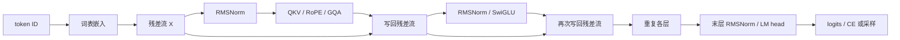

import TransformerFlowLab from '../../../components/labs/TransformerFlowLab'

用 `[BOS,春,风,来,EOS]` 训练下一 token 预测器：输入前四个 token，模型一次给出四行词表分数；随后只给它 `[BOS,春]`，让同一个模型逐步生成余下文本。本章要核对这两种调用是否沿着同一组参数和同一条因果计算路径。

阅读前建议掌握 [P4 基础 Decoder](/principles/decoder/)、[P8 常见结构](/principles/modern-decoder/)、[P9 生成](/principles/generation/) 和 [P10 KV cache](/principles/kv-cache/)。本章复用已推导的模块来组装 **decoder-only** 语言模型；模型是教学配置，并非某个公开模型的 checkpoint。

## 训练目标：一段文本对应哪四次预测

给五个符号分配 ID：`BOS=0`、`春=1`、`风=2`、`来=3`、`EOS=4`。词表大小取 8，余下三个 ID 只是同场竞争的候选。这里一个汉字算一个教学 token；真实语料先由 [P1 tokenizer](/principles/tokenization/) 编码。

| 输入位置 | 输入 ID | 可读取的前缀 | 目标 ID |
| --- | --- | --- | --- |
| 0 | `0` | BOS | `1` 春 |
| 1 | `1` | BOS、春 | `2` 风 |
| 2 | `2` | BOS、春、风 | `3` 来 |
| 3 | `3` | BOS、春、风、来 | `4` EOS |

输入 `[[0,1,2,3]]` 的形状是 $(B,T)=(1,4)$；目标 `[[1,2,3,4]]` 也是 $(1,4)$。因果 mask 使四行可以并行计算，却不让第 0 行偷看“春”之后的 token。每行预测的是其**后一个** token，不是复原本行输入。生成时目标未知，必须先得到最后一行 logits，再选下一个 ID。

训练与生成共同调用 `ModernDecoder`：ID 查 embedding，两个块逐层更新隐藏状态，末层给词表打分。训练把四行分数变成损失并更新参数；生成读取最后一行分数，然后将新 ID 连同逐层 KV cache 送回模型。

## 形状路径：四个 ID 怎样变成四行 logits

固定 `vocab_size=8, width=12, layers=2, heads=4, kv_heads=2, head_width=4, ff_width=20`。这比 P8 的二维手算模型大，是为了检验查询总宽 $n_qd_h=16$ 与残差宽 $d=12$ **不同**时仍能连接；模块的数值推导仍在 P8，本章核对组装后的维度。

| 阶段 | 本例形状 | 下一步为什么能连接 |
| --- | --- | --- |
| 输入 ID | $(1,4)$ | `Embedding(8,12)` 按 ID 取行 |
| 隐藏状态 $X$ | $(1,4,12)$ | 两个残差块始终写回宽 12 |
| 每层 $Q$ | $(1,4,4,4)$ | 四个查询头，每头宽 4 |
| 每层 $K,V$ | 各 $(1,2,4,4)$ | 两个 KV 头，每头宽 4 |
| 注意力分数 | $(1,4,4,4)$ | 每个查询头的四行对四个键打分 |
| 输出 logits | $(1,4,8)$ | 每行对八个候选 ID 打分 |

图中旁路携带宽 12 的隐藏状态。Q 的宽 16 只存在于注意力内部，经输出投影才能写回残差流；两层注意力分别产生各自的 K/V。

<TransformerFlowLab client:load />

调用预设把同一形状链置于三个具体时刻：训练一次处理 `[BOS,春,风,来]` 四行，prefill 处理 `[BOS,春]` 两行，随后 decode 只追加“风”这一行。选择有效查询行时，图下同时给出它的绝对位置与可读键上界；生成取最后有效行，而训练的四行分别监督春、风、来、EOS。阶段选择展示算子次序和形状账，不代替实际权重前向的数值验证。

在实验中先固定隐藏宽 12 和四个查询头。改变 KV 头数只会改变 K/V 的宽度与缓存量；改变历史长度只会改变分数矩阵的键轴长度。它们都不应改变输出 logits 的词表轴 8。

### ID 进入残差流

设嵌入表 $E\in\mathbb R^{V\times d}$，位置 t 的输入为 $X_{0,t}=E_{\mathrm{id}_t,:}$。ID 2 不比 ID 1“语义大一倍”，相邻 ID 也不保证词义相近。查表等价于 one-hot 行向量乘 E，但实现无需分配 V 维 one-hot。

本例 `embedding([[0,1,2,3]])` 得到 $(1,4,12)$。查出的四行使用同一张表，却随后沿各自可见的前缀更新；第 3 行经历两个注意力块后，已不只是“来”的词向量。

PyTorch 的 `Linear(d,k).weight` 存为 $(k,d)$，前向是 $XW^\top$。下文按这个实际存储形状计算参数数量。

## 两次残差更新：每层怎样读前缀并保留宽度

[P8](/principles/modern-decoder/) 已逐项手算 RMSNorm、RoPE、GQA、SwiGLU 和绑定输出头。那里的模型是**词表 3、隐藏宽 2、一个块**；本章扩为**词表 8、隐藏宽 12、两个块**。P8 的数值不能直接代入本章，但各模块的输入输出契约保持一致。

对第 ℓ 层的隐藏状态 $X_\ell\in\mathbb R^{1\times4\times12}$，代码依次计算

$$
Z_\ell=X_\ell+\operatorname{GQA}_\ell(\operatorname{RMSNorm}_{\ell,a}(X_\ell)),
\qquad
X_{\ell+1}=Z_\ell+\operatorname{SwiGLU}_\ell(\operatorname{RMSNorm}_{\ell,f}(Z_\ell)).
$$

两个 norm 的参数彼此独立，第二个读取**注意力更新后的** $Z_\ell$。RMSNorm 只沿每行的 12 个特征算平方平均；SwiGLU 对四行分别做相同的特征变换。跨位置读取只发生在 GQA 中，因果 mask 令第 $t$ 行仅可读取 $0,\ldots,t$ 的键。

本例 GQA 中，四个 Q 头分成两组：头 `0,1` 共享第一组 K/V，头 `2,3` 共享第二组 K/V。它们共享 K/V，查询投影和注意力权重仍各自独立。Q/K 每头四个坐标按 [P7 RoPE](/principles/rope/) 旋转，V 不旋转；输出投影把拼接的 16 维结果映回 12 维。漏掉这一步，注意力分支就无法与残差相加。

第一层写回后，第二层读到 $X_1$，不是原始 embedding。两层参数和 KV cache 均独立。残差让每个分支保留旧状态的直接路径，却不保证训练必然稳定；初始化与优化细节由 [T2](/training/optimization/) 处理。

## 词表头与损失：四行分数怎样产生一次更新

两层结束得到 $X_2$，经末层 RMSNorm 得到 $H\in\mathbb R^{1\times4\times12}$。本模型将输出矩阵与输入 embedding 表 $E\in\mathbb R^{8\times12}$ **绑定为同一个参数对象**，因此

$$
\operatorname{logits}=HE^\top\in\mathbb R^{1\times4\times8}.
$$

第 $t$ 行目标是表中第 $t$ 个目标 ID，即 `1,2,3,4`。对每行做 softmax，取目标概率的负对数，再对四个有效位置取平均：

$$
L=-\frac14\sum_{t=0}^{3}
\log p_\theta(\text{targets}_t\mid \text{inputs}_{0:t}).
$$

四个条件分别是 $p(春\mid BOS)$、$p(风\mid BOS,春)$、$p(来\mid BOS,春,风)$ 和 $p(EOS\mid BOS,春,风,来)$。`sequence_loss` 实现同一移位目标。EOS 是要预测的真实结束事件；这里没有 padding 或跨文档位置。[T1](/training/data/) 再处理多文档与有效目标 mask。

一次更新的路径是 `logits -> L -> backward() -> optimizer.step()`。词表头的梯度回流至两层块，也回流至共享的 $E$。输入查表只访问 ID `0,1,2,3`，输出头却给八个 ID 都打分，因此未作为输入出现的 EOS 行也可能得到梯度。`backward()` 只计算并累积梯度，`step()` 才改变参数；下一轮更新前要清除旧梯度。

固定随机种子 13，脚本测得初始平均损失 **2.127761**；对这个教学样本做 70 次 AdamW 更新后为 **0.002233**。这说明从损失到参数的链条能工作，不能把训练样本过拟合当作泛化证据。正式训练的数据划分、优化状态与评估分别在 [T1](/training/data/)、[T2](/training/optimization/) 和 [T3](/training/pretraining/) 展开。

## 参数与缓存：权重绑定和 GQA 究竟省在哪里

先按实际矩阵尺寸计一层。Q 和输出投影各有 $12\times(4\times4)=192$ 个权重；K、V 各有 $12\times(2\times4)=96$，所以注意力为 $576$。SwiGLU 的 gate、up、down 各有 $12\times20=240$，共 $720$。两个 RMSNorm 各有 12 个缩放参数，共 24；一层合计 **1320**。

Embedding 表为 $8\times12=96$，两层共 $2\times1320=2640$，末层 RMSNorm 有 12 个参数。绑定输出头不再另算一张词表矩阵，总数为

$$
N=96+2(576+720+24)+12=\boxed{2748}.
$$

若改成独立输出头，新增 96 个权重，总数 2844。若只把 KV 头数从 2 改成 4，每层 K/V 权重再增加 $2\times12\times(2\times4)=192$，两层共增加 384；Q/O 和词表头不变。这是参数数量变化，不直接给出质量或速度结论。

训练输入长 4 时，每层返回 K/V 各 $(1,2,4,4)$，两层缓存共 $2\times1\times2\times4\times2\times4=128$ 个元素。缓存元素随历史长度增长，参数数目不随输入长度变化。各层 K/V 来自各自的隐藏状态和投影，不是共享的一份状态。

## 生成：同一前向怎样只处理新 token

训练完成后以 `[BOS,春]`，即 `[[0,1]]` 为 prompt。**Prefill** 一次处理两行，得到末行 logits 和两层各长 2 的 KV cache；按 [P9 采样规则](/principles/generation/) 选出“风”。下一次 **decode** 只送入刚选出的 ID `2`，其绝对位置是 2；每层将新 K/V 接在本层旧缓存后，再预测“来”。本次固定随机种子得到 `[0,1,2,3,4]`。

区分“已经输出的 token”和“已经送入模型的 token”。初次 prefill 后，采样出的“风”已在返回文本中，却尚未生成它自身的 K/V；下一轮送入时才写入缓存。最后采样出 EOS 后函数立即返回，故最终文本长 5，而缓存只覆盖前四个 token。这是执行时序，不是缓存丢失。

一层若已有历史 $P$ 行、本次新增 $U$ 行，新增查询行 $i$ 的绝对位置是 $P+i$，可读键条件为 $j\le P+i$。RoPE 对新 Q/K 使用这些绝对位置；历史 K 已旋转且不再重算。[P10](/principles/kv-cache/) 给出了整段、分块和逐 token 注意力分数一致的推导。本章脚本将**完整模型 logits**在三种切分 `5`、`2+1+2`、`1+1+1+1+1` 下比较，每步核对所有层的缓存形状；只比较生成文字会漏掉分数错误。

缓存复用历史 K/V 和历史层计算；新查询仍须读取可见的历史键。它减少重复前向，不使单步注意力成本与历史长度无关。本教学模型只接受等长、无 padding 输入；文档隔离、变长批次和滑动窗口需要另定位置与 mask 规则，不能把有效目标 mask 直接当作注意力 mask。

## 运行整条路径

下面脚本复用 [P8 的模型实现](/principles/modern-decoder/) 与 [P2 的损失函数](/principles/language-modeling/)，没有复制模块公式。它核对 $(1,4,8)$ logits、2748 个共享参数和损失下降，再在固定参数下比较缓存切分，最后从同一段文本前两项生成。运行 `python code/principles/complete_transformer.py`。

<CodeFile path="code/principles/complete_transformer.py" />

<Callout tone="note" title="核对边界">
固定种子与样本用于复现计算路径。模型实现以 `repeat_interleave` 临时展开 K/V，并用 `torch.cat` 追加缓存，清楚但未优化显存和吞吐；生产内核与缓存管理见 [S3](/systems/flash-attention/) 和 [S5](/systems/paged-cache/)。
</Callout>

## 常见误区

- 把 Q 的总宽 16 当作残差宽 12：本例必须经输出投影才能相加。
- 将目标整体右移两次，或把 EOS 当作 padding 删除：都会改变四个预测事件。
- 只绑定输入与输出矩阵的数值，不共享同一个参数对象：更新后两张表会分离。
- 把最后采样的 token 也计入缓存长度：它尚未被模型前向处理。
- 用单个训练样本的低损失推断模型理解自然语言：这里只检验计算链条。

## 练习与核对

输入仍为 `[0,1,2,3]`，但最后一个目标被误设为 `3`，损失实际在训练什么？

前三行仍预测 `1,2,3`；最后一行改成预测“来”自身，而非 EOS。模型将“在 BOS、春、风、来之后结束”误学为“再来一个来”。logits 形状完全不变，所以要检查移位目标 ID。

把 KV 头数改为 4，长度为 5 时，两层缓存有多少元素？参数新增多少？

缓存有 K/V 两份：$2\times B\times n_{\mathrm{layers}}\times T\times n_{\mathrm{kv}}\times d_h=2\times1\times2\times5\times4\times4=320$ 个元素。原两 KV 头在同样长度下是 160。每层 K/V 投影各增加 $12\times8=96$ 个权重；两层共新增 384。Q/O、FFN 和绑定词表表不变。

为什么生成“风”后缓存仍只长 2？下一轮的输入和绝对位置是什么？

本轮前向只处理了 prompt，随后才从末行分数采样“风”。下一轮把“风”的 ID `2` 作为新增输入，其绝对位置从缓存历史长度 2 开始；前向后各层缓存长 3。每个新查询都需用自身真实位置计算 RoPE。

接下来 [T1](/training/data/) 定义数据和有效目标，[T2](/training/optimization/) 定义更新规则，[T3](/training/pretraining/) 将预测器放入可复现的文本训练流程。

## 原始资料

- [Attention Is All You Need](https://arxiv.org/abs/1706.03762)：因果注意力和 decoder 结构的源头；本章采用后续变体，模块公式见 P8 的原始资料。
- [PyTorch Embedding](https://docs.pytorch.org/docs/stable/generated/torch.nn.Embedding.html)、[Linear](https://docs.pytorch.org/docs/stable/generated/torch.nn.Linear.html)、[CrossEntropyLoss](https://docs.pytorch.org/docs/stable/generated/torch.nn.CrossEntropyLoss.html)：查表、权重形状与损失归约的 API 依据。
