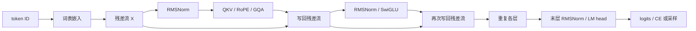

分别运行 RMSNorm、RoPE 和 GQA 都得到正确数字，不代表把它们放在一起就会得到正确模型。最容易出错的地方恰好在模块之间：查询总宽度不一定等于隐藏宽度，旋转后的键才进入缓存，第二个解码块的位置从历史长度开始，绑定词表权重后参数不能计算两次。

先修是 [P4 基础 Decoder](/principles/decoder/)、[P7 RoPE](/principles/rope/)、[P8 现代模块](/principles/modern-decoder/) 与 [P10 缓存](/principles/kv-cache/)。本章给出一个完整现代 **decoder-only** 语言模型。它包含训练前向、自动微分、增量前向和文本生成，不含原论文的 encoder 与 cross-attention，也不宣称与某个公开 checkpoint 兼容。

## 配置与轴：先把整条路径写下来

使用词表 8、隐藏宽度 12、两层、查询头 4、KV 头 2、头宽 4、前馈宽 20 的手算配置。输入 ID 形状为 $(B,T)$，输出 logits 为 $(B,T,8)$。查询总宽是 $4\times4=16$，大于隐藏宽 12；输出投影负责把 16 映回 12。因此 `reshape` 中不能把最后一轴悄悄设成隐藏宽。

| 对象 | 形状 | 改变它的是哪个操作 |
| --- | --- | --- |
| ID | $(B,T)$ | 分词器与文档窗口 |
| 隐藏状态 $X$ | $(B,T,d)$ | 嵌入、残差、FFN |
| $Q$ | $(B,n_q,T,d_h)$ | Q 投影、头轴重排、RoPE |
| 新增 $K,V$ | $(B,n_{\mathrm{kv}},T,d_h)$ | K/V 投影，K 再旋转 |
| 历史 $K,V$ | $(B,n_{\mathrm{kv}},T_{\mathrm{past}},d_h)$ | 每层缓存 |
| 分数 | $(B,n_q,T,T_{\mathrm{past}}+T)$ | 查询乘全部键 |
| 词表输出 | $(B,T,n_{\mathrm{vocab}})$ | 最后归一化与 LM head |



图中旁路携带的是完整隐藏状态；注意力和 FFN 写回的分支输出都必须回到宽度 $d$。缓存属于每一层的注意力，不是把同一份 K/V 传给所有层。

## 一个现代块：残差流怎样被两次更新

沿用 [P8](/principles/modern-decoder/) 的定义，不重新证明各模块。输入是 $X_\ell$，完整块为

$$
Z_\ell=X_\ell+\operatorname{GQA}_\ell(\operatorname{RMSNorm}_{\ell,a}(X_\ell)),
\qquad
X_{\ell+1}=Z_\ell+\operatorname{SwiGLU}_\ell(\operatorname{RMSNorm}_{\ell,f}(Z_\ell)).
$$

两次 RMSNorm 有独立可训练缩放，FFN 读取的是注意力写回后的 $Z_\ell$。若第二个归一化仍读取旧 $X_\ell$，得到的是另一个结构；形状完全相同，因此只检查 shape 找不到这个错误。

SwiGLU 的 gate、up、down 都是无偏置线性层；Q、K、V、O 也无偏置。归一化没有平移参数，末层再做一次 RMSNorm。学习式位置表在这个模型里不存在，位置只进入 Q/K 的 RoPE。V 不旋转，嵌入也不与 sin/cos 相加。

RMSNorm 先把 FP16/BF16 输入提升到 float32 计算平方平均，再将归一化值转回输入类型；float64 核对保留原精度。此举保护统计量，不表示其余矩阵运算也必须全用 float32。epsilon 既影响数值，也属于 checkpoint 的配置。

## 多头与旋转：从投影宽度走到注意力

Q 投影为 `Linear(d, n_q*d_h)`，K/V 各为 `Linear(d, n_kv*d_h)`。输出先 reshape 为 $(B,T,n_q,d_h)$，再转置成 $(B,n_q,T,d_h)$。K/V 类似，但头数不同。头维是最后一轴，时间是倒数第二轴。

位置 $p$ 按相邻坐标对旋转，复用 [P7 的 `apply_rope`](/principles/rope/)。第 $r$ 对的频率为 $\omega_r=\beta^{-2r/d_h}$。本实现要求 $d_h$ 为正偶数，只采用相邻配对约定；公开模型可能按两半配对，权重转换必须一起处理。

对查询头 h，使用 KV 头 $\lfloor h/g\rfloor$，其中 $g=n_q/n_{\mathrm{kv}}$。以四个 Q 头、两个 KV 头为例，映射是 `0,0,1,1`。参考实现用 `repeat_interleave` 展开用于运算的 K/V，实际保存的缓存仍只有两个 KV 头。

<Callout tone="note" title="参考计算与存储的边界">
展开 K/V 可以清楚核对 GQA 的数学语义，但会分配临时张量。该实现不证明分组 GPU 内核的速度或峰值显存优势；缓存容量公式与临时计算内存分开记账。
</Callout>

## 因果缓存：新查询的位置不能重新从零开始

设历史长度为 $P=T_{\mathrm{past}}$，新增长度为 $U$。新查询使用绝对位置 $P,P+1,\ldots,P+U-1$。新增 K 按同样位置旋转后接在旧 K 后，V 直接拼接。查询行 i 的允许关系是

$$
M_{ij}=\mathbf 1[j\le P+i],\qquad 0\le i<U,\quad 0\le j<P+U.
$$

例如 $P=3,U=2$，mask 是

```text
query position 3: 1 1 1 1 0
query position 4: 1 1 1 1 1
```

对这个 $2\times5$ 矩阵直接调用从左上开始的 `tril()`，会错误屏蔽绝大多数历史。这里显式比较位置，因此整段前向（P=0）、单 token 解码和多 token chunk 共用一条定义。

缓存保存旋转后的 K：历史位置固定，下次不应重复旋转。每层的 K/V 都检查批大小、KV 头数、头宽、历史长度、设备与 dtype；所有层必须覆盖同一前缀。模型输入超过声明上下文上限就报错。RoPE 在数学上能接受更大位置，不代表该模型已经获得更长上下文能力。

正常训练调用 `model(ids)`，返回完整位置 logits；缓存模式调用 `model.forward_cached(ids, caches)`，返回 logits 与新缓存。教学实现中的普通前向也经过同一块计算，不为两种路径维护两套注意力公式。推理调用方使用 `no_grad()`，避免缓存保留训练图；训练调用方不把不同更新步骤的缓存混用。

## 输出与参数账：共享权重要只算一次

最终隐藏状态为 $H$，绑定输出头时 logits 是 $HE^\top$。E 同时参与输入查表与词表打分，只有一份 `Parameter`，两条路径的梯度相加。独立输出头则有两份 $n_{\mathrm{vocab}}d$ 权重。

每层注意力权重数为 $2d(n_q+n_{\mathrm{kv}})d_h$，SwiGLU 为 $3dd_{\mathrm{ff}}$，两个 RMSNorm 为 $2d$。绑定配置的总数为

$$
N=n_{\mathrm{vocab}}d+n_{\mathrm{layers}}\left[2d(n_q+n_{\mathrm{kv}})d_h+3dd_{\mathrm{ff}}+2d\right]+d.
$$

代入本章小配置，嵌入为 96，每层注意力 576、FFN 720、Norm 24，两层加末层 Norm 12，总数 $96+2\times1320+12=2748$。不绑定时多 96，得到 2844。脚本用所有参数的 `numel()` 核对这个显式账本。

普通参数数量与 FLOP 的关系还受查表、序列长度与注意力平方项影响，见 [S1](/systems/ledger/) 与 [T3](/training/pretraining/)。不要把上式直接当成每个位置执行的 GEMM 权重数。

## 反向与生成：两个调用方共用同一个模型

训练仍采用下一 token 移位。若文档流是 `[BOS,a,b,EOS]`，输入前三项，目标后三项；模型输出 $(1,3,V)$。复用 `sequence_loss`，反向传播后 AdamW 更新所有可训练参数。模块完整并不意味着可以省略数据划分、优化器状态或评估协议，正式文本训练在 [T3](/training/pretraining/)。

缓存生成先用整个 prompt prefill，从末位置 logits 采样一个 token；下一轮只输入该 token。该 token 的 K/V 在下一轮才写入缓存。最后一次采样后可以立即返回，不必为了“让缓存长度等于返回文本长度”额外执行没有用途的前向。

`generate_cached` 支持温度、top-k、top-p、EOS 和显式随机数生成器。采样规则复用 [P9](/principles/generation/)。零个新 token 直接返回 prompt；prompt 与请求的最大输出长度必须适配声明上下文；生成中不对随机 UTF-8 字节序列保证可解码成合法文本，展示时可以使用替换字符，但数据往返检查仍严格解码。

## 完整代码与核对：模型必须接受能暴露错误的输入

<CodeFile path="code/principles/modern_decoder.py" />

运行 `python code/principles/modern_decoder.py`。脚本遍历 MQA、GQA、MHA 与绑定/独立输出头；隐藏宽 12、查询总宽 16，刻意不让它们碰巧相等。整段、五次单 token 与 `2+1+2` 三种分块给出相同 logits，所有层缓存都检查形状。

未来位置替换只允许改变之后的 logits；拆出第一个批样本与整批的第一个输出相同。脚本再比较显式注意力与 PyTorch SDPA 的完整模型输出，核对所有参数有有限梯度，并在固定小批过拟合。固定批 NLL 低于 0.05 是优化链核对，不是自然语言质量承诺。

模型只接受等长、无 padding 的输入。训练程序按独立窗口逐个更新，不将 [T1](/training/data/) 的隔离 packing 直接塞进该模型。若未来接入 padding 或隔离文档，应同时扩展注意力允许关系、位置编号、有效目标、缓存和参考计算，不能只在 loss 上加一个 mask。

## 常见误区

- 在 `reshape` 时假定查询总宽一定是 d，掩盖真实配置的独立头宽。
- 对已旋转历史 K 再做一次 RoPE，或新 chunk 的位置重新从零开始。
- 用普通 `tril(U,P+U)` 当作缓存因果关系。
- 绑定权重后重复统计参数，或者复制数值却没有共享同一个 Parameter。
- 用固定批过拟合或少量生成样例证明模型具有泛化能力。

## 练习与核对

<details>
<summary>上例历史长 3，新增查询行 0 可以读取哪些键？</summary>

它的绝对位置是 3，键 0、1、2、3 可见，键 4 不可见。单步解码也是该公式的 U=1 特例，整行历史和自身都可见。

</details>

<details>
<summary>小配置的两层缓存长 5、批大小 2，共多少个元素？</summary>

K 和 V 各一份，元素数为 $2\times B\times n_{\mathrm{layers}}\times T\times n_{\mathrm{kv}}\times d_h=2\times2\times2\times5\times2\times4=320$。Q 不进入历史缓存，展开的临时 K/V 也不属于持久缓存。

</details>

<details>
<summary>为何普通模型输出正确，还要检查 SDPA 与缓存？</summary>

前者核对公式的执行替换，后者核对历史复用。它们可能分别在布尔 mask 语义、缩放、位置偏移或头映射上出错。选择查询总宽与隐藏宽不同、历史与新增长度不同的例子，才会暴露这些错误。

</details>

接下来进入 [T3 文本训练闭环](/training/pretraining/)，或用 [T9](/training/distributed-training/) 检查同一模型跨进程更新。

## 原始资料

- [RoFormer](https://arxiv.org/abs/2104.09864)、[RMSNorm](https://arxiv.org/abs/1910.07467)、[GLU Variants](https://arxiv.org/abs/2002.05202)、[GQA](https://arxiv.org/abs/2305.13245)：模块定义分别依照各论文，整合配置是本课教学选择。
- [PyTorch SDPA](https://docs.pytorch.org/docs/stable/generated/torch.nn.functional.scaled_dot_product_attention.html)：作为执行对照，布尔 True 表示允许关注；此处不依靠 `is_causal=True` 推断缓存位置。
