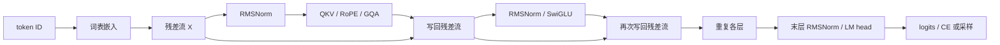

import TransformerFlowLab from '../../../components/labs/TransformerFlowLab'
import SwiGluLab from '../../../components/labs/SwiGluLab'

用 `[BOS,春,风,来,EOS]` 训练下一 token 预测器：输入前四个 token，模型一次给出四行词表分数；随后只给它 `[BOS,春]`，让同一个模型逐步生成余下文本。本章要核对这两种调用是否沿着同一组参数和同一条因果计算路径。

阅读前建议掌握 [P4 基础 Decoder](/principles/decoder/)、[P8 归一化](/principles/normalization/)、[P9 头共享](/principles/head-sharing/) 、[P10 门控 FFN](/principles/gated-ffn/)、[P11 生成](/principles/generation/) 和 [P12 KV cache](/principles/kv-cache/)。本章复用已推导的模块来组装 **decoder-only** 语言模型；模型是教学配置，并非某个公开模型的 checkpoint。

## 训练目标：一段文本对应哪四次预测

给五个符号分配 ID：`BOS=0`、`春=1`、`风=2`、`来=3`、`EOS=4`。词表大小取 8，余下三个 ID 只是同场竞争的候选。这里一个汉字算一个教学 token；真实语料先由 [P1 tokenizer](/principles/tokenization/) 编码。

| 输入位置 | 输入 ID | 可读取的前缀 | 目标 ID |
| --- | --- | --- | --- |
| 0 | `0` | BOS | `1` 春 |
| 1 | `1` | BOS、春 | `2` 风 |
| 2 | `2` | BOS、春、风 | `3` 来 |
| 3 | `3` | BOS、春、风、来 | `4` EOS |

输入 `[[0,1,2,3]]` 的形状是 $(B,T)=(1,4)$；目标 `[[1,2,3,4]]` 也是 $(1,4)$。因果 mask 使四行可以并行计算，却不让第 0 行偷看“春”之后的 token。每行预测的是其**后一个** token，不是复原本行输入。生成时目标未知，必须先得到最后一行 logits，再选下一个 ID。

训练与生成共同调用 `Transformer`：ID 查 embedding，两个块逐层更新隐藏状态，末层给词表打分。训练把四行分数变成损失并更新参数；生成读取最后一行分数，然后将新 ID 连同逐层 KV cache 送回模型。

## 形状路径：四个 ID 怎样变成四行 logits

固定 `decoder_config(vocab_size=8, dim=12, layers=2, heads=4, kv_heads=2, head_dim=4, ff_dim=20, max_length=12)`。`ModelConfig` 定义词表和层数，`BlockConfig` 定义 norm 与 FFN，内部 `AttentionConfig`/`PositionConfig` 定义 GQA 和 RoPE。查询总宽 $H_qD_h=16$ 与残差宽 $D=12$ 不同，本章检验这些已推导单元能否实际接上。

| 阶段 | 本例形状 | 下一步为什么能连接 |
| --- | --- | --- |
| 输入 ID | $(1,4)$ | `Embedding(8,12)` 按 ID 取行 |
| 隐藏状态 $X$ | $(1,4,12)$ | 两个残差块始终写回宽 12 |
| 每层 $Q$ | $(1,4,4,4)$ | 四个查询头，每头宽 4 |
| 每层 $K,V$ | 各 $(1,2,4,4)$ | 两个 KV 头，每头宽 4 |
| 注意力分数 | $(1,4,4,4)$ | 每个查询头的四行对四个键打分 |
| 输出 logits | $(1,4,8)$ | 每行对八个候选 ID 打分 |

图中旁路携带宽 12 的隐藏状态。Q 的宽 16 只存在于注意力内部，经输出投影才能写回残差流；两层注意力分别产生各自的 K/V。

<TransformerFlowLab client:visible />

保持 KV 头数为 2，依次选择“训练”“prefill”“decode”三个调用预设。每次都将计算阶段切到“末层 RMSNorm 与词表头”，核对如下读数：

| 调用 | 本次输入 | logits 形状 | 前向完成后两层缓存元素数 |
| --- | --- | --- | --- |
| 训练 | `[BOS,春,风,来]` | $(1,4,8)$ | 128 |
| prefill | `[BOS,春]` | $(1,2,8)$ | 64 |
| decode | `[风]`，历史长 2 | $(1,1,8)$ | 96 |

在 decode 预设中，选中行 0，核对绝对位置为 2、可读键为 0–2。生成只取最后有效行；训练则让四行分别预测春、风、来、EOS。这个实验展示算子次序和形状账，实际权重产生的数值由脚本验证。

隐藏宽始终为 12，查询头数始终为 4。只改变 KV 头数时，K/V 宽度与缓存量会变，输出词表轴仍为 8。只改变历史长度时，分数矩阵的键轴会变，本次查询行数保持不变。

### ID 进入残差流

设 embedding 表 $E\in\mathbb R^{V\times D}$，位置 $t$ 的输入为 $X_{0,t}=E_{\mathrm{id}_t,:}$。ID 是行地址，相邻 ID 不保证词义相近。查表等价于 one-hot 行向量乘 $E$，但实现无需分配 $V$ 维 one-hot。

本例 `embedding([[0,1,2,3]])` 得到 $(1,4,12)$。查出的四行使用同一张表，却随后沿各自可见的前缀更新；第 3 行经历两个注意力块后，已不只是“来”的词向量。

PyTorch 的 `Linear(D,k).weight` 存为 $(k,D)$，前向是 $XW^\top$。下文按这个实际存储形状计算参数数量。

## 两次残差更新：每层怎样读前缀并保留宽度

[P8](/principles/normalization/)、[P9](/principles/head-sharing/) 和 [P10](/principles/gated-ffn/) 已分别手算 norm、共享头和门控乘积。现在选择 Pre-RMSNorm、GQA 与 SwiGLU，同 [P7 RoPE](/principles/rope/) 组合；各单元的数学定义保持不变，输入却来自同一模型的上一阶段，而不再是独立例题的人为向量。

对第 ℓ 层的隐藏状态 $X_\ell\in\mathbb R^{1\times4\times12}$，代码依次计算

$$
Z_\ell=X_\ell+\operatorname{GQA}_\ell(\operatorname{RMSNorm}_{\ell,a}(X_\ell)),
\qquad
X_{\ell+1}=Z_\ell+\operatorname{SwiGLU}_\ell(\operatorname{RMSNorm}_{\ell,f}(Z_\ell)).
$$

两个 norm 的参数彼此独立，第二个读取**注意力更新后的** $Z_\ell$。RMSNorm 只沿每行的 12 个特征算平方平均；SwiGLU 对四行分别做相同的特征变换。跨位置读取只发生在 GQA 中，因果 mask 令第 $t$ 行仅可读取 $0,\ldots,t$ 的键。

本例 GQA 中，四个 Q 头分成两组：头 `0,1` 共享第一组 K/V，头 `2,3` 共享第二组 K/V。它们共享 K/V，查询投影和注意力权重仍各自独立。Q/K 每头四个坐标按 [P7 RoPE](/principles/rope/) 旋转，V 不旋转；输出投影把拼接的 16 维结果映回 12 维。漏掉这一步，注意力分支就无法与残差相加。

第一层写回后，第二层读到 $X_1$，不是原始 embedding。两层参数和 KV cache 均独立。残差让每个分支保留旧状态的直接路径，却不保证训练必然稳定；初始化与优化细节由 [T2](/training/optimization/) 处理。

## 词表头与损失：四行分数怎样产生一次更新

两层结束得到 $X_2$，经末层 RMSNorm 得到 $H\in\mathbb R^{1\times4\times12}$。本模型将输出矩阵与输入 embedding 表 $E\in\mathbb R^{8\times12}$ **绑定为同一个参数对象**，因此

$$
\operatorname{logits}=HE^\top\in\mathbb R^{1\times4\times8}.
$$

第 $t$ 行目标是表中第 $t$ 个目标 ID，即 `1,2,3,4`。对每行做 softmax，取目标概率的负对数，再对四个有效位置取平均：

$$
L=-\frac14\sum_{t=0}^{3}
\log p_\theta(\text{targets}_t\mid \text{inputs}_{0:t}).
$$

四个条件分别是 $p(春\mid BOS)$、$p(风\mid BOS,春)$、$p(来\mid BOS,春,风)$ 和 $p(EOS\mid BOS,春,风,来)$。调用 `token_loss(logits, targets)` 对已经移位的目标计算交叉熵；函数本身不再移位。EOS 是要预测的真实结束事件；这里没有 padding 或跨文档位置。[T1](/training/data/) 再处理多文档与有效目标 mask。

一次更新的路径是 `logits -> L -> backward() -> optimizer.step()`。词表头的梯度回流至两层块，也回流至共享的 $E$。输入查表只访问 ID `0,1,2,3`，输出头却给八个 ID 都打分，因此未作为输入出现的 EOS 行也可能得到梯度。`backward()` 只计算并累积梯度，`step()` 才改变参数；下一轮更新前要清除旧梯度。

固定随机种子 13，脚本测得初始平均损失 **2.138576**；对这个教学样本做 70 次 AdamW 更新后为 **0.002258**。这说明从损失到参数的链条能工作，不能把训练样本过拟合当作泛化证据。正式训练的数据划分、优化状态与评估分别在 [T1](/training/data/)、[T2](/training/optimization/) 和 [T3](/training/pretraining/) 展开。

## 参数与缓存：权重绑定和 GQA 究竟省在哪里

先按实际矩阵尺寸计一层。Q 和输出投影各有 $12\times(4\times4)=192$ 个权重；K、V 各有 $12\times(2\times4)=96$，所以注意力为 $576$。SwiGLU 的 gate、up、down 各有 $12\times20=240$，共 $720$。两个 RMSNorm 各有 12 个缩放参数，共 24；一层合计 **1320**。

Embedding 表为 $8\times12=96$，两层共 $2\times1320=2640$，末层 RMSNorm 有 12 个参数。绑定输出头不再另算一张词表矩阵，总数为

$$
N=96+2(576+720+24)+12=\boxed{2748}.
$$

若改成独立输出头，新增 96 个权重，总数 2844。若只把 KV 头数从 2 改成 4，每层 K/V 权重再增加 $2\times12\times(2\times4)=192$，两层共增加 384；Q/O 和词表头不变。这是参数数量变化，不直接给出质量或速度结论。

训练输入长 4 时，每层返回 K/V 各 $(1,2,4,4)$，两层缓存共 $2\times1\times2\times4\times2\times4=128$ 个元素。缓存元素随历史长度增长，参数数目不随输入长度变化。普通训练前向不请求缓存；表中的缓存数是启用 `use_cache=True` 时的容量账，不能把未返回缓存解释成丢失历史。各层 K/V 来自各自的隐藏状态和投影，不是共享的一份状态。

## 生成：同一前向怎样只处理新 token

训练完成后以 `[BOS,春]`，即 `[[0,1]]` 为 prompt。**Prefill** 一次处理两行，得到末行 logits 和两层各长 2 的 KV cache；按 [P11 采样规则](/principles/generation/) 选出“风”。下一次 **decode** 只送入刚选出的 ID `2`，其绝对位置是 2；每层将新 K/V 接在本层旧缓存后，再预测“来”。本次固定随机种子得到 `[0,1,2,3,4]`。

区分“已经输出的 token”和“已经送入模型的 token”。初次 prefill 后，采样出的“风”已在返回文本中，却尚未生成它自身的 K/V；下一轮送入时才写入缓存。最后采样出 EOS 后函数立即返回，故最终文本长 5，而缓存只覆盖前四个 token。这是执行时序，不是缓存丢失。

一层若已有 $T_{\mathrm{past}}$ 行历史、本次新增 $T_{\mathrm{new}}$ 行，新增查询的局部行号为 $i=0,\ldots,T_{\mathrm{new}}-1$。它的绝对位置是 $T_{\mathrm{past}}+i$，可读键满足 $j\le T_{\mathrm{past}}+i$。实验中的 P、U 分别表示这两个长度。RoPE 对新 Q/K 使用绝对位置；历史 K 已旋转，直接复用。

[P12](/principles/kv-cache/) 已推导整段、分块和逐 token 注意力分数的一致性。本章脚本比较三种切分 `5`、`2+1+2`、`1+1+1+1+1` 下每个位置的完整词表 logits，并核对所有层的缓存形状。只比较生成文字会漏掉分数错误。

缓存复用历史 K/V 和历史层计算；新查询仍须读取可见的历史键。它减少重复前向，不使单步注意力成本与历史长度无关。本章调用使用等长、无 padding 输入；文档隔离、变长批次和滑动窗口需要另定位置与 mask 规则，不能把有效目标 mask 直接当作注意力 mask。

## 运行整条路径

下面脚本从统一包导入 `Transformer`、`decoder_config` 与 `token_loss`，没有复制模块公式。模型前向返回 `ModelOutput`：读取 `.logits` 得到分数；显式启用 `use_cache=True` 才返回 `.cache`，缓存对象持有逐层 K/V，下一次经 `cache=` 传回。它核对 $(1,4,8)$ logits、2748 个共享参数和损失下降，再在固定参数下比较缓存切分，最后从同一段文本前两项生成。运行 `uv run python -m examples.principles.complete_transformer`。

<CodeFile path="examples/principles/complete_transformer.py" symbol="main" run="uv run python -m examples.principles.complete_transformer" />

<Callout tone="note" title="核对边界">
固定种子与样本用于复现计算路径。模型实现以 `repeat_interleave` 临时展开 K/V，并用 `torch.cat` 追加缓存，清楚但未优化显存和吞吐；这两处是当前教学执行路径的成本边界，生产内核与缓存管理见 [S3](/systems/flash-attention/) 和 [S5](/systems/paged-cache/)。
</Callout>

## 选读：把现代模块放进一条可手算 trace

展开一个两 token、48 参数的完整数值例

下面保留独立数学参考，不使用本章随机初始化的 2748 参数模型。它选取特殊权重以使 RoPE 后的向量和 logits 可复算，先定义整套配置，再从 RMSNorm 沿两次残差走到绑定输出头。这里只有算子组合的核对，没有训练或语言质量结论。

手算模型只有两个输入 token：BOS 在位置 0，A 在位置 1；这里只计分 A 行预测 EOS 的一项目标。词表为 `{BOS,A,EOS}`，隐藏维度 $D=2$，查询头数 $H_q=2$，KV 头数 $H_{\mathrm{kv}}=1$，每头宽度 $D_h=2$，FFN 宽度 $D_{\mathrm{ff}}=2$。为了保留 P4 前两行进入块时的数值，这里重新设定输入 embedding 分别为 $E_{BOS}=(2,0)$、$E_A=(0,2)$、$E_{EOS}=(0,0)$；这里不再加学习式位置表，位置进入 RoPE。所有归一化取 $\gamma=(1,1),\epsilon=1$，便于手算；真实模型的 $\epsilon$ 通常更小。

### RMSNorm：把哪一维的尺度控制住

P4 的 Pre-LayerNorm 先减每个 token 的特征均值。RMSNorm 则用同一行特征的平方平均缩放，不减均值。对 $x\in\mathbb R^D$，

$$
\operatorname{RMSNorm}(x)_a=\gamma_a\frac{x_a}{\sqrt{\frac1D\sum_{c=1}^D x_c^2+\epsilon}}.
$$

$\gamma$ 是可训练的逐特征缩放；本章使用无平移参数的形式。分母的平方平均跨**特征轴**，不跨 token 或 batch。输入 `(2,0)` 的平方平均为 2，因此结果为 $(a,0)$；`(0,2)` 变为 $(0,a)$，其中 $a=2/\sqrt3\approx1.1547$。这就是后续投影读到的两行。相同输入若用 P4 的 LayerNorm（同取 $\epsilon=1$），会变成 $(1/\sqrt2,-1/\sqrt2)$ 和 $(-1/\sqrt2,1/\sqrt2)$。数值、方向都不同，旧权重不能原样代替。

全为 2 的向量标准差为 0，均方根却为 2；RMSNorm 不保证输出零均值。忽略 $\epsilon$ 时，它对正比例缩放不敏感，但对每个分量同时加常数一般敏感。少一次求均值与少一组平移参数是结构差别，运行速度仍要看具体 kernel、数据类型和硬件。

### GQA 与 RoPE：同一对 K/V 怎样服务两个查询头

P3 的普通多头注意力让每个查询头有自己的 K/V。GQA（grouped-query attention，分组查询注意力）保留 $H_q$ 个独立 Q，只计算 $H_{\mathrm{kv}}$ 组 K/V；每 $g=H_q/H_{\mathrm{kv}}$ 个 Q 头共用一组，要求这里的 $g$ 是整数。我们的 $g=2$，所以两个头读取**同一**组历史 K/V，但能给出不同的注意力权重。

投影形状先决定计算规模：两行归一化输入各宽 2；Q 每行输出 $H_qD_h=4$ 个数，K/V 各输出 $H_{\mathrm{kv}}D_h=2$ 个数。令 $c=\cos1,s=\sin1$，选一组无偏置投影，使 BOS、A 在 RoPE **之前**分别得到：

| 输入位置 | $q_0$ | $q_1$ | 唯一的 $k$ | $v$ |
| --- | --- | --- | --- | --- |
| BOS，0 | $(0,0)$ | $(0,0)$ | $(1,0)$ | $(1,0)$ |
| A，1 | $(c,-s)$ | $(s,c)$ | $(s,c)$ | $(0,1)$ |

这些值来自同一对输入 $(a,0),(0,a)$ 的线性投影，例如 $W_V=I/a$，$W_K$ 的两行依次是 $(1,0)/a,(s,c)/a$。两个 Q 投影的首行均为零，第二行依次是 $(c,-s)/a$ 与 $(s,c)/a$；按 P3 的行向量约定右乘即可核对。特意选这些权重是为了让位置计算后的数值简洁，并不代表训练后的权重。

[P7](/principles/rope/) 的二维 RoPE 在位置 0 转角为零，在位置 1 的首个频率转角为 1 弧度。它只旋转 Q/K，不旋转 V，于是 A 的两个 Q 变为 $(1,0)$、`(0,1)`，A 的 K 变为 `(0,1)`；BOS 的 K 仍为 `(1,0)`。A 能看到两个位置，按 $1/\sqrt{D_h}=1/\sqrt2$ 缩放后，头 0 的分数为 $(1/\sqrt2,0)$，头 1 为 $(0,1/\sqrt2)$。记

$$
p=\frac{e^{1/\sqrt2}}{e^{1/\sqrt2}+1}\approx0.669762.
$$

头 0 对 BOS/A 的权重是 $(p,1-p)$，输出 $(p,1-p)$；头 1 的权重是 $(1-p,p)$，输出 $(1-p,p)$。它们共享 K/V 却没有共享权重。BOS 位置只能看 BOS；causal mask 的职责未被 GQA 或 RoPE 代替。

把两头结果拼为 $(p,1-p,1-p,p)$，再用本例输出投影 $W_O$ 的两列计算：第一列取“头 0 第一项 + 头 1 第二项”，第二列取“头 0 第二项 - 头 1 第一项”，得到注意力写入量 $(2p,0)$。加回原始 A 隐藏状态 $(0,2)$，第一条残差后的值为

$$H_A=(2p,2)\approx(1.339523,2).$$

### SwiGLU：对同一位置的隐藏状态做门控变换

注意力让 A 读取 BOS；接下来的 FFN 只处理 A 自己的 $H_A$。先用第二个 RMSNorm 得到 $r=H_A/\sqrt{((2p)^2+2^2)/2+1}\approx(0.678541,1.013108)$。P4 的 FFN 是一次扩张、一次收缩。以下为列向量写法，矩阵形状与 PyTorch 存储方向一致；前面 GQA 段按行向量右乘，两者转置对应。SwiGLU 则把扩张拆成 gate 与 up 两条投影，再逐元素相乘：

$$
\operatorname{SwiGLU}(r)=W_{\mathrm{down}}\left[\operatorname{SiLU}(W_{\mathrm{gate}}r)\odot(W_{\mathrm{up}}r)\right],\qquad
\operatorname{SiLU}(t)=t\,\operatorname{sigmoid}(t).
$$

$W_{\mathrm{gate}},W_{\mathrm{up}}\in\mathbb R^{D_{\mathrm{ff}}\times D}$，$W_{\mathrm{down}}\in\mathbb R^{D\times D_{\mathrm{ff}}}$；此处为无偏置版本。给三矩阵都取 $I_2$，则逐坐标写入为 $r_i^2\operatorname{sigmoid}(r_i)$，约为 `(0.305447,0.752987)`。第二次残差后

$$Y_A=H_A+\operatorname{SwiGLU}(r)\approx(1.644970,2.752987).$$

SiLU 的输出可以为负；SwiGLU 不是简单的 `sigmoid(gate) * up`。它也不会自动只计算少数中间坐标；[A1 MoE](/advanced/moe/) 才讨论稀疏选择参数分支。

<SwiGluLab client:visible />

gate 倍数为 1 时，实验沿同一 A 位置恢复 `r≈(0.678541,1.013108)` 和第二次残差 `Y≈(1.644970,2.752987)`。把 gate 倍数设为 0，FFN 不再写入，但原来的 H 仍通过残差保留；设成负数时，观察 SiLU 的符号，再逐坐标与 up 相乘。这些变化只替换 gate 矩阵，up、down 和进入 FFN 的 H 都固定。

### 权重绑定：从最终隐藏状态回到词表

与 P4 一样，先对 $Y_A$ 做最后一次归一化，得到 $f\approx(0.663724,1.110795)$。输入 embedding 表 $E\in\mathbb R^{V\times D}$ 已有三行；若输出 head **共享同一个参数表**，logits 为 $z=fE^\top\approx(1.327449,2.221590,0)$，依次对应 BOS、A、EOS。EOS 的目标概率是 $1/(e^{1.327449}+e^{2.221590}+1)\approx0.07146$，所以单项交叉熵约为 $2.638585$。本例权重人为固定，目标概率低并不妨碍它检验前向路径。

共享的是参数对象，而非运算：输入按 ID 查 $E$ 的行，输出对 $E$ **所有行**做点积。若目标是 EOS，损失对未出现在输入中的 EOS 行通常也有梯度；输入查表那条路径没有这份贡献。绑定节省 $VD$ 个独立输出权重，但必须在训练时按共享参数更新；不能把一个已经用独立 head 训练好的模型直接改绑并期望 logits 不变。

本例无偏置：Q/O 共 16 个权重，K/V 共 8，SwiGLU 共 12，两处入口和末层 RMSNorm 共 6，绑定词表表共 6，合计 48。二维的 gamma/epsilon 与本章主模型配置不同，不能将这里的 loss 当成训练脚本的初始 loss。

<CodeFile path="examples/principles/modern_decoder.py" symbol="verify_chapter_walkthrough" run="uv run python -m examples.principles.modern_decoder" />

参考函数逐项核对 p、H、Y、logits、loss，另检查共享参数的梯度；通用模型仍来自统一包，数学 oracle 不被训练流程调用。

## 常见误区

- 把 Q 的总宽 16 当作残差宽 12：本例必须经输出投影才能相加。
- 将目标整体右移两次，或把 EOS 当作 padding 删除：都会改变四个预测事件。
- 只绑定输入与输出矩阵的数值，不共享同一个参数对象：更新后两张表会分离。
- 把最后采样的 token 也计入缓存长度：它尚未被模型前向处理。
- 用单个训练样本的低损失推断模型理解自然语言：这里只检验计算链条。

## 练习与核对

输入仍为 `[0,1,2,3]`，但最后一个目标被误设为 `3`，损失实际在训练什么？

前三行仍预测 `1,2,3`；最后一行改成预测“来”自身，而非 EOS。模型将“在 BOS、春、风、来之后结束”误学为“再来一个来”。logits 形状完全不变，所以要检查移位目标 ID。

把 KV 头数改为 4，长度为 5 时，两层缓存有多少元素？参数新增多少？

缓存有 K/V 两份：$2\times B\times L\times T\times H_{\mathrm{kv}}\times D_h=2\times1\times2\times5\times4\times4=320$ 个元素。原两 KV 头在同样长度下是 160。每层 K/V 投影各增加 $12\times8=96$ 个权重；两层共新增 384。Q/O、FFN 和绑定词表表不变。

为什么生成“风”后缓存仍只长 2？下一轮的输入和绝对位置是什么？

本轮前向只处理了 prompt，随后才从末行分数采样“风”。下一轮把“风”的 ID `2` 作为新增输入，其绝对位置从缓存历史长度 2 开始；前向后各层缓存长 3。每个新查询都需用自身真实位置计算 RoPE。

接下来 [T1](/training/data/) 定义数据和有效目标，[T2](/training/optimization/) 定义更新规则，[T3](/training/pretraining/) 将预测器放入可复现的文本训练流程。

## 原始资料

- [Attention Is All You Need](https://arxiv.org/abs/1706.03762)：因果注意力和 decoder 结构的源头；本章采用后续变体，模块公式见 P8–P10 的原始资料。
- [PyTorch Embedding](https://docs.pytorch.org/docs/stable/generated/torch.nn.Embedding.html)、[Linear](https://docs.pytorch.org/docs/stable/generated/torch.nn.Linear.html)、[CrossEntropyLoss](https://docs.pytorch.org/docs/stable/generated/torch.nn.CrossEntropyLoss.html)：查表、权重形状与损失归约的 API 依据。
