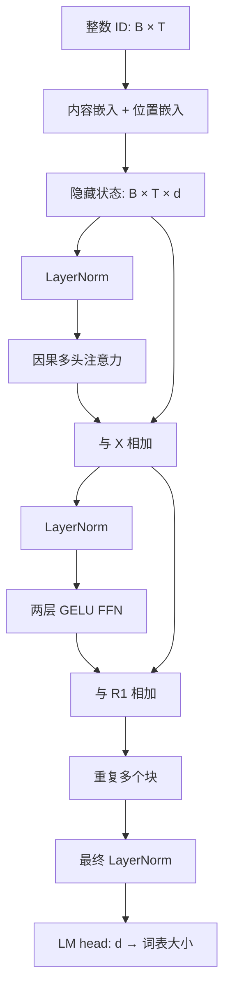

注意力的输出仍是隐藏向量，不是下一 token 的概率。[P2](/principles/language-modeling/) 已给出目标，[P3](/principles/attention/) 已给出读取操作；本章把它们接起来，构成一个完整的仅解码器语言模型。先修还包括 [M6](/math/backprop/) 的链式法则与残差分支梯度。

本章选择学习式绝对位置、Pre-LayerNorm、普通多头和 GELU 前馈网络，便于把结构拆清楚。它是明确的教学变体；2017 年原始 Transformer 使用编码器与解码器、Post-Norm 等不同设计，现代 Llama 类模型又会替换其中几处。不要把三者视为同一配置。

## 输入：词表行与位置行相加

输入 ID 张量 $U\in\mathbb Z^{B\times T}$。嵌入矩阵 $E\in\mathbb R^{n_{\mathrm{vocab}}\times d}$ 提供内容，位置矩阵 $P\in\mathbb R^{T_{\max}\times d}$ 提供位置。对于位置 i：

$$
x_{b,i}=E_{U_{b,i},:}^\top+P_{i,:}^\top.
$$

两项都在 $\mathbb R^d$，相加后堆成 $X\in\mathbb R^{B\times T\times d}$。P 是参数表，不是本章必须先理解的三角函数；它使相同 token 在不同位置有不同输入。为什么需要额外位置、它能解决哪些问题，将在 [P5](/principles/attention-order/) 中证明。

位置表只定义了 $0\le i<T_{\max}$，超过范围就没有对应参数。不能通过增加运行时数组长度凭空得到训练过的新位置向量。参数表容量、训练时实际见过的长度与模型有效上下文也不是同一个数。

教学主线使用无填充的窗口，每条输入从位置 0 开始。加入左侧填充、文档拼接或缓存后，位置 ID 需要重新明确；数组列号不一定等于文本中真实位置。

图中旁路是残差。每个块输入与输出的隐藏维度保持 d，因而可以堆叠；只有最后的词表层改变末轴尺寸。

## LayerNorm：在每个位置内部计算

对单个隐藏列向量 $x\in\mathbb R^d$，层归一化（LayerNorm）计算特征轴均值和总体形式方差：

$$
\mu_x=\frac1d\sum_{a=1}^d x_a,\qquad
v_x=\frac1d\sum_{a=1}^d(x_a-\mu_x)^2,
\qquad
\operatorname{LN}(x)_a=\gamma_a\frac{x_a-\mu_x}{\sqrt{v_x+\epsilon}}+b_{\mathrm{LN},a}.
$$

$\gamma,b_{\mathrm{LN}}\in\mathbb R^d$ 是可训练缩放与平移，$\epsilon>0$ 防止极小方差导致除零。这里方差分母是 d，而不是 d−1；它是算子定义，不是在估计一个未知总体方差。

例如 $x=(1,2,3,4)^\top$，均值 2.5，方差 1.25。取 $\gamma=1,b_{\mathrm{LN}}=0,\epsilon=10^{-5}$，得到：

$$
\operatorname{LN}(x)\approx\begin{bmatrix}-1.341635\\-0.447212\\0.447212\\1.341635\end{bmatrix}.
$$

加 epsilon 后方差并非严格为 1；训练后的逐特征缩放平移也会进一步改变均值与方差。

对 $(B,T,d)$ 输入使用 `LayerNorm(d)`，每个 $(b,i)$ 独立沿末轴计算，共用一组缩放与平移参数。因此改变另一批样本不会改变此位置归一化结果。它与沿 batch 统计的 BatchNorm 不同，不需要维护全局运行均值。

## Pre-Norm 残差块：分支先归一化再变换

一个块有两个子层，写成：

$$
H=X+\operatorname{MHA}(\operatorname{LN}_1(X)),\qquad
Y=H+\operatorname{FFN}(\operatorname{LN}_2(H)).
$$

归一化位于变换分支的输入，因此称为 Pre-Norm。原始 Post-Norm 则是 $H=\operatorname{LN}(X+\operatorname{MHA}(X))$，归一化包住整个相加结果。顺序不同，计算图和梯度都不同；不能靠移动代码一行就认为权重仍兼容。

对一个残差表达 $y=x+f(x)$，其雅可比矩阵是 $I+J_f$。反向传播包含直接的恒等分支贡献，有助于保留信号路径。但这不保证梯度永不爆炸或消失：多个矩阵乘积、分支幅度与学习率仍会影响训练。解释“更容易优化”时不能将它升级为无条件稳定性证明。

残差要求两个张量形状相同。注意力分头后必须通过拼接与输出投影回到 d；FFN 的中间维度可以扩张，但末层也要回到 d。广播有时能让错误代码运行，因此验证应主动比较完整轴，而不只是没有异常。

## FFN：逐位置增加非线性表达能力

前馈网络（feed-forward network，FFN）对每个位置使用同一组两层参数，但不同位置不在 FFN 内互相读取。设 $W_1\in\mathbb R^{d_{\mathrm{ff}}\times d}$，$W_2\in\mathbb R^{d\times d_{\mathrm{ff}}}$，采用 PyTorch 线性层布局：

$$
\operatorname{FFN}(x)=W_2\operatorname{GELU}(W_1x+b_1)+b_2.
$$

第一层把 d 扩展到 $d_{\mathrm{ff}}$，激活逐元素作用，第二层映回 d。若没有激活，两层合起来仍是一层仿射映射，不能增加这种复合的非线性表达能力。

GELU 的定义为 $\operatorname{GELU}(a)=a\Phi(a)$，$\Phi$ 是标准正态分布的累积分布函数，等于 $[1+\operatorname{erf}(a/\sqrt2)]/2$。例如输入 1 的输出约为 0.8413，输入 −1 的输出约为 −0.1587。它不是把所有负数截断为 0 的 ReLU，也不是随机抽样操作。

代码采用 PyTorch `GELU()` 默认的非 tanh 近似选项。某些实现选择 tanh 近似来改变算子成本，比较数值时需要确认配置。现代门控 FFN 则使用另一种表达式，详见 P8，不能把激活名称换掉就当成完整结构替换。

注意力负责位置之间的信息交换，FFN 负责每个位置上的特征变换。这是一种结构分工，不表示学习到的知识只储存在某一个子层。

## 堆叠与词表输出：隐藏向量最终预测什么

堆叠 $n_{\mathrm{layers}}$ 个块后，对最终隐藏状态再做 LayerNorm。LM head 的参数采用 $W_{\mathrm{head}}\in\mathbb R^{n_{\mathrm{vocab}}\times d}$，单位置输出：

$$
z_{b,i}=W_{\mathrm{head}}\operatorname{LN}_{\mathrm{final}}(y_{b,i})+b_{\mathrm{head}}.
$$

结果形状是 $(B,T,n_{\mathrm{vocab}})$。沿最后轴 softmax 得到每个位置的下一 token 分布。训练可以直接将原始 z 输入交叉熵，避免显式先 softmax；生成时只需要关注最后一个有效位置的分布。

本章的输入嵌入和 LM head 权重独立，输出带偏置。权重绑定则可令 $W_{\mathrm{head}}=E$，由一套词表行同时承担输入与输出角色；参数与梯度路径因此改变。某些现代模型的 head 不带偏置，这也是配置差异，不能使用本章数字去计数那些模型。

堆叠不会破坏因果性：每层位置 i 只依赖上一层的 $0\ldots i$，逐位置 LayerNorm 与 FFN 又不读取未来，所以归纳可知最终 logits 也只依赖原始输入前缀。

## 参数账本：一个 268 参数的完整模型

采用 $n_{\mathrm{vocab}}=8,d=4,d_{\mathrm{ff}}=8,n_q=2,n_{\mathrm{layers}}=1,T_{\max}=4$，线性层全部有偏置，LayerNorm 有缩放与平移：

| 部件 | 参数计算 | 数量 |
| --- | --- | --- |
| 内容嵌入 | 8×4 | 32 |
| 位置嵌入 | 4×4 | 16 |
| Q、K、V、输出投影 | 4×(4×4+4) | 80 |
| FFN 两层 | 4×8+8+8×4+4 | 76 |
| 块内两个 LayerNorm | 2×(4+4) | 16 |
| 最终 LayerNorm | 4+4 | 8 |
| LM head | 4×8+8 | 40 |
| 总计 | 上述相加 | 268 |

头数决定如何拆分投影输出，在固定 d 时不改变这些投影参数数目。因果矩阵、位置 ID、softmax 中间结果也不是可训练参数。参数数目与前向临时张量占用是两份不同账本。

脚本用 `sum(p.numel() for p in model.parameters())` 核对 268。后续换成 RMSNorm、SwiGLU、GQA 或去偏置时，应从部件重新计数，而不是套这个总数比例。

## 手算一条完整路径

要在纸上核对完整模型，不必手算所有随机矩阵。将位置表置零，将注意力与 FFN 分支的参数置零，保留残差路径；令 ID 0 的内容嵌入为 $(1,2,3,4)^\top$。所有块输出仍等于输入，因为分支输出为零。

最终 LayerNorm 给出前面的四维数值。令 LM head 的前四行构成单位矩阵，其余行为零，偏置为零，输出 logits 就是前四项为该标准化向量、后四项为零。这个受控例子穿过输入、残差、最终归一化与 head，能捕获遗漏最终 LayerNorm、错误的行列布局或输出偏置。

它不是通常运行的模型配置：真实训练时分支不能一直为零，否则注意力不交换信息。自检在核对随机模型的梯度后才修改参数执行这个局部实验。

## 三类 Transformer：相同部件，不同条件结构

编码器通常使用双向自注意力，为每个输入位置建立同时考虑两侧的表示。仅解码器使用因果自注意力，从已有文本续写。编码器–解码器先编码源输入，再让解码器以因果自注意力读取已生成目标，并通过跨注意力读取编码器输出。

跨注意力的 Q 来自解码器，K/V 来自编码器，不一定有相同长度。把自注意力的 T×T 分数公式照搬过去会漏掉源长度与目标长度两个轴。选择架构取决于任务条件，不意味着仅解码器已经消除了其他架构的用途。

本课围绕仅解码器语言模型展开，但遇到多模态与编码器输入时仍会明确信息入口。[A9](/advanced/multimodal/) 会将视觉 token 接进这个完整预测链。

## 验证：前向、反向与因果性同时成立

运行 `python code/principles/decoder.py`。脚本检查输出形状、268 参数、修改未来输入不影响过去输出、样本间隔离、每个参数都有有限梯度，最后检查受控手算路径。它复用了 P2 的有效位置交叉熵，没有另造损失函数。

<CodeFile path="code/principles/decoder.py" />

随机模型可以输出 logits，也可以取最大类别，但这不是训练完成。权重初始化、数据窗口、优化器状态与验证协议都需要建立；完整训练过程在 [T1](/training/data/) 到 [T4](/training/evaluation/) 展开。

## 常见误区

- 把注意力单层称为完整语言模型，遗漏词表投影与预测目标。
- 将 LayerNorm 沿时间轴计算，意外引入未来内容。
- 以为残差保证训练稳定，忽略分支幅度与优化器。
- 将词表输出层误写成只有一个类别分数。
- 用某个模型的参数总数推断所有 Transformer 的配置。

## 练习与核对

在上述 268 参数模型中去掉 LM head 偏置，并绑定 head 与内容嵌入，剩多少参数？

去偏置减少 8，绑定减少独立 head 的 32 个权重，共减少 40，因此为 228。嵌入仍保留一次；不能将输入与输出两处参数都删掉。

为什么 FFN 中间层可以有 8 维，却不能直接将它与 4 维残差相加？

残差相加按同一特征坐标逐元素进行，需要相同末轴。第二层负责映回 4 维；将 8 维直接裁切或错误广播会改变网络定义。

如果把最终 LayerNorm 改成沿时间轴计算，会怎样破坏因果性？

位置 0 的均值与方差会包含后续位置数值；即使注意力遮罩正确，未来输入仍通过归一化影响过去输出。因果性是完整计算图的性质，不只是一张注意力遮罩。

接下来 [P5](/principles/attention-order/) 将移除位置表，精确分析模型还保留了哪些顺序信息。

## 原始资料

- [Attention Is All You Need](https://arxiv.org/abs/1706.03762)：原始编码器–解码器、Post-Norm 与 FFN，本文教学配置有明确差异。
- [Layer Normalization](https://arxiv.org/abs/1607.06450)：特征内统计与可训练仿射变换。
- [On Layer Normalization in the Transformer Architecture](https://proceedings.mlr.press/v119/xiong20b.html)：Pre-Norm 与 Post-Norm 的分析。
- [Gaussian Error Linear Units](https://arxiv.org/abs/1606.08415)：GELU 定义。
