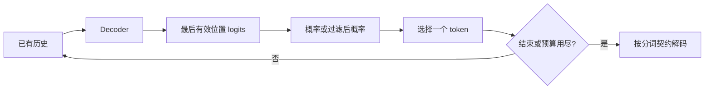

import SamplingLab from '../../../components/labs/SamplingLab'

一个完整 Decoder 给出每个位置的词表分数，但文本还没有生成。[P2](/principles/language-modeling/) 的训练使用真实历史，本章则把模型自己的输出接回输入。先修是 P2/P4 和 M2 的类别分布；缓存尚不是必需条件，先建立正确的重算循环，P10 再证明怎样复用计算。

生成没有一套对所有任务都最优的选项。温度和截断改变输出分布，停止规则决定循环边界，对话模板决定输入契约；它们都不能替代训练质量与评估。

## 自回归循环：每一步扩展已知历史

给定非空 prompt $u_{0:T-1}$，模型输出 $(1,T,n_{\mathrm{vocab}})$ logits。下一项分布来自最后一个有效位置，$p(u_T\mid u_{0:T-1})$。选出 $u_T$ 后接到历史，重新前向预测 $u_{T+1}$，直到结束标记或达到输出预算。

注意最后有效位置不一定是数组最后一列。右侧填充批次若直接读 `logits[:,-1]`，可能读取 PAD 的预测。教学代码只处理一个非空、无 padding 的 prompt，所以末列确实有效；扩大到批生成要单独跟踪有效长度与结束状态。

本章简单实现每步重算整个历史，计算重复但定义清楚。选择算法与缓存是两个维度：同一采样分布可以使用重算或缓存，正确缓存不应改变它的概率。

## 贪心选择：局部最大不等于全局最大

贪心（greedy）选择 $u_T=\arg\max_c z_c$。因为 softmax 单调，取 logits 最大值与概率最大值相同，不必先求概率。并列分数要定义确定的处理顺序；不同设备与精度可能打破近似并列。

贪心不是最可能完整序列的保证。假设第一步 A 的概率 0.6、B 为 0.4；选 A 后结束概率 0.1，选 B 后结束概率 0.9，那么 A→EOS 概率 0.06，B→EOS 为 0.36。只看第一步会选 A，完整两步序列却是 B→EOS 更高。

束搜索（beam search）保留多个候选历史，代价包括更多计算与缓存。结束长度不同的候选还会涉及长度偏置与评分协议。它不是开放式聊天质量的普遍保证，本文不把多候选搜索与独立随机采样混为一谈。

## 温度：改变概率比，而不是 logits 排序

采样温度 $\tau>0$ 定义：

$$
p_c^{(\tau)}=\frac{\exp(z_c/\tau)}{\sum_a\exp(z_a/\tau)}.
$$

两类别的概率比为 $p_c^{(\tau)}/p_a^{(\tau)}=\exp((z_c-z_a)/\tau)$。降低温度放大已有分数差，使分布更尖；升高温度缩小差，使分布更平。正温度不改变类别排序，所以纯贪心的结果不受它影响。

例如原概率为 $(0.4,0.3,0.2,0.1)$，取对应 logits 为这些概率的自然对数。温度 0.5 时概率与原概率平方成正比，归一化后为 $(0.5333,0.3,0.1333,0.0333)$。温度 2 时则与平方根成正比，分布更平。

常见接口用 `temperature=0` 表示贪心模式；这是一种 API 分支约定，不是将 0 代进除法。代码的分布函数要求温度严格为正，贪心应单独取 argmax。低温不保证事实正确，高温也不等价于创造性质量。

## Top-k：保留固定数量的候选

top-k 将分数最大的 k 项保留，其余设为 $-\infty$，再在保留项中归一化。上例 k=2 后得到 $(4/7,3/7,0,0)$。截断后的概率不是简单保留原来 0.4 与 0.3；它们需要除以保留总质量 0.7。

固定 k 对尖锐和扁平分布都保留同样多项，可能在确定情境下保留许多低概率候选，在不确定情境下又过早丢弃合理选项。它是采样策略，不是模型输出层的结构。

分数并列时，用阈值 `score >= kth_score` 可能保留多于 k 项。若要求严格 k 项，应根据明确的排序及并列规则保留 k 个索引。本文参考实现采用稳定排序，原索引顺序打破精确并列。

## Top-p：保留达到概率质量的最小前缀

核采样（nucleus sampling，top-p）按概率降序排序，保留累计概率首次达到阈值 p 的整个前缀，然后重新归一化。跨过阈值的那个 token 必须保留，否则总质量可能根本没有达到 p。

上例 p=0.6 时，第一项累计 0.4 不足，加入第二项后 0.7 达标，因此保留前两项。p=0.9 在数学上应在前三项处达标，但 float64 下前三项的累计和是 0.8999999999999999，略小于 0.9，参考实现因此保留了全部四项。阈值恰好落在累计和上时，舍入就能改变支持集合；不应将这种差别解读为模型含义变化，报告实验时也不宜把阈值设在这样的边界上。

代码判断“加入此项之前的累计质量是否已达标”，即 $\sum_{a<j}p_a\ge p$ 才排除 j。这自动保留第一个 token，也保留跨阈值项。若先筛掉所有累计和大于 p 的项，p=0.1 时可能连最大项都丢掉，产生空分布。

## Min-p：按最大概率的比例设门槛

top-p 的门槛是累计质量，分布越平保留越多，但在长尾很长的平坦分布里可能一次放进很多低概率项。min-p 改用相对门槛：先算当前概率，保留满足 $p_c\ge p_{\min}\cdot\max_a p_a$ 的项，再重新归一化。最大项永远满足条件，所以支持集合不会为空。

上例 $p_{\min}=0.6$ 时门槛为 $0.6\times0.4=0.24$，保留前两项，结果与 top-k=2 相同。先把温度降到 0.5，最大概率变成 0.5333，门槛升到 0.32，只剩第一项。可见门槛跟着分布的尖锐程度移动：模型越确定，保留越少；越不确定，保留越多。这正是它与固定 k 的区别。

## 重复惩罚：只改变历史中出现过的类别

模型偶尔会陷入重复同一片段的循环。重复惩罚在温度之前直接修改历史中出现过的 ID 的 logits。本章采用 CTRL 论文的形式，惩罚系数 $\theta\ge1$：

$$
z_c'=\begin{cases}z_c/\theta,&c\in\text{历史且 }z_c>0,\\ z_c\,\theta,&c\in\text{历史且 }z_c\le0,\\ z_c,&\text{其他}.\end{cases}
$$

两种情况都让该类别的分数变小。一个 ID 在历史中出现多次也只惩罚一次。上例 logits 都是负数，若 ID 0 出现过且 $\theta=2$，则 $z_0'=2\ln0.4=\ln0.16$，归一化后为 $(0.2105,0.3947,0.2632,0.1316)$，最高概率从 ID 0 让给了 ID 1。

这个规则依赖 logits 的符号，因此失去了 softmax 的平移不变性：给所有 logits 加 3 之后，ID 0 的 logit 变成正数，改为被除以 2，结果与上面不同。另一类“出现惩罚 / 频率惩罚”直接减去常数或按出现次数减去常数，保持平移不变，但同样需要记录具体定义。无论哪一种，惩罚只是抑制表面重复，它不知道重复是否合理，例如代码里合法重复的变量名也会被压低。

## 组合顺序：同一组参数，不同顺序是不同协议

组合这些选项时，顺序属于协议。本章参考实现依次执行：重复惩罚作用在原始 logits 上，再除以温度，再做 top-k，在 top-k 的归一化分布上做 top-p，最后在剩余分布上做 min-p 并重新归一化。换顺序可能得到不同支持集合；记录实验时不能只给参数而遗漏处理顺序。

<SamplingLab client:visible />

空心框始终是 τ=1、无截断时的原始概率，实心柱是经过全部步骤后的最终概率，被截断的候选标出是哪一步删掉的。可以先只调温度，看熵怎样单调变化；再把 top-p 调到 0.5，比较 τ=0.5 与 τ=1.5 时保留项数：降温后同一个 p 保留得更少。打开重复惩罚后，只有橙色的“鱼”改变 logit，其余候选的概率因为重新归一化而一起上升。

## 随机性与可复现：同一个 seed 的适用范围

从类别分布采样可用 `torch.multinomial`。固定模型、概率、CPU 环境和 generator 状态，重复运行可产生相同样本序列。记录 seed 很有用，但它不是跨所有内核、设备与并行调度的位级保证。

同一 seed 下两种过滤策略消耗随机数与类别区间的方式可能不同，不能要求它们选择相同 token。比较质量通常要多个独立样本与明确统计协议；只挑一个 seed 的漂亮结果不说明稳定性。

`model.eval()` 控制 dropout 等训练模式行为，`torch.no_grad()` 控制是否记录求导图，两者独立。生成通常同时使用它们。若只关闭梯度但保留训练模式的 dropout，相同输入的概率仍可能随机变化。

## 停止：EOS、预算和上下文不是一回事

EOS 表示模型输出了某个结束类别；最大新 token 数则是调用方施加的预算。没有产生 EOS 就触及预算，属于截断，不应伪装成模型主动完成。prompt 长度加新输出长度还要服从模型的上下文约束。

学习式位置表限制较直接：若 prompt 有 6 项、表容量 8，保守接口只允许最多 2 项输出。RoPE 可以在数值上计算更远位置，但这不证明模型在那里可靠；[A4](/advanced/long-context/) 区分表示、训练、缓存与评估边界。

本文循环在新增 token 后检查 EOS，因此返回结果包含它；展示文本时可按 tokenizer 的约定跳过特殊项。若 `max_new_tokens=0`，应原样返回 prompt，不执行一次额外采样。脚本核对这两个边界。

停止字符串可能横跨多个 token，也可能出现在不完整解码字节上；它不等于一个 EOS ID。真实流式服务通常需要增量解码和边界匹配，系统路线会进一步区分 token 到达与文本可展示时刻。

## 基础模型与聊天模型：模板也是输入分布的一部分

基础语言模型学习文本续写，不一定把裸字符串问题理解为受约束的助手任务。指令微调通过训练数据建立角色、指令与回答关系。调用聊天模型时，角色消息需按模型的 chat template 转成控制标记和文本，再编码为 ID。

典型模板包含 system/user/assistant 角色边界、每轮结束标记与生成起始标记，但具体字符串和 ID 随模型而异。不能拿一个模型的模板去套另一个，也不能擅自再加一次 BOS。模板可由 tokenizer 的正式接口应用，而不是手工拼出看似相同的标签。

模型是否允许或默认输出思考段落，属于特定训练与模板协议。它与温度不是同一设置；也不能将普通基础权重仅靠加“请逐步思考”就当成经过推理训练的模型。[T5](/training/instruction-tuning/) 与 [A5](/advanced/reasoning-rl/) 会分别解释训练目标。

输入模板、特殊项处理、输出停止项与 loss mask 应来自同一契约。训练只把回答计入损失，而推理忘记 assistant 起始边界，是一种数据/调用不一致；采样参数通常修复不了它。

## 验证：先核对分布，再核对循环

脚本用人工概率检查 top-k 与 top-p 支持、跨阈值项、温度、min-p 与重复惩罚（包括平移反例），再用 P4 Decoder 检查固定 generator 的结果、prompt 保留、零预算和 EOS 停止。随机 Decoder 的输出内容没有质量意义，验证只针对算法与边界。

<CodeFile path="code/principles/generation.py" />

运行 `python code/principles/generation.py`。本章没有使用缓存，因而可以把其重算结果作为下一章缓存生成的参考。

## 常见误区

- 认为贪心保证完整序列概率最大。
- 将 `temperature=0` 代进除法，或认为温度改变正温度下的排名。
- top-p 删除了跨阈值项，甚至形成空分布。
- 以为重复惩罚只降低重复，不改变其他候选；重新归一化会抬高所有未被惩罚的项。
- 把最大输出预算、模型上下文和主动结束混为一谈。
- 模板不匹配却只调温度寻找补救。

## 练习与核对

概率 [0.5,0.25,0.15,0.1]，top-p=0.6 保留哪些项？

保留前两项，因为第一项 0.5 不足，加入第二项后 0.75 达标。重新归一化为 $[2/3,1/3,0,0]$。

为什么在所有 logits 上加相同常数，不应改变采样分布？什么选项会破坏这一点？

指数中的公共因子在归一化分母分子中抵消。排序、top-k、基于概率的 top-p 与 min-p 也不变；如果实现发生溢出则是数值问题，应减最大值稳定计算。按符号区分乘除的重复惩罚会破坏平移不变性，脚本用加 3 的例子核对了这一点。

概率 [0.5,0.25,0.15,0.1]，min-p=0.4 保留哪些项？温度升高后呢？

门槛是 $0.4\times0.5=0.2$，保留前两项，归一化为 $[2/3,1/3,0,0]$。升温使分布变平，最大概率下降，门槛随之降低，其他项的概率又上升，因此保留项只会增加或不变。

批次中一条请求已经 EOS，另一条还未结束，能直接停止整个批次吗？

不能。每条请求需独立完成标记；已完成项不继续添加实际输出，未完成项继续计算或进入新的活跃批。连续批处理正是在系统层管理这种不同生命周期。

进入 [P10 KV cache](/principles/kv-cache/)，在不改变条件分布的前提下消除历史重复计算。

## 原始资料

- [The Curious Case of Neural Text Degeneration](https://arxiv.org/abs/1904.09751)：核采样与开放式生成。
- [Nguyen 等：Turning Up the Heat: Min-p Sampling for Creative and Coherent LLM Outputs](https://arxiv.org/abs/2407.01082)：min-p 的定义与动机。
- [Keskar 等：CTRL](https://arxiv.org/abs/1909.05858)：按符号乘除的重复惩罚。
- [Transformers Generation](https://huggingface.co/docs/transformers/main/en/main_classes/text_generation)：各选项的工程接口；本文参考实现顺序已单独定义。
- [Transformers Chat templates](https://huggingface.co/docs/transformers/main/en/chat_templating)：角色消息到模型输入序列的契约。
