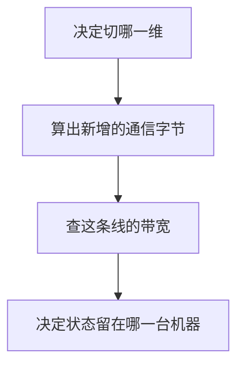

[S1](/systems/ledger/) 的字节和 [S2](/systems/accelerator/) 的脊点确定之后，多出来的卡只能做一件事：用通信换容量或换吞吐。先决定切哪一维，再问这些字节要穿过哪条线。

<Figure src="infra/08-parallel.svg" alt="三种切法分别切开矩阵的列、切开层，或复制整份模型">张量并行每步都要集合通信。流水并行在阶段之间送激活。数据并行复制整模，训练时同步梯度。图下的带宽提醒：HBM 和 NVLink 不是同一个量级。</Figure>

## 切列、切层、复制，以及只送选中的专家

张量并行把一个矩阵乘的列或行分到多张卡。列并行产生互不重叠的输出通道，下游若需要完整向量，应拼接或 gather；行并行产生同一输出的不同部分和，需要求和归约。[Megatron-LM](https://arxiv.org/abs/1909.08053) 将两种切法配对，让列并行后的一些局部运算继续在各卡执行，在行并行末端才合并。具体通信次数依赖层结构，不能把所有列并行都描述为立即 all-reduce。

流水并行按层把网络切成阶段。前一阶段的激活送给后一阶段。理想均衡阶段、忽略通信、使用 $n_{\mathrm{micro}}$ 个微批的填充排空模型中，相对有效计算时间的气泡开销为 $(n_{\mathrm{PP}}-1)/n_{\mathrm{micro}}$，而总历时中的气泡占比为 $(n_{\mathrm{PP}}-1)/(n_{\mathrm{micro}}+n_{\mathrm{PP}}-1)$。它们的分母不同。这个模型用于理解 [GPipe](https://arxiv.org/abs/1811.06965) 的微批排程；交错阶段见 [Narayanan 等人](https://arxiv.org/abs/2104.04473)，阶段之间的传输仍在。

数据并行每张卡留一份完整模型，各自吃不同的样本。推理时可以不通信，直接把请求分出去。训练时梯度要合到一起，再更新那份共享的权重。

专家并行是 [S1](/systems/ledger/) 专家结构的自然延伸：token 只去它选中的专家所在的卡，集合操作是 all-to-all，而不是把所有专家的结果加起来。放置方式见 [GShard](https://arxiv.org/abs/2006.16668)。

## 两卡矩阵：先算局部结果，再选择 collective

rank 是协作进程的编号，shard 是它持有的数据切片。沿用论文布局，输入 $X\in\mathbb R^{B\times d_{\mathrm{in}}}$，权重 $W\in\mathbb R^{d_{\mathrm{in}}\times d_{\mathrm{out}}}$，输出 $Y=XW$。列切分 $W=[W_0\;W_1]$，局部结果分别为 $Y_0=XW_0$、$Y_1=XW_1$；完整结果是沿输出维拼接 $[Y_0\;Y_1]$，不是 $Y_0+Y_1$。

具体取 $X=[1,2,3,4]$，$W$ 的行依次是 $[0,1,2,3]$、$[4,5,6,7]$、$[8,9,10,11]$、$[12,13,14,15]$。完整输出为 $[80,90,100,110]$。两卡各持两列，得到 $[80,90]$ 与 $[100,110]$，拼接才恢复四维输出；若相加得到 $[180,200]$，形状和意义都错误。

行切分则令 $X=[X_0\;X_1]$，$W$ 按输入维上下切成 $W_0,W_1$。完整矩阵乘为

$$
Y=X_0W_0+X_1W_1.
$$

上例前两维部分和为 $[8,11,14,17]$，后两维部分和为 $[72,79,86,93]$，相加才得到 $[80,90,100,110]$。all-reduce 可让两卡都得到这份和；若下游只需要分片输出，reduce-scatter 可能更合适。通信选择由输出拥有关系决定，不是仅凭 tensor 名字决定。

| 操作 | 输入在各 rank 的含义 | 输出含义 |
| --- | --- | --- |
| all-gather | 不同坐标切片 | 每卡获得拼接结果 |
| all-reduce | 同一坐标的部分贡献 | 每卡获得求和等归约结果 |
| reduce-scatter | 同一结果的部分贡献 | 归约后各卡保留不同切片 |
| all-to-all | 发往不同目的 rank 的数据 | 每卡收集发给自己的部分 |

使用 collective 时所有参与者还必须遵循相同调用次序、形状与数据类型。某 rank 因异常跳过通信，其他 rank 可能永久等待；模型算术一致还不够，进程失败处理也属于分布式正确性。

## 层内配对：怎样减少不必要的 gather

前馈第一投影按输出通道切分，每卡得到一部分中间激活。GELU 或 SwiGLU 的逐元素运算可以在相应局部通道完成，随后下投影按输入通道切分，各卡产出完整隐藏维的部分和，再 all-reduce。若 gate/up 的切片没有对齐，逐元素乘会把不同通道混在一起，因此权重加载映射是正确性的一部分。

多头注意力也可按完整查询头切分，局部头计算之后用行并行输出投影合并。GQA 中 KV 头少于 TP rank 时，不能机械地把 KV 头平均分配成零个头；实现可能复制 KV 头，容量缩减不再简单等于 TP 倍数。具体规则要读模型的分片实现。[S6](/systems/engine-execution/) 给出了 nano-vLLM 的具体权重和通信落点，可在理解本节后回读。

词表并行输出头让各卡计算不同 token 范围的 logits。若 rank 0 负责抽样，可以 gather 全词表；也有分布式 softmax/采样算法在计算最大值、归一化和概率质量时通信，避免完整 gather。它们必须恢复同一个采样分布。embedding 按词表切分时，各卡仅对本地 ID 返回嵌入，其余返回零，再求和恢复输入；因此它的通信与输出头不同，尽管权重形状有关联。

## 流水时间线：训练微批与自回归请求分开

均衡四阶段处理 12 个独立微批，首批需要 4 个时间单位穿过全流水，此后理想每单位完成一个，总历时 $12+4-1=15$。理想满负荷有效单位为 12，填充排空损失为 3。相对有效工作的开销是 3/12=25%，总历时占比是 3/15=20%。实际阶段不均衡、通信与前后向交错会改变时间线。

单个自回归请求的下一个 token 依赖上一 token 在最后阶段采样完毕，再回到第一阶段。它不能像 12 个独立微批那样每单位无依赖推进。因此流水主要依靠多个请求或微批填满，不等于把单请求生成延迟除以阶段数。对低并发服务，按层切分可能主要解决容量，反而增加激活传输和串行等待。

<CodeFile path="code/systems/parallel_layout.py" />

CPU 脚本枚举列切片拼接和行切片求和，核对完整矩阵乘；它还验证 S6 的 packed 位置及理想流水比例。它不发起 NCCL collective，不测机间延迟，数学输出相同与分布式执行可用是两层不同验收。

## 同一次集合通信，秒数取决于线

NCCL 规定了 all-reduce、all-gather、reduce-scatter 和 all-to-all 的结果应当是什么，文档在 [NCCL User Guide](https://docs.nvidia.com/deeplearning/nccl/user-guide/docs/index.html)。字节数由切分方式决定。秒数由拓扑决定：同一机柜里的 NVLink，和穿过网卡的链路，带宽可以差一个数量级以上。

产品页带宽可能按单向、双向合计、每链路或每设备聚合书写，这些口径不能混入同一个传输时间公式。对于消息大小 $m$，粗略下限可写为固定延迟 $\lambda$ 加 $m/b_{\mathrm{link}}$，其中 $b_{\mathrm{link}}$ 必须是实际使用方向与路径的有效带宽；collective 还可能分多阶段、绕不同链路。机内、机间拓扑应以目标机器为准，通过通信基准记录消息大小与参与 rank，再解释模型同步成本。[Wafer 的并行与拓扑一节](https://github.com/wafer-ai/gpu-perf-engineering-resources#parallelism-collectives-and-topology) 给出进一步资料索引。

## 把 prefill 和 decode 拆开

[S1](/systems/ledger/) 与 [S2](/systems/accelerator/) 已经说明，长提示的 prefill 靠近算力平台，单请求 decode 靠近带宽斜线。把两种请求放在同一张卡上，小而频繁的 decode 会把大矩阵乘切开。拆成两类 worker 之后，各自按自己的强度扩容，代价是 KV 或隐藏状态要跨机传送。传送时间小于混部造成的损失时，拆开才划算。问题的提法见 [DistServe](https://arxiv.org/abs/2401.09670)。[Mooncake](https://www.usenix.org/conference/fast25/presentation/qin) 把 KV 的存放和传输做成独立的一层。阅读索引在 [Wafer 的解耦一节](https://github.com/wafer-ai/gpu-perf-engineering-resources#prefill-and-decode-disaggregation)。

例如 S1 的一条 8192 token 提示有 1 GiB KV。若示意链路有效单向带宽为 50 GB/s，理想复制就需约 21.5 ms，另加固定延迟、排队与协议；这个 50 是教学假设，不是产品测量。若混部损失只有 5 ms，直接全量搬移未必划算；若可转移部分层、压缩、复用驻留前缀或流水重叠，成本模型还需重算。接收端模型、位置配置和缓存布局必须一致，不能把任意 KV 当跨模型可迁移状态。

## 训练：重算，或者把 16 字节切开

[S1](/systems/ledger/) 的 16 字节已经让一个 8B 模型超过单卡。两条正交的办法可以叠用。梯度检查点少留激活，反向时重算，[T2](/training/optimization/#激活与重算反向传播要保存什么) 用一个小例子核对了保存量与梯度。另一条是分片：普通数据并行让每张卡都存一整份 16 字节，ZeRO 则按数据并行的成员数 $n_{\mathrm{DP}}$ 把这些常驻状态切开。

| 阶段 | 切开什么 | 每卡字节（N 个参数） | 8B、$n_{\mathrm{DP}}=8$ |
| --- | --- | --- | --- |
| 数据并行 | 不切 | $16N$ | 128.5 GB |
| ZeRO-1 | 12 字节优化器状态 | $4N+12N/n_{\mathrm{DP}}$ | 44.2 GB |
| ZeRO-2 | 再加 2 字节梯度 | $2N+14N/n_{\mathrm{DP}}$ | 30.1 GB |
| ZeRO-3 / FSDP | 再加 2 字节参数 | $16N/n_{\mathrm{DP}}$ | 16.1 GB |

表中的 12 字节是 fp32 主权重、一阶矩与二阶原始矩；数字不含激活。PyTorch 的 FSDP 默认策略对应第三阶段。

分片为什么不改变更新结果？数据并行本来就要把各卡梯度求和。all-reduce 可以拆成两步：reduce-scatter 让每张卡只拿到自己那一段的梯度总和，all-gather 再把各段拼回整份。ZeRO-1/2 在两步之间插入更新：每张卡只用自己那段梯度更新自己那段参数与优化器状态，然后 all-gather 拼回参数。每一段都恰好更新一次，结果与不切时相同，通信量也与普通数据并行相同，约每卡收发 $2N$ 个元素。ZeRO-3 连参数也不常驻，前向与反向用到某层时各 all-gather 一次，通信约为 $3N$，即普通数据并行的 1.5 倍。脚本用四个 rank 的 12 维梯度核对“先分段求和、各段更新、再拼接”与整份更新相同。

切得越细，单卡常驻越小，集合通信越多，通信能否与计算重叠就越关键。分片的定义与通信分析见 [ZeRO](https://arxiv.org/abs/1910.02054)，工程实现见 [PyTorch FSDP](https://arxiv.org/abs/2304.11277)。训练系统要同时安排这三样：激活留多少、优化器状态放在谁那里、微批怎样填满流水。这是 [AI Infra Book 第 10 章](https://bojieli.github.io/ai-infra-book/manuscripts/10-%E8%AE%AD%E7%BB%83%E7%B3%BB%E7%BB%9F.html) 的问题；分布式推理一侧的放置、扩容和恢复见 [第 9 章](https://bojieli.github.io/ai-infra-book/manuscripts/09-%E5%88%86%E5%B8%83%E5%BC%8F%E6%8E%A8%E7%90%86.html)。

## 状态放在哪一台机器上

调度回答的是：这份权重和这段 KV 此刻在哪，下一个请求要不要等它们，还是另找一份副本。[AI Infra Book 第 11 章](https://bojieli.github.io/ai-infra-book/manuscripts/11-%E8%B5%84%E6%BA%90%E8%B0%83%E5%BA%A6%E4%B8%8E%E8%BF%90%E8%A1%8C%E7%8E%AF%E5%A2%83.html) 把这个问题放到共享集群里。端和云是同一个问题的两个半径：状态若必须留在设备上，模型就得缩到那台设备的容量和能耗里；状态若可以送到云上，延迟预算就要盖住网络的往返。[第 12 章](https://bojieli.github.io/ai-infra-book/manuscripts/12-%E7%AB%AF%E8%BE%B9%E4%BA%91%E5%8D%8F%E5%90%8C.html) 讨论的就是这个放置。

生产里值得持续记录的是这些量：TTFT 和 TPOT 的分位数、KV 块和带宽谁先用尽、失败后怎样隔离、新 kernel 或新驱动怎样回滚、成本按 token 还是按达标请求计算。GPU 忙，只说明屋顶线的某一侧被碰到了；排队仍在变长时，服务并没有变好。基准的记法可以回到 [Wafer 的 serving benchmarks](https://github.com/wafer-ai/gpu-perf-engineering-resources#serving-benchmarks)。

## 练习与核对

1. 流水并行分 4 个阶段、同时有 12 个微批在飞，气泡大约占多少？要把它压到 5% 以下，微批至少要多少？

相对有效计算的开销为 $3/12=25\%$，总历时占比为 $3/(12+3)=20\%$。若要求总历时占比严格小于 5%，则 $3/(n_{\mathrm{micro}}+3)<0.05$，即 $n_{\mathrm{micro}}>57$，至少 58 个；若要求相对有效时间开销小于 5%，才是至少 61 个。这里忽略通信且阶段均衡，不能直接套到单请求自回归延迟。

2. ZeRO 把优化器状态切到 8 张数据并行卡上，8B 模型每卡常驻的 16 字节变成多少？

16 字节里，fp32 主权重、一阶矩与二阶原始矩共 12 字节属于优化器状态，切 8 份后每卡 1.5 字节；低精度参数和梯度各 2 字节仍完整保留。每个参数约 $2+2+1.5=5.5$ 字节，8B 模型约 $8.03\times10^9\times5.5\approx44$ GB，还没算激活。再切梯度和参数，常驻继续下降，代价是更多的集合通信。

3. 为什么“把张量切到另一张卡”不是免费的容量？

切分后的依赖需要传递局部结果或合并部分和，字节数由算子和所有权决定，秒数由消息规模、拓扑、固定延迟和有效带宽决定。TP 常在层内通信，PP 在阶段间传激活，独立推理副本则可不做模型 collective，不能把所有并行概括为每层同一种通信。

下一章 [S10 服务评估](/systems/serving-evaluation/) 不再只计某一层的运算或通信，而从客户端事件检验整体服务是否满足目标。

## 引用与边界

| 用到的内容 | 出处 | 本页的处理 |
| --- | --- | --- |
| 超节点、网络、分布式推理、训练、调度、端边云 | AI Infra Book 第 6、7、9、10、11、12 章，链在各节 | 收成「切哪一维、走哪条线、状态放哪」 |
| 并行、MoE 通信、解耦、生产与硬件 | [Wafer，Distributed inference](https://github.com/wafer-ai/gpu-perf-engineering-resources#5-distributed-inference) 与 [Current hardware](https://github.com/wafer-ai/gpu-perf-engineering-resources#6-current-hardware) | 索引 |
| Megatron、GPipe、ZeRO、DistServe、NCCL、H100 | 正文中的论文和文档 | 只保留会改变字节或同步次数的规则 |

本页不给出某一代 GPU 的推荐拓扑或并行组合。那种组合依赖模型形状、长度分布和这台集群的线，要用 [S2](/systems/accelerator/) 的记录方法在目标机器上测。
