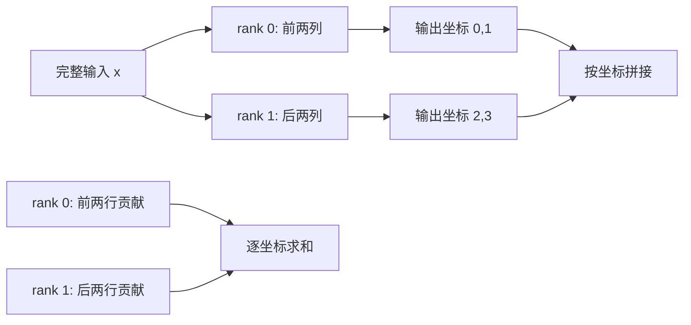

import { CollectiveLab } from '../../../components/labs/SystemsLabs'

[S1 资源估算](/systems/ledger/) 已算出模型权重和 KV cache 的大小，[S2 硬件](/systems/accelerator/) 解释了计算与搬移的瓶颈。假设一张 GPU 放不下目标模型，或放得下但处理不了到达的请求，我们需要加入第二张卡。

两张卡可以共同计算同一层，也可以各算不同层，还可以各存一份完整模型并分别服务请求。本章从算子和请求状态逐项计算通信与等待，再判断各布局对容量、单请求延迟和整体吞吐的影响。

沿用 S1 的两层小 Decoder：隐藏维度 $d=4$、两个查询头、一个 KV 头、每头维度 $d_h=2$。下面先看它的一次线性投影，再把结论放回一个生成请求。数值矩阵只是演示切分的投影，不代表该模型的某组实际训练权重。权重、激活和 KV 均以每元素 2 字节计；带宽示例另外注明假设。

## 先约定谁持有结果

每张 GPU 上运行的协作进程称为一个 `rank`；`shard` 是该 rank 持有的权重或激活切片。两张卡分别为 rank 0 和 rank 1。设输入 $x=[1,2,3,4]$，投影权重按行写为

$$
W=\begin{bmatrix}0&1&2&3\\4&5&6&7\\8&9&10&11\\12&13&14&15\end{bmatrix},\qquad
y=xW=[80,90,100,110].
$$

**结果在哪张卡上**决定用哪种通信。`all-gather` 把各 rank 的不同切片拼起来，让每个 rank 得到完整结果；`all-reduce` 把同一坐标的局部贡献求和，再让每个 rank 得到完整和。它们不是两种可以互换的“同步”。若仅一张卡需要结果，可以使用相应的 `gather` 或 `reduce`，但下游计算和通信安排也要随之改变。NCCL 对这些操作的结果有明确约定，见[官方 collective 文档](https://docs.nvidia.com/deeplearning/nccl/user-guide/docs/api/colls.html)。

## 列切分：不同 rank 算不同输出坐标

将 $W$ 的前两列放在 rank 0、后两列放在 rank 1。两个 rank 都有完整输入 $x$，各自得到

$$
y_0=xW_{:,0:2}=[80,90],\qquad y_1=xW_{:,2:4}=[100,110].
$$

这里 $y=[y_0,y_1]$ 是**拼接**，不能相加。若下一步只是对各自的输出坐标逐元素计算，例如同一切片上的激活函数，完全可以继续保留 $y_0,y_1$；只有后继算子或采样者需要完整向量时，才做 `all-gather`。在本例两卡均要完整 $y$ 时，每卡发送本地两个半精度元素，即 4 字节，接收对方 4 字节；这是每卡两个方向各 4 字节，不是“总通信 4 字节”。

## 行切分：不同 rank 算同一输出的部分和

现在把输入和 $W$ 沿输入维一起切开。rank 0 持有 $x_0=[1,2]$ 和前两行，rank 1 持有 $x_1=[3,4]$ 和后两行：

$$
x_0W_{0:2,:}=[8,11,14,17],\qquad
x_1W_{2:4,:}=[72,79,86,93].
$$

逐坐标求和才得到 $y=[80,90,100,110]$。若两张卡下一层都需要完整 $y$，一次两卡 `all-reduce` 可使两边各得到它；在这个两卡、四元素示例中，每卡发送 8 字节部分和，接收 8 字节。若下一步仍只需要不同输出片段，`reduce-scatter` 可以只留下对应片段，避免每卡都持有完整结果。所谓“行并行以后用 all-reduce”有前提：**两边都需要完整输出**。

图的上半部是**不同坐标**，下半部是**相同坐标的部分贡献**。这个区别比记住 collective 名称更可靠。[Megatron-LM 原论文](https://arxiv.org/abs/1909.08053) 在前馈层配对使用两种切法：上投影按输出列切，中间激活留在本地；下投影按输入行切，末端再合并部分和。对 SwiGLU，还必须让每个 rank 的 gate 与 up 使用对应的中间通道，否则局部逐元素乘法已经改变了模型。

## 放回 Decoder：头、词表与 KV 不一定均分

<CollectiveLab client:visible />

先选“输出列：拼接”，将“步骤”从分发调到局部计算，再调到合并。两卡局部输出分别为 `[80,90]`、`[100,110]`，按坐标拼成完整结果。

再选“输入行：部分和”，核对局部输出为 `[8,11,14,17]`、`[72,79,86,93]`，逐坐标相加仍得 `[80,90,100,110]`。图保留 rank 身份，便于区分不同坐标和同坐标的部分贡献。

通信字节只按本章两卡、两边都需要完整结果的约定计数，不模拟 NCCL 拓扑和耗时。

注意力的查询头彼此独立计算，可以按**完整头**分给两个 rank，再通过输出投影的行切分合并。不能把单个头维度随意切开后仍套用这一层的“头独立”论证。我们的模型有两个查询头，却只有一个 KV 头：两 rank 各拿一个查询头时，KV 头必须由两边共享或复制，不能给每卡分配“半个 KV 头”并期待普通 GQA 算法原样工作。因此这组配置的 KV cache 不会因两卡 TP 自动减半。真实引擎还可能有别的头映射与分片规则，须查加载实现和缓存布局。[S6 执行器](/systems/engine-execution/) 展示了具体引擎的权重与缓存映射。

输出头也可以按词表列切。各卡只得到自己负责 token 的 `logits`，即 softmax 前的原始分数。若只由 rank 0 抽样，最直接的办法是把完整 logits 聚到它那里；分布式采样则需要跨 rank 求全局最大值、归一化总量并正确定位抽中 token。只拿本地最大 logits 就抽样，会改变模型的概率分布。词表切分是否合算，取决于词表规模、每步通信和采样实现，不由“并行度 2”单独决定。

## 三种两卡布局服务同一批请求

| 布局 | 每张卡常驻 | 一条请求怎样运行 | 主要跨卡移动 |
| --- | --- | --- | --- |
| TP=2，层内切分 | 各层的一部分权重与按实现分片或复制的 KV | 两卡协作完成每层、每一步 | 层内部分和、必要时的完整激活或 logits |
| PP=2，按层切分 | 各一层权重及该层 KV | 第一层输出送第二层，下一 token 再从第一层开始 | 阶段边界的激活与调度信息 |
| 两个完整副本 | 两套完整权重，各管自己的请求与 KV | 请求分发给其中一个副本 | 正常前向不需要模型 collective |

TP 是 tensor parallel，PP 是 pipeline parallel。若单卡已经能容纳整模，副本通常最容易增加独立请求的吞吐；它不会让单条请求的矩阵乘自动缩短。TP 和 PP 帮助容纳较大模型，但都让一次生成依赖多张卡。单卡是否“放得下”还要算常驻 KV 与峰值缓冲，不能只按权重大小判断。

PP 的传输量可用同一个玩具模型估计：两层各在一张卡，阶段之间要送长度为 4 的隐藏向量。一次 decode 步，半精度激活是 $4\times2=8$ 字节；对 $P$ 个 prompt token 的 prefill，若全部跨阶段传一次，负载约为 $8P$ 字节。它远小于大型模型的真实值，但说明该通信随 **batch 内 token 数和隐藏维度**增长；还有每条请求的固定消息延迟。两阶段的 KV 分别留在拥有该层的 rank：本模型每 token 每层 K 与 V 各有 $1\times2$ 个元素，合计 $8$ 字节；两层共 $16$ 字节。把请求迁到另一组 PP worker 时，两层各自的 KV 都须恢复到对应阶段，或重算已处理的前缀。

### 流水能隐藏多少空档

若每阶段处理一个独立微批恰需一个时间单位，且忽略传输与不均衡，$p$ 阶段、$m$ 个互不依赖的微批从填充到排空共需 $m+p-1$ 单位。其中有效稳态长度为 $m$，空档为 $p-1$。四阶段、12 微批时是 15 单位：相对 12 单位有效时间多 $3/12=25\%$，而空档占总历时 $3/15=20\%$。若要求后一种占比**严格小于** 5%，要满足 $3/(m+3)<0.05$，所以至少 58 微批。

这个时间线常用于训练微批或多条独立请求；它不能直接算单条自回归请求的加速。该请求的下一 token 要等前一 token 穿过最后阶段并完成采样，才可重回第一阶段。低并发时，PP 主要解决容量，阶段边界还会增加单请求等待。服务中的连续 batching 可以交错不同请求，却必须按请求依赖维护各自的 KV 和完成顺序。

## 把通信字节换成时间

同一份 $8$ 字节激活跨卡要多久，并不能仅由字节数决定。粗略模型是 $t\gtrsim\lambda+m/b$：$\lambda$ 为本次消息的固定延迟，$m$ 为实际经过该路径的字节，$b$ 为**该方向可达到的有效带宽**。TP 的每层 collective 会重复很多次，固定延迟在小 decode batch 中可能比 $m/b$ 更重要。一个 collective 可能分阶段经过多条链路；不能把设备产品页的双向聚合峰值直接填成单次单向路径的 $b$。机内、跨节点乃至不同 GPU 拓扑的 $b$ 和 $\lambda$ 均须测量。[NCCL 文档](https://docs.nvidia.com/deeplearning/nccl/user-guide/docs/overview.html)说明它提供拓扑感知的通信原语；实际链路与服务时间要用目标机器测，[G4 测量](/gpu/measurement/)给出计时边界。

这也解释了布局选择：如果两张卡隔着慢网络，高频层内 TP 的每步等待可能压过局部计算收益；按层 PP 的消息次数通常较少，但激活跨阶段并且单请求仍串行；副本不需要模型 collective，却要求每张卡单独容纳权重。不能脱离模型形状、请求长度、并发与拓扑给三者排通用名次。[vLLM 并行与扩展文档](https://docs.vllm.ai/en/latest/serving/parallelism_scaling/)给出 TP/PP 的实际配置入口；配置可运行不等于适合当前负载。

## 请求状态在哪：路由、prefill 与 decode

一条请求在 prefill 后有确定的 KV cache。继续 decode 的 worker 必须读到这份 KV；调度器不能只看哪张卡空闲就把下一 token 发过去。用完整副本服务时，同一请求通常保持在拥有其 KV 的副本上；迁移要复制或重算状态。失败也一样：若 TP 组内一个 rank 消失，另一 rank 的权重切片和 KV 不能独自完成该请求。恢复路径可以在健康副本上从保存的 prompt 与已确认输出重算前缀，或从兼容的 KV checkpoint 恢复；输出流对客户端的已确认边界必须明确，避免重试后重复发送或遗漏 token。

prefill（一次处理提示）与 decode（逐步生成）也可部署在不同 worker。这样可分别为两类负载配置资源，但 prefill 结束后必须把 KV 送到 decode 侧。[DistServe 原论文](https://arxiv.org/abs/2401.09670)研究了这种拆分，[vLLM 示例](https://docs.vllm.ai/en/latest/examples/disaggregated/example_connector/)展示了状态转移接口。以 S1 的大型模型账为例，一条 8192-token 提示约有 1 GiB KV。**假设**可用的单向有效带宽为 50 GB/s，仅传 1 GiB 的理想下界约为 $1.074\,\mathrm{GB}/50\,\mathrm{GB/s}=21.5$ ms，尚未计固定延迟、队列、格式转换或接收侧写入。若原先混部只损失 5 ms，就不能仅凭“资源独立”宣称拆分更快；若能重叠传输或减少搬移量，需按新路径重算。两侧模型权重、位置约定、KV 布局与已处理长度也必须兼容。

训练中的数据并行需要同步梯度，ZeRO/FSDP 还会分片优化器、梯度和参数；这些状态及同步目标与推理 KV 不同。它们的更新推导在 [T9 分布式训练](/training/distributed-training/)。专家并行把 token 发往选中专家所在 rank，通信与普通 TP 不同，在 [A1 MoE](/advanced/moe/) 建立路由规则后再讨论。

<CodeFile path="code/systems/parallel_layout.py" />

脚本核对本章两种矩阵切分、两卡通信字节、两层 KV 与流水比例。它没有建立多进程组、执行 NCCL 或测 GPU 网络，因而不能证明某种布局在目标硬件上更快。

## 练习与核对

把本例改成三张卡，每卡持有权重的一部分输入行。三份局部结果需要怎样合并？如果只有 rank 0 抽样，是否还必须让三卡各得完整结果？

三份都是同四个输出坐标的部分贡献，必须逐坐标求和，不能拼接。若后续仅 rank 0 需要完整结果，`reduce` 到 rank 0 可以满足该所有权要求；若下一层仍在三卡上运行，就要重新考虑它所需的输入布局，不能只优化这一层末端。

两层模型改为四层，隐藏维仍为 4，两张卡各放两层。对一条含 5 个 prompt token 的请求，忽略协议开销，阶段边界至少送多少半精度激活？总 KV 每 token 多少字节？

边界只在两卡之间出现一次，送 $5\times4\times2=40$ 字节。每层 K、V 各有 2 个半精度元素，故每层每 token 为 8 字节，四层总计 32 字节，每张卡各存其两层的 16 字节。层数增加没有让边界数量自动增加，因为仍只有两个阶段。

四阶段流水要求空档占总历时不超过 5%，最少要几个独立微批？这个数能推出单请求 decode 延迟吗？

不超过允许等号，$3/(m+3)\leq0.05$，所以 $m\geq57$；若要求严格小于才是 58。单请求每步依赖前一步采样，不能把 57 个独立微批的填充模型套为它的延迟公式。

下一章 [S10 服务评估](/systems/serving-evaluation/) 将把本章的布局选择放进完整请求负载，测 TTFT、TPOT、失败率和满足 SLO 的吞吐。

## 原始资料

- [Megatron-LM](https://arxiv.org/abs/1909.08053)：列/行切分的层内配对。本章的四维矩阵为教学构造。
- [NCCL collective API](https://docs.nvidia.com/deeplearning/nccl/user-guide/docs/api/colls.html)、[PyTorch Distributed](https://docs.pytorch.org/docs/stable/distributed.html)：结果语义与进程组调用约束；脚本未实现真实 collective。
- [vLLM Parallelism and Scaling](https://docs.vllm.ai/en/latest/serving/parallelism_scaling/)、[DeepSpeed Inference](https://www.deepspeed.ai/tutorials/inference-tutorial/)：推理部署中的模型切分入口。具体可用配置与性能取决于版本、模型和机器。
- [DistServe](https://arxiv.org/abs/2401.09670)：prefill/decode 分离的动机与实验条件。本文 50 GB/s 是示意假设。
