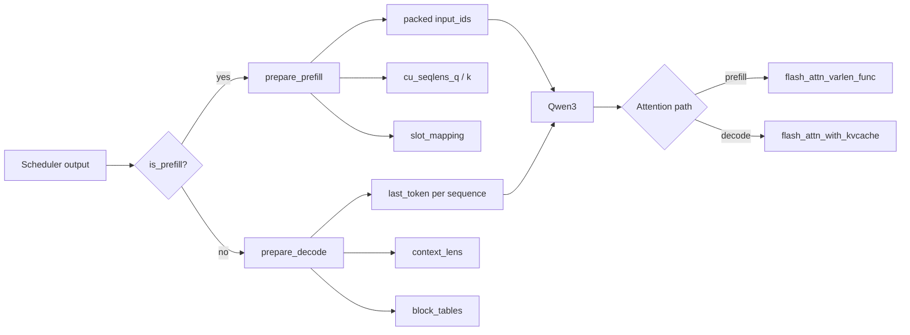
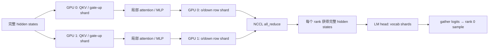

import Qwen3Layer from '../../../components/diagrams/Qwen3Layer.astro'
import LaunchTimeline from '../../../components/diagrams/LaunchTimeline.astro'
import Checklist from '../../../components/labs/Checklist'

[S3](/systems/engine-runtime/) 读完了控制面：调度器决定这一步算谁，块管理器决定 K/V 写到哪里。本章进入数据面，看 `ModelRunner` 怎样把调度结果变成张量、Qwen3 怎样在多张卡上计算、CUDA Graph 怎样压掉 decode 的启动开销。最后两节离开源码，讨论量化和投机解码这两种引擎级优化，以及怎样用不变量和实验检验自己的理解。

## 同一个模型，两种批形状

prefill 把多条不等长序列打平为 token 流，用累计长度描述边界；decode 则每条序列只送入最后一个 token，并携带完整上下文长度和 block table。

| 张量 | prefill | decode |
| --- | --- | --- |
| `input_ids` | `[Σ scheduled_tokens]` | `[num_seqs]` |
| `positions` | 每个新增 token 的绝对位置 | `len(seq) - 1` |
| Q 长度 | `cu_seqlens_q` | 隐含为每条 1 |
| K 长度 | `cu_seqlens_k = cached + new` | `context_lens = len(seq)` |
| 缓存映射 | `slot_mapping`；命中前缀时另带 `block_tables` | `slot_mapping` + `block_tables` |

`positions` 一行正是 [KV cache 的正确性](/principles/kv-cache/) 中“新位置不能从 0 重新编号”的工程落点：decode 的位置是序列当前长度减一，而不是批内行号。

### 为什么 prefill 也可能读缓存

命中共享前缀或执行 chunked prefill 时，当前 Q 的数量小于可见 K 的数量，即 `cu_seqlens_k[-1] > cu_seqlens_q[-1]`。此时 `prepare_prefill()` 生成 block tables，attention 从分页缓存读取历史 K/V。

<SourceNote>[model_runner.py:129-188](https://github.com/GeeeekExplorer/nano-vllm/blob/bb823b3e06983d71485a8e1f23715ebd87d98ef8/nanovllm/engine/model_runner.py#L129-L188)、[attention.py:59-75](https://github.com/GeeeekExplorer/nano-vllm/blob/bb823b3e06983d71485a8e1f23715ebd87d98ef8/nanovllm/layers/attention.py#L59-L75)</SourceNote>

## Qwen3 层：最小实现保留了关键优化

模型结构看起来接近普通 Transformer，但每个线性层已经为张量并行切分，attention 同时承担 KV cache 读写，RMSNorm 与 SiLU×Gate 则交给 `torch.compile`。

<Qwen3Layer />

| 模块 | 实现重点 | 为什么影响推理 |
| --- | --- | --- |
| GQA | Q 头多于 KV 头 | 减少 KV cache 容量与带宽，见 [S1](/systems/ledger/) |
| RoPE | 按绝对 `positions` 旋转 Q/K | decode 不能把位置重置为 0 |
| RMSNorm | 残差加法与归一化融合 | 减少中间张量与 kernel 开销 |
| Gated MLP | gate/up 合为一个列并行投影 | 匹配权重打包并减少调用 |
| LM head | prefill 只取每条序列最后一个 hidden state | 避免为所有 prompt token 计算 logits |

## 张量并行：切权重，也要安排通信落点

每个 rank 都运行完整控制流，但只持有部分权重。列并行切输出维，局部计算后暂不通信；行并行切输入维，局部结果必须 `all_reduce` 才恢复完整输出。

<Panels>
<Panel title="列并行">`QKVParallelLinear` 与 `MergedColumnParallelLinear` 沿输出维切分。每张卡得到一组 attention 头或 MLP 中间通道。</Panel>
<Panel title="行并行" tone="accent2">`o_proj` 与 `down_proj` 沿输入维切分。各卡产生部分和，随后 NCCL `all_reduce`。</Panel>
</Panels>

一次“列并行接行并行”只在块的末尾通信一次，这是 [Megatron-LM](https://arxiv.org/abs/1909.08053) 的切法；[S5](/systems/cluster/) 会把这笔通信放到机内、机间不同的线上计价。

### 进程间如何同步一次调用

rank 0 将方法名与参数 pickle 到 1 MiB 共享内存，再用每个 worker 的 Event 发信号；所有 rank 执行同名方法。模型内部的数值通信仍走 NCCL。这个设计很适合教学，但固定端口 `tcp://localhost:2333`、固定共享内存名 `nanovllm` 与固定缓冲区意味着多实例隔离不是当前目标。

<SourceNote>[linear.py](https://github.com/GeeeekExplorer/nano-vllm/blob/bb823b3e06983d71485a8e1f23715ebd87d98ef8/nanovllm/layers/linear.py#L54-L156)、[worker RPC](https://github.com/GeeeekExplorer/nano-vllm/blob/bb823b3e06983d71485a8e1f23715ebd87d98ef8/nanovllm/engine/model_runner.py#L41-L89)</SourceNote>

## CUDA Graph：把稳定的 decode 形状录下来重放

decode 每步 token 少、kernel 多，CPU 发射开销容易显眼；这正是 [S2](/systems/accelerator/) 时间线图里的白道。nano-vLLM 为一组离散 batch size 捕获 graph；运行时向上取最近的已捕获尺寸，把多余槽位设为无效后重放。

<LaunchTimeline />

$$
\text{captured batch sizes}=[1,2,4,8]+[16,32,\ldots,\min(\text{max\_num\_seqs},512)].
$$

<Panels>
<Panel title="走 graph">decode、`enforce_eager=False` 且真实 batch size ≤ 512。</Panel>
<Panel title="走 eager" tone="accent2">所有 prefill、显式 eager 模式，或 batch size 大于 512。</Panel>
</Panels>

重放前会复制 `input_ids`、`positions`、`slot_mapping`、`context_lens` 与 `block_tables` 到静态缓冲区。padding 槽的 `slot_mapping=-1`、`context_lens=0`，因此不会污染 KV cache。

<SourceNote>[model_runner.py:195-257](https://github.com/GeeeekExplorer/nano-vllm/blob/bb823b3e06983d71485a8e1f23715ebd87d98ef8/nanovllm/engine/model_runner.py#L195-L257)</SourceNote>

## 显存预算：先测峰值，再把余量切成块

构造时先用上限形状 warmup，读取 CUDA 峰值显存。随后把目标显存利用率内的剩余字节除以单个 KV 块的字节数，得到 `num_kvcache_blocks`。块字节数就是 [S1](/systems/ledger/) 的单 token KV 公式乘上块大小，再按张量并行切开 KV 头：

<KeyEq label="KV 块预算">

$$
\text{block\_bytes}=2\times\text{num\_layers}\times\text{block\_size}\times\frac{\text{num\_kv\_heads}}{\text{TP}}\times\text{head\_dim}\times\text{dtype\_bytes},
$$

$$
\text{num\_blocks}=\left\lfloor\frac{\text{total}\times\text{utilization}-\text{used}-\text{peak}+\text{current}}{\text{block\_bytes}}\right\rfloor.
$$

</KeyEq>

| 旋钮 | 增大后的直接效果 | 主要代价 |
| --- | --- | --- |
| `gpu_memory_utilization` | 更多 KV 块 | 留给其他 CUDA 工作区的余量更小 |
| `kvcache_block_size` | 元数据更少 | 尾块内部碎片更大，前缀复用粒度更粗 |
| `tensor_parallel_size` | 每卡 KV 头与权重减少 | 通信与多进程复杂度上升 |
| `max_num_batched_tokens` | prefill 批可更大 | warmup 峰值和单步延迟可能上升 |

这是静态容量规划，不是运行中扩容；配置得不到至少一个块时会直接断言失败。

## 入口与出口：权重装入与采样

### 权重加载

Hugging Face checkpoint 中独立的 `q_proj/k_proj/v_proj` 被装入融合参数 `qkv_proj`；`gate_proj/up_proj` 被装入 `gate_up_proj`。每个参数对象挂载自己的 `weight_loader`，因此 loader 不需要知道所有并行层细节。

<Steps label="权重打包映射" items={[
  { tag: 'HF', title: 'q_proj', detail: 'shard q' },
  { tag: 'HF', title: 'k_proj', detail: 'shard k' },
  { tag: 'HF', title: 'v_proj', detail: 'shard v' },
  { tag: 'PACK', title: 'qkv_proj', detail: 'column parallel' },
  { tag: 'HF', title: 'gate + up', detail: 'two shards' },
  { tag: 'PACK', title: 'gate_up', detail: 'column parallel' },
  { tag: 'OUT', title: 'per-rank', detail: 'local weights' },
]} />

### 采样

logits 先除以每条序列的 temperature，再 softmax。实现使用指数竞争技巧：对每个类别采样 $E_i\sim\operatorname{Exp}(1)$，取 $\arg\max_i p_i/E_i$，得到服从类别分布的样本。

$$
\text{token}=\arg\max_i\ \frac{\operatorname{softmax}(\text{logits}/T)_i}{E_i},\qquad E_i\sim\operatorname{Exp}(1).
$$

<Callout tone="warn" title="不要读出不存在的能力">
当前 `SamplingParams` 没有 top-k、top-p、frequency penalty、随机种子或 greedy sampling。API 形似 vLLM，不代表功能等价。
</Callout>

## 量化与投机解码：改字节，或改步数

nano-vLLM 没有实现这两项，但它们是推理引擎最常见的两个旋钮，而且各自只改写一本账。

### 量化先改字节

把权重或 KV 从 2 字节收成 1 字节，[S1](/systems/ledger/) 里由权重主导的算术强度大约翻倍，容量也大约减半。误差是否可接受，要在固定的评测集上和改字节之前的模型比，再看吞吐和尾延迟。两条常见的不同做法：SmoothQuant 把激活里难量化的幅度搬一部分到权重上，使两侧都能用 8 位整数，见 [Xiao 等人](https://arxiv.org/abs/2211.10438)；AWQ 按激活的幅度保护少量显著权重，见 [Lin 等人](https://arxiv.org/abs/2306.00978)。具体缩放和 kernel 以论文和所用引擎的实现为准。

### 投机解码用接受率决定一步产出几个 token

草稿模型先提出若干候选，目标模型再一次验证能接受多长的前缀。设草稿长度为 $\gamma$，每个草稿 token 被独立接受的概率是常数 $\alpha$，并在第一次拒绝时仍由目标分布产出一个 token。一步验证期望得到的 token 数是

<KeyEq label="投机解码每步期望产出">

$$
\sum_{i=0}^{\gamma} \alpha^{i} = \frac{1-\alpha^{\gamma+1}}{1-\alpha}.
$$

</KeyEq>

$\alpha = 0$ 时这个和是 1，相当于没有草稿。$\alpha$ 接近 1 时，一步可以接近 $\gamma+1$ 个 token。净加速还要扣掉草稿模型自己的时间，所以接受率高而草稿很贵时，端到端仍可能变慢。过程的定义见 [Leviathan 等人](https://arxiv.org/abs/2211.17192)。这里的常数 $\alpha$ 是为了把期望写成等比级数，真实接受率随上下文和采样方式变化。

### 三个数描述这次服务

| 指标 | 它记的区间 |
| --- | --- |
| TTFT | 请求到达到第一个 token |
| TPOT | 之后相邻 token 的间隔 |
| 有效吞吐 | 满足延迟目标的完成量，而不是不计延迟的最大 token 速率 |

基准记录要包含模型、输入输出长度、并发、dtype、硬件、正确性做法和延迟目标。[Etalon](https://arxiv.org/abs/2407.07000) 讨论怎样让服务基准反映这些目标，[MLPerf Inference](https://mlcommons.org/benchmarks/inference-datacenter/) 是一组公开的基准定义。

## 它为什么适合学习，也为什么还不是生产 vLLM

nano-vLLM 刻意保留最能解释性能来源的机制，同时删掉服务化、容错与大范围模型兼容性。读懂这份代码，关键是能同时说清它做了什么，以及它明确没做什么。

| 维度 | 已实现 | 未覆盖 / 风险边界 |
| --- | --- | --- |
| 服务 | 同步离线 `generate()` | 无 HTTP、流式输出、取消、超时、租户隔离 |
| 模型 | Qwen3 Causal LM | 无通用模型注册、量化、LoRA、多模态 |
| 调度 | prefill 优先、chunked prefill、decode、抢占 | 无优先级、公平性目标、swap、抢占成本模型 |
| 缓存 | 分页 KV、引用计数、前缀复用 | 无跨进程缓存服务、持久化或复杂淘汰策略 |
| 并行 | 单机张量并行 1–8 | 固定 rendezvous 端口与共享内存名，多实例会冲突 |
| 质量 | 断言式前置条件 | 仓库没有测试目录；异常恢复与输入错误信息有限 |

把它当作可执行的系统论文图，而不是一个缩小后仍具备完整兼容性的 vLLM 替代品。

## 用不变量、实验和改造检验理解

能复述代码只是入门。下面的清单把理解推进到“可以定位错误、设计实验、评估改动”。勾选状态只保存在当前浏览器。

<Checklist client:visible storageKey="nano-vllm-mastery-v1" items={[
  { title: '画出请求状态机', detail: '解释 WAITING、RUNNING、FINISHED 以及 preempt 时块所有权的变化。', level: '基础' },
  { title: '手算 slot_mapping', detail: '给定 block table、block size 与 position，逐 token 算出物理槽位。', level: '核心' },
  { title: '追踪 chunked prefill', detail: '说明每个 chunk 后 num_cached_tokens、hash_blocks 与采样何时发生。', level: '核心' },
  { title: '验证 prefix cache', detail: '构造共享 system prompt 的两条请求，比较命中块数与 prefill token 数。', level: '实验' },
  { title: '解释张量并行通信', detail: '指出 QKV/o_proj、gate_up/down 与 embedding/head 各自在哪里通信。', level: '进阶' },
  { title: '做 eager / graph 基准', detail: '固定输入分布和随机种子，分别测 prefill、decode 吞吐与端到端延迟。', level: '实验' },
  { title: '添加可验证改造', detail: '选择 greedy sampling 或调度公平性之一，先写行为测试，再做最小实现。', level: '精通' },
]} />

源码建议读三遍，每遍只追一件事：

<Panels>
<Panel title="第一遍 · 25 分钟">`llm_engine.py → scheduler.py → sequence.py`。只追踪请求状态、每步输入输出和终止条件。</Panel>
<Panel title="第二遍 · 45 分钟" tone="info">`block_manager.py → model_runner.py → attention.py`。手算一个 block table，再核对 prefill/decode 的张量。</Panel>
<Panel title="第三遍 · 60 分钟" tone="accent2">`qwen3.py → linear.py → loader.py`。追踪每个权重 shard、通信位置和融合参数映射。</Panel>
</Panels>

读完之后，下面每个问题都应能指出源码里的证据：

| 问题 | 必须能指出的证据 |
| --- | --- |
| 这一步为什么是 prefill？ | `waiting` 非空且本步返回了被调度的序列 |
| token 会写到哪里？ | `block_table + slot_mapping + block_size` |
| 历史 K/V 从哪里读？ | prefill 的前缀分支，或 decode 的 FlashAttention block table |
| 为什么产生一个而非多个 token？ | LM head 选每条序列最后状态，Sampler 每行取一个 id |
| 显存不足会怎样？ | decode 中从 running 尾部抢占，释放块，序列回 waiting |
| 多卡何时同步？ | 行并行 all-reduce、embedding all-reduce、LM head gather |

## 练习与核对

1. 张量并行下，LM head 为什么用 gather，而不是 all-reduce？

词表沿行被切成互不重叠的 vocabulary shards，每个 rank 产出不同 token 区间的 logits。最终采样需要拼接完整词表，因此 gather 到 rank 0；这不是对同一输出的部分和求和。

2. CUDA Graph 为什么主要用于 decode？

decode 的输入形状稳定、单步计算小且重复次数多，发射开销相对突出。prefill 长度变化大、计算密集，捕获大量形状成本高且收益相对低。

3. 草稿长度 γ = 4，接受率 α = 0.8，一步验证期望产出多少 token？

$\dfrac{1-0.8^5}{1-0.8}=\dfrac{1-0.32768}{0.2}=3.3616$。每次调用目标模型平均得到约 3.4 个 token；草稿模型每步要跑 4 次，只有它足够便宜时这个倍数才能转成端到端加速。

4. 实际 batch size 为 5 时，nano-vLLM 用哪个捕获尺寸重放？多出来的槽位怎样处理？

向上取最近的已捕获尺寸 8。第 6 到 8 个槽位的 `slot_mapping` 设为 $-1$、`context_lens` 设为 0，因此既不写 KV，也不参与注意力；它们的输出被丢弃。

## 引用与边界

| 用到的内容 | 出处 | 本页的处理 |
| --- | --- | --- |
| 调度、并行、CUDA Graph、显存预算、采样 | [nano-vLLM @ bb823b3](https://github.com/GeeeekExplorer/nano-vllm/tree/bb823b3e06983d71485a8e1f23715ebd87d98ef8) | 沿源码调用链解释，锚点指向具体行 |
| 批处理、KV、量化与投机解码何时有效 | [AI Infra Book，推理优化](https://bojieli.github.io/ai-infra-book/manuscripts/08-%E6%8E%A8%E7%90%86%E4%BC%98%E5%8C%96.html) | 每项只保留它改写的那一本账 |
| 引擎主题的原始论文 | [Wafer，Inference engines](https://github.com/wafer-ai/gpu-perf-engineering-resources#4-inference-engines) | 索引 |
| 两种量化、投机解码、服务基准 | SmoothQuant、AWQ、Leviathan 等，链在正文 | 机制用自己的例子重写，等比级数是常数接受率下的期望 |

本章没有给出任何实测性能数字；图中的时间线只示意形状。要比较 eager 与 graph、量化前后的吞吐，用 [S2](/systems/accelerator/) 的记录方法在目标机器上测。
