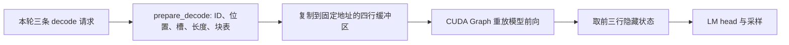

import { PackedExecutionLab } from '../../../components/labs/SystemsLabs'
import NanoOverview from '../../../components/diagrams/NanoOverview.astro'
import Qwen3Layer from '../../../components/diagrams/Qwen3Layer.astro'
import LaunchTimeline from '../../../components/diagrams/LaunchTimeline.astro'

[S4](/systems/engine-runtime/) 决定本轮处理哪些 token，[S5](/systems/paged-cache/) 给每个请求分配 KV 块。执行器要为扁平张量中的每个 token 保留四项信息：所属请求、逻辑位置、K/V 写入槽位和可读历史长度。

本章沿 [nano-vLLM 固定提交 `bb823b3`](https://github.com/GeeeekExplorer/nano-vllm/tree/bb823b3e06983d71485a8e1f23715ebd87d98ef8) 的单卡 `ModelRunner`，追踪一轮 prefill 和随后一轮 decode。GPU 算子的行为按该源码说明；文末 CPU 脚本只核对地址和长度，不模拟注意力数值。

## 本轮清单：三个请求共享一次前向

<NanoOverview />

沿图看一次调用：CPU 选请求和块号，ModelRunner 准备设备输入，GPU 前向读写每层的缓存，采样 ID 回到请求状态。本图列出控制与执行的职责，不表示所有 ModelRunner 方法都在 GPU 上运行。

设物理 KV 块大小 $T_b=4$，块号从 0 开始，配置允许最多 32 条并发序列。调度器交来 A、B、C 三条请求；`num_cached_tokens` 是已经写入 KV 的逻辑长度，`num_scheduled_tokens` 是本轮新算的长度。B 的历史 token ID 为 `[21,22,23,24]`，其 K/V 已在物理块 5；其他历史为空。块表中的第二个号负责容纳本轮新增位置。

| 请求 | 已缓存长度 | 本轮 token ID | 本轮逻辑位置 | 块表 | 本轮可见 K 长度 |
| --- | ---: | --- | --- | --- | ---: |
| A | 0 | `[11,12,13]` | `0,1,2` | `[2]` | 3 |
| B | 4 | `[25,26]` | `4,5` | `[5,7]` | 6 |
| C | 0 | `[31,32,33,34]` | `0,1,2,3` | `[9]` | 4 |

同一 batch 中可以有两个位置 0，因为位置属于请求自己的序列。A、B、C 共享模型权重与一次设备执行机会，**不共享注意力的可见集合**。B 的两个新查询能看见其缓存中的四个旧 K/V 和两个新 K/V；A 的查询不能看 B 的缓存。

## Prefill：packed 数组怎样保留请求边界

`prepare_prefill()` 按请求顺序只取本轮的 token 区间，把它们紧接着放进 `input_ids`。这是 **packed** 表示：不为短序列补零；边界由累计长度指出。令第 $r$ 条请求的新增查询长度为 $q_r$、已有缓存长度为 $c_r$，则它的可见键长度为 $k_r=c_r+q_r$。这里的 `cu_seqlens` 是 cumulative sequence lengths，首项为 0，后续项是各请求长度的前缀和。

<KeyEq label="本轮查询与历史键的两套边界">
$$
Q_0=K_0=0,\qquad
Q_{r+1}=Q_r+q_r,\qquad
K_{r+1}=K_r+(c_r+q_r).
$$
</KeyEq>

代入表中 $q=(3,2,4)$、$c=(0,4,0)$，得到：

| 元数据 | 具体值 | 如何读 |
| --- | --- | --- |
| `input_ids` | `[11,12,13,25,26,31,32,33,34]` | 共 9 个本轮查询 |
| `positions` | `[0,1,2,4,5,0,1,2,3]` | 每项在所属请求中的绝对位置 |
| `cu_seqlens_q` | `[0,3,5,9]` | A 占 packed 下标 `[0,3)`，B 占 `[3,5)`，C 占 `[5,9)` |
| `cu_seqlens_k` | `[0,3,9,13]` | 可见键长度依次为 3、6、4 |
| `max_seqlen_q/k` | `4 / 6` | 本批中最长的单请求 Q/K，不是总数 |

B 的 `cu_seqlens_k` 区间长度是 6，却没有再输入旧 token 21–24；它们的 K/V 从缓存取。这里的 13 是各请求可见键**长度之和**，不表示 13 个键被拼成一个可跨请求注意的序列。`flash_attn_varlen_func` 接收两组边界；存在缓存前缀时，`prepare_prefill()` 还传块表，使它从分页 KV 中找历史。因果条件仍按**各请求的逻辑位置**判断，不能把 B 的新查询当作序列位置 0、1。

若本轮处理到了各请求当前已有 ID 的末尾，LM head 只需 packed 下标 `Q[1:]-1 = [2,4,8]` 对应的隐藏状态，分别生成下一 token 的 logits（softmax 前分数）。若 B 只处理 prompt 的中间 chunk，[S4 的调度规则](/systems/engine-runtime/#两条请求为什么每轮都要重新选)会让它继续等待，不能拿中间位置的 logits 提前生成。`ParallelLMHead` 的 [末下标选择](https://github.com/GeeeekExplorer/nano-vllm/blob/bb823b3e06983d71485a8e1f23715ebd87d98ef8/nanovllm/layers/embed_head.py#L50-L60)只优化计算位置，本身不负责决定能否向用户交付采样结果。

## KV 写入：位置与物理槽位各管一件事

<PackedExecutionLab client:visible />

默认九格对应本章 packed 数组。依次核对三个场景：

1. prefill 中把“packed 下标”设为 3，检查 B 的第一格：逻辑位置为 4、物理槽为 28。三个编号的用途不同。
2. 勾选“下一轮 decode”，依次选择下标 0、1、2。A、B、C 的新 ID 分别进入位置 3、6、4，槽位分别为 11、30、40。
3. 把“执行阶段”调到 capture、replay，读图下的缓冲区说明：Graph 共四行，三行有效，padding 行槽号为 -1。该行的上下文长度按下文规则置为 0；实验不展示这一字段。

Graph 场景只展示本快照的 decode 固定地址缓冲区。无效行必须跳过 KV 写入；丢弃它的输出不能撤销已经发生的缓存写入。

模型用 `positions` 为 Q/K 应用 RoPE，注意力层用 `slot_mapping` 把本轮 K/V 写入物理缓存。由 [S5 的块表公式](/systems/paged-cache/#块表逻辑位置怎样变成物理槽位)，逻辑位置 $p$ 写到 `block_table[p // 4] * 4 + p % 4`。本例因此得到：

| 请求 | 本轮写入位置 | `slot_mapping` |
| --- | --- | --- |
| A | `0,1,2` | `8,9,10` |
| B | `4,5` | `28,29` |
| C | `0,1,2,3` | `36,37,38,39` |

`slot_mapping` 与 packed `input_ids` 一一对齐，共九项；B 历史位置 0–3 仍在物理槽 20–23。不同请求逻辑位置相同不要求物理槽相同。注意力层先调用写缓存的 Triton kernel，再按 prefill/decode 分支读取；[该 kernel](https://github.com/GeeeekExplorer/nano-vllm/blob/bb823b3e06983d71485a8e1f23715ebd87d98ef8/nanovllm/layers/attention.py#L8-L37)遇到槽号 `-1` 会跳过写入。所有层共用块号体系，但每层有自己的 K/V 数值；块号不能代替 RoPE 的逻辑位置。

这一步有两个必须一起成立的不变量：每个本轮 token 恰好写到其请求的预留槽；每个查询只读该请求**有效长度内**的键。仅看前向得到有限 logits 不够，错位读取也可能给出有限值。若 B 的第二块被误填成 2，它会覆盖或读取 A 的数据；若 B 的位置被改为 0、1，即使槽号正确，RoPE 后的注意力分数也会改变。

## Decode：同一组三请求怎样进入下一轮

假设 A、B、C 刚分别生成一个新 ID，记作 `14,27,35`。生成时新 ID 只追加到请求，尚无它自己的 KV；本轮 decode 才分别输入这一个 ID。S4 已说明这种“已有 ID 比已缓存长度多一”的状态。A 的下一位置是 3，B 是 6，C 是 4；为了容纳 C 的位置 4，先给它分配新物理块 10。

| 请求 | decode `input_id` | `position` | `context_len` | 块表 | 新 K/V 槽位 |
| --- | ---: | ---: | ---: | --- | ---: |
| A | 14 | 3 | 4 | `[2]` | 11 |
| B | 27 | 6 | 7 | `[5,7]` | 30 |
| C | 35 | 4 | 5 | `[9,10]` | 40 |

`prepare_decode()` 因此产生三个长度为 3 的一维数组：`input_ids=[14,27,35]`、`positions=[3,6,4]`、`context_lens=[4,7,5]`；块表补成两列 `[[2,-1],[5,7],[9,10]]`。`context_len` **包含本轮刚输入的 token**，因为模型先写新 K/V，再让该查询读到它。它不是“写入前已经缓存多少”。decode 每条请求只有一个查询，`flash_attn_with_kvcache` 用有效上下文长度和块表找到可见键；A 的空白第二列不属于可读历史。

## 从 eager 到 CUDA Graph：复用的是发射序列

<LaunchTimeline />

**eager** 路径按 Python 控制流发起本轮模型算子。decode 每轮只有少量查询，却要经过多层许多短 kernel；这时 CPU 逐次发射的开销可能占明显份额，[S2](/systems/accelerator/)与 [G4](/gpu/measurement/)提供成本和计时边界。CUDA Graph 把一组 GPU 操作及依赖捕获下来，以后作为图重放，减少重复提交开销；它不会重新定义注意力或自动修正元数据。[NVIDIA CUDA Graph 指南](https://docs.nvidia.com/cuda/cuda-programming-guide/04-special-topics/cuda-graphs.html)把图定义与执行分开解释。

nano-vLLM 初始化时先以较大输入 warmup，测峰值显存，再按 [S1 的 KV 块字节数](/systems/ledger/)和利用率预算分配固定 KV 池。模型权重已在 `load_model()` 时装入；所有层随后绑定这块缓存的各层 K/V 视图。Graph 捕获在这些地址确定之后进行。该快照的捕获列表按 `[1,2,4,8] + range(16, min(max_num_seqs,512)+1, 16)` 生成；本例 `max_num_seqs=32`，因此有尺寸 4 可用。各图使用同一批预留输入、元数据和输出缓冲区的切片。

本例真实 batch size 为 3，选择已捕获的尺寸 4。重放前，执行器把前三项新 `input_ids`、`positions`、`slot_mapping`、`context_lens` 和块表复制进同一地址的静态缓冲区。

第四行是 padding，设 `slot_mapping=-1`、`context_lens=0`。前者让写缓存 kernel 跳过该行，后者使它没有有效历史可读。执行器只取前三行输出；padding 的隐藏状态不得送去 LM head 或采样。

块表缓冲区中超出本轮有效长度的旧列可能保留旧值。读取必须服从 `context_lens`，只有有效历史可读。

```mermaid
flowchart LR
    A["本轮三条 decode 请求"] --> B["prepare_decode: ID、位置、槽、长度、块表"]
    B --> C["复制到固定地址的四行缓冲区"]
    C --> D["CUDA Graph 重放模型前向"]
    D --> E["取前三行隐藏状态"]
    E --> F["LM head 与采样"]
```

图中真正捕获的是 `self.model(input_ids, positions)`，包括模型内部的 KV 写入和注意力；`compute_logits()` 与采样在 graph 重放**之后**执行。重放仍使用当前权重及 KV 池中的值，静态的是操作拓扑、输入输出地址和捕获尺寸，不是 token 的数值。若换成新分配的输入张量地址却不复制到静态缓冲区，graph 仍会读旧地址。若两个重放并发改写同一缓冲或提前释放/复用活跃 KV 槽，结果也不受“已捕获”保护。[PyTorch 的 CUDA Graph 说明](https://docs.pytorch.org/docs/2.14/notes/cuda.html#cuda-graphs)要求关注静态地址与前后调用顺序。

`run_model()` 对所有 prefill、`enforce_eager=True` 或 batch size 大于 512 走 eager；其他 decode 才选择不小于真实大小的捕获图。这个固定提交还有一个配置边界：例如 `max_num_seqs=17` 时，列表最大只有 16，真实 batch 为 17 的 decode 找不到图，会在选图时失败。基础尺寸 1、2、4、8 则无条件列入，即使配置上限更小也会建立相应条目。部署前应检查所有允许的 batch size 均能找到 bucket，或为未覆盖尺寸走 eager；本页的 32 条配置覆盖了例子。捕获多个尺寸和 padding 分别消耗初始化时间、显存及额外计算；是否值得必须在目标负载上测真实延迟，不能从“用了 graph”推定加速。

[F7 `torch.compile`](/frameworks/torch-compile/) 分析张量程序并可能生成融合算子；这里的显式 CUDA Graph 重放的是已捕获的 GPU 工作提交。nano-vLLM 也对部分层和采样函数使用 `torch.compile`，两种机制可以同时存在，但一次编译图既不自动等于一枚 kernel，也不等于这里的 `CUDAGraph` 对象。

## 源码如何串起来

<Qwen3Layer />

此图是固定快照的 Qwen3 层路径：Q/K 还需按头归一化，MLP 使用合并 gate/up 投影。两个残差相加都保留；实现可将待相加的残差交给下一次 RMSNorm 一起处理。这是融合调用的组织变化，不是删去模型里的残差。

在固定快照的 [`ModelRunner`](https://github.com/GeeeekExplorer/nano-vllm/blob/bb823b3e06983d71485a8e1f23715ebd87d98ef8/nanovllm/engine/model_runner.py) 中，阅读顺序是 `__init__` 加载权重与分配 KV → `prepare_prefill` 或 `prepare_decode` 装配元数据 → `run_model` 选择 eager/graph → `Attention.forward` 写读 KV → LM head 取隐藏状态并生成 logits → `Sampler` 给 rank 0 返回 token ID。单卡只需跟踪上述数据；多 rank 的权重切片、`all_reduce` 与词表 gather 留给 [S9](/systems/cluster/)。采样分布及策略见 [P9](/principles/generation/)，本章只需要知道 logits 与下一 ID 的接口。

下面的脚本独立重算两轮元数据，断言 packed 边界、绝对位置、物理槽位、末位置索引及 padding 不写 KV。它不证明 FlashAttention、Triton kernel 或 CUDA Graph 在本机正确或更快。GPU 验收应固定相同权重、输入与初始 KV，比较 eager 与 graph 的有效行 logits 和写入后的 KV；覆盖块边界、含前缀的 prefill、不同 batch bucket，再按 G4 同步和计时。随机采样 ID 不能用作浮点前向逐项相等的唯一证据。

<CodeFile path="code/systems/engine_execution.py" />

## 常见误区

- `cu_seqlens_k[-1]=13` 表示 B 可看 A/C 的键：它只是逐请求长度的累计总数，注意力仍按边界隔离。
- 新 token 的位置等于它的物理槽号：位置用于 RoPE，槽号用于 KV 地址。
- 捕获后输入值固定：每轮先更新固定地址中的值；固定的是内存地址和捕获尺寸。
- graph 覆盖整轮服务：本快照只捕获模型前向，准备元数据、logits 和采样仍在外面。

## 练习与核对

把 B 的已缓存长度从 4 改为 5，本轮仍新算两个 token、块表仍为 `[5,7]`。B 的位置、槽位、可见 K 长度及新的 `cu_seqlens_k` 是什么？

B 本轮位置改为 5、6，仍落在第二个逻辑块，物理槽为 $7\times4+1=29$、$7\times4+2=30$。B 的可见 K 长度从 6 变成 7；A、C 不变，累计键长度为 `[0,3,10,14]`。查询累计长度仍是 `[0,3,5,9]`。若沿用原 B 的 slot 28，会覆写已经缓存的位置 4。

batch size 为 3，捕获尺寸为 4。若第四行的 `slot_mapping` 留着上次的槽 40，即使最终只取前三行输出，会怎样？

graph 中的模型前向仍计算第四行；只丢弃其输出不能撤销副作用。缓存写 kernel 可能把第四行 K/V 写到槽 40，污染 C 的有效位置。必须在重放前把无效行的槽号置为 `-1`，并把有效上下文长度置为 0；还须确保有效行的地址与长度本身正确。

下一章 [S7 量化与精度](/systems/quantization/) 将改变权重和 KV 的表示字节；执行器的地址与有效长度约束依然要保持。

## 原始资料

- [nano-vLLM 固定提交的 `model_runner.py`](https://github.com/GeeeekExplorer/nano-vllm/blob/bb823b3e06983d71485a8e1f23715ebd87d98ef8/nanovllm/engine/model_runner.py)、[`attention.py`](https://github.com/GeeeekExplorer/nano-vllm/blob/bb823b3e06983d71485a8e1f23715ebd87d98ef8/nanovllm/layers/attention.py)、[`embed_head.py`](https://github.com/GeeeekExplorer/nano-vllm/blob/bb823b3e06983d71485a8e1f23715ebd87d98ef8/nanovllm/layers/embed_head.py)：本页具体元数据、KV 与输出行为，核对于 2026-09-28。
- [NVIDIA CUDA Graph 指南](https://docs.nvidia.com/cuda/cuda-programming-guide/04-special-topics/cuda-graphs.html)、[PyTorch CUDA Graph 说明](https://docs.pytorch.org/docs/2.14/notes/cuda.html#cuda-graphs)：图重放、静态地址与使用限制。

本章没有 GPU 实测数字；三请求表与脚本是对执行元数据的手算核对。
