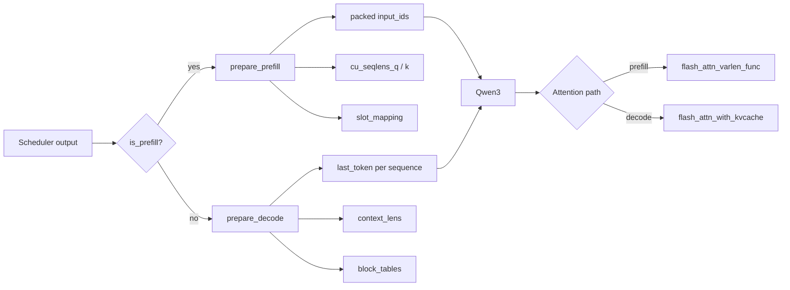
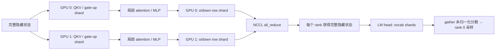

import Qwen3Layer from '../../../components/diagrams/Qwen3Layer.astro'
import LaunchTimeline from '../../../components/diagrams/LaunchTimeline.astro'
import Checklist from '../../../components/labs/Checklist'

[S4](/systems/engine-runtime/) 与 [S5](/systems/paged-cache/) 决定这一步算谁、K/V 写到哪里。本章进入数据面，看 `ModelRunner` 怎样把这些决定变成张量，以及 CUDA Graph 怎样减少 decode 的启动开销。第一次阅读先沿单卡主线；张量并行段可在 [S9](/systems/cluster/) 的切片与 collective 数值例之后回读。

## 同一个模型，两种批形状

prefill 把多条不等长序列打平为 token 流，用累计长度描述边界；decode 则每条序列只送入最后一个 token，并携带完整上下文长度和 block table。

| 张量 | prefill | decode |
| --- | --- | --- |
| `input_ids` | `[Σ scheduled_tokens]` | `[num_seqs]` |
| `positions` | 每个新增 token 的绝对位置 | `len(seq) - 1` |
| Q 长度 | `cu_seqlens_q` | 隐含为每条 1 |
| K 长度 | `cu_seqlens_k = cached + new` | `context_lens = len(seq)` |
| 缓存映射 | `slot_mapping`；命中前缀时另带 `block_tables` | `slot_mapping` + `block_tables` |


```mermaid
flowchart LR
    A[Scheduler output] --> B{is_prefill?}
    B -->|yes| C[prepare_prefill]
    C --> D[packed input_ids]
    C --> E[cu_seqlens_q / k]
    C --> F[slot_mapping]
    B -->|no| G[prepare_decode]
    G --> H[last_token per sequence]
    G --> I[context_lens]
    G --> J[block_tables]
    D --> K[Qwen3]
    H --> K
    K --> L{Attention path}
    L -->|prefill| M[flash_attn_varlen_func]
    L -->|decode| N[flash_attn_with_kvcache]
```

`positions` 一行正是 [KV cache 的正确性](/principles/kv-cache/) 中“新位置不能从 0 重新编号”的工程落点：decode 的位置是序列当前长度减一，而不是批内行号。

### 三条请求怎样核对 packed 元数据

本步新增长度为 3、2、4，先前缓存长度分别为 0、4、0。打平输入共有 9 个 token，查询累计长度为 `[0,3,5,9]`，可见键累计长度为 `[0,3,9,13]`；第二条的 Q 只有 2 个，但可见 K 有 6 个。位置列表为 `[0,1,2,4,5,0,1,2,3]`，不是全局连续 0 到 8。每条请求最后一个新增隐藏状态在 packed 数组中的下标为 2、4、8。

这三个下标可用于完整 prefill 后的输出头选择；若该请求只是中间 chunk，还不能采样。两个请求具有同样位置 0 并不代表它们可互相注意；varlen 边界和块表仍区分请求。元数据错一个偏移，可能得到有限数值却读错别人的缓存，所以仅检查“不报错”不足以验证打包。

<CodeFile path="code/systems/parallel_layout.py" />

### 为什么 prefill 也可能读缓存

命中共享前缀或执行 chunked prefill 时，当前 Q 的数量小于可见 K 的数量，即 `cu_seqlens_k[-1] > cu_seqlens_q[-1]`。此时 `prepare_prefill()` 生成 block tables，attention 从分页缓存读取历史 K/V。

<SourceNote>[model_runner.py:129-188](https://github.com/GeeeekExplorer/nano-vllm/blob/bb823b3e06983d71485a8e1f23715ebd87d98ef8/nanovllm/engine/model_runner.py#L129-L188)、[attention.py:59-75](https://github.com/GeeeekExplorer/nano-vllm/blob/bb823b3e06983d71485a8e1f23715ebd87d98ef8/nanovllm/layers/attention.py#L59-L75)</SourceNote>

## Qwen3 层：最小实现保留了关键优化

模型结构看起来接近普通 Transformer，但每个线性层已经为张量并行切分，attention 同时承担 KV cache 读写，RMSNorm 与 SiLU×Gate 则交给 `torch.compile`。

这里的 Q/K normalization 在 `qkv_bias=False` 分支中对每个头的查询与键应用 RMSNorm：对头内坐标 $x_a$ 计算 $x_a/\sqrt{d_h^{-1}\sum_bx_b^2+\varepsilon}$，再乘逐坐标可学习缩放。它不是 M3 中的欧氏单位化，不能据此声称查询与键的范数为 1。RoPE 保持的是 RMSNorm 之后、旋转之前的欧氏范数，见 [qwen3.py:64–80](https://github.com/GeeeekExplorer/nano-vllm/blob/bb823b3e06983d71485a8e1f23715ebd87d98ef8/nanovllm/models/qwen3.py#L64-L80)。

<Qwen3Layer />

| 模块 | 实现重点 | 为什么影响推理 |
| --- | --- | --- |
| GQA | Q 头多于 KV 头 | 减少 KV cache 容量与带宽，见 [S1](/systems/ledger/) |
| RoPE | 按绝对 `positions` 旋转 Q/K | decode 不能把位置重置为 0 |
| RMSNorm | 残差加法与归一化融合 | 减少中间张量与 kernel 开销 |
| Gated MLP | gate/up 合为一个列并行投影 | 匹配权重打包并减少调用 |
| LM head | prefill 只取每条序列最后一个隐藏状态 | 避免为所有 prompt token 计算未归一化分数 |

## 张量并行：切权重，也要安排通信落点

每个 rank 都运行完整控制流，但只持有部分权重。列并行切输出维，局部计算后暂不通信；行并行切输入维，局部结果必须 `all_reduce` 才恢复完整输出。

名称沿用论文中的 $Y=XW$ 布局：$W\in\mathbb R^{d_{\mathrm{in}}\times d_{\mathrm{out}}}$，列对应输出维，行对应输入维。PyTorch 的 `weight` 存储 $W^\top$，形状为 `(out_features, in_features)`，所以列并行实际切存储权重的第 0 轴，行并行切第 1 轴。不要只凭“行、列”猜源码的切分轴。参见 [PyTorch Linear](https://docs.pytorch.org/docs/stable/generated/torch.nn.Linear.html) 与 [Megatron 并行层](https://docs.nvidia.com/megatron-core/developer-guide/nightly/apidocs/core/core.extensions.transformer_engine.html)。

<Panels>
<Panel title="列并行">`QKVParallelLinear` 与 `MergedColumnParallelLinear` 沿输出维切分。每张卡得到一组 attention 头或 MLP 中间通道。</Panel>
<Panel title="行并行" tone="accent2">`o_proj` 与 `down_proj` 沿输入维切分。各卡产生部分和，随后 NCCL `all_reduce`。</Panel>
</Panels>


```mermaid
flowchart LR
    X[完整隐藏状态] --> C0[GPU 0: QKV / gate-up shard]
    X --> C1[GPU 1: QKV / gate-up shard]
    C0 --> L0[局部 attention / MLP]
    C1 --> L1[局部 attention / MLP]
    L0 --> R0[GPU 0: o/down row shard]
    L1 --> R1[GPU 1: o/down row shard]
    R0 --> A[NCCL all_reduce]
    R1 --> A
    A --> Y[每个 rank 获得完整隐藏状态]
    Y --> V[LM head: vocab shards]
    V --> G[gather 未归一化分数 → rank 0 采样]
```

一次“列并行接行并行”只在块的末尾通信一次，这是 [Megatron-LM](https://arxiv.org/abs/1909.08053) 的切法；[S9](/systems/cluster/) 会把这笔通信放到机内、机间不同的线上计价。

### 进程间如何同步一次调用

rank 0 将方法名与参数 pickle 到 1 MiB 共享内存，再用每个 worker 的 Event 发信号；所有 rank 执行同名方法。模型内部的数值通信仍走 NCCL。这个设计很适合教学，但固定端口 `tcp://localhost:2333`、固定共享内存名 `nanovllm` 与固定缓冲区意味着多实例隔离不是当前目标。

<SourceNote>[linear.py](https://github.com/GeeeekExplorer/nano-vllm/blob/bb823b3e06983d71485a8e1f23715ebd87d98ef8/nanovllm/layers/linear.py#L54-L156)、[worker RPC](https://github.com/GeeeekExplorer/nano-vllm/blob/bb823b3e06983d71485a8e1f23715ebd87d98ef8/nanovllm/engine/model_runner.py#L41-L89)</SourceNote>

## CUDA Graph：把稳定的 decode 形状录下来重放

decode 每步 token 少、kernel 多，CPU 发射开销容易显眼；这正是 [S2](/systems/accelerator/) 时间线图里的白道。nano-vLLM 为一组离散批大小捕获 graph；运行时向上取最近的已捕获尺寸，把多余槽位设为无效后重放。

<LaunchTimeline />

捕获的批大小列表按代码生成，`max_num_seqs` 是允许的最大序列数：

```python
capture_sizes = [1, 2, 4, 8] + list(range(16, min(max_num_seqs, 512) + 1, 16))
```

<Panels>
<Panel title="走 graph">decode、`enforce_eager=False` 且真实批大小 ≤ 512。</Panel>
<Panel title="走 eager" tone="accent2">所有 prefill、显式 eager 模式，或批大小大于 512。</Panel>
</Panels>

重放前会复制 `input_ids`、`positions`、`slot_mapping`、`context_lens` 与 `block_tables` 到静态缓冲区。padding 槽的 `slot_mapping=-1`、`context_lens=0`，因此不会污染 KV cache。

<SourceNote>[model_runner.py:195-257](https://github.com/GeeeekExplorer/nano-vllm/blob/bb823b3e06983d71485a8e1f23715ebd87d98ef8/nanovllm/engine/model_runner.py#L195-L257)</SourceNote>

## 显存预算：先测峰值，再把余量切成块

构造时先用上限形状 warmup，读取 CUDA 峰值显存。随后把目标显存利用率内的剩余字节除以单个 KV 块的字节数，得到 `num_kvcache_blocks`。块字节数就是 [S1](/systems/ledger/) 的单 token KV 公式乘上块大小，再按张量并行切开 KV 头：

沿用 S1 的记号：$n_{\mathrm{layers}}$ 是层数，$n_{\mathrm{kv}}$ 是 KV 头数，$d_h$ 是头维度，$b_{\mathrm{elem}}$ 是每元素字节数；另记块大小为 $T_b$，张量并行度为 $n_{\mathrm{TP}}$，块字节数为 $m_{\mathrm{KV}}$，对应代码里的 `block_bytes`。

<KeyEq label="KV 块预算">

$$
\begin{aligned}
m_{\mathrm{KV}}&=2n_{\mathrm{layers}}T_b\\
&\quad\times\frac{n_{\mathrm{kv}}}{n_{\mathrm{TP}}}d_hb_{\mathrm{elem}}.
\end{aligned}
$$

$$
\begin{aligned}
m_{\mathrm{free}}&=u\,m_{\mathrm{total}}-m_{\mathrm{used}}\\
&\quad-m_{\mathrm{peak}}+m_{\mathrm{current}},\\
n_{\mathrm{blocks}}&=\left\lfloor\frac{m_{\mathrm{free}}}{m_{\mathrm{KV}}}\right\rfloor.
\end{aligned}
$$

</KeyEq>

这里 $u$ 对应 `gpu_memory_utilization`；四个 $m$ 分别对应代码中的 `total`、`used`、`peak`、`current`，单位均为字节。$n_{\mathrm{blocks}}$ 对应 `num_kvcache_blocks`。此处沿用 nano-vLLM 的前提：KV 头数可被张量并行度整除，各卡保存等量 KV 头。

| 旋钮 | 增大后的直接效果 | 主要代价 |
| --- | --- | --- |
| `gpu_memory_utilization` | 更多 KV 块 | 留给其他 CUDA 工作区的余量更小 |
| `kvcache_block_size` | 元数据更少 | 尾块内部碎片更大，前缀复用粒度更粗 |
| `tensor_parallel_size` | 每卡 KV 头与权重减少 | 通信与多进程复杂度上升 |
| `max_num_batched_tokens` | prefill 批可更大 | warmup 峰值和单步延迟可能上升 |

这是静态容量规划，不是运行中扩容；配置得不到至少一个块时会直接断言失败。

## 入口与出口：权重装入与采样

### 权重加载

Hugging Face checkpoint 中独立的 `q_proj/k_proj/v_proj` 被装入融合参数 `qkv_proj`；`gate_proj/up_proj` 被装入 `gate_up_proj`。每个参数对象挂载自己的 `weight_loader`，因此 loader 不需要知道所有并行层细节。

<Steps label="权重打包映射" items={[
  { tag: 'HF', title: 'q_proj', detail: 'shard q' },
  { tag: 'HF', title: 'k_proj', detail: 'shard k' },
  { tag: 'HF', title: 'v_proj', detail: 'shard v' },
  { tag: 'PACK', title: 'qkv_proj', detail: 'column parallel' },
  { tag: 'HF', title: 'gate + up', detail: 'two shards' },
  { tag: 'PACK', title: 'gate_up', detail: 'column parallel' },
  { tag: 'OUT', title: 'per-rank', detail: 'local weights' },
]} />

### 采样

设最后一个位置的词表未归一化分数为列向量 $z\in\mathbb R^{n_{\mathrm{vocab}}}$，先除以该序列的采样温度 $\tau>0$（代码字段 `temperature`），再 softmax。实现使用指数竞争技巧：对每个类别独立采样 $E_c\sim\operatorname{Exp}(1)$，取 $\arg\max_c p_c/E_c$，得到服从类别分布的 token ID $\widehat u$。指数分布参数 1 是速率，$c$ 是类别索引。

$$
\begin{aligned}
p_c&=\operatorname{softmax}(z/\tau)_c,\\
\widehat u&=\operatorname*{arg\,max}_{0\le c<n_{\mathrm{vocab}}}\frac{p_c}{E_c},\\
E_c&\sim\operatorname{Exp}(1).
\end{aligned}
$$

<Callout tone="warn" title="不要读出不存在的能力">
当前 `SamplingParams` 没有 top-k、top-p、frequency penalty、随机种子或 greedy sampling。API 形似 vLLM，不代表功能等价。
</Callout>

## 执行边界：模型算子、采样与服务分别验证

本文的执行器读取固定精度权重并每步采样一个 token。改变表示精度需要 [S7 量化](/systems/quantization/) 的误差与存储分析；改变每步产出需要 [S8 投机解码](/systems/speculative-decoding/) 的接受与补偿证明；用户侧速度则按 [S10 服务评估](/systems/serving-evaluation/) 定义的事件记录核对。这三种改动需要独立验收，不能只看 CUDA Graph 的 kernel 时间判断整体收益。

## 它为什么适合学习，也为什么还不是生产 vLLM

nano-vLLM 刻意保留最能解释性能来源的机制，同时删掉服务化、容错与大范围模型兼容性。读懂这份代码，关键是能同时说清它做了什么，以及它明确没做什么。

| 维度 | 已实现 | 未覆盖 / 风险边界 |
| --- | --- | --- |
| 服务 | 同步离线 `generate()` | 无 HTTP、流式输出、取消、超时、租户隔离 |
| 模型 | Qwen3 Causal LM | 无通用模型注册、量化、LoRA、多模态 |
| 调度 | prefill 优先、chunked prefill、decode、抢占 | 无优先级、公平性目标、swap、抢占成本模型 |
| 缓存 | 分页 KV、引用计数、前缀复用 | 无跨进程缓存服务、持久化或复杂淘汰策略 |
| 并行 | 单机张量并行 1–8 | 固定 rendezvous 端口与共享内存名，多实例会冲突 |
| 质量 | 断言式前置条件 | 仓库没有测试目录；异常恢复与输入错误信息有限 |

把它当作可执行的系统论文图，而不是一个缩小后仍具备完整兼容性的 vLLM 替代品。

## 用不变量、实验和改造检验理解

能复述代码只是入门。下面的清单把理解推进到“可以定位错误、设计实验、评估改动”。勾选状态只保存在当前浏览器。

<Checklist client:visible storageKey="nano-vllm-mastery-v1" items={[
  { title: '画出请求状态机', detail: '解释 WAITING、RUNNING、FINISHED 以及 preempt 时块所有权的变化。', level: '基础' },
  { title: '手算 slot_mapping', detail: '给定 block table、block size 与 position，逐 token 算出物理槽位。', level: '核心' },
  { title: '追踪 chunked prefill', detail: '说明每个 chunk 后 num_cached_tokens、hash_blocks 与采样何时发生。', level: '核心' },
  { title: '验证 prefix cache', detail: '构造共享 system prompt 的两条请求，比较命中块数与 prefill token 数。', level: '实验' },
  { title: '解释张量并行通信', detail: '指出 QKV/o_proj、gate_up/down 与 embedding/head 各自在哪里通信。', level: '进阶' },
  { title: '做 eager / graph 基准', detail: '固定输入分布和随机种子，分别测 prefill、decode 吞吐与端到端延迟。', level: '实验' },
  { title: '添加可验证改造', detail: '选择 greedy sampling 或调度公平性之一，先写行为测试，再做最小实现。', level: '精通' },
]} />

源码建议读三遍，每遍只追一件事：

<Panels>
<Panel title="第一遍 · 25 分钟">`llm_engine.py → scheduler.py → sequence.py`。只追踪请求状态、每步输入输出和终止条件。</Panel>
<Panel title="第二遍 · 45 分钟" tone="info">`block_manager.py → model_runner.py → attention.py`。手算一个 block table，再核对 prefill/decode 的张量。</Panel>
<Panel title="第三遍 · 60 分钟" tone="accent2">`qwen3.py → linear.py → loader.py`。追踪每个权重 shard、通信位置和融合参数映射。</Panel>
</Panels>

读完之后，下面每个问题都应能指出源码里的证据：

| 问题 | 必须能指出的证据 |
| --- | --- |
| 这一步为什么是 prefill？ | `waiting` 非空且本步返回了被调度的序列 |
| token 会写到哪里？ | `block_table + slot_mapping + block_size` |
| 历史 K/V 从哪里读？ | prefill 的前缀分支，或 decode 的 FlashAttention block table |
| 为什么产生一个而非多个 token？ | LM head 选每条序列最后状态，Sampler 每行取一个 id |
| 显存不足会怎样？ | decode 中从 running 尾部抢占，释放块，序列回 waiting |
| 多卡何时同步？ | 行并行 all-reduce、embedding all-reduce、LM head gather |

## 练习与核对

<details>
<summary>1. 张量并行下，LM head 为什么用 gather，而不是 all-reduce？</summary>

词表沿行被切成互不重叠的 vocabulary shards，每个 rank 产出不同 token 区间的未归一化分数。最终采样需要拼接完整词表，因此 gather 到 rank 0；这不是对同一输出的部分和求和。

</details>

<details>
<summary>2. CUDA Graph 为什么主要用于 decode？</summary>

decode 的输入形状稳定、单步计算小且重复次数多，发射开销相对突出。prefill 长度变化大、计算密集，捕获大量形状成本高且收益相对低。

</details>

<details>
<summary>3. 新增长度 `[3,2,4]`、缓存长度 `[0,4,0]`，为什么查询累计长度末项是 9，键累计长度末项是 13？</summary>

Q 只对应本步新增 token，总数 3+2+4=9；K 包含各请求自己的历史与新增，总数 3+6+4=13。累计长度是边界元数据，并不意味着历史 K 重新拼成同一个跨请求共享上下文。

</details>

<details>
<summary>4. 实际批大小为 5 时，nano-vLLM 用哪个捕获尺寸重放？多出来的槽位怎样处理？</summary>

向上取最近的已捕获尺寸 8。第 6 到 8 个槽位的 `slot_mapping` 设为 $-1$、`context_lens` 设为 0，因此既不写 KV，也不参与注意力；它们的输出被丢弃。

</details>

下一章 [S7 量化与精度](/systems/quantization/) 将权重与状态的表示字节、数值误差和实际 kernel 支持分别核对。

## 引用与边界

| 用到的内容 | 出处 | 本页的处理 |
| --- | --- | --- |
| 调度、并行、CUDA Graph、显存预算、采样 | [nano-vLLM @ bb823b3](https://github.com/GeeeekExplorer/nano-vllm/tree/bb823b3e06983d71485a8e1f23715ebd87d98ef8) | 沿源码调用链解释，锚点指向具体行 |
| 批处理、KV、量化与投机解码何时有效 | [AI Infra Book，推理优化](https://bojieli.github.io/ai-infra-book/manuscripts/08-%E6%8E%A8%E7%90%86%E4%BC%98%E5%8C%96.html) | 每项只保留它改写的那一本账 |
| 引擎主题的原始论文 | [Wafer，Inference engines](https://github.com/wafer-ai/gpu-perf-engineering-resources#4-inference-engines) | 索引 |
| 量化、投机与服务评估 | S7、S8、S10 | 各章独立定义误差、分布与测量协议 |

本章没有给出任何实测性能数字；图中的时间线只示意形状。要比较 eager 与 graph、量化前后的吞吐，用 [S2](/systems/accelerator/) 的记录方法在目标机器上测。
