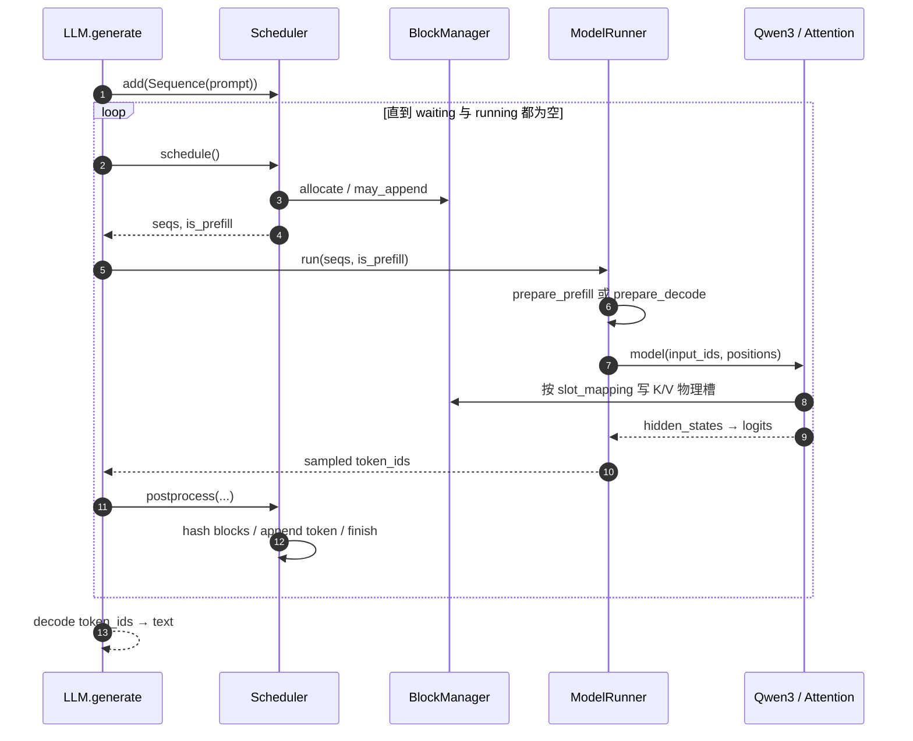
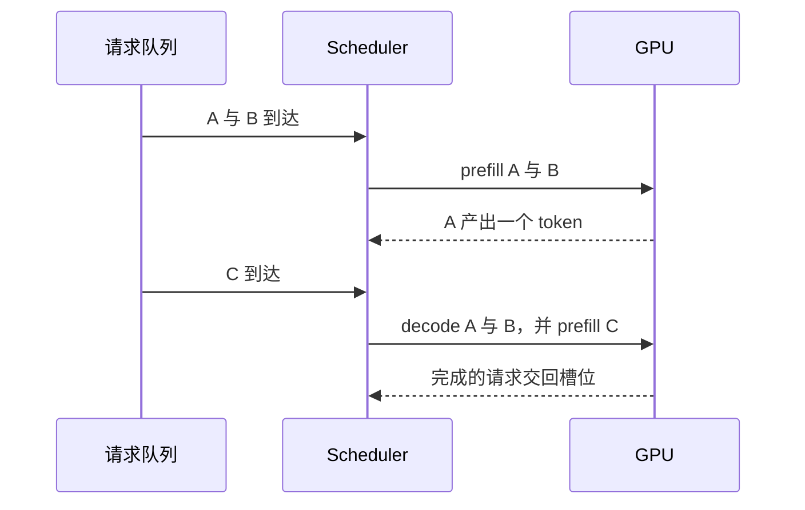
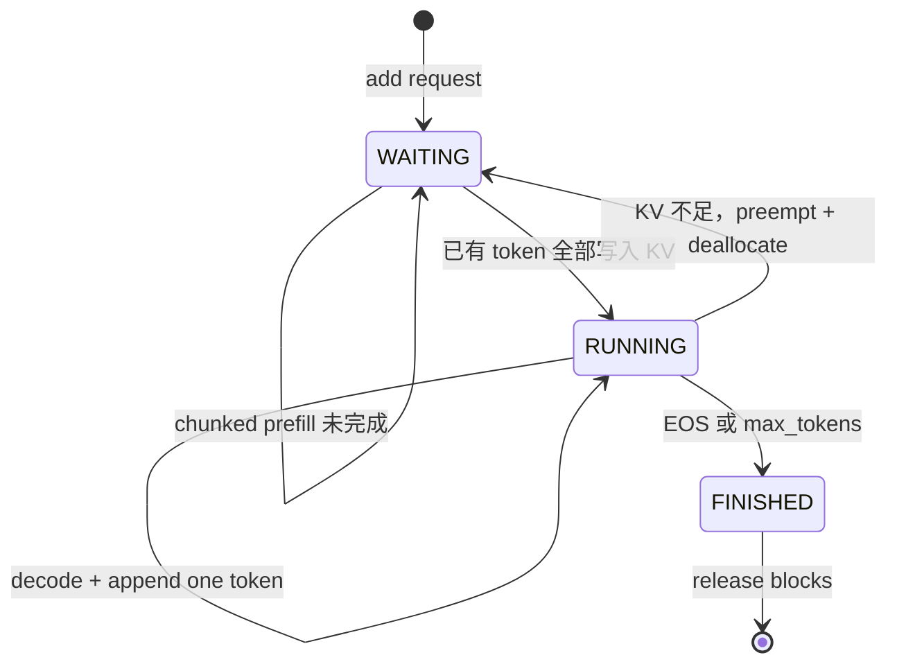

import NanoOverview from '../../../components/diagrams/NanoOverview.astro'
import SchedulerLab from '../../../components/labs/SchedulerLab'
import PagedKvLab from '../../../components/labs/PagedKvLab'

单卡的屋顶线和 kernel 决定一步计算能有多快。推理引擎决定这一步算哪些请求、KV 放在哪、权重用多少字节，以及一步能产出几个 token。模型权重可以不变，这些决定仍会改掉 [S1](/systems/ledger/) 的三本账。本章和 [S4](/systems/engine-execution/) 沿一个真实的小引擎读下去：本章讲控制面——调度与缓存的所有权，下一章讲数据面——张量、并行与 kernel 启动。

<Callout title="源码快照">
[nano-vLLM](https://github.com/GeeeekExplorer/nano-vllm) 提交 [bb823b3](https://github.com/GeeeekExplorer/nano-vllm/commit/bb823b3e06983d71485a8e1f23715ebd87d98ef8)（2026-04-26），约 1,200 行 Python。正文中的源码锚点都指向这一提交；上游后续变化后，先核对调度器与 ModelRunner 再对照阅读。目标不是记住类名，而是能独立解释一个 token 如何被调度、计算、缓存并采样。
</Callout>

## 先把它看成两台协作的机器

nano-vLLM 的代码短，是因为它把问题收敛成两个循环：CPU 上的调度循环决定“这一步算谁”，GPU 上的模型执行器决定“这些 token 怎么算”。KV cache 是两者共享的契约：调度器维护序列状态与逻辑块表，模型执行器把逻辑 token 映射到 GPU 的物理 KV 槽位，再用 Qwen3 前向计算下一个 token。

<NanoOverview />

<StatGrid items={[
  { value: '5', label: '核心运行时对象（含 Sequence）' },
  { value: '2', label: 'prefill / decode 两条执行路径' },
  { value: '1', label: '每步每条序列采样的 token 数' },
  { value: '0', label: 'HTTP 服务层与分布式队列' },
]} />

<SourceNote>[llm_engine.py](https://github.com/GeeeekExplorer/nano-vllm/blob/bb823b3e06983d71485a8e1f23715ebd87d98ef8/nanovllm/engine/llm_engine.py#L15-L90)、[model_runner.py](https://github.com/GeeeekExplorer/nano-vllm/blob/bb823b3e06983d71485a8e1f23715ebd87d98ef8/nanovllm/engine/model_runner.py#L15-L48)</SourceNote>

## 三行 API，背后启动了完整运行时

`LLM` 本身没有新增逻辑，只是继承 `LLMEngine`。构造函数会加载模型与 tokenizer、探测可用 KV cache、预热模型，并按需捕获 CUDA Graph，因此实例化远比表面昂贵。

```python
from nanovllm import LLM, SamplingParams

llm = LLM("/path/to/Qwen3-0.6B", enforce_eager=True)
params = SamplingParams(temperature=0.6, max_tokens=128)
result = llm.generate(["解释 PagedAttention"], params)
```

<Steps label="初始化路径" items={[
  { title: 'Config', detail: '校验参数' },
  { title: 'TP workers', detail: 'spawn' },
  { title: 'Qwen3', detail: 'load_model' },
  { title: 'warmup', detail: '测峰值显存' },
  { title: 'KV cache', detail: '分配剩余显存' },
  { title: 'CUDA Graph', detail: '可选捕获' },
  { title: 'Scheduler', detail: '开始接单' },
]} />

<Callout tone="warn" title="运行边界">
当前实现需要 CUDA、NCCL、FlashAttention 与本地 safetensors 权重；只实现 Qwen3 离线批量生成，不是兼容 OpenAI API 的在线服务。`temperature` 必须大于 `1e-10`，没有 greedy 分支。
</Callout>

<SourceNote>[config.py](https://github.com/GeeeekExplorer/nano-vllm/blob/bb823b3e06983d71485a8e1f23715ebd87d98ef8/nanovllm/config.py#L6-L25)、[sampling_params.py](https://github.com/GeeeekExplorer/nano-vllm/blob/bb823b3e06983d71485a8e1f23715ebd87d98ef8/nanovllm/sampling_params.py#L4-L11)</SourceNote>

## 先读骨架，再读算子

第一次读只追踪数据所有权，不陷入张量细节；第二次再进入 attention 与并行层。控制面（`Sequence`、`Scheduler`、`BlockManager`）在 CPU 上回答状态、配额和映射问题；数据面（`ModelRunner`、Qwen3 与 layers）在 GPU 上完成实际张量计算和通信。

| 文件 | 所在层 | 职责 |
| --- | --- | --- |
| [llm.py](https://github.com/GeeeekExplorer/nano-vllm/blob/bb823b3e06983d71485a8e1f23715ebd87d98ef8/nanovllm/llm.py) | 入口 | 公共 API；`LLM = LLMEngine` |
| [config.py](https://github.com/GeeeekExplorer/nano-vllm/blob/bb823b3e06983d71485a8e1f23715ebd87d98ef8/nanovllm/config.py) | 入口 | 容量、长度、TP、执行模式 |
| [engine/llm_engine.py](https://github.com/GeeeekExplorer/nano-vllm/blob/bb823b3e06983d71485a8e1f23715ebd87d98ef8/nanovllm/engine/llm_engine.py) | 控制面 | 生命周期与 `generate` 循环 |
| [engine/scheduler.py](https://github.com/GeeeekExplorer/nano-vllm/blob/bb823b3e06983d71485a8e1f23715ebd87d98ef8/nanovllm/engine/scheduler.py) | 控制面 | prefill 优先、decode、抢占 |
| [engine/sequence.py](https://github.com/GeeeekExplorer/nano-vllm/blob/bb823b3e06983d71485a8e1f23715ebd87d98ef8/nanovllm/engine/sequence.py) | 控制面 | 单请求状态与序列化边界 |
| [engine/block_manager.py](https://github.com/GeeeekExplorer/nano-vllm/blob/bb823b3e06983d71485a8e1f23715ebd87d98ef8/nanovllm/engine/block_manager.py) | 控制面 | 物理块、引用计数、前缀哈希 |
| [engine/model_runner.py](https://github.com/GeeeekExplorer/nano-vllm/blob/bb823b3e06983d71485a8e1f23715ebd87d98ef8/nanovllm/engine/model_runner.py) | 数据面 | 张量准备、KV 分配、CUDA Graph |
| [models/qwen3.py](https://github.com/GeeeekExplorer/nano-vllm/blob/bb823b3e06983d71485a8e1f23715ebd87d98ef8/nanovllm/models/qwen3.py) | 数据面 | Transformer 与权重打包映射 |
| [layers/attention.py](https://github.com/GeeeekExplorer/nano-vllm/blob/bb823b3e06983d71485a8e1f23715ebd87d98ef8/nanovllm/layers/attention.py) | 数据面 | Triton 写缓存 + FlashAttention |
| [layers/linear.py](https://github.com/GeeeekExplorer/nano-vllm/blob/bb823b3e06983d71485a8e1f23715ebd87d98ef8/nanovllm/layers/linear.py) | 数据面 | 列并行 / 行并行 |
| `layers/rotary_embedding.py`、`layers/embed_head.py` | 数据面 | RoPE；词表并行与 logits 聚合 |
| `utils/context.py`、`utils/loader.py` | 工具 | 一次 forward 的隐式元数据；safetensors → 切分后的参数 |

## 一个 token 的完整往返

先走一条请求：prompt 为 [A, B, C]，位置从 0 开始，没有前缀命中或分块。Prefill 一次输入三个 token，写入位置 0、1、2 的 K/V，并用 C 的输出采样 D。此时 D 已属于序列，但尚未写入缓存。

下一步 decode 只输入 D，位置为 3；写入它的 K/V 后，D 的查询读取 A 到 D 的四组 K/V，再采样 E。因此“序列已有多少 token”和“缓存已计算多少 token”不是同一个数。多请求调度决定这一步执行哪些计算；分页缓存决定 K/V 写到哪里。

每次 `step()` 严格执行“调度 → 模型 → 后处理”。prefill 完成时也会立即采样第一个输出 token；后续 decode 每条活跃序列每步再产生一个。



核心循环的代码形状（[llm_engine.py:49-55](https://github.com/GeeeekExplorer/nano-vllm/blob/bb823b3e06983d71485a8e1f23715ebd87d98ef8/nanovllm/engine/llm_engine.py#L49-L55)）：

```python
def step(self):
    seqs, is_prefill = self.scheduler.schedule()
    token_ids = self.model_runner.call("run", seqs, is_prefill)
    self.scheduler.postprocess(seqs, token_ids, is_prefill)
    return finished_outputs
```

<Callout title="关键不变量">
模型只计算调度器本步批准的 token；块管理器必须在前向前准备好所有写入槽位；采样结果只有在前向结束后才并入 `Sequence`。
</Callout>

## 连续批处理：每一步重新拼批

把若干请求拼成一个张量，然后一起跑到全部结束，短请求会在长请求后面空转。迭代级调度在每个 decode 步重新选择还活着的请求，结束的请求腾出的位置可以马上给新来的请求做 prefill。利用率因此更接近「这一步有多少 token 可算」，排队、公平和显存回收也变成调度器自己的状态。这个调度单位的变化来自 [Orca](https://www.usenix.org/conference/osdi22/presentation/yu)。



图中同一步里既有 decode 又有 prefill，这是 Orca 的做法。nano-vLLM 选择更简单的规则，下面会看到它不在同一步混合两者。

公平性是这个机制带出来的新问题：如果调度总是优先能填满 GPU 的短请求，长请求的排队会变差。进一步的阅读放在 [Wafer 的调度一节](https://github.com/wafer-ai/gpu-perf-engineering-resources#scheduling-and-continuous-batching)。

nano-vLLM 的调度器维护 `waiting` 与 `running` 两个双端队列。它先尽可能调度 prefill；只要本步存在 prefill，就不会混入 decode。没有 prefill 时，才为 running 中的每条序列安排一个 decode token。



下面的实验按源码分支逐步执行。三条请求的 prompt 长度分别为 11、5、8，C 已命中一个完整前缀块。调小 token 预算，观察 chunked prefill 与“预算装不下就延后”的分支。

<SchedulerLab client:visible />

<Panels>
<Panel title="Prefill 优先">降低新请求首 token 延迟，但持续涌入长 prompt 时会推迟 decode。</Panel>
<Panel title="仅首条可分块" tone="info">预算装不下完整 prompt 时，只有本批第一条序列允许 chunked prefill。</Panel>
<Panel title="按整序列抢占" tone="accent2">显存不足时释放某条序列的全部块，回到 waiting 后重新 prefill；没有 swap。</Panel>
</Panels>

<SourceNote>[scheduler.py:25-92](https://github.com/GeeeekExplorer/nano-vllm/blob/bb823b3e06983d71485a8e1f23715ebd87d98ef8/nanovllm/engine/scheduler.py#L25-L92)</SourceNote>

## 分页 KV cache：逻辑连续，物理可以离散

若每条请求占一块连续显存，并且按最大长度预留，短请求会留下用不上的尾巴，结束一条长请求还会迫使别的请求搬家。分页把 KV 切成固定大小的块，逻辑 token 通过块表找到物理块。请求之间的物理块可以交错，结束的块回到空闲列表。

<Figure src="infra/07-paging.svg" alt="请求 A 的逻辑块映射到不连续的物理块">教学用的块大小是 4。A 的 10 个 token 在逻辑上连续，物理上占用 1、2、5 三块。B 的块夹在中间。空闲块可以给下一条请求。</Figure>

[PagedAttention](https://arxiv.org/abs/2309.06180) 把操作系统的分页用到 KV 上，[vLLM](https://github.com/vllm-project/vllm) 是对应的实现。块大小在生产系统里通常大于 4，映射方式相同。

在 nano-vLLM 里，每条序列看到的是连续 token；`block_table` 把第 0、1、2… 个逻辑块翻译为任意物理块。模型不需要搬动历史 K/V，只要把逻辑位置换算成正确槽位：

<KeyEq label="逻辑位置到物理槽位">

$$
\text{logical\_block}=\left\lfloor\frac{\text{position}}{\text{block\_size}}\right\rfloor,\qquad
\text{slot}=\text{block\_table}[\text{logical\_block}]\times\text{block\_size}+\text{position}\bmod\text{block\_size}.
$$

</KeyEq>

<PagedKvLab client:visible />

GPU 上真正分配的张量是

$$
\text{kv\_cache.shape}=[2,\ \text{num\_layers},\ \text{num\_blocks},\ \text{block\_size},\ \text{kv\_heads\_per\_rank},\ \text{head\_dim}].
$$

第一维的 2 分别是 K 与 V。每个注意力层拿到自己在 `kv_cache` 中的一片 view；`slot_mapping` 再告诉 Triton kernel 本批每个新 K/V 应写到哪一个扁平槽位。

<SourceNote>[KV 分配](https://github.com/GeeeekExplorer/nano-vllm/blob/bb823b3e06983d71485a8e1f23715ebd87d98ef8/nanovllm/engine/model_runner.py#L103-L127)、[Triton 写缓存](https://github.com/GeeeekExplorer/nano-vllm/blob/bb823b3e06983d71485a8e1f23715ebd87d98ef8/nanovllm/layers/attention.py#L10-L40)</SourceNote>

## 前缀缓存：缓存的是完整块链，不是字符串

共享前缀时，只读块可以被多条请求指到同一物理块。nano-vLLM 为每个完整块计算哈希，它同时依赖“前一块哈希”和“本块 token_ids”。因此相同 token 块只有出现在相同前缀链上才命中；命中后还会逐 token 比较，避免仅凭哈希确认。

$$
h_0=\operatorname{xxh64}(\text{tokens}_0),\qquad
h_i=\operatorname{xxh64}(h_{i-1}\,\|\,\text{tokens}_i).
$$

<Panels>
<Panel title="命中时">复用物理 block id，增加 `ref_count`；prefill 只计算未命中的后缀，FlashAttention 通过 block table 读取完整 K/V。</Panel>
<Panel title="释放时" tone="accent2">按序列的 block table 逆序减引用计数；归零的块回到 free 队列，但哈希与 token 元数据暂留到块再次分配。</Panel>
</Panels>

| 设计点 | nano-vLLM 的选择 | 含义 |
| --- | --- | --- |
| 匹配粒度 | 完整物理块 | 部分块不进入共享前缀索引 |
| 链式身份 | 前缀哈希 + 本块 tokens | 相同局部 token、不同历史不会误复用 |
| 冲突防护 | 再比较 `token_ids` | 哈希命中不是最终证据 |
| 所有权 | `ref_count` | 多个序列可安全共享同一前缀块 |

<Callout tone="warn" title="保守的尾块">
`can_allocate()` 只扫描 `range(seq.num_blocks - 1)`，即不复用序列最后一个逻辑块。阅读与优化时要把“可缓存的完整块”和“未来可能继续写的尾块”分开考虑。
</Callout>

<SourceNote>[block_manager.py:35-120](https://github.com/GeeeekExplorer/nano-vllm/blob/bb823b3e06983d71485a8e1f23715ebd87d98ef8/nanovllm/engine/block_manager.py#L35-L120)</SourceNote>

## 练习与核对

<details>
<summary>1. 为什么 prefill 完成后，下一步 decode 的输入是刚采样的 token，而不是 prompt 最后一个 token？</summary>

prefill 已经为 prompt 全部位置写入 KV，并用最后一个 prompt hidden state 采样出第一个输出 token。这个新 token 尚未进入 KV；下一步必须以它作为输入，计算并写入它自己的 K/V，同时让它的查询读取全部历史。

</details>

<details>
<summary>2. 为什么抢占后需要重新 prefill，而不是只把序列放回 running？</summary>

`preempt()` 会释放整条序列的 block table，并把 `num_cached_tokens` 归零。GPU 已不再保证保留它的历史 K/V，所以必须回到 WAITING 重建缓存；若前缀块仍在哈希索引中且被其他请求持有，可能再次命中。

</details>

<details>
<summary>3. 块大小 4，block_table = [6, 2, 9]，位置 9 的 token 写入哪个物理槽位？</summary>

逻辑块 $\lfloor 9/4\rfloor=2$，块内偏移 $9\bmod4=1$，物理块 `block_table[2] = 9`，槽位 $9\times4+1=37$。可以把实验里的序列长度调到 9 核对。

</details>

<details>
<summary>4. prefix cache 命中时，Q 的长度为什么可以小于 K 的长度？</summary>

Q 只为未缓存后缀计算；K 则包含共享前缀的历史 K 和当前后缀的新 K。FlashAttention 通过累计长度与 block table 获得这个非对称的注意力窗口，[S4](/systems/engine-execution/) 的批形状一节会展开 `cu_seqlens_q` 与 `cu_seqlens_k`。

</details>
