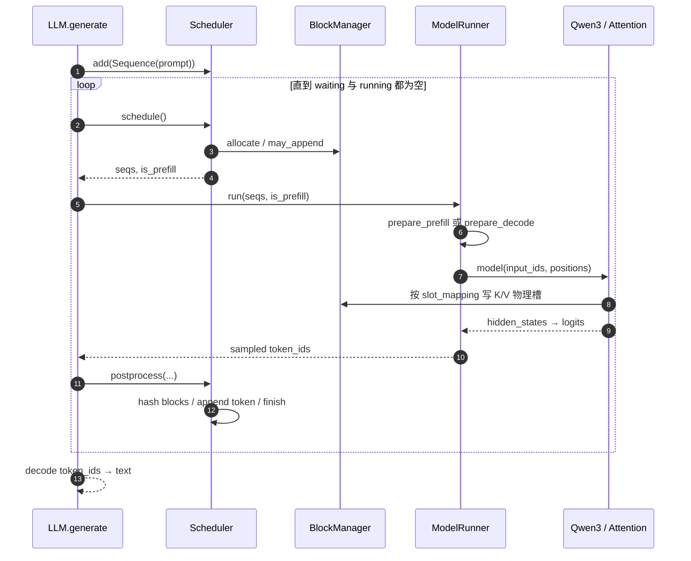
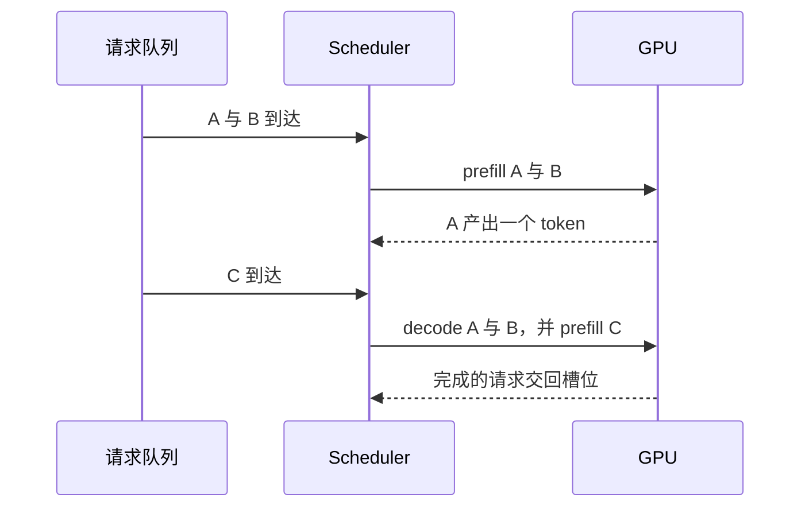
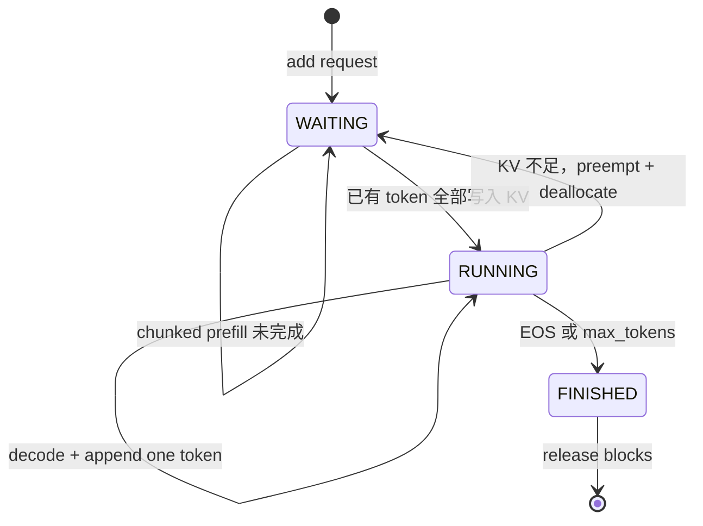

import NanoOverview from '../../../components/diagrams/NanoOverview.astro'
import SchedulerLab from '../../../components/labs/SchedulerLab'

单卡的屋顶线和 kernel 决定一步计算能有多快。推理引擎决定这一步算哪些请求、怎样使用缓存容量，以及何时产出 token。模型权重可以不变，这些决定仍会改掉 [S1](/systems/ledger/) 的三本账。本章沿一个真实的小引擎读调度控制面；[S5](/systems/paged-cache/) 解释缓存所有权与地址，[S6](/systems/engine-execution/) 再解释张量与 kernel 启动。

<Callout title="源码快照">
[nano-vLLM](https://github.com/GeeeekExplorer/nano-vllm) 提交 [bb823b3](https://github.com/GeeeekExplorer/nano-vllm/commit/bb823b3e06983d71485a8e1f23715ebd87d98ef8)（2026-04-26），约 1,200 行 Python。正文中的源码锚点都指向这一提交；上游后续变化后，先核对调度器与 ModelRunner 再对照阅读。目标不是记住类名，而是能独立解释一个 token 如何被调度、计算、缓存并采样。
</Callout>

## 先把它看成两台协作的机器

nano-vLLM 的代码短，是因为它把问题收敛成两个循环：CPU 上的调度循环决定“这一步算谁”，GPU 上的模型执行器决定“这些 token 怎么算”。KV cache 是两者共享的契约：调度器维护序列状态与逻辑块表，模型执行器把逻辑 token 映射到 GPU 的物理 KV 槽位，再用 Qwen3 前向计算下一个 token。

<NanoOverview />

<StatGrid items={[
  { value: '5', label: '核心运行时对象（含 Sequence）' },
  { value: '2', label: 'prefill / decode 两条执行路径' },
  { value: '1', label: '每步每条序列采样的 token 数' },
  { value: '0', label: 'HTTP 服务层与分布式队列' },
]} />

<SourceNote>[llm_engine.py](https://github.com/GeeeekExplorer/nano-vllm/blob/bb823b3e06983d71485a8e1f23715ebd87d98ef8/nanovllm/engine/llm_engine.py#L15-L90)、[model_runner.py](https://github.com/GeeeekExplorer/nano-vllm/blob/bb823b3e06983d71485a8e1f23715ebd87d98ef8/nanovllm/engine/model_runner.py#L15-L48)</SourceNote>

## 三行 API，背后启动了完整运行时

`LLM` 本身没有新增逻辑，只是继承 `LLMEngine`。构造函数会加载模型与 tokenizer、探测可用 KV cache、预热模型，并按需捕获 CUDA Graph，因此实例化远比表面昂贵。

```python
from nanovllm import LLM, SamplingParams

llm = LLM("/path/to/Qwen3-0.6B", enforce_eager=True)
params = SamplingParams(temperature=0.6, max_tokens=128)
result = llm.generate(["解释 PagedAttention"], params)
```

<Steps label="初始化路径" items={[
  { title: 'Config', detail: '校验参数' },
  { title: 'TP workers', detail: 'spawn' },
  { title: 'Qwen3', detail: 'load_model' },
  { title: 'warmup', detail: '测峰值显存' },
  { title: 'KV cache', detail: '分配剩余显存' },
  { title: 'CUDA Graph', detail: '可选捕获' },
  { title: 'Scheduler', detail: '开始接单' },
]} />

<Callout tone="warn" title="运行边界">
当前实现需要 CUDA、NCCL、FlashAttention 与本地 safetensors 权重；只实现 Qwen3 离线批量生成，不是兼容 OpenAI API 的在线服务。`temperature` 必须大于 `1e-10`，没有 greedy 分支。
</Callout>

<SourceNote>[config.py](https://github.com/GeeeekExplorer/nano-vllm/blob/bb823b3e06983d71485a8e1f23715ebd87d98ef8/nanovllm/config.py#L6-L25)、[sampling_params.py](https://github.com/GeeeekExplorer/nano-vllm/blob/bb823b3e06983d71485a8e1f23715ebd87d98ef8/nanovllm/sampling_params.py#L4-L11)</SourceNote>

## 先读骨架，再读算子

第一次读只追踪数据所有权，不陷入张量细节；第二次再进入 attention 与并行层。控制面（`Sequence`、`Scheduler`、`BlockManager`）在 CPU 上回答状态、配额和映射问题；数据面（`ModelRunner`、Qwen3 与 layers）在 GPU 上完成实际张量计算和通信。

| 文件 | 所在层 | 职责 |
| --- | --- | --- |
| [llm.py](https://github.com/GeeeekExplorer/nano-vllm/blob/bb823b3e06983d71485a8e1f23715ebd87d98ef8/nanovllm/llm.py) | 入口 | 公共 API；`LLM = LLMEngine` |
| [config.py](https://github.com/GeeeekExplorer/nano-vllm/blob/bb823b3e06983d71485a8e1f23715ebd87d98ef8/nanovllm/config.py) | 入口 | 容量、长度、TP、执行模式 |
| [engine/llm_engine.py](https://github.com/GeeeekExplorer/nano-vllm/blob/bb823b3e06983d71485a8e1f23715ebd87d98ef8/nanovllm/engine/llm_engine.py) | 控制面 | 生命周期与 `generate` 循环 |
| [engine/scheduler.py](https://github.com/GeeeekExplorer/nano-vllm/blob/bb823b3e06983d71485a8e1f23715ebd87d98ef8/nanovllm/engine/scheduler.py) | 控制面 | prefill 优先、decode、抢占 |
| [engine/sequence.py](https://github.com/GeeeekExplorer/nano-vllm/blob/bb823b3e06983d71485a8e1f23715ebd87d98ef8/nanovllm/engine/sequence.py) | 控制面 | 单请求状态与序列化边界 |
| [engine/block_manager.py](https://github.com/GeeeekExplorer/nano-vllm/blob/bb823b3e06983d71485a8e1f23715ebd87d98ef8/nanovllm/engine/block_manager.py) | 控制面 | 物理块、引用计数、前缀哈希 |
| [engine/model_runner.py](https://github.com/GeeeekExplorer/nano-vllm/blob/bb823b3e06983d71485a8e1f23715ebd87d98ef8/nanovllm/engine/model_runner.py) | 数据面 | 张量准备、KV 分配、CUDA Graph |
| [models/qwen3.py](https://github.com/GeeeekExplorer/nano-vllm/blob/bb823b3e06983d71485a8e1f23715ebd87d98ef8/nanovllm/models/qwen3.py) | 数据面 | Transformer 与权重打包映射 |
| [layers/attention.py](https://github.com/GeeeekExplorer/nano-vllm/blob/bb823b3e06983d71485a8e1f23715ebd87d98ef8/nanovllm/layers/attention.py) | 数据面 | Triton 写缓存 + FlashAttention |
| [layers/linear.py](https://github.com/GeeeekExplorer/nano-vllm/blob/bb823b3e06983d71485a8e1f23715ebd87d98ef8/nanovllm/layers/linear.py) | 数据面 | 列并行 / 行并行 |
| `layers/rotary_embedding.py`、`layers/embed_head.py` | 数据面 | RoPE；词表并行与未归一化分数聚合 |
| `utils/context.py`、`utils/loader.py` | 工具 | 一次 forward 的隐式元数据；safetensors → 切分后的参数 |

## 一个 token 的完整往返

先走一条请求：prompt 为 [A, B, C]，位置从 0 开始，没有前缀命中或分块。Prefill 一次输入三个 token，写入位置 0、1、2 的 K/V，并用 C 的输出采样 D。此时 D 已属于序列，但尚未写入缓存。

下一步 decode 只输入 D，位置为 3；写入它的 K/V 后，D 的查询读取 A 到 D 的四组 K/V，再采样 E。因此“序列已有多少 token”和“缓存已计算多少 token”不是同一个数。多请求调度决定这一步执行哪些计算；分页缓存决定 K/V 写到哪里。

每次 `step()` 严格执行“调度 → 模型 → 后处理”。prefill 完成时也会立即采样第一个输出 token；后续 decode 每条活跃序列每步再产生一个。


```mermaid
sequenceDiagram
    autonumber
    participant U as LLM.generate
    participant S as Scheduler
    participant B as BlockManager
    participant R as ModelRunner
    participant M as Qwen3 / Attention
    U->>S: add(Sequence(prompt))
    loop 直到 waiting 与 running 都为空
        U->>S: schedule()
        S->>B: allocate / may_append
        S-->>U: seqs, is_prefill
        U->>R: run(seqs, is_prefill)
        R->>R: prepare_prefill 或 prepare_decode
        R->>M: model(input_ids, positions)
        M->>B: 按 slot_mapping 写 K/V 物理槽
        M-->>R: hidden_states → logits
        R-->>U: sampled token_ids
        U->>S: postprocess(...)
        S->>S: hash blocks / append token / finish
    end
    U-->>U: decode token_ids → text
```

核心循环的代码形状（[llm_engine.py:49-55](https://github.com/GeeeekExplorer/nano-vllm/blob/bb823b3e06983d71485a8e1f23715ebd87d98ef8/nanovllm/engine/llm_engine.py#L49-L55)）：

```python
def step(self):
    seqs, is_prefill = self.scheduler.schedule()
    token_ids = self.model_runner.call("run", seqs, is_prefill)
    self.scheduler.postprocess(seqs, token_ids, is_prefill)
    return finished_outputs
```

<Callout title="关键不变量">
模型只计算调度器本步批准的 token；块管理器必须在前向前准备好所有写入槽位；采样结果只有在前向结束后才并入 `Sequence`。
</Callout>

## 连续批处理：每一步重新拼批

把若干请求拼成一个张量，然后一起跑到全部结束，短请求会在长请求后面空转。迭代级调度在每个 decode 步重新选择还活着的请求，结束的请求腾出的位置可以马上给新来的请求做 prefill。利用率因此更接近「这一步有多少 token 可算」，排队、公平和显存回收也变成调度器自己的状态。这个调度单位的变化来自 [Orca](https://www.usenix.org/conference/osdi22/presentation/yu)。


```mermaid
sequenceDiagram
  participant Q as 请求队列
  participant S as Scheduler
  participant G as GPU
  Q->>S: A 与 B 到达
  S->>G: prefill A 与 B
  G-->>S: A 产出一个 token
  Q->>S: C 到达
  S->>G: decode A 与 B，并 prefill C
  G-->>S: 完成的请求交回槽位
```

图中同一步里既有 decode 又有 prefill，这是 Orca 的做法。nano-vLLM 选择更简单的规则，下面会看到它不在同一步混合两者。

公平性是这个机制带出来的新问题：如果调度总是优先能填满 GPU 的短请求，长请求的排队会变差。进一步的阅读放在 [Wafer 的调度一节](https://github.com/wafer-ai/gpu-perf-engineering-resources#scheduling-and-continuous-batching)。

nano-vLLM 的调度器维护 `waiting` 与 `running` 两个双端队列。它先尽可能调度 prefill；只要本步存在 prefill，就不会混入 decode。没有 prefill 时，才为 running 中的每条序列安排一个 decode token。


```mermaid
stateDiagram-v2
    [*] --> WAITING: add request
    WAITING --> WAITING: chunked prefill 未完成
    WAITING --> RUNNING: 已有 token 全部写入 KV
    RUNNING --> RUNNING: decode + append one token
    RUNNING --> WAITING: KV 不足，preempt + deallocate
    RUNNING --> FINISHED: EOS 或 max_tokens
    FINISHED --> [*]: release blocks
```

下面的实验按源码分支逐步执行。三条请求的 prompt 长度分别为 11、5、8，C 已命中一个完整前缀块。调小 token 预算，观察 chunked prefill 与“预算装不下就延后”的分支。

<SchedulerLab client:visible />

<Panels>
<Panel title="Prefill 优先">降低新请求首 token 延迟，但持续涌入长 prompt 时会推迟 decode。</Panel>
<Panel title="仅首条可分块" tone="info">预算装不下完整 prompt 时，只有本批第一条序列允许 chunked prefill。</Panel>
<Panel title="按整序列抢占" tone="accent2">显存不足时释放某条序列的全部块，回到 waiting 后重新 prefill；没有 swap。</Panel>
</Panels>

<SourceNote>[scheduler.py:25-92](https://github.com/GeeeekExplorer/nano-vllm/blob/bb823b3e06983d71485a8e1f23715ebd87d98ef8/nanovllm/engine/scheduler.py#L25-L92)</SourceNote>

## 缓存容量：调度器只需要哪些契约

调度前查询可用容量，接纳时获得缓存所有权，结束或抢占时释放。当前章先把这些操作视为抽象容量接口；物理块映射与前缀复用在 [S5 分页与前缀缓存](/systems/paged-cache/) 推导。不能在资源尚未保留时先启动前向，否则另一个请求可能占走同一缓存。

## 分块预填充：预算不足时不能提前生成

区分三个量：序列已有 ID 数、已经写入 KV 的输入数、本步安排的输入数。提示 `[A,B,C,D,E]`、预算为 2，没有前缀命中时，前两步分别计算 A/B 与 C/D，只能增加缓存计数，不能采样答案；第三步处理 E，完整提示条件已经具备，才用 E 的隐藏状态采样第一个输出 F。若在第二步用 D 的 logits 提前生成，就是在截断提示 `[A,B,C,D]` 下回答另一个任务。

| 迭代 | 序列 ID | 本步输入 | 计算后缓存长度 | 是否采样 |
| --- | --- | --- | --- | --- |
| 1 | A–E | A、B | 2 | 否 |
| 2 | A–E | C、D | 4 | 否 |
| 3 | A–E | E | 5 | 是，追加 F |
| 4 | A–F | F | 6 | 是，追加 G |

chunked prefill 是调度策略，计算依然应与完整 prompt 前向等价。后续块的查询读取之前块的 K/V，并按绝对位置使用因果规则。只把提示切成几段独立前向、不传历史缓存，会失去前段条件；只把缓存长度增加却没有完成 GPU 写入，也会读取无效状态。

调度通常同时有 token 预算与序列预算：前者限制本步输入总数，后者限制请求个数。三个 prompt 长 11、5、8、token 预算 12 时，允许分块的策略可能先安排第一条 11 再把第二条留到下一轮，也可能先给第一条一小块以让其他请求获得机会。合法性来自不超预算、资源可用和状态连续；哪种策略更好需要按 S10 的固定负载比较，不由数学正确性唯一决定。

## 抢占与公平：重算也有系统成本

缓存紧张时，抢占可释放某条请求的状态，保留其已生成 ID，之后重新 prefill 这些 ID 恢复 K/V。恢复时是在重算已提交历史，不应再次把这些 token 当新输出发送，也不应重新抽样改变历史。若前缀缓存命中，则部分状态可以直接复用；没有命中就支付完整重算成本。

优先短请求可能改善平均完成时间，却使长请求饥饿；prefill 优先可能改善新请求 TTFT，却延长已经开始流式输出的 ITL。公平策略可以限制每轮 prefill 预算、增加等待年龄权重或区分请求优先级，但引入一种策略之前应先记录目标指标与约束。nano-vLLM 的规则是固定源码案例，不是所有线上负载的最优解。

完成、取消与抢占是不同终态：完成与取消不会再次进入 waiting，抢占会；取消需要释放所有权且不继续采样；在途 GPU 工作尚未结束时不能立刻将同一物理资源给别的请求。CPU 队列状态、GPU 状态和客户端事件必须对应，否则会产生重复 token、缓存被覆盖或资源泄漏。

## CPU 核对：只在完整条件具备后采样

下面参考状态机采用单请求与固定 token 预算，验证分块预填充不提前输出、完成请求不继续前向，以及抢占重算不重复发送已有输出。它不复刻 nano-vLLM 的请求排序或分页实现；源码策略仍由上面的交互实验说明。

<CodeFile path="code/systems/scheduling.py" />

## 练习与核对

<details>
<summary>1. 为什么 prefill 完成后，下一步 decode 的输入是刚采样的 token，而不是 prompt 最后一个 token？</summary>

prefill 已经为 prompt 全部位置写入 KV，并用最后一个 prompt隐藏状态采样出第一个输出 token。这个新 token 尚未进入 KV；下一步必须以它作为输入，计算并写入它自己的 K/V，同时让它的查询读取全部历史。

</details>

<details>
<summary>2. 为什么抢占后需要重新 prefill，而不是只把序列放回 running？</summary>

`preempt()` 会释放整条序列的 block table，并把 `num_cached_tokens` 归零。GPU 已不再保证保留它的历史 K/V，所以必须回到 WAITING 重建缓存；若前缀块仍在哈希索引中且被其他请求持有，可能再次命中。

</details>

<details>
<summary>3. prompt 长 5、每轮最多处理 2 个输入，没有前缀命中，何时可以采样第一个输出？</summary>

第三轮才处理 prompt 最后一个输入，缓存数从 4 到 5，随后才采样。前两轮只做历史状态计算；提前采样会忽略剩余 prompt。

</details>

<details>
<summary>4. prefix cache 命中时，Q 的长度为什么可以小于 K 的长度？</summary>

Q 只为未缓存后缀计算；K 则包含共享前缀的历史 K 和当前后缀的新 K。FlashAttention 通过累计长度与 block table 获得这个非对称的注意力窗口，[S6](/systems/engine-execution/) 的批形状一节会展开 `cu_seqlens_q` 与 `cu_seqlens_k`。

</details>

下一章 [S5 分页与前缀缓存](/systems/paged-cache/) 将这里的抽象容量转换成块表、物理槽位和可核对的所有权。
