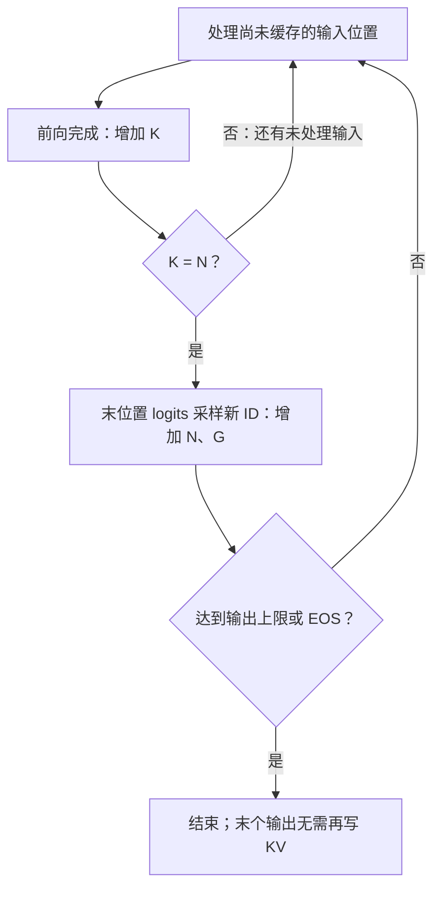

import SchedulerLab from '../../../components/labs/SchedulerLab'

[P11 生成](/principles/generation/)解释从 logits 选下一个 token，[P12 KV cache](/principles/kv-cache/)证明已经计算的历史可以复用。[S1 资源估算](/systems/ledger/)则说明每条请求的 KV 占用多少显存。现在假设 A、B 两条请求同时到达，C 稍后加入：**每轮只允许处理 4 个输入 token，调度器该交给模型哪些位置？** 回答这个问题，需要同时跟踪请求的输出和真正写入的 KV。

本章把 KV 容量当作抽象资源：调度器先保留、前向写入、结束后释放。[S5](/systems/paged-cache/)再解释这些位置如何映射到物理块，[S6](/systems/engine-execution/)解释一轮清单如何变成 GPU 张量。

## 一条请求：刚生成的 token 还没有 KV

固定请求 A，prompt 是 [A,B,C]，最多生成两个 token；为了核对时序，设模型依次选出 D、E。**prefill** 是处理已有提示并建立 KV 的阶段；**decode** 是每次输入刚生成的 token、继续生成的阶段。这里 token 是 tokenizer 给文本片段分配的 ID，字母仅作可读标签。

记 $N$ 为请求当前已有的 token ID 总数，$K$ 为已经完成前向并写入 KV 的位置数，$G$ 为已经生成的输出数。一轮开始时，普通因果生成需要处理区间 $[K,N)$。处理完这个区间后，末位置的 logits（softmax 前的原始分数）才可用于选下一个 token。

```mermaid
flowchart TD
  A["处理尚未缓存的输入位置"] --> B["前向完成：增加 K"]
  B --> P{"K = N？"}
  P -->|否：还有未处理输入| A
  P -->|是| C["末位置 logits 采样新 ID：增加 N、G"]
  C --> D{"达到输出上限或 EOS？"}
  D -->|否| A
  D -->|是| E["结束；末个输出无需再写 KV"]
```

沿图核对两个计数的更新时间：前向写入 KV 后才增加 $K$，采样后才增加 $N$ 和 $G$。新 ID 要到下一轮作为输入时才写入 KV。分块 prefill 尚未处理完 $[K,N)$ 时，继续处理剩余输入，不进入采样分支。

| A 的时刻 | 已有 ID，$N$ | 已写 KV，$K$ | 本轮输入及位置 | 本轮结束时的输出 |
| --- | ---: | ---: | --- | --- |
| 入队 | [A,B,C]，3 | 0 | 尚未执行 | 无 |
| prefill 后 | [A,B,C,D]，4 | 3 | [A,B,C]，0–2 | D |
| decode 后 | [A,B,C,D,E]，5 | 4 | [D]，3 | E，达到输出上限 |

第二轮不能再次输入 C：C 的 KV 已经存在，且 D 的查询必须使用绝对位置 3 并读到 A–D 的 K/V。终止后 E 虽然还没有自己的 KV，却不再需要下一次前向。EOS（结束 token）也可使请求在采样后结束。[P12](/principles/kv-cache/)给出了整段与分块计算等价所需的位置、mask 和逐层缓存条件。

三个计数不能混称。对于 prompt 长 $P$、输出数 $G$，$N=P+G$；常见生成状态是 $K=N-1$，分块 prefill 时可能有 $K<P$。调度器安排的新增输入数 $S$ 还只是**计划**；只有前向成功写完，才能令 $K\leftarrow K+S$。这也是异步执行时必须等待在途写入完成再复用缓存的原因。

## 两条请求：为什么每轮都要重新选

把 A 的 prompt 长度 3、输出上限 2，与 B 的 prompt 长度 5、输出上限 2 放在一起。若把它们固定成一批，必须等待不同长度的提示和输出都结束后才整体换批。**连续批处理**按一次模型迭代重新选择活跃请求：短请求结束后释放位置，新请求可进入下一轮；慢请求保留自己的进度。Orca 将这种粒度称为 iteration-level scheduling；具体如何混合 prefill 与 decode，各引擎可另选策略。

下面采用一个明确的教学策略：每轮最多 **4 个输入 token、2 条请求**；有 waiting 请求时先做 prefill，本轮不混入 decode；只有首个 waiting 请求可在预算不足时分块。两个预算约束的是本轮算力/清单，KV 容量是另一个约束。设 B 后续输出 F、H；C 在第二轮后到达，prompt [m,n]，输出 G 即结束。

| 轮次 | waiting / running（轮前） | 本轮输入与绝对位置 | KV 写完后的采样 | 轮后状态 |
| --- | --- | --- | --- | --- |
| 1 | A、B / 空 | A: [A,B,C]，0–2；余 1 不够 B 的 5 项 | A → D | B 等待；A 运行，$N=4,K=3$ |
| 2 | B / A | B: [u,v,w,x]，0–3 | 无，y 尚未处理 | B 等待，$N=5,K=4$；A 暂停一轮 |
| 3 | B、C / A | B: [y]，4；C: [m,n]，0–1 | B → F；C → G | B 与 A 运行；C 完成并释放资源 |
| 4 | 空 / A、B | A: [D]，3；B: [F]，5 | A → E；B → H | A、B 均完成并释放资源 |

第三轮的总输入数是 $1+2=3$，两条请求，均未越预算。B 的前四个提示 token 在第二轮虽已写 KV，**不能**从 x 的 logits 采样：那会忽略 prompt 最后的 y。第三轮处理 y 时，其查询能读位置 0–4，之后才有完整提示的第一个输出 F。C 加入时，A 的 KV 与未计算的 D 都保留在自己的请求状态中；C 不读取 A、B 的缓存。第四轮 A 和 B 可共享一次权重前向，但注意力仍按各自的请求边界、位置与 KV 长度执行。

读表时可逐行检查三个不变量：本轮输入恰好是该请求的 $[K,N)$ 的前缀；只有本轮处理到 $N$ 才采样；结束的请求不会再进调度清单。这里的字母输出是固定的教学结果，真实采样规则由 [P11](/principles/generation/)决定。

## 预算：分块与延迟交换了什么

若只设“最多两条请求”，一条极长 prompt 仍可能占用整轮；若只设“最多四个 token”，又可能纳入太多独立请求，超过运行时元数据或缓存容量。因此 token 预算限制 $\sum_r S_r\le4$，序列预算限制本轮请求数不超过 2；每条请求还须有足够的 KV 容量。这里 $S_r$ 是请求 $r$ 本轮新算的位置数，不能用 $N_r$ 或已分配的物理槽位代替。

B 的 5 项放不进第二轮的 4-token 预算，因此被切为 4+1。分块 prefill 仍须保持与整段前向相同的历史 K/V、逻辑位置和因果可见集合；它只改变执行分组，不改变模型所条件化的 prompt。第三轮的 y 后面有 3 个空预算，C 因而能同时进入；这说明连续批处理的接纳点是**迭代边界**，而非整批请求全部完成之后。

这项策略有代价：A 在第二、三轮未得到下一 token，逐次输出间隔 ITL 变长；B 的首 token 延迟 TTFT 取决于它何时完成全部 prefill。若持续有新长 prompt，prefill 优先甚至可能推迟已有请求的 decode。调小每轮 prefill 预算、让 decode 优先、给等待时间加权都可能改变延迟分布；应在固定到达过程、prompt 长度与输出长度下比较 [S10 服务评价](/systems/serving-evaluation/)，不能仅凭一轮 GPU 利用率称其更好。

<SchedulerLab client:visible />

先保持 token 预算为 4、最多序列数为 2，连续点四次“执行一步”，逐轮对照上表：第二轮 B 只有四项 KV，尚无输出；第三轮 C 加入；第四轮 A、B 输入各自的新 ID 后结束。

再重置，在 A 第一次采样后选择 A 并点“抢占”。检查 A 的已有 ID 和已交付输出保留，缓存长度归零。继续执行，恢复历史时不再次交付旧输出。改变预算或序列数会改变时序，但逻辑位置和“处理完整个已有区间才采样”的条件不变。

## 抢占、结束与取消：哪些状态可重用

上图中每个格子表示所选请求的一个逻辑位置。实线 KV 已计算，虚线 ID 已知但尚未前向。取消会终止请求；演示是同步教学状态机。真实 GPU 资源回收还必须等待在途工作安全结束。

KV 容量不足时，调度器可以延后接纳；也可以**抢占**某条已运行请求，释放它的 KV，稍后按其已有 token ID 重新 prefill。假设 A 已采样 D，$N=4,K=3$，抢占后 $N$ 仍为 4、已交付的输出仍是 D，但若释放了全部缓存，$K$ 回到 0。重算 A、B、C、D 的前向后，D 的末位置 logits 才产生新的 E。重算 C 时不再次发送 D；重算历史不能更改已向客户端提交的 token。若保留或命中安全的前缀 KV，则只重算未命中的后缀，[S5](/systems/paged-cache/)会说明共享条件。

**完成**与**取消**都是终态。达到输出上限或生成 EOS 后，停止调度并释放只由该请求持有的容量。用户取消时即使没有新 logits，也要移出 waiting/running 并释放资源；若 GPU 前向尚在执行，先等待或标记在途操作完成，再让另一请求使用相同槽位。这里的 CPU 参考是同步模型，取消发生在两轮之间，因此无法证明异步释放安全。多请求共用同一物理前缀时，释放的是引用而非清空其他请求仍使用的 KV。

若可缓存位置减少，抢占会增加重算；若总是选择短请求，长请求可能饥饿。请求完成速度、TTFT、ITL、吞吐与重算量是不同指标。调度策略改变这些量，也必须维持每个请求的 token 顺序、位置与缓存所有权。

## 对照实现：机制与具体策略分开

上面的时序采用 [nano-vLLM 固定提交 bb823b3](https://github.com/GeeeekExplorer/nano-vllm/commit/bb823b3e06983d71485a8e1f23715ebd87d98ef8) 中的关键调度分支，但不是整个项目的仿真。其 [Sequence](https://github.com/GeeeekExplorer/nano-vllm/blob/bb823b3e06983d71485a8e1f23715ebd87d98ef8/nanovllm/engine/sequence.py)维护 token、已缓存与已调度计数；[Scheduler](https://github.com/GeeeekExplorer/nano-vllm/blob/bb823b3e06983d71485a8e1f23715ebd87d98ef8/nanovllm/engine/scheduler.py)先扫描 waiting 做 prefill，只允许本轮首条等待序列分块；若安排了 prefill，直接返回而不混 decode。没有 waiting 工作时再让 running 请求各输入一个 token。前向完成后，postprocess 才增加已缓存数；未完成的 prompt 不追加采样结果。KV 不够时，该快照会抢占并释放整条序列的块，随后重新进入 waiting。

这些分支不是“连续批处理”的定义。Orca 的核心是按迭代重新选请求；[vLLM 的 chunked prefill 文档](https://docs.vllm.ai/en/v0.9.0/performance/optimization.html#chunked-prefill)展示了可优先 decode，并在同一批中加入剩余预算可容纳的 prefill。两者都要满足请求内顺序和容量约束，却会产生不同的 TTFT/ITL。文档所述版本也不应倒套到 nano-vLLM 快照。

CPU 脚本固定复现上表和抢占变式，逐轮断言输入 token、绝对位置、KV 长度、输出及终态；它不模拟 logits、GPU 执行或真实物理块。

<CodeFile path="examples/systems/scheduling.py" symbol="Scheduler.step" />

## 常见误区

- “已采样就已缓存”：新 ID 先追加到请求，下一轮输入它后才有它的 KV；最后一个输出可能永远无需缓存。
- “分块 prefill 每块都能采样”：只有处理到完整 prompt 和已有输出的末位置，才有当前请求应使用的下一 token logits。
- “同一 batch 就能互看 KV”：batch 共享的是一次执行机会，注意力仍按请求边界隔离。
- “取消只删队列”：还须等待在途写入安全结束并释放持有的缓存。

## 练习与核对

1. 若第三轮的 token 预算从 4 改为 2，B 的 y 完成后 C 会怎样？

B 使用 1 个输入，剩 1 个，不够 C 的 2 项；本策略只允许首条 waiting 请求分块，所以 C 留到下一轮。B 可采样 F，C 不能因只剩 1 个预算而提前采样。若策略允许第二条也分块，可以先处理 C 的 m，但仍须等 n 的前向完成才采样 G。

2. A 采样 D 后被抢占且全部 KV 释放。重算 A、B、C、D 时应向客户端再发送 D 吗？何时能采样 E？

不能。D 已经提交，是重建历史时的输入，不是新输出。A、B、C 的中间分块只恢复 KV；处理到 D 的末位置后，才得到用于采样 E 的完整条件。此时缓存长度为 4，已有 ID 在采样 E 后为 5。

3. 第四轮 A 和 B 一起 decode 时，为什么 B 的新输入位置是 5 而不是 3？

位置属于各自请求的逻辑序列。A 已有三个 prompt token 和 D，因此输入 D 的位置是 3；B 已有五个 prompt token 和 F，因此输入 F 的位置是 5。它们只是同轮执行，不能使用 batch 内的统一位置计数。

下一章 [S5 分页与前缀缓存](/systems/paged-cache/)将把本章“先保留、后写入、按拥有关系释放”的抽象容量变成物理块和前缀共享规则。

## 原始资料

- [Orca, OSDI 2022](https://www.usenix.org/conference/osdi22/presentation/yu)：迭代级调度与 selective batching 的原始论文。
- [nano-vLLM 的 Scheduler 与 Sequence，固定提交 bb823b3](https://github.com/GeeeekExplorer/nano-vllm/blob/bb823b3e06983d71485a8e1f23715ebd87d98ef8/nanovllm/engine/scheduler.py)：本页具体 prefill/decode 分支；源码于 2026-09-28 核对。
- [vLLM 官方优化文档：chunked prefill](https://docs.vllm.ai/en/v0.9.0/performance/optimization.html#chunked-prefill)：混合 prefill/decode 的另一种策略；按所链接的文档版本阅读。
