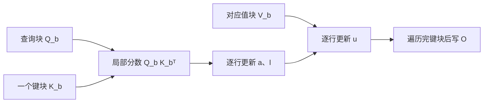

从 [P3 注意力](/principles/attention/) 到 [P10 KV cache](/principles/kv-cache/)，我们都把注意力写作“算分数、做 softmax、用权重加权 V”。这能说明模型算了什么，却没有规定 GPU 必须把每一步的结果写到哪里。[S2](/systems/accelerator/) 已说明，数据在 GPU 存储层级之间移动会占时间。本章只解决一个问题：**如果最终只要每个查询的输出，能否边读 K/V 边更新输出，避免在显存中保存整张分数和权重矩阵？**

先修只需知道点积、稳定 softmax 和 causal mask。贯穿案例有六个键，以及绝对位置为 3、4、5 的三个查询。我们先算最后一个查询，再让另外两行检验边界。

## 同一组 Q/K/V：朴素计算会留下什么

只看一个头，令 $d_h=2$、值宽 $d_v=1$。三个查询都取 $q_i=(1,0)$，键和值如下。键的首坐标特意乘 $\sqrt2$，使缩放点积恰好等于表中的整数。

| 键的绝对位置 $j$ | $k_j$ | $v_j$ | $q_i^\top k_j/\sqrt{d_h}$ |
| --- | --- | ---: | ---: |
| 0 | $(0,0)$ | 1 | 0 |
| 1 | $(\sqrt2,0)$ | 2 | 1 |
| 2 | $(2\sqrt2,0)$ | 3 | 2 |
| 3 | $(3\sqrt2,0)$ | 4 | 3 |
| 4 | $(4\sqrt2,0)$ | 5 | 4 |
| 5 | $(5\sqrt2,0)$ | 6 | 5 |

若查询在位置 5，六个键都可见。它的一行分数是 $s=(0,1,2,3,4,5)$。查询在位置 3 时只能读键 0–3；位置 4 时只能读键 0–4。这是 [P3 的 causal mask](/principles/attention/#causal-mask哪些键允许进入分母)，不是把未来分数改成 0。

一般地，$Q\in\mathbb R^{T_q\times d_h}$、$K\in\mathbb R^{T_k\times d_h}$、$V\in\mathbb R^{T_k\times d_v}$，显式写法为

$$
S=QK^\top/\sqrt{d_h},\qquad
A=\operatorname{softmax}(S+M),\qquad O=AV.
$$

softmax 沿键轴逐行计算。$M_{ij}$ 对可见键为 0、不可见键为 $-\infty$。$S,A$ 各有 $T_qT_k$ 个元素，输出只有 $T_qd_v$ 个。若 $T_q=T_k=8192$，一个头的一张 bf16 分数矩阵就是 $8192^2\times2$ byte，即 **128 MiB**；32 个头仅这张矩阵就达 4 GiB，尚未计权重矩阵、梯度和其他激活。这个数说明显式物化的代价，并不表示所有使用上面公式的库都会真的保存它。

## 一行状态：把看过的键压缩成什么

对任意非空的已读键集合 $J$，保留三个状态：

$$
a_J=\max_{j\in J}s_j,\qquad
l_J=\sum_{j\in J}e^{s_j-a_J},\qquad
u_J=\sum_{j\in J}e^{s_j-a_J}v_j.
$$

$a_J,l_J$ 是标量，$u_J$ 与单个值向量同宽；本例是标量。输出 $o_J=u_J/l_J$。减去最大值来自 [M2 的稳定 softmax](/math/distributions/)：它让指数参数不大于 0，却不改变归一化结果。只保存 $o_J$ 不够，因为后面的键可能改变最大值和分母；需要同时保存权重总量 $l_J$。

设已读部分为 $J$，新块为 $R$。两部分的指数分别以 $a_J,a_R$ 为基准，不能直接相加。换到共同基准 $a'=\max(a_J,a_R)$，对旧部分任一分数有 $e^{s_j-a'}=e^{s_j-a_J}e^{a_J-a'}$；新部分同理。逐项求和便得到完整的合并式：

<KeyEq label="在线 softmax 与输出的共同更新">

$$
\begin{aligned}
a'&=\max(a_J,a_R),\\
l'&=e^{a_J-a'}l_J+e^{a_R-a'}l_R,\\
u'&=e^{a_J-a'}u_J+e^{a_R-a'}u_R,\\
o'&=u'/l'.
\end{aligned}
$$

</KeyEq>

每个查询各持有一份状态，按键块重复合并。**分母和加权分子必须乘相同的重缩放系数**；只调整其中之一会改变输出。这是代数等式，不依赖键块大小。在浮点数中，换归约顺序会产生小的舍入差异，因此“同一个注意力”指同一数学算子，不是逐比特相同。

## 六个键手算：第二块为什么要重缩放第一块

将本例六个键按 0–2、3–5 分为两块。对位置 5 的查询，第一块的最大值为 2：

$$
l_1=e^{-2}+e^{-1}+1\approx1.503215,\qquad
u_1=e^{-2}+2e^{-1}+3\approx3.871094.
$$

第二块最大值为 5，所以 $l_2=e^{-2}+e^{-1}+1\approx1.503215$，但值不同，$u_2=4e^{-2}+5e^{-1}+6\approx8.380738$。全局最大值从 2 升到 5，旧状态必须整体乘 $e^{-3}$：

$$
l=e^{-3}l_1+l_2\approx1.578055,\qquad
u=e^{-3}u_1+u_2\approx8.573469,\qquad
o=u/l\approx5.43293.
$$

| 已读键 | 当前最大分数 | 指数和 | 加权分子 | 归一化输出 |
| --- | ---: | ---: | ---: | ---: |
| 0–2 | 2 | 1.503215 | 3.871094 | 2.57521 |
| 3–5，单独算 | 5 | 1.503215 | 8.380738 | 5.57521 |
| 0–5，按共同基准合并 | 5 | 1.578055 | 8.573469 | 5.43293 |

直接平均两个块的归一化输出得到约 4.07521，显然不对：第二块整体分数更高，贡献的概率质量远大于第一块。若把六个分数都加 1000，直接计算 $e^{1005}$ 会溢出；每块减最大值并重缩放，输出仍是同一个 $5.43293$。

## 从一行到 tile：节省的是哪次搬移

GPU 上一个工作单元通常同时处理一块查询 $Q_b$，依次取若干 K/V 块。每取一块，就计算**局部** $Q_bK_b^\top$，按行更新 $a,l,u$，随后丢弃局部分数；最后把归一化的输出写回。按行维护状态这件事，与上面的标量手算相同。

图中 $Q_b$ 与每个 $K_b$ 配对，局部分数只活到状态更新完成；它没有作为全长 $S$ 或 $A$ 写入全局显存。Q/K/V 的读取和 O 的写出仍不可省，查询块之间也可能重复读取 K/V。片上 shared memory 与寄存器容量限制 tile 大小；tile 太大可能降低可并行的工作单元数，tile 太小则增加重复加载和循环开销。详见 [G3 的分块资源用量](/gpu/kernel-design/) 与 [S2 的执行上限](/systems/accelerator/)。

基础的 dense FlashAttention **没有删掉允许的查询键配对**，主要注意力计算仍随 $T_qT_k$ 增长；它减少的是中间张量的显存占用及相关读写。原论文还讨论一个单独的 block-sparse 扩展，那会改变可见配对集合，不能把它和本节的 dense 精确算法混为一谈。[FlashAttention-2](https://arxiv.org/abs/2307.08691) 主要改变 GPU 的工作划分、并行与非矩阵乘开销，仍计算相同的 dense 注意力。

## 边界：先决定哪些键可以进入状态

本例三个查询的绝对位置为 3、4、5，键位置为 0–5。把键按三个一组读取：

| 查询位置 | 键块 0–2 | 键块 3–5 |
| ---: | --- | --- |
| 3 | 全部可见 | 只用键 3 |
| 4 | 全部可见 | 只用键 3、4 |
| 5 | 全部可见 | 全部可见 |

在边缘块，对不可见键赋 $-\infty$，令其指数贡献为 0；不能赋 0，因为 $e^0=1$。整块都不可见时跳过它，避免初始最大值与块最大值同为 $-\infty$ 时出现 $-\infty-(-\infty)=\mathrm{NaN}$。若整行都没有可见键，softmax 的分母为零，必须由调用者规定输出策略；本章脚本选择报错。padding mask 也遵循同样的“可见才参与”规则。

这还是一个 $T_q=3,T_k=6$ 的**矩形**注意力矩阵。其查询绝对位置是 3–5，而非局部行号 0–2。PyTorch SDPA 文档中，非方阵的 `is_causal=True` 使用**左上对齐**的 causal bias；对本例只会让局部第 0 行看键 0，和所需的键 0–3 不同。因此带 KV cache 的调用应按实际后端契约提供正确的偏移或显式 mask。本例若用 SDPA，就传布尔 `attn_mask`（`True` 表示允许）并令 `is_causal=False`；不把两个参数一起传。

## 反向和 API：前向正确不等于完整训练 kernel

训练时仍要计算对 Q/K/V 的梯度。朴素实现可保存完整概率矩阵 $A$；FlashAttention 的反向利用前向保存的输出和每行 softmax 统计，**分块重算**局部概率，再累积梯度。这用额外计算换取较少的全长激活保存。若启用 dropout，还要在重算时复现相应随机掩码；本页的无 dropout CPU 参考没有实现反向。

PyTorch 的 `torch.nn.functional.scaled_dot_product_attention`（SDPA）是调用接口，不是一个固定的 FlashAttention kernel。它可依输入设备、dtype、形状、mask 和库版本选择不同实现；官方 [SDPA 文档](https://docs.pytorch.org/docs/stable/generated/torch.nn.functional.scaled_dot_product_attention.html) 列出可用后端与约束，`sdpa_kernel()` 可在实验中限制后端。自动选择时记录实际 kernel，比较性能时固定 Q/K/V、精度、mask、dropout、预热和同步，并先核对输出与梯度误差。[G4 的完整模型实验](/gpu/measurement/#完整模型先对齐输出与梯度再观察执行路径) 说明这些测量边界。

## CPU 核对：同一案例，换块大小

下面脚本直接构造上表的 Q/K/V，先手算位置 5 的 $5.43293$，再将三个查询的 dense 输出与在线输出比较。块长 1、2、3、4、8 会触及完整块和不完整尾块；分数整体加 1000 检查稳定性；额外的 padding 和全遮蔽行检查 mask 边界。

<CodeFile path="code/systems/attention_io.py" />

运行成功只证明这些输入上的数学一致性。NumPy 循环没有 GPU shared memory、tensor core 或并行调度，不能用它的耗时论证 FlashAttention 的加速。

## 练习与核对

位置 4 的查询读取第二块键 3–5 时，该块的最大值、分母和加权分子是多少？最后的输出应更接近 4 还是 5？

键 5 不可见。只用分数 3、4 和值 4、5，块最大值为 4，$l_2=e^{-1}+1\approx1.367879$，$u_2=4e^{-1}+5\approx6.471518$。与第一块以全局最大值 4 合并，得到 $l=e^{-2}l_1+l_2\approx1.571317$、$u=e^{-2}u_1+u_2\approx6.995413$，输出约 4.45194，更接近 4。不能在第二块把键 5 的分数“改成 0”后算入分母。

为什么把两块各自的输出等权平均会错？什么时候它恰好正确？

全局输出以各块的指数质量 $e^{a_r-a}l_r$ 为权重，除以质量之和。只有两块的指数质量相等时，等权平均才正确；块长相同不是充分条件。

序列长度翻倍、头数和值宽固定时，显式分数矩阵与每行在线状态分别怎样增长？这是否让注意力计算量变成线性？

显式分数元素数随 $T^2$ 增长为四倍；所有查询的在线状态随 $T$ 增长为两倍。每个允许的查询键配对仍要参与点积，所以 dense 注意力的主要计算量仍是二次增长。

下一章 [S4 请求生命周期](/systems/engine-runtime/) 会把这样的 kernel 当作一次模型前向的一部分，转而决定不同请求在什么时候进入前向。

## 原始资料

- [FlashAttention 原论文](https://arxiv.org/abs/2205.14135)：dense 注意力的 IO 分析、在线 softmax、反向重算，以及另列的 block-sparse 扩展。
- [FlashAttention-2 原论文](https://arxiv.org/abs/2307.08691)：GPU 并行和工作划分。
- [PyTorch SDPA 官方文档](https://docs.pytorch.org/docs/stable/generated/torch.nn.functional.scaled_dot_product_attention.html)：mask 语义、非方阵 causal 对齐与后端选择；核对于 2026-09-28。
