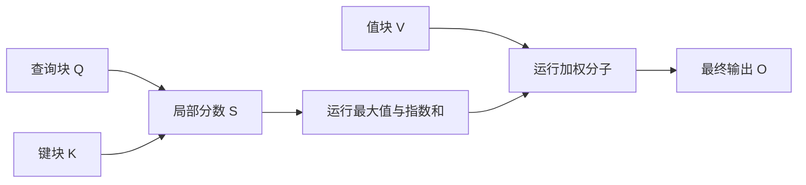

[P3 注意力](/principles/attention/) 已经给出查询、键、值怎样形成输出，[S2 单卡执行](/systems/accelerator/) 说明计算分块怎样复用数据。现在遇到一个具体矛盾：长度为 8192 的提示，每个头有 $8192^2$ 个分数，bf16 一张分数矩阵就有 128 MiB；32 个查询头共有 4 GiB。即使权重和 KV 放得下，先把这些分数写回显存，再读回来计算 softmax，仍然会付出大量搬移。

FlashAttention 的关键问题是：最终需要的只是每个查询的一行输出，能否在看完一个键块以后，把该块压缩成几个可合并的量？本章先在实数算术中证明可以，再解释 GPU 上如何实现。这里的 CPU 验证不测加速比，正式执行应使用 PyTorch SDPA 或经过验证的 FlashAttention 后端。

具体实现里谁负责一行、如何协作归约与处理边界，回读 [G2 内存与同步](/gpu/memory-and-sync/) 和 [G3 Kernel 设计](/gpu/kernel-design/)。本章只推导在线状态，不重复线程索引与 block 屏障的规则。

## 显式中间矩阵：为什么正确的公式仍可能低效

只看一个头，查询 $Q\in\mathbb R^{T_q\times d_h}$、键 $K\in\mathbb R^{T_k\times d_h}$、值 $V\in\mathbb R^{T_k\times d_v}$。标准注意力是

$$
S=QK^\top/\sqrt{d_h},\qquad A=\operatorname{softmax}(S),\qquad O=AV.
$$

softmax 沿键轴逐行计算，$O\in\mathbb R^{T_q\times d_v}$。朴素执行分别启动矩阵乘、掩码、softmax 和第二次矩阵乘，$S,A$ 可能成为全局显存中的完整张量。它们的元素数随 $T_qT_k$ 增长，而输出只随 $T_qd_v$ 增长。这里说的“可能”很重要：一个高层公式不能直接推出后端一定物化这些张量，必须检查实际 kernel 或 profiler。

图里只有局部分数随键块变化；运行统计与输出累积留在片上。FlashAttention 没有删除任何允许看见的键，也没有用稀疏近似替代注意力。它改的是计算顺序和中间数据位置。这一点与进阶路线的稀疏注意力完全不同。

## 一行 softmax：先定义可以合并的状态

对某个查询，把分数记作 $s_j$，值向量记作 $v_j$。稳定 softmax 的输出是

$$
o=\frac{\sum_j\exp(s_j-a)v_j}{\sum_j\exp(s_j-a)},\qquad a=\max_js_j.
$$

[M2](/math/distributions/) 已说明同时减最大值不改变概率。现在对已经读到的键集合 $J$，保留三个量：最大值 $a_J$、指数和 $l_J$ 和加权分子 $u_J$。

$$
a_J=\max_{j\in J}s_j,\quad
l_J=\sum_{j\in J}\exp(s_j-a_J),\quad
u_J=\sum_{j\in J}\exp(s_j-a_J)v_j.
$$

$a_J,l_J$ 是标量，$u_J\in\mathbb R^{d_v}$。最终结果就是 $u_J/l_J$。假如第二个块 $R$ 的最大分数比第一个更大，旧块的指数都需要改用新的基准。因此不能直接把两个块独立归一化后的输出相加；它们各自的分母不同。

令 $a'=\max(a_J,a_R)$。对旧块任意元素有

$$
\exp(s_j-a')=\exp(s_j-a_J)\exp(a_J-a').
$$

对新块同理。将它们分别求和，得到更新规则：

<KeyEq label="在线 softmax 的合并状态">

$$
\begin{aligned}
a'&=\max(a_J,a_R),\\
l'&=\exp(a_J-a')l_J+\exp(a_R-a')l_R,\\
u'&=\exp(a_J-a')u_J+\exp(a_R-a')u_R.
\end{aligned}
$$

</KeyEq>

分母与分子必须使用同一缩放因子。状态按键块重复更新，最后一次除法才把分子变成输出。数学证明只用指数分解和求和，所以在精确算术中合并顺序不会改变结果；浮点运算不满足精确结合律，不应承诺逐比特相同。

## 六个分数：新最大值怎样改变旧块

取 $s=(0,1,2,3,4,5)$，标量值 $v=(1,2,3,4,5,6)$，分成两个长度为 3 的块。第一块最大值为 2，因此

$$
l_1=e^{-2}+e^{-1}+1\approx1.503215,
$$

$$
u_1=e^{-2}+2e^{-1}+3\approx3.871094.
$$

第二块最大值为 5，$l_2$ 仍为 1.503215，而 $u_2=4e^{-2}+5e^{-1}+6\approx8.380738$。合并基准为 5，第一块整体乘 $e^{-3}$，第二块不变：

$$
l=e^{-3}l_1+l_2\approx1.578055,\qquad
u=e^{-3}u_1+u_2\approx8.573473.
$$

输出约为 5.43293。旧块自己的输出约为 2.57521，新块自己的输出约为 5.57521；把两者简单平均得到 4.07521，明显错误，因为第二块整体分数更大，应该贡献更多质量。这个算例中对所有分数加 1000，结果仍相同；直接计算 $e^{1005}$ 会溢出，而运行最大值把每次指数的参数限制为非正。

## 因果掩码：整块不可见时不进行状态更新

对于自回归查询位置 $i$，只允许键位置 $j\le i$。掩码不是将不可见分数改成 0，因为 $e^0=1$ 会给未来位置正权重；应把它们视作 $-\infty$，使指数贡献为零。完全在未来的键块可以跳过，不必先做矩阵乘。

若一个局部块全不可见，它的最大值与初始状态可能同为 $-\infty$，盲算 $-\infty-(-\infty)$ 得到 NaN。参考代码明确跳过这个块。若某一行在所有块中都没有可见键，则 softmax 本身未定义，脚本抛出错误；实际含 padding 的模型也可以定义“无效查询输出为零”，但必须显式写出该策略并让损失掩码一致处理，不能让 NaN 默默进入残差。

缓存前向还有一个容易忽略的边界：$T_q<T_k$ 时，查询的绝对位置不一定从 0 开始。历史长度为 6、新增长度为 3，查询位置是 6、7、8，三行分别允许 7、8、9 个键。不同后端对非方阵 `is_causal` 的对齐约定可能不同，应检查 API，必要时提供显式位置掩码。本章脚本用绝对位置比较构造掩码，不依赖隐含对齐。

## 从一行到 tile：片上存储买到了什么

GPU 实现同时处理一块查询，对一块键和值计算局部分数，维护每行统计。读取当前查询块以后，依次遍历可见的 K/V 块；局部分数进入 softmax 更新后即可丢弃。最终只将 $O$ 和反向所需的少量统计写回全局显存。这里没有“完全不读显存”：Q/K/V 和输出仍然需要读写，片上容量也限制块尺寸。

Tile 太小会增加循环、地址计算和重复加载；tile 太大会占用过多共享内存和寄存器，降低同时驻留的线程块数量。最优值取决于头维度、数据类型、GPU 架构和序列形状。S2 的屋顶线只给性能上限，不能从减少了一个中间张量就推出实际加速比例。

FlashAttention-2 进一步改进工作划分和并行，减少非矩阵乘运算以及线程之间的同步需求。它不是修改 softmax 公式的第二种模型。训练反向可根据已保存的输出统计重新计算局部概率，交换计算与存储；随机 dropout 还需要保证相同随机掩码可重现。因此本章无 dropout 的 CPU 算法仅验证前向数学，不宣称已经实现生产训练 kernel。

## CPU 核对：改变分块，不改变允许的注意力

脚本用 3 个查询、9 个键、头维度 5、值维度 4，查询对应绝对位置 6 到 8。先用显式 dense softmax 得到参考，再分别用块长 1、2、4、20 的在线实现核对；键分数放大 1000 倍后再次核对，覆盖极端分数。全掩码行必须失败。

<CodeFile path="code/systems/attention_io.py" />

运行输出中的 “verified” 指输出与参考的容差核对。NumPy 循环没有 tensor core、共享内存或异步拷贝，通常比一次 dense 矩阵乘慢。真正的 GPU 对照需固定 Q/K/V、掩码、精度、dropout、预热次数和同步点，使用同一设备上的后端；先报告最大误差，再报告时间及峰值内存。自动选择后端时也要记录实际执行的 kernel。

## 常见误区

- 认为在线 softmax 必须保留全部历史分数。保存的是最大值、分母和加权分子，大小不随已读键数增长。
- 将低 IO 等同低 FLOP。注意力主要矩阵乘仍覆盖全部允许的查询键对，训练还可能重算。
- 把 FlashAttention 的结果说成近似注意力。实数运算中的算子相同，浮点舍入允许有小差异。
- 因果 mask 一律从左上角画三角形。带历史缓存的查询必须用绝对位置判断可见性。

## 练习与核对

为什么两块独立 softmax 的输出不能直接平均？什么时候碰巧可以？

两块对全局分母的质量是 $e^{a_1-a}l_1$ 与 $e^{a_2-a}l_2$。只有这两个质量相同，等权平均才正确；块长相同不能保证分数分布相同。一般必须以这些质量加权。

查询绝对位置为 4、5，键位置为 0 到 5，块长为 2，哪一块需要局部掩码？

前两块 0–1、2–3 对两行都可见。最后块 4–5 对位置 4 的查询只能使用第一个键，对位置 5 两键都可见。把 Q 的行号 0、1 当绝对位置会错误删除历史。

长度从 4096 变到 8192，显式分数内存和在线输出状态各增加几倍？

头数与维度固定，分数元素数按 $T^2$ 增长，变为 4 倍。每行统计与输出按 $T$ 增长，变为 2 倍；主要计算量仍有二次项，内存节省不等于计算复杂度线性化。

下一章 [S4 请求生命周期](/systems/engine-runtime/) 将这些 kernel 当作一次前向的执行工具，转而决定每一步送进去哪些请求。

## 原始资料

- [FlashAttention](https://arxiv.org/abs/2205.14135)：IO 分析、在线 softmax 与精确注意力算法。
- [FlashAttention-2](https://arxiv.org/abs/2307.08691)：GPU 工作划分与并行调整。
- [PyTorch SDPA](https://docs.pytorch.org/docs/stable/generated/torch.nn.functional.scaled_dot_product_attention.html)：后端、掩码与数值边界，读取于 2026-09-27。
