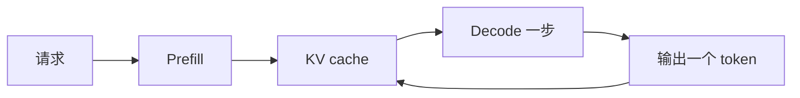
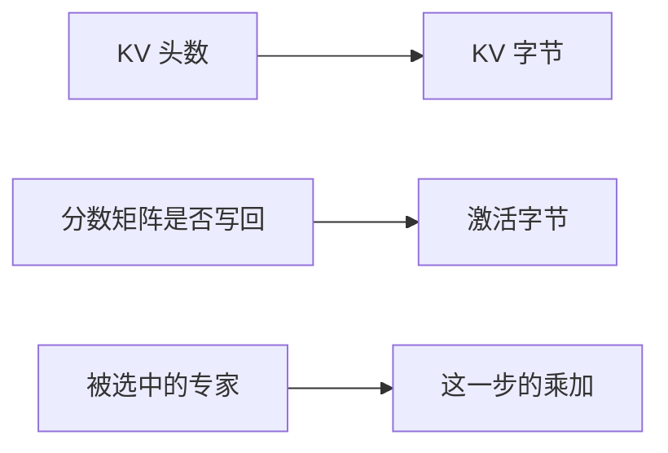

一次生成同时记三本账：花了多少时间，占了多少字节，这些字节在存储层级之间搬了几次。权重、激活和 KV cache 是这三本账里反复出现的三项。本章先把字节算出来，再看两类改动怎样改写它：换一种架构，改的是公式里的因子；换一种负载，改的是同样这些字节被读的次数。

Prefill 读入整段提示，同一层里各个 token 的矩阵乘可以一起做。Decode 每次只吃一个新 token，却要读回已经写好的 KV，再把这个新 token 的 K 和 V 追加进去。[KV cache 的正确性](/principles/kv-cache/) 证明了这种追加和整段重算可以保持数值等价；这一章给追加的结果定价。

## 先用一个能手算的模型把加法做完

下面的模型 S 是教案，不是任何已发布的权重。它小到每一项都能口算，形状仍是 decoder-only：注意力加 SwiGLU 前馈。

| 符号 | 值 | 含义 |
| --- | --- | --- |
| $L$ | 2 | 层数 |
| $d$ | 256 | 隐藏维 |
| $n_q, n_{kv}, d_h$ | 8、2、32 | query 头、KV 头、每头维度 |
| $d_{ff}$ | 512 | 前馈中间维 |
| $V$ | 128 | 词表 |
| $b$ | 2 | fp16，每元素字节数 |

一层里的大矩阵是：

$$
\begin{aligned}
W_q &\colon d \times n_q d_h = 256 \times 256 = 65536,\\
W_k, W_v &\colon d \times n_{kv} d_h = 256 \times 64 = 16384,\\
W_o &\colon n_q d_h \times d = 65536,\\
W_{gate}, W_{up}, W_{down} &\colon 131072 \times 3.
\end{aligned}
$$

一层参数量是 $65536 \times 2 + 16384 \times 2 + 131072 \times 3 = 557056$。两层是 $1114112$。词嵌入和输出头各是 $V \times d = 32768$，这里按不共享来计。合计 $N = 1114112 + 32768 + 32768 = 1179648$，fp16 权重占 $1179648 \times 2 = 2359296$ 字节，也就是 2.25 MiB。RMSNorm 的缩放向量只有几百个数，第一张账单里先不收。

每个 token 的 KV 是 K 和 V 各一份：

<KeyEq label="每个 token 的 KV 字节">

$$
2 \times L \times n_{kv} \times d_h \times b = 2 \times 2 \times 2 \times 32 \times 2 = 512 \text{ 字节}.
$$

</KeyEq>

128 个 token 的 KV 是 $512 \times 128 = 65536$ 字节。这个数在练习里要自己再算一次。

## 把同一组公式放大到公开的 8B 形状

Llama 3 8B 的层宽是公开的：32 层，隐藏维 4096，32 个 query 头，8 个 KV 头，词表 128256。前馈宽度按 [模型代码](https://github.com/meta-llama/llama3/blob/main/llama/model.py) 里的规则得到 14336：从 $4d$ 出发，乘 $2/3$，再乘发布配置里的 1.3，向上取到 1024 的倍数。

$$
\begin{aligned}
4 \times 4096 &= 16384,\\
\lfloor 2 \times 16384 / 3 \rfloor &= 10922,\\
\lfloor 1.3 \times 10922 \rfloor &= 14198,\\
1024 \times \lceil 14198 / 1024 \rceil &= 14336.
\end{aligned}
$$

技术报告把这组形状写进了 8B 模型，见 [The Llama 3 Herd of Models](https://arxiv.org/abs/2407.21783)。下面的参数量是把这些矩阵乘出来，不是对某个 checkpoint 文件的测量。输出头与词嵌入在这份代码里是两块矩阵。

一层注意力是 $4096 \times 4096$ 的 $W_q$、$W_o$，加上 $4096 \times 1024$ 的 $W_k$、$W_v$，共 $41943040$ 个参数。一层 SwiGLU 是三块 $4096 \times 14336$，共 $176160768$。一层合计 $218103808$，32 层是 $6979321856$。两块词表矩阵各 $128256 \times 4096 = 525336576$。总和 $N = 8029995008$。

bf16 权重是 $N \times 2 = 16059990016$ 字节，约 16.06 GB（按 $10^9$），或 14.96 GiB（按 $2^{30}$）。每层两个 RMSNorm 再加最后的一个，大约还有 $65 \times 4096$ 个参数，相对 80 亿可以留到后面再记。每个 token 的 KV：

$$
2 \times 32 \times 8 \times 128 \times 2 = 131072 \text{ 字节} = 128 \text{ KiB}.
$$

8192 个 token 是 $131072 \times 8192 = 2^{30}$ 字节，正好 1 GiB。十六条这样的请求就是 16 GiB，和权重放在同一张图上才看得出谁先把卡撑满。

<Figure src="infra/01-ledgers.svg" alt="权重约 14.96 GiB，十六条长请求的 KV 为 16 GiB">刻度是 GiB。一条 8192 token 请求的 KV 只有 1 GiB；并发到 16 条时，KV 超过 bf16 权重。产品页上的 80GB 容量按厂商的十进制习惯书写，和这里的 GiB 不是同一个单位。</Figure>

## 时间账先分开两个时刻

用户感受到的时间至少有两段。首 token 之前的等待包含排队、prefill 和第一次采样，通常记作 TTFT。之后每个 token 的间隔记作 TPOT。只测量 decode，会把长提示的 prefill 整段漏掉；只报平均值，会把排队的长尾抹平。[S4](/systems/engine-execution/) 把它们收成服务指标，这里先记住：prefill 的账单随提示长度一次付清，decode 的账单按生成长度逐 token 重复。

数据搬移账问的是另一件事：这 14.96 GiB 权重在每个 decode token 上要不要从显存再读一遍，KV 是按整个上下文读还是只读新增的一块。本章最后把「读了多少字节、做了多少乘加」收成一个比值，[S2](/systems/accelerator/) 才把这个比值放到具体 GPU 的带宽和算力上。

## 架构改写哪一笔账

上面的公式里，KV 字节正比于 KV 头数，注意力的计算量正比于 token 数的平方。换一种架构，就是改这两个因子，或者让一部分参数在某一步根本不参与计算。

### 因果掩码决定谁能并行

Decoder 在位置 $t$ 只能看见 $1 \ldots t$。Prefill 仍然可以把整段提示放进同一次矩阵乘，因为每个位置需要的历史都已经在输入里，掩码只是把未来的分数盖住。Decode 则没有这种自由：位置 $t+1$ 的查询依赖位置 $t$ 刚采样出来的 token。所以 KV 可以复用，生成本身仍是串行的。位置如何进入 Q 和 K，见 [相对位置与 RoPE](/principles/rope/)。

### KV 头数直接乘在缓存上

多头注意力为每个 query 头保存一对 K、V。分组查询让若干 query 头共用一对。多查询注意力让所有 query 头共用一对。图里把 query 头画成 8 个，是为了看清分组；Llama 3 8B 是 32 个 query 头共用 8 对 KV。

<Figure src="infra/02-variants.svg" alt="MHA 每个 query 头一对 KV，GQA 分组共享，MQA 全体共享">绿色是 query，蓝色是要写入缓存的 K/V。缓存的宽度跟着蓝色走。</Figure>

8B 形状在 8192 token 上是 1 GiB KV。若 KV 头从 8 改成 32，其他宽度不动，缓存变为 4 GiB。GQA 的定义和从多头检查点压缩出分组头的做法，见 [Ainslie 等人](https://arxiv.org/abs/2305.13245)。只留一对 KV 的做法见 [Shazeer 的多查询注意力](https://arxiv.org/abs/1911.02150)。

头数变少之后，每个 query 头在解码时仍要扫过它所共享的那一对 K、V。计算量按 query 头计，容量按 KV 头计。两本账因此可以分开移动。

### 分数矩阵不一定要落在显存里

一层、一条序列、fp16，若把注意力分数完整存下来，字节数是 $n_q \times S \times S \times 2$。$S = 8192$、$n_q = 32$ 时，这是 $32 \times 8192^2 \times 2 = 4$ GiB，而且只是一层、一条请求。实现如果按层循环，不会把 32 层的分数同时留下，但单层 4 GiB 已经比这一层的 KV 大。

FlashAttention 的做法是按 tile 计算分数、在线归一化、只把输出写回，从而不必物化整块 $S \times S$。算法和 IO 复杂度见 [Dao 等人](https://arxiv.org/abs/2205.14135)。这里要记住的系统后果是：激活账单取决于实现是否把中间矩阵写回显存，不能只按数学定义里出现过的张量去加。

### 专家：参数可以常驻，计算可以缺席

稠密层每个 token 都经过同一套前馈权重。混合专家层先为 token 选择少数专家，再只计算那几个前馈。参数总量按全部专家计，一次前向的乘加按被选中的专家计。容量规划因此有两个数：卡上要放得下所有专家，算力只覆盖活跃的那一部分。

专家若分放在不同设备上，token 要被送到它选中的设备，通信形态是 all-to-all。设备上的专家放置见 [GShard](https://arxiv.org/abs/2006.16668)，稀疏门控的大规模训练见 [Switch Transformer](https://arxiv.org/abs/2101.03961)。一个具体的稀疏模型形状可以对照 [Mixtral](https://arxiv.org/abs/2401.04088)。[S5](/systems/cluster/) 再把这种通信放进集群账单；这里只把「总参数」和「活跃参数」拆成两个量。

## 负载改写同一份字节被读的次数

同样这些字节，在 prefill、decode 和训练里被读的次数、旁边还要留下的张量，都不一样。

<Figure src="infra/03-phases.svg" alt="Prefill 是一整块并行计算，decode 是逐步的窄条，训练为一个参数保留 16 字节">上半张是推理的两种时间形状。下半张是混合精度 Adam 里，一个参数常见的 16 字节构成。</Figure>

### 线性层的算术强度等于批大小

算术强度是做完这次计算要付出的乘加次数，除以为此从显存读入或写回的字节数。只看参数矩阵、batch 为 $B$、权重为 bf16 时：每个参数对每个 token 做一次乘加，即 2 FLOP，权重本身是 2 字节。KV 还小到可以先不计入时，

<KeyEq label="线性层的算术强度">

$$
\text{强度} = \frac{2NB}{2N} = B \text{ FLOP/byte}.
$$

</KeyEq>

$B = 1$ 时强度是 1。8B 模型因此在单请求 decode 上，大约读 16.06 GB、做 $1.6 \times 10^{10}$ 次乘加。这个比值要到 [S2](/systems/accelerator/) 才和某张 GPU 的带宽天花板比较；这里先把它当成负载的签名。

批大小的作用是让同一份权重服务多个 token。$B$ 从 1 增到 8，线性层的强度从 1 增到 8，权重字节不变。KV 不能这样共享：每条请求有自己的上下文，字节随 $B$ 和长度一起涨。前面的图已经显示，16 条 8192 token 请求的 KV 是 16 GiB。强度公式在 KV 不能忽略时变成

$$
\frac{2NB}{2N + \text{KV 字节}}.
$$

长上下文、大并发会把分母里的第二项抬起来，瓶颈从「重复读权重」转到「读每条请求的缓存」。

### Decode 注意力是另一个更小的强度

一条请求、缓存长度 $S$、只计 QK 和 AV 这两次对 KV 的乘法。8B 形状下每层是 $4 \times 4096 \times S$ 次乘加，32 层是 $524288 \times S$。$S = 8192$ 时总共 $2^{32}$ 次乘加。KV 正好 $2^{30}$ 字节。强度是 $2^{32} / 2^{30} = 4$ FLOP/byte。

Softmax 的元素级运算比这个主项小，这里不收进分子。这个 4 和前面的 1 GiB 是同一笔账的两侧：字节已经算过，现在知道这些字节只支撑很少的乘加。

Prefill 的线性层则是 $2NS$。$S = 8192$ 时约 $1.32 \times 10^{14}$ 次乘加，另有约 $3.5 \times 10^{13}$ 次注意力乘加。提示足够长时，一次 prefill 的计算量比单步 decode 高几个数量级，而且权重在这次大矩阵乘内部被大量复用。所以「计算密集」和「带宽密集」不是模型的属性，是这一步负载的属性。

### 训练要留下梯度和优化器状态

推理部署可以只保留低精度权重，也就是图中最左边的 2 字节。混合精度 Adam 的一种常见布局是：低精度参数 2 字节、低精度梯度 2 字节、fp32 主权重 4 字节、动量 4 字节、方差 4 字节，合计 16 字节。这个构成写在 [ZeRO 论文](https://arxiv.org/abs/1910.02054) 的显存分析里；fp32 主权重的来源是 [混合精度训练](https://arxiv.org/abs/1710.03740)，动量和方差来自 [Adam](https://arxiv.org/abs/1412.6980)。

8B 的 $N \times 16 \approx 1.28 \times 10^{11}$ 字节，约 128 GB，已经超过一张 80GB 的卡，而且还没有激活。激活随 batch 和序列长度增长。梯度检查点丢掉前向激活，反向时再算一遍，用计算换这块显存，见 [Chen 等人](https://arxiv.org/abs/1604.06174)。[S5](/systems/cluster/) 再讨论把 16 字节里的哪一段切到别的卡上。

### 到达过程让平均长度失效

上面的强度都假设长度和批大小已经给定。线上请求的长度分布是尖的，到达是一阵一阵的。用平均长度估出来的 KV，会在一串长请求同时到达时不够用；用最大长度预留，又会在短请求上空转。调度要在每个 decode 步重新决定这一步算哪些请求。那是 [S3](/systems/engine-runtime/) 的事，它使用的输入就是这一章的两套强度和字节。

## 练习与核对

1. 模型 S、fp16、上下文 128，KV 一共多少字节？上下文改成 1024 呢？

单 token 512 字节，128 个 token 是 $512\times128=65536$ 字节。上下文 1024 时是 $512\times1024=524288$ 字节，约 0.5 MiB，仍然小于 2.25 MiB 的权重。模型 S 之所以看不出 KV 压过权重，是因为层数和 KV 头都太少；8B 那张图就是同一个公式在公开宽度上的结果。

2. 把 8B 形状改成只有 1 个 KV 头（MQA），8192 token 的 KV 是多少？

单 token KV 变为 $2\times32\times1\times128\times2=16384$ 字节，是原来 8 个 KV 头时的 $1/8$。8192 个 token 是 $16384\times8192=2^{27}$ 字节，即 128 MiB。query 头仍是 32 个，所以注意力的乘加次数不变，只是它们共享同一对 K、V。

3. 16 条 8192 token 的请求一起 decode，把 KV 计入分母后，线性层的强度是多少？

分子 $2NB=2\times8029995008\times16\approx2.570\times10^{11}$。分母是权重 $1.606\times10^{10}$ 字节加 KV $16\times2^{30}\approx1.718\times10^{10}$ 字节，共约 $3.324\times10^{10}$。强度约 $7.7$ FLOP/byte，只有不计 KV 时的 16 的一半左右：并发上去以后，读缓存和读权重一样贵。

## 引用与边界

| 用到的内容 | 出处 | 本页的处理 |
| --- | --- | --- |
| 从一次执行的资源账进入 AI Infra | [AI Infra Book，初识 AI Infra](https://bojieli.github.io/ai-infra-book/manuscripts/01-%E5%88%9D%E8%AF%86%20AI%20Infra.html) | 沿用「先记账」这个分层，例题和表述是重写的 |
| 架构怎样改变系统需求 | [AI Infra Book，模型架构](https://bojieli.github.io/ai-infra-book/manuscripts/02-%E6%A8%A1%E5%9E%8B%E6%9E%B6%E6%9E%84.html) | 借用问题，例子换成本章的 8B 手算 |
| 推理与训练是不同负载 | [AI Infra Book，推理与训练负载](https://bojieli.github.io/ai-infra-book/manuscripts/03-%E6%8E%A8%E7%90%86%E4%B8%8E%E8%AE%AD%E7%BB%83%E8%B4%9F%E8%BD%BD.html) | 用本章的数字把差异算成强度和字节 |
| 推理算术与注意力 kernel 的阅读入口 | [Wafer 清单，Start here](https://github.com/wafer-ai/gpu-perf-engineering-resources#start-here-the-minimum-mental-model)、[Attention](https://github.com/wafer-ai/gpu-perf-engineering-resources#attention) | 只作为下一步读原始材料的索引 |
| 8B 的层数、宽度、GQA 和 FFN 取整 | [Llama 3 论文](https://arxiv.org/abs/2407.21783)，[模型实现](https://github.com/meta-llama/llama3/blob/main/llama/model.py) | 参数量由这些宽度乘出来，未读取权重文件 |
| GQA、MQA、FlashAttention、MoE、16 字节优化器布局 | 正文中链接的各篇论文 | 只保留会改写字节或乘加的那一条机制 |

账单省略了激活峰值、allocator 碎片、对齐填充和 RoPE 表；强度公式忽略了 kernel 启动、采样和临时缓冲。这些项在具体实现里会把账单改掉几个百分点到几倍，所以本章的数字用来比较两种负载，不用来预测某次运行的毫秒数。本章也没有比较这些架构的模型质量：质量要在对应的训练配方里测，系统侧能先确定的是容量和 IO。
