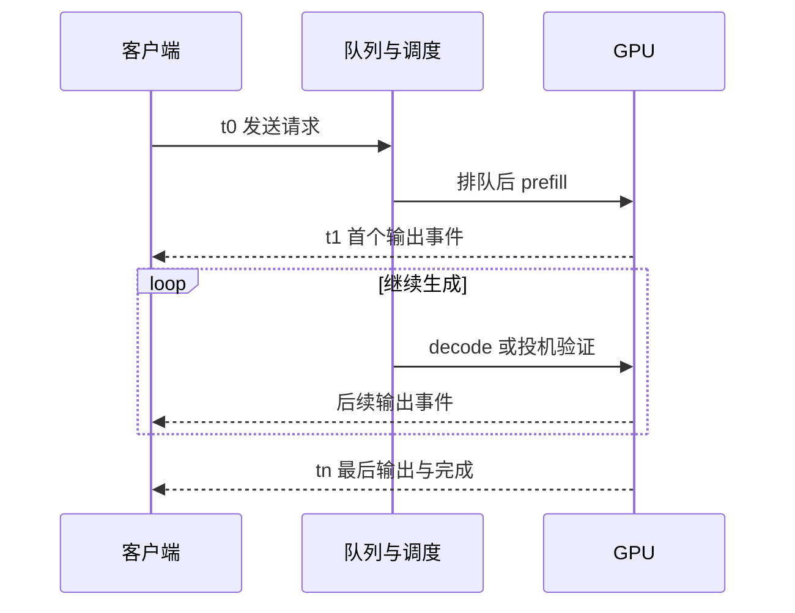

某次优化把 decode kernel 从 2 ms 降到 1 ms，在线用户的 p95 首 token 等待却从 0.8 秒升到 1.4 秒。排队、长提示抢占、网络事件和并发容量都在 kernel 计时之外。本章从完整请求记录判断这次优化对用户是否有益，并明确比较所需的负载与计时边界。

先修是 [S4 调度](/systems/engine-runtime/) 与 [T4 模型评估](/training/evaluation/)；量化、投机、多卡实验分别回读 S7/S8/S9。数学正确性、任务质量和服务性能是相互补充的验收。这个章的 CPU 事件表只能验证统计协议；真实吞吐仍需真实硬件负载实验。

## 时钟边界：客户端与引擎看见不同事件

为一条请求记录客户端发出时刻 $t_0$，收到首个输出 token 的时刻 $t_1$，最后一个输出 token 的时刻 $t_n$。再记录服务器接收、排队结束、prefill 开始/结束、每轮 decode 与发送事件。客户端与服务器若使用不同钟，不能直接相减形成精确排队时间，除非有可靠的时钟对齐。进程内区间应使用单调时钟，避免系统时钟调整造成负间隔。

首 token 延迟（time to first token，TTFT）定义为 $t_1-t_0$，因此可能包含网络、服务排队、tokenization、prefill、采样与发送。若论文或引擎只从调度开始计时，也可报告，但要改用明确边界，不能与客户端 TTFT 混合比较。

图的横向参与者是所有权边界，竖向才是时间。首 token 之前任何环节变慢，都可能抬高 TTFT；减少某个 GPU 区间不保证客户端端到端一定缩短。

## 三种指标：事件间隔与请求平均不能混用

若每个事件恰好一个 token，第 $i$ 个后续输出间隔为 $t_i-t_{i-1}$，可以收集逐 token ITL。若一个事件包含多个 token，则客户端观察到的是事件间隔，而不是每个 token 在 GPU 内形成的精确时刻。

令请求实际输出数为 $n$，定义平均每输出 token 时间（time per output token，TPOT）：

<KeyEq label="请求级平均与首 token 边界">

$$
\mathrm{TTFT}=t_1-t_0,\qquad
\mathrm{TPOT}=\frac{t_n-t_1}{n-1}\quad(n>1).
$$

</KeyEq>

分母排除首 token，因为 numerator 也排除了首 token 前的等待。只有一个输出 token 时 TPOT 未定义，本文记为 `None` 并从 TPOT 分布中排除，单独报告数量；不能记为零而把平均值人为拉低。无输出失败请求也没有 TTFT，它们进入失败计数与失败延迟，不能从整个报告消失。

当前 vLLM 文档把 `inter_token_latency_seconds` 记录为流式输出事件之间的墙钟间隔，而请求级平均 TPOT 每个完成请求记录一次。投机解码可一次输出多个 token，因此两种直方图不是同一个聚合。实际引擎版本可能调整指标名称与语义，实验需记录版本与读取日期。

## 三条请求：按表计算，不凭字段名猜测

下面时间以秒为单位，括号中的数字为该事件输出 token 数。

| 请求 | 发出 | 输出事件 | TTFT | 总输出数 | 请求 TPOT |
| --- | --- | --- | --- | --- | --- |
| A | 0.0 | 1.0(1)、1.2(1)、1.5(1) | 1.0 | 3 | 0.25 |
| B | 0.1 | 0.6(1) | 0.5 | 1 | 未定义 |
| C | 0.2 | 0.8(1)、1.1(3) | 0.6 | 4 | 0.10 |

A 的事件间隔是 0.2、0.3，平均为 0.25；C 的事件间隔只有 0.3，却在第二个事件带回 3 个 token，请求平均为 0.3/3=0.1。若将 C 的 0.3 重复三次填入逐 token ITL 直方图，就凭空创造了三个不可观察的事件。

A 与 C 的请求 TPOT 等权平均为 0.175；把两个请求的后首 token 时间合计后除以后续 token 数，得到 $(0.5+0.3)/(2+3)=0.16$。二者都可定义，但权重不同。报告必须说明采用请求等权还是 token 加权，不能用“平均 TPOT”省略这个选择。

如果观察窗口从 0 到 1.5，共输出 8 个 token，则窗口输出吞吐为 8/1.5，约 5.333 token/s。这个玩具值只示范分母。真实实验需要说明跨窗口请求的 token 如何统计、是否包含预热及排空，不可以对每条请求的 token/s 做简单平均就叫整体吞吐。

## 分位数：长尾不属于平均值的附录

TTFT 的 p95 表示某种分位数定义下约 95% 的样本不超过该值。小样本中的分位数对算法敏感：最近秩方法与线性插值可能给出不同值。本文脚本采用最近秩：将 $m$ 个样本升序排列，对比例 $u>0$ 取第 $\lceil um\rceil$ 个样本（从 1 计数），$u=0$ 取最小值。上表 TTFT 排序为 0.5、0.6、1.0，p50 为 0.6、p95 为 1.0。应固定统计实现，记录样本数和聚合单位；只有三个请求不适合对真实 p99 作结论。

事件 ITL 的样本数受输出长度影响，长请求会贡献更多事件；请求 TTFT 每条只贡献一个。比较两种分布时先检查单位。平均 TPOT 也会掩盖突然停顿：同样一秒生成十个后续 token，可以均匀输出，也可以先停顿 0.9 秒再突发返回。用户体验与流式事件分布不同，需同时查看尾部事件间隔。

量化质量或任务成功率也不是尾延迟的替代。一个系统可能很快但回答质量下降，一个系统可能答案质量相同却经常超时。固定质量要求后再比较服务指标，避免把降低输出长度、提前终止或放宽任务评分当作无条件加速。

## 负载模型：封闭循环会自动减轻过载

封闭循环（closed-loop）保留固定并发客户端：某个请求结束才发下一条。适合测某一并发下的稳态吞吐，但系统变慢时客户端也自动降低到达率。因此它可能低估独立外部流量造成的排队风险。

开放循环（open-loop）按独立时间表发请求，例如固定间隔或明确分布生成的到达过程。即使前一个没完成，下一条仍按计划发出，更适合观察系统在给定到达率下的积压。负载生成器如果自身 CPU 或网络跟不上，实际发送时刻偏离计划，就不再是所声明的开放负载；应记录计划时刻与实际时刻。

输入分布至少包括 prompt 长度、输出上限与实际终止长度、前缀共享率、任务类别。两个系统同时更换模型、长度和到达模式，无法把差异归因于调度策略。比较 chunked prefill 时固定请求列表和到达时间；比较前缀缓存时固定命中规则并区分冷缓存与热缓存；比较投机时固定目标采样分布与草稿成本。

## 测量协议：预热、同步与端到端观测

预热加载、JIT 编译、CUDA Graph 捕获与缓存填充之后再进入稳态测量；冷启动本身有价值，可以作为另一项独立指标。热缓存不能与另一系统的冷缓存混用。请求列表及随机 seed 应保存为实验产物，而不是只记录平均长度。

GPU 时间若使用 CPU 墙钟包围异步调用，需要在测量边界同步，否则可能只测到提交开销。CUDA events 可以测设备区间，但不会自动包含队列、tokenization、网络。客户端端到端时间无需为了每轮打点而强行同步 GPU，因为过度同步会改变被测系统；事件打点应尽量沿已有执行边界。

记录硬件型号与数量、互连、精度、模型与 tokenizer 版本、引擎提交、后端、batch/token 预算、缓存大小、采样参数、到达方式和观察窗口。测试次数与变异范围决定结论能推广多远。S2 的产品峰值和 S1 的理论账只能解释趋势，不能替代实测报告。

## 有效吞吐：先满足 SLO，再统计产出

服务等级目标（service-level objective，SLO）可规定 TTFT 上限、TPOT 上限以及成功率。总吞吐很高但多数请求超时，并不满足服务目标。定义 goodput 时应明确单位：每秒满足条件的完成请求数，或这些请求贡献的输出 token 数，两者不同。

沿上表，若只要求 TTFT 不超过 0.7 秒，B 与 C 满足，共 5 个输出 token。在 1.5 秒窗口里的有效 token 吞吐为 5/1.5，约 3.333 token/s，总吞吐仍为 5.333。若还要求 TPOT 不超过 0.2 秒，应明确 B 的单 token 特例如何判定；本文将其 TPOT 条件视为不适用，而 TTFT 与成功条件仍适用。

规划容量时逐步增加到达率，观察 SLO 达标率、队列长度、缓存占用与失败率，在固定协议下找到满足约束的区间。不能只跑一个高并发点就宣称最大容量。请求排队时间常在接近饱和时迅速上升，这说明系统必须为波动留下余量，峰值 token/s 不是承诺长期可用的容量。

## 资源容量：理论 KV 上限与可服务负载

S1 的每 token KV 字节为 $m_{\mathrm{token}}$。若可用缓存容量为 $M_{\mathrm{KV}}$，忽略块尾浪费时，最大常驻 token 数不超过 $M_{\mathrm{KV}}/m_{\mathrm{token}}$。实际还要考虑分页、共享、滑窗以及预留策略；它不是最大并发请求数，除非给定每条的驻留长度。

稳定系统中，平均在途请求数约为到达率乘平均驻留时间，这是 Little 定律的应用条件。若每秒到达 5 条、平均系统时间 2 秒，平均在途约 10 条；若平均每条驻留 2000 token、每 token KV 128 KiB，粗略状态量约为 2.44 GiB。不过长度与驻留时间相关时，应该直接对 token 驻留做统计，而不是把两个独立平均值相乘当精确峰值。突发和尾部长度还会让峰值远高于平均。

多卡吞吐规划还需看通信和副本分发。某个 rank 缓存先满会限制整组；PD 分离要把 KV 传输队列纳入资源。只按权重能否放下分配机器，遗漏了实际服务生命周期的主导成本。

## 取消与失败：统计和所有权都要闭环

请求超时、客户端断开、超过长度或引擎异常，应记录终态与已经输出的数量。取消不能只在 HTTP 层停止发送；调度器需要停止后续采样，并在在途 GPU 操作结束后释放 KV。共享块引用计数要正确减一，不得连带清除其他请求的状态。

失败请求应保留在总请求分母，说明是否产生输出、失败时间及错误类别。质量评估可以单独处理无效输出，但系统成功率不能只统计剩下的成功子集。重试还会增加实际到达负载，若只记最终成功请求会隐藏额外计算和排队。

## CPU 核对：统计语义从数据开始

脚本直接实现上面的事件表，拒绝时间倒退与空输出事件，核对单 token、突发多 token、总吞吐与 TTFT goodput。没有请求生成器或 GPU 计时框架，因为这次验证的问题是指标语义是否正确。

<CodeFile path="code/systems/serving_metrics.py" />

## 常见误区

- 用 GPU kernel 时间替代用户 TTFT。两者时钟边界不同。
- 将超时请求剔除后报告低 p99。它们是服务结果的一部分。
- 相同并发就意味着相同到达负载。封闭循环会随延迟改变发送速率。
- 忽略单 token 请求与投机多 token 事件。会改变 TPOT 或 ITL 的含义。

## 练习与核对

首事件在 2 秒返回 1 token，末事件在 3 秒返回 4 token，总共两个事件，TPOT 和事件 ITL 是多少？

总输出为 5，后首 token 有 4 个，TPOT 为 1/4=0.25 秒；可观测事件间隔只有 1 秒。不能凭这两个事件推断四个单独 token 的精确形成时刻。

到达率 20 请求/秒，稳定平均系统时间 0.5 秒，平均在途请求数是多少？若队列持续增长，还能套这个稳态结论吗？

稳定时约为 10 条。队列持续增长说明该观察期不满足稳态条件，不能将这次有限窗口平均直接当稳定容量；应报告积压速率和过载行为。

同一优化总 token/s 上升 30%，SLO 达标率从 95% 降到 50%，应怎样报告？

报告总吞吐和 SLO 有效吞吐两个数，并检查满足约束的负载区间。若请求长度相同，粗略有效产出可能从 0.95 降为 1.3×0.5=0.65，说明名义吞吐增加不等于服务目标改善；真实 goodput 需按满足条件的请求实际 token 统计。

系统主线到这里形成闭环：模型给出正确输出，调度和存储承载请求，执行器使用硬件，最后以固定协议评价用户可见结果。进一步改变架构，可进入 [进阶专题](/advanced/)，并继续使用同一套正确性、质量与服务账。

## 原始资料

- [vLLM Metrics](https://docs.vllm.ai/en/latest/design/metrics/)：流式事件、请求级 TPOT 与监控边界，读取于 2026-09-27。
- [vLLM Benchmarking](https://docs.vllm.ai/en/latest/cli/bench/serve/)：在线服务负载与报告参数。
- [CUDA Programming Guide](https://docs.nvidia.com/cuda/cuda-programming-guide/)：异步执行和同步的测量条件。
